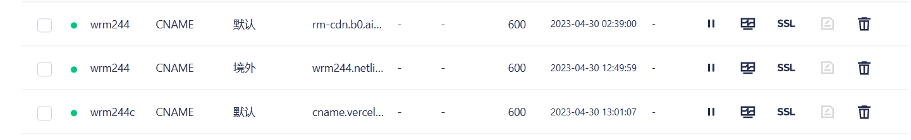
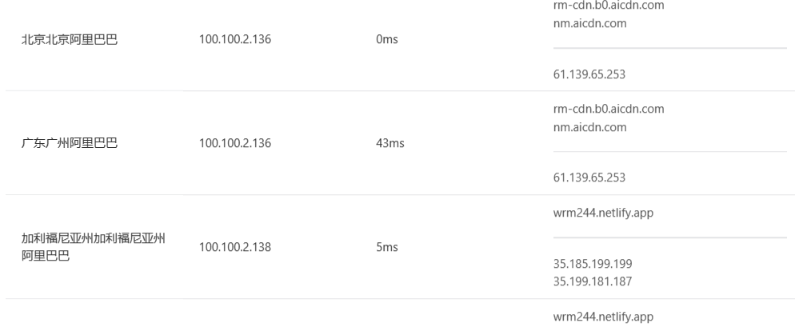
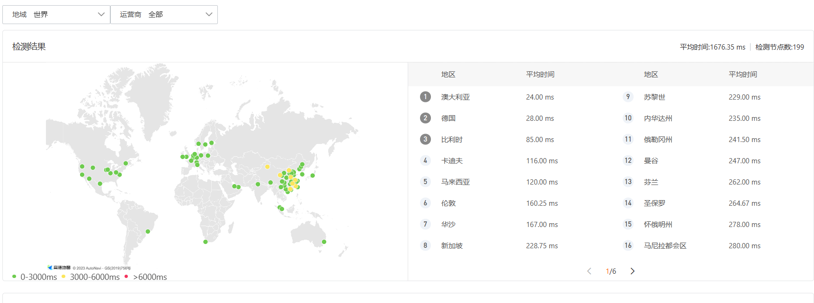
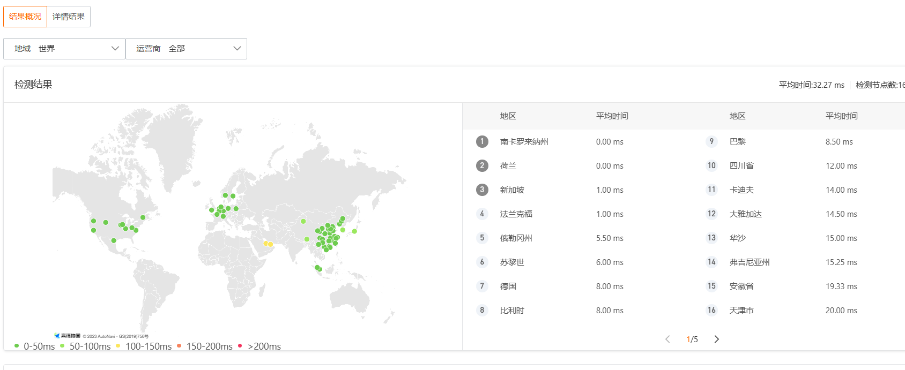

前面文章有提到说本站采用了又拍云``cdn``加速服务：[本网站CDN加速的处理](本网站CDN加速的处理.md)，但是海外加速成本特别高，所以国内``cdn``加速处理不能惠及到境外用户，相当于反向cdn了。所以在尝试了几种办法包括区域重定向，换服务商等等，但都由于成本问题而搁浅。最终采用了线路分组``DNS``解析我的域名。

<!-- truncate -->

## 我的思路

当时在网站部署的时候，选择netlify还是实验室的云服务器当做服务，我纠结了很久，主要考虑到国内访问的速度与部署的持久性，其中一个原因是netlify在国外速度可以，国内表现不佳，cdn回源也半斤八两。思来想去，还是决定两个都部署上去，然后正好使用``cdn``的时候把netlify当做热备站。这样部署持续了好几天。

最近，趁着五一假期，测测看看网页服务如何，结果和腾讯云之前一样，国内的非常好，国外的要么连接超时，要么解析不出域名！我就纳闷了，该如何处理？这时一个点子在我脑海浮现，这个netlify是不是有点闲了，只有热备注功能，要是我这个域名如果能根据地域在境外的时候重定向到netlify那不是很棒？！

所以用思路去投喂GPT，他给我的反馈是采取``geo ip``重定向，但这需要更改我本地的逻辑代码，我所成本有点高，他说我可以结合cloudflare免费加速了，但是这样国内就变成反向cdn了。。困恼着，打开cloudflare看看有没有解决思路，先把域名迁移过去，再试试看，不出所料国内延迟高达1s。但是在域名解析的过程中，我发现这个解析线路是可以自定义的！

所以我把境外的线路的``cname``解析为netlify，国内``cname``的默认线路解析为又拍云的``cdn``很棒啊，朋友们，区域解析不同，就可以用到不同的服务：

## 测试情况

### HTTP请求

### PING

---

## 总结

以上就是本站解决国内外cdn加速不平衡策略，才疏学浅，本文仅仅简单介绍处理办法，而更多的还是学习好基础知识才能比较快得判断在出现任何情况下该用什么快速办法处理，而且这种处理办法综合是最优的，不说了学习去。

## 参考与致谢

- [本网站CDN加速的处理](本网站CDN加速的处理.md)
