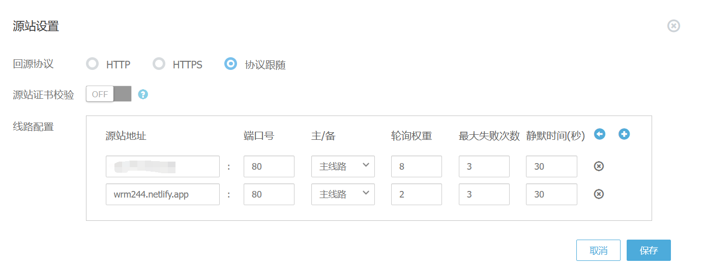
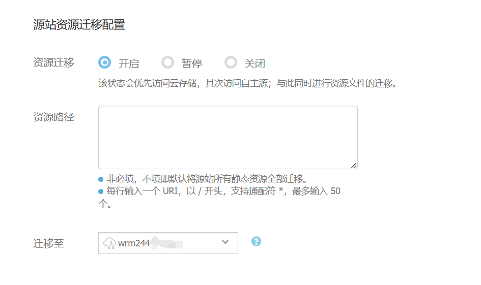
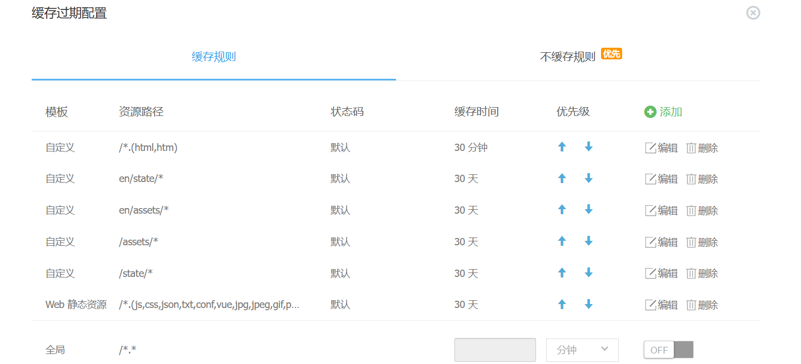
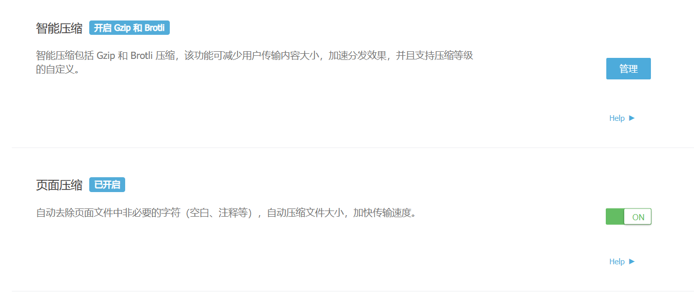
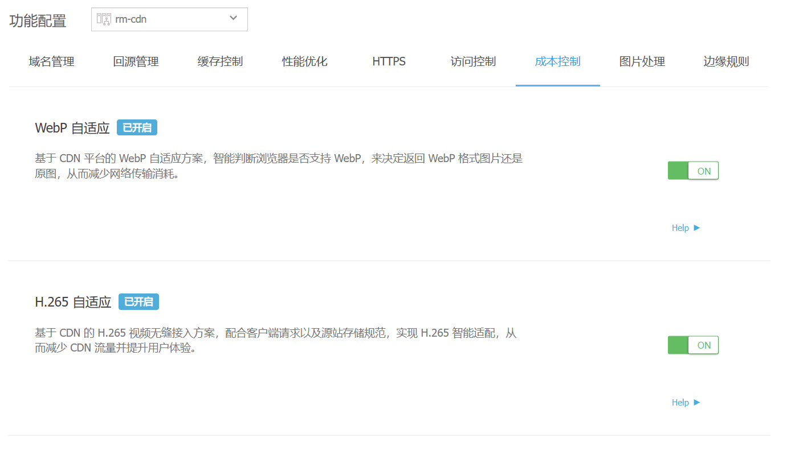
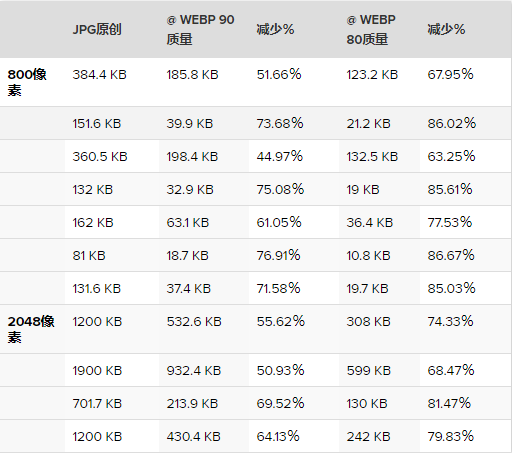
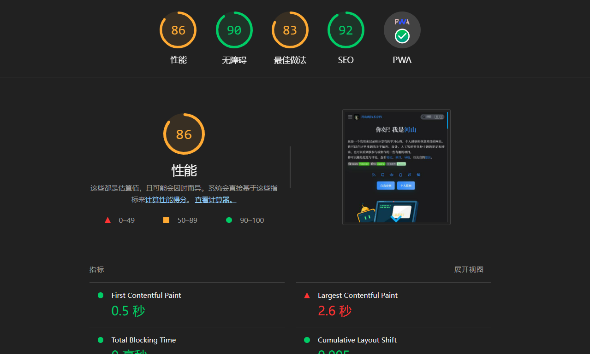
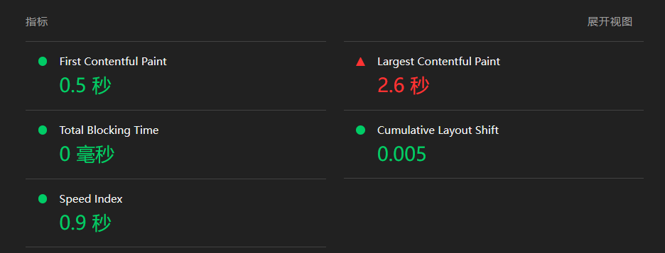

import DisplayFlex from '@site/src/components/DisplayFlex'

# 本网站CDN加速的处理

本来这个网站的cdn服务是挂载在腾讯云的，因为实验室之前购买了云主机与cdn流量包，只用了一点流量还未过期，所以就顺便直接使用了腾讯云cdn服务使资源利用最大化。使用后体验感觉不愧是大厂云服务，ping的延迟基本在15ms以下，虽然速度可嘉，但在几天的使用下来发现，实验室所购买的流量包是国内的，不对国外区域提供，离谱的是，在我利用站长工具测速的时候，国内一片绿，国外的一片红！墙上加墙，循环了属于是。当然还有其他缺点，比如他的收费细项太多太杂了，总会莫名其妙的扣钱，看个账单还看不出是哪里扣费用。以至于在其他平台寻找下家，最后选定了有开发者联盟支持的又拍云。

<!-- truncate -->

--- 

## CDN？

CDN的全称是Content Delivery Network，即内容分发网络。其基本思路是尽可能避开互联网上有可能影响[数据传输速度](https://baike.baidu.com/item/%E6%95%B0%E6%8D%AE%E4%BC%A0%E8%BE%93%E9%80%9F%E5%BA%A6/488203?fromModule=lemma_inlink)和稳定性的瓶颈和环节，使内容传输得更快、更稳定。总的来说，[内容服务](https://baike.baidu.com/item/%E5%86%85%E5%AE%B9%E6%9C%8D%E5%8A%A1/53323077?fromModule=lemma_inlink)基于[缓存服务器](https://baike.baidu.com/item/%E7%BC%93%E5%AD%98%E6%9C%8D%E5%8A%A1%E5%99%A8/4548255?fromModule=lemma_inlink)，也称作[代理缓存](https://baike.baidu.com/item/%E4%BB%A3%E7%90%86%E7%BC%93%E5%AD%98/10329556?fromModule=lemma_inlink)，它位于网络的边缘(离客户端近)，距用户仅有"一跳"之遥。
国内厂商提供CDN的服务相差不差，基本有以下几点提供配置：
- 缓存控制
- 性能优化
- Https(配置ssl是在我们域名的基础上配置，实在不清楚为什么请求要单独收费)
- 访问控制
特别的在使用又拍云配置过程中多新增了几项服务：
- 成本控制
- 边缘处理
所以这篇博客主要介绍一下又在又拍云下，本站访问性能的提升。

## 静态部署

首先要说明本站静态部署的位置有以下提供：

| 序号 | 提供商             | 网址               | 是否CDN  |
| ---- | ------------------ | ------------------ | -------- |
| 1    | 腾讯云轻量级服务器 | wrm244.gxist.cn    | 是       |
| 2    | Netlify            | wrm244.netlify.app | 否(源站) |
| 3    | cloudflare         | wikiblog.pages.dev | 否       |
| 4    | github pages       | wrm244.github.io   | 否         |

> 以上建议访问次序由上到下递减

该部署是通过github ci/cd 自动化集成分发构建好的静态页面到github pages与云服务器(通过ssh sync 同步)，再自动更新到netlify与cloudflare，其中又拍云回源暂时绑定在主源站云服务器与备用netlify站点。

以下是对应域名几张国内访问速率对比图：

<DisplayFlex>

wrm244.gxist.cn

wrm244.netlify.app 
</DisplayFlex>

<DisplayFlex>

wikiblog.pages.dev

wrm244.github.io

</DisplayFlex>

## 回源设置

主要有两条主线路，一个云服务器另外一个是``netlify``节点，轮询8:2。因为又拍云在境外cdn节点不是很多，所以在考虑如何设置在境外用户访问cdn域名后重定向到``netlify``原始域名节点，毕竟netlify部署服务中已经帮我们处理好边缘缓存了。

特别的，又拍云还有一个独特设置就是可以把源站静态资源在访问时候先迁移到我的云存储当中，环节源站压力，本身这个云存储是用来放置图床的，现在又拍云把cdn与云存储打通。所以在本站环境全是静态资源下，我觉得比较便利，相当于图床直接放在源代码仓里即可。

## 缓存控制

在网站全是静态文件的情况下，在修改样式(js、css)完毕之后，我认为缓存可以一个月，保留htm与html动态缓存或者不缓存，这样的话可以在每天加载html的时候保证文章内容在最新的情况下，获取到已经缓存的样式、脚本与图像资源，因为这些资源是来自html内嵌链接获取的。
同时设置了分段缓存与离线模式，分段缓存的话源站云服务器那边可能设置不了，在全是静态资源的情况下，离线模式是可以支撑起来的。

## 性能优化

在压缩方面，又拍云提供了全站智能压缩与页面代码压缩(css,js,html)，其中js在部署的时候已经压缩成一行。gzip在设置的时候需要排除大小本来很小的文件，比如说小于1k，不然就会变为反向压缩

## Https

TLS 1.3、HTTP/2、HSTS（HTTP Strict Transport Security，HTTP 严格传输安全)设置

## 成本控制

在又拍云上，成本控制中可以智能判断浏览器是否支持 WebP，来决定返回 WebP 格式图片还是原图，从而减少网络传输消耗。**WebP**（发音：_weppy_）是一种同时提供了[有损压缩](https://baike.baidu.com/item/%E6%9C%89%E6%8D%9F%E5%8E%8B%E7%BC%A9/2311513?fromModule=lemma_inlink)与[无损压缩](https://baike.baidu.com/item/%E6%97%A0%E6%8D%9F%E5%8E%8B%E7%BC%A9/2817566?fromModule=lemma_inlink)（可逆压缩）的[图片文件格式](https://baike.baidu.com/item/%E5%9B%BE%E7%89%87%E6%96%87%E4%BB%B6%E6%A0%BC%E5%BC%8F/1989798?fromModule=lemma_inlink)，派生自影像编码格式[VP8](https://baike.baidu.com/item/VP8/8983934?fromModule=lemma_inlink)，被认为是[WebM](https://baike.baidu.com/item/WebM/2455966?fromModule=lemma_inlink)多媒体格式的姊妹项目，是由[Google](https://baike.baidu.com/item/Google/86964?fromModule=lemma_inlink)在购买[On2 Technologies](https://baike.baidu.com/item/On2%20Technologies/3745812?fromModule=lemma_inlink)后发展出来，以[BSD](https://baike.baidu.com/item/BSD/3794498?fromModule=lemma_inlink)[授权条款](https://baike.baidu.com/item/%E6%8E%88%E6%9D%83%E6%9D%A1%E6%AC%BE/2797008?fromModule=lemma_inlink)发布。

当 WebP 将 JPG 压缩到相当于原图 90% 质量 时，图片体积减少了 50% 左右。当 WebP 将 JPG 压缩到相当于原图 80% 质量时，图片体积则减少了 60%~80%。有损 WebP 压缩性能优于 JPG 的原因主要是其[预测编码](https://www.zhihu.com/search?q=%E9%A2%84%E6%B5%8B%E7%BC%96%E7%A0%81&search_source=Entity&hybrid_search_source=Entity&hybrid_search_extra=%7B%22sourceType%22%3A%22answer%22%2C%22sourceId%22%3A260228870%7D)技术先进，并且宏块自适应量化也带来了压缩效率的提升，而布尔[算术编码](https://www.zhihu.com/search?q=%E7%AE%97%E6%9C%AF%E7%BC%96%E7%A0%81&search_source=Entity&hybrid_search_source=Entity&hybrid_search_extra=%7B%22sourceType%22%3A%22answer%22%2C%22sourceId%22%3A260228870%7D)与[霍夫曼编码](https://www.zhihu.com/search?q=%E9%9C%8D%E5%A4%AB%E6%9B%BC%E7%BC%96%E7%A0%81&search_source=Entity&hybrid_search_source=Entity&hybrid_search_extra=%7B%22sourceType%22%3A%22answer%22%2C%22sourceId%22%3A260228870%7D)相比提升了 5%~10% 的压缩性能。

---

## 总结

通过对本站的cdn边缘缓存，使得访问网站速度上提升大约20%以上，加上又拍云的成本控制，可以实现无缓存访问一次平均2兆以下的传输流量。经过Lighthouse测试如下：

主要提升是在FCP（First Contentful Paint）的时间，LCP最大内容渲染时间仍是瓶颈。

这需要慢慢改进代码渲染的逻辑与顺序了。下篇再见，我是河山。

## 参考与致谢

- [WebP—维基百科 ](https://zh.wikipedia.org/wiki/WebP)
- [A new image format for the Web](https://developers.google.com/speed/webp/)
- [又拍云](https://www.upyun.com/)

## 推荐阅读

- [关于完善本站国内外cdn加速不平衡策略](关于完善本站国内外cdn加速不平衡策略.md)