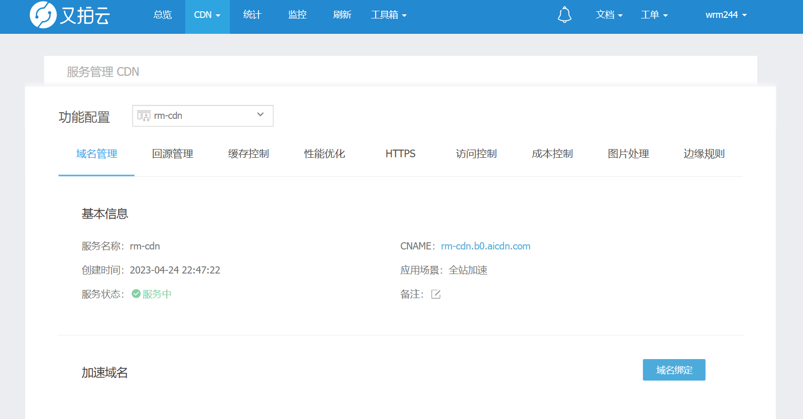
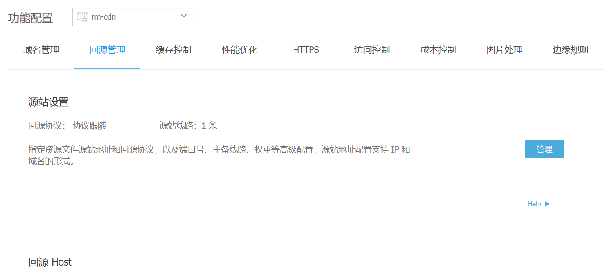
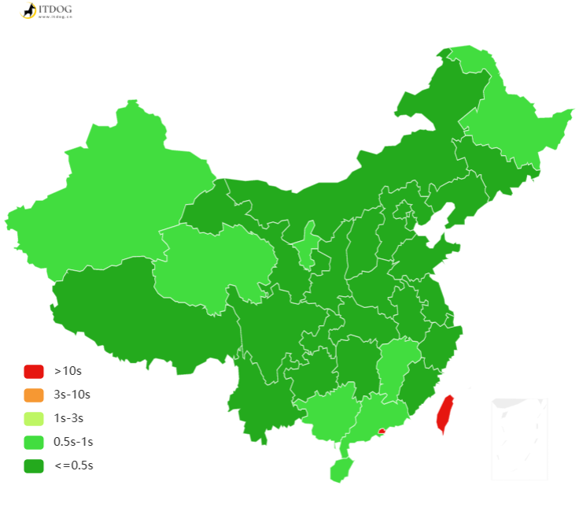
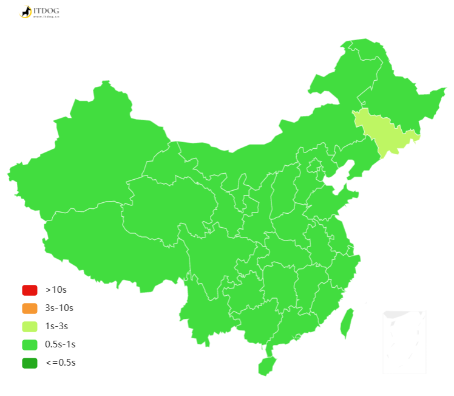
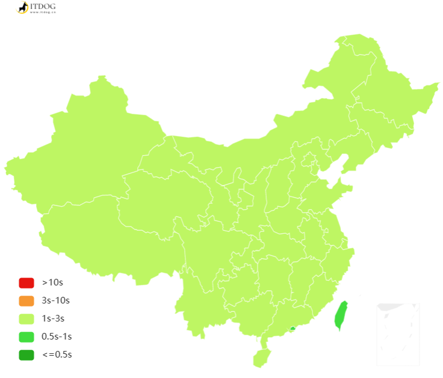
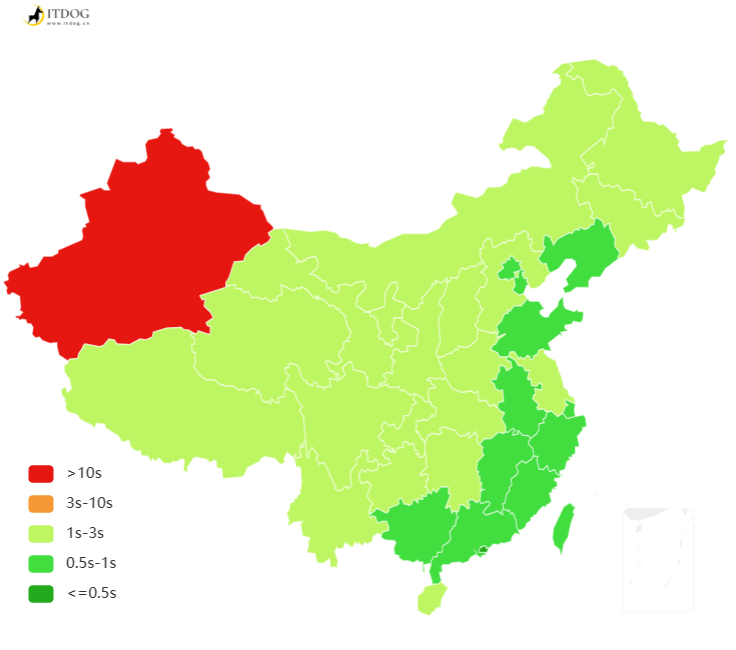

# 本网站CDN加速的处理

本来这个网站的cdn服务是挂载在腾讯云的，因为实验室之前购买了云主机与cdn流量包，只用了一点流量还未过期，所以就顺便直接使用了腾讯云cdn服务使资源利用最大化。使用后体验感觉不愧是大厂云服务，ping的延迟基本在15ms以下，虽然速度可嘉，但在几天的使用下来发现，实验室所购买的流量包是国内的，不对国外区域提供，离谱的是，在我利用站长工具测速的时候，国内一片绿，国外的一片红！墙上加墙，循环了属于是。当然还有其他缺点，比如他的收费细项太多太杂了，总会莫名其妙的扣钱，看个账单还看不出是哪里扣费用。以至于在其他平台寻找下家，最后选定了有开发者联盟支持的又拍云。

<!-- truncate -->

--- 

## 一、CDN？

CDN的全称是Content Delivery Network，即内容分发网络。其基本思路是尽可能避开互联网上有可能影响[数据传输速度](https://baike.baidu.com/item/%E6%95%B0%E6%8D%AE%E4%BC%A0%E8%BE%93%E9%80%9F%E5%BA%A6/488203?fromModule=lemma_inlink)和稳定性的瓶颈和环节，使内容传输得更快、更稳定。总的来说，[内容服务](https://baike.baidu.com/item/%E5%86%85%E5%AE%B9%E6%9C%8D%E5%8A%A1/53323077?fromModule=lemma_inlink)基于[缓存服务器](https://baike.baidu.com/item/%E7%BC%93%E5%AD%98%E6%9C%8D%E5%8A%A1%E5%99%A8/4548255?fromModule=lemma_inlink)，也称作[代理缓存](https://baike.baidu.com/item/%E4%BB%A3%E7%90%86%E7%BC%93%E5%AD%98/10329556?fromModule=lemma_inlink)，它位于网络的边缘(离客户端近)，距用户仅有"一跳"之遥。
国内厂商提供CDN的服务相差不差，基本有以下几点提供配置：
- 缓存控制
- 性能优化
- Https(配置ssl是在我们域名的基础上配置，实在不清楚为什么请求要单独收费)
- 访问控制
特别的在使用又拍云配置过程中多新增了几项服务：
- 成本控制
- 边缘处理
所以这篇博客主要介绍一下又在又拍云下，本站访问性能的提升。

## 二、静态部署

首先要说明本站静态部署的位置有以下提供：
| 序号 | 提供商             | 网址               | 是否CDN  |
| ---- | ------------------ | ------------------ | -------- |
| 1    | 腾讯云轻量级服务器 | wrm244.gxist.cn    | 是       |
| 2    | Netlify            | wrm244.netlify.app | 否(源站) |
| 3    | cloudflare         | wikiblog.pages.dev | 否       |
| 4    | github pages       | wrm244.github.io   | 否         |
> 以上建议访问次序由上到下递减

该部署是通过github ci/cd 自动化集成分发构建好的静态页面到github pages与云服务器(通过ssh sync 同步)，再自动更新到netlify与cloudflare，其中又拍云回源暂时绑定在主源站云服务器与备用netlify站点。

以下是对应域名几张国内访问速率对比图：
1.wrm244.gxist.cn

2.wrm244.netlify.app

3.wikiblog.pages.dev

4.wrm244.github.io

## 回源设置

---

# 总结

提示：这里对文章进行总结：

例如：以上就是今天要讲的内容，本文仅仅简单介绍了pandas的使用，而pandas提供了大量能使我们快速便捷地处理数据的函数和方法。
  
