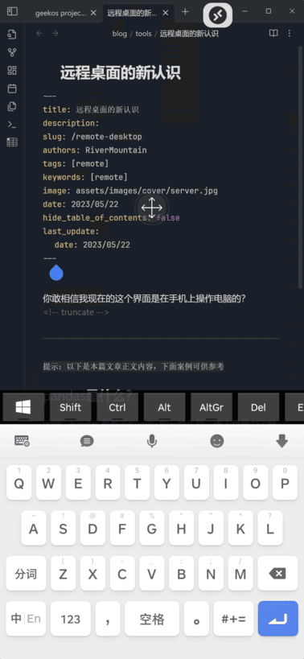

你敢相信我现在的这个界面是在手机上操作电脑的？



也就是说我不用再手机上下载手机版软件就可以体会到手机适配的感觉，并且是全功能电脑原生。
<!-- truncate -->

---

`提示：以下是本篇文章正文内容，下面案例可供参考`

## pandas是什么？

示例：pandas 是基于NumPy 的一种工具，该工具是为了解决数据分析任务而创建的。

## 使用步骤

### 1.引入库

代码如下（示例）：

```c

import numpy as np

import pandas as pd

import matplotlib.pyplot as plt

import seaborn as sns

import warnings

warnings.filterwarnings('ignore')

import ssl

ssl._create_default_https_context = ssl._create_unverified_context

```

### 2.读入数据

代码如下（示例）：

```c

data = pd.read_csv(

'https://labfile.oss.aliyuncs.com/courses/1283/adult.data.csv')

print(data.head())

```

该处使用的url网络请求的数据。

---

## 总结

提示：这里对文章进行总结：

例如：以上就是今天要讲的内容，本文仅仅简单介绍了pandas的使用，而pandas提供了大量能使我们快速便捷地处理数据的函数和方法。
  
