在胡乱摸索 Docusaurus 的一些基本操作以及稍稍魔改一下主题之后，开始进行站点的云端部署。这里选择的是比较经济的做法，即部署的 Github 上。

## 创建 Github 仓库

为什么选这个，总所周知 `Github` 对所有仓库都是免费的，当然你可以充钱成为尊贵的 Pro 用户，每个月只需几刀，但是对于我来说暂时用不到，部署的前提是你已经注册了 `Github` 的账号。很多人在刚开始搭建博客并且用 Github 来进行部署的都会接触到一个特殊的仓库，`{username}.github.io`，这个仓库很特殊，它的 **url** 为 `https://{username}.github.io`。

根据参考方案我用两个仓库来进行部署，分别为：

存放 **Docusaurus 项目配置、文档等文件**的 **`源码仓库`** **`{username}/my-wesite`** （可以自定义）<br/>
存放**页面渲染后生成的文件**的 **`部署仓库`** **`{username}/{username}.github.io`**

两个仓库创建完成之后开始进行部署

## 修改 Docusaurus 配置文件

对 `docusaurus.config.js` 进行修改：

```js
title: 'Shake-Blog',
  titleDelimiter: '🦖',
  url: 'https://Shake-Jarjane.github.io', // 网站的 url 地址
  baseUrl: '/',                           // 解析后的地址，如果设为 wsite，则 url 解析为https://xxx.xx/site
  projectName: 'Shake-Jarjane.github.io', // {username}.github.io
  organizationName: 'Shake-Jarjane',      // username
  deploymentBranch: 'main',               // 部署的默认分支,如果部署到同一个仓库下则可不指定
                                          // 注意主分支名称
  ```

## 编译

编译静态文件，运行后将在 /build 目录中生成静态文件

```bash
yarn build
```

在部署之前先进行本地测试

```bash
yarn serve
```

如果出现以下信息就说明没啥问题了

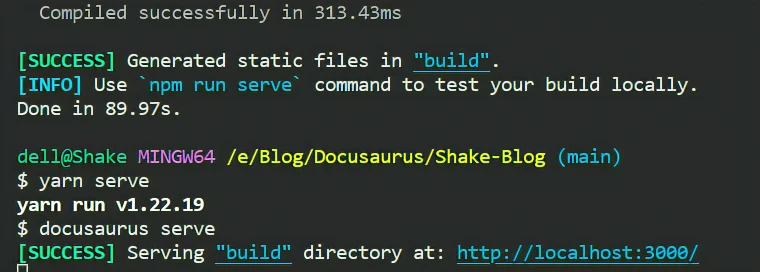


### 掉坑里

运行以上两个命令的时候，直接破天荒的报了一大堆错，这时候不要慌，先把报错信息谷歌一下，或者仔细看一下报错信息，我这里其中一个报错原因是因为死链，应该是和原有的编译信息冲突了，说白了就是前博主的信息没删干净，所以魔改别人的东西需谨慎。

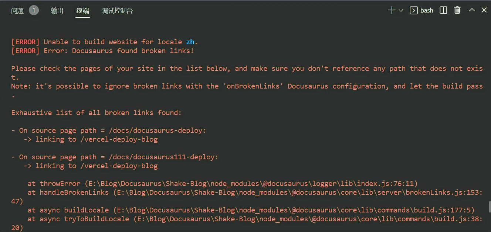
根据提示，在 `docusaurus.config.js` 里添加

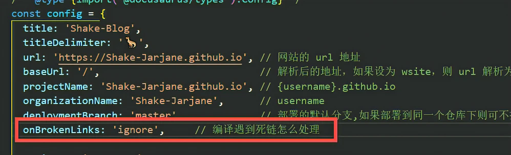

还有一些是链接错误的，就是跳转的连接非法或者不存在，将跳转的连接复制在 `vscode` 进行全局搜索，看看哪里设置的错误的跳转链接并修改即可，以我的为例：

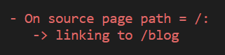


我这里的错误跳转链接是 `/blog`，因为我刚把 fork 的开源仓库里的部分文章给删了进行测试，所以这里脑子短路写错了。
因为我并不懂前端相关的东西，所以如果有其他报错的话就仔细看一下报错信息举一反三。

## 部署到远程仓库（Github Pages）

```bash
GIT_USER = <GITHUB_USERNAME> yarn deploy
# 例：GIT_USER = Shake-Jarjane yarn deploy
```

出现以下提示就基本OK了，然后你现在的站点就是 `https//{username}.github.io`

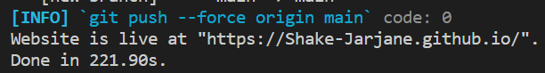


等这里出现个绿色的✔就说明网站就绪了，打开网站并且看到正常显示主界面了


## 使用 Github Action 自动化部署

Github Action 是 Github 提供的免费自动化构建实现，特别适用于持续集成和持续交付的场景，它具备自动化完成许多不同任务的能力，例如构建、测试和部署等等。简单的说就是你只需专注于文章协作，在部署的 Github Page 之后，可以用 Gtihub Action 来实现自动化更新部署，交给它来一梭哈。

### 配置 SSH

前文也提到了，是跨仓库部署的，所以需要 SSH 密钥来通过权限检查，配置方法如下：

```bash title='生成 SSH 公钥'
ssh-keygen -t rsa -C "email@xxx.com"
```

如果你已经有了 SSH，那么得生成新的，换个目录即可或者换个文件名即可，你可以在上面的命令回车之后输入文件名定义新的 SSH 文件。

```
ssh-keygen -t rsa -C "email@xxx.com" -f ~/.ssh/id_rsa_test
```

根据提示打开目录文件

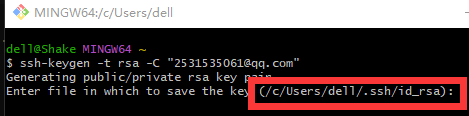

可看到目标路径下有公钥和秘钥

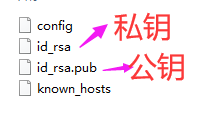


用记事本的方式打开公钥，将里面的内容全部复制

### 将 SSH Key 配置到 Github

进入 SSH and GPG keys

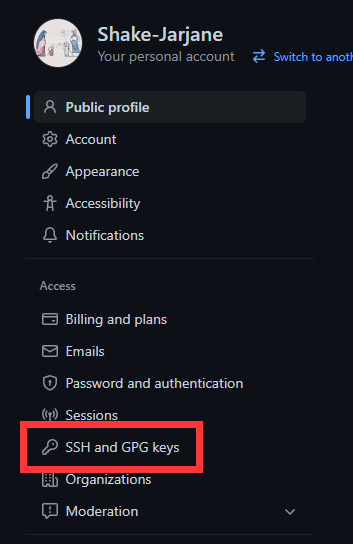

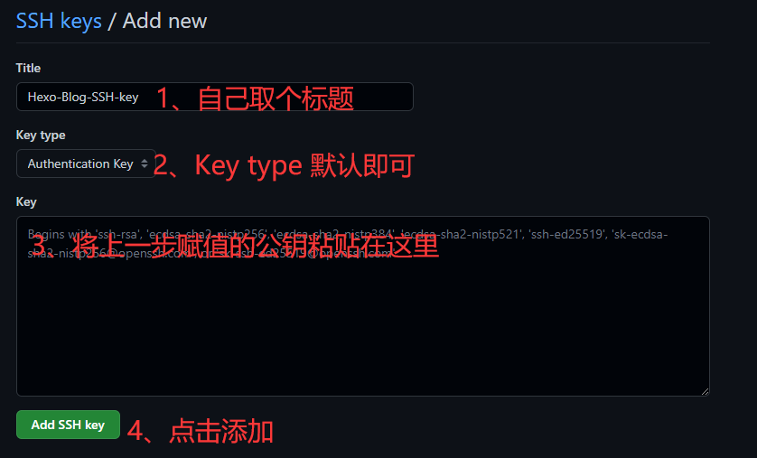


然后会弹出相应的提示

### 测试链接

```
ssh -T git@github.com
```

没啥问题的话就会由以下提示

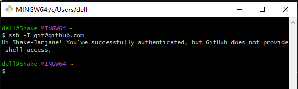

将 公钥 **`id_rsa.pub`** 添加到 **`部署仓库`**<br/>
在部署仓库如下位置进行添加
注意这里 **secret** 的 **Name** 需要记住，可以直接取名为 **`GH_PAGES_DEPLOY`**，后续的自动化工作流中将会用到这个 **Name**

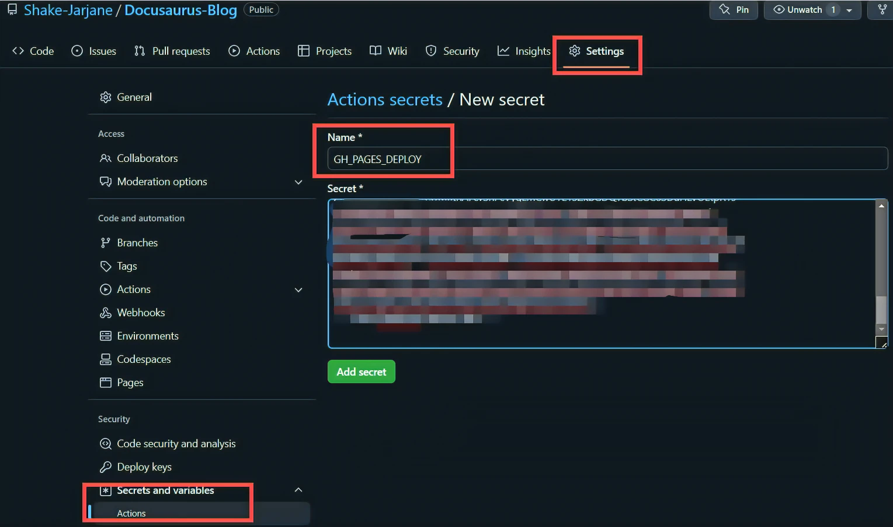

将 私钥 **`id_rsa`** 添加到 **`源码仓库`**<br/>
在源码仓库如下位置进行添加
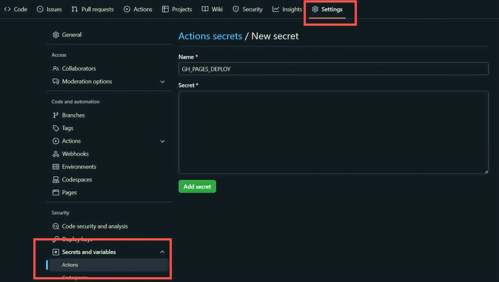

### 创建 deploy.yml

在你的源仓库中创建 `.github/workflows/deploy.yml` 工作流文件，注意 **node 版本**与**主分支名称**

``` yml
name: Deploy to GitHub Pages

on:
  pull_request:
    branches: [main]
  push:
    branches: [main]

jobs:
  test-deploy:
    if: github.event_name != 'push'
    runs-on: ubuntu-latest
    steps:
      - uses: actions/checkout@v3
      - uses: actions/setup-node@v3
        with:
          node-version: 17.9.1
          cache: yarn
      - name: Install dependencies
        run: yarn install --frozen-lockfile
      - name: Test build website
        run: yarn build
  deploy:
    if: github.event_name != 'pull_request'
    runs-on: ubuntu-latest
    steps:
      - uses: actions/checkout@v3
      - uses: actions/setup-node@v3
        with:
          node-version: 17.9.1
          cache: yarn
      - uses: webfactory/ssh-agent@v0.5.0
        with:
          ssh-private-key: ${{ secrets.GH_PAGES_DEPLOY }}
      - name: Deploy to GitHub Pages
        env:
          USE_SSH: true
        run: |
          git config --global user.email "actions@github.com"   # 修改为你的 Github 邮箱
          git config --global user.name "gh-actions"            # 修改为你的 Github 用户名
          yarn install --frozen-lockfile
          yarn deploy
```

以上配置完成之后，如果还是用 `yarn deploy` 命令的话，只有部署仓库会有渲染过后的文件，源码仓库依旧是空的，源码仓库需要单独 push 源码，要做到的只是将源码 push 到自己的仓库即可，push 之后 Git Action 会自动执行部署，也就是说不用管部署仓库，只需更新你的源码仓库即可。Gtihub Action 相当于 Github 给你一个免费的云服务器，根据你的配置给你新建一个系统，配置环境啥的。

### Push 源码

#### 修改远程仓库

如果你和我一样是 fork 或者 git clone 别人的仓库的，先执行一下命令来查看当前的远程仓库，没有就跳过这一步

```
git remote -v
```

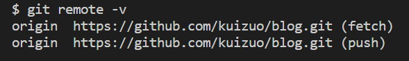

可以看到我 git clone 的是 `kuizuo` 博主的源码，接下来删除远程仓库

```
git remote rm xxxx // 删除远程仓库(例如 我要删除上面这个图的仓库 git remote rm origin 即可)
```

再执行 `git remote -v`，显示空的，说明已经删除完成

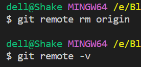

#### 添加远程仓库

```
git remote add origin git@github.com:<username>/<my-blog> //例如: git remote add origin git@github.com:Shake-Jarjane/Docusaurus-Blog
```

然后再执行 git remote -v，显示的是你自己的仓库就说明完成了

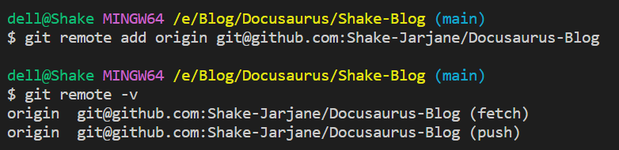

#### 推送到远程仓库

```
git push -u origin "main" // 我这里主分支是 main
```

然后在 Github 仓库刷新就可以看到刚推送上去的文件了。如果推送的其他问题与细节操作，可以自行去搜索一下，这里对我说出现的小问题不再列举。（因为挺多的哈哈哈~）

一切就绪之后，你只需向源仓库中推送文档的变更，GitHub Action 就会自动识别工作流，并执行站点的部署。无需再执行 `yarn deploy`。

## 自定义域名

现在站点的地址为：`https://username.github.io/`，这是免费的，你直接用，如果你不喜欢，想要自定义，可以去购买一个域名，我选择的是在[阿里云](https://cn.aliyun.com/?from_alibabacloud=&utm_content=se_1013083955)购买，如果对域名没有什么特别的要求，怎么便宜怎么来，具体的域名介绍可以自己去查查。

### 域名解析

以阿里云为例，购买完域名之后，进入控制台，进入域名解析，在你的所购买的域名下点击解析设置


点击添加记录，一下填写信息供参考，如果你是 Vercel 或者其他的方式部署则会有差异。分别添加两条 `CNAME` 记录，主机记录分别是 `www` 和 `@`，如下：

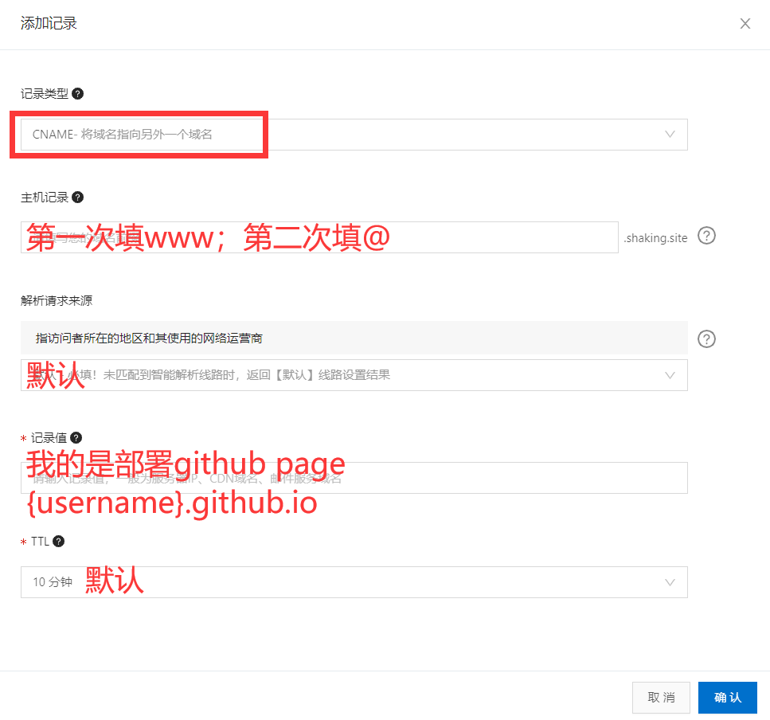

这里的记录值也有另一种填写方式，运行以下命令来 `ping` 你的Github 地址

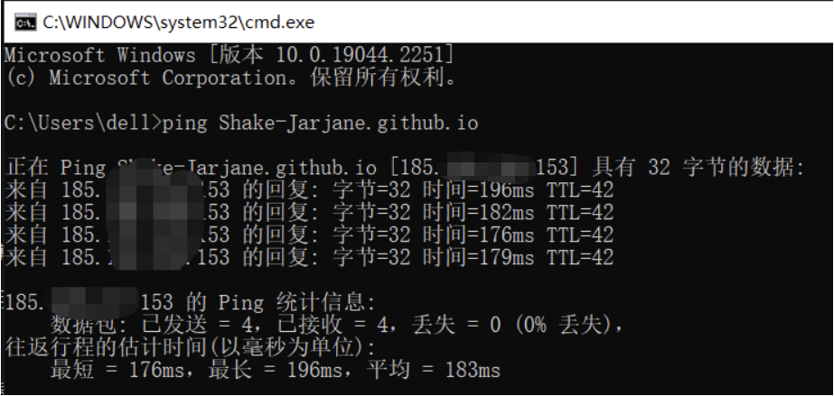

然后这个 ip 地址就可以填进去了，剩下步骤相同。

主机记录「www」和「@」的区别是解析的域名的形式，以域名shaking.site为例：<br/>
主机记录「www」对应 www.shaking.site 域名<br/>
主机记录「@」对应 shaking.site 域名<br/>
一般「www」和「@」都是一起出现<br/>

### Github 仓库配置域名

在你的本地目录 `static` 文件夹下 新建  `CNAME`，并在其中填入你的域名。<br/>
前往部署仓库，进入 `Settings`，在 `Custom domain` 填入域名，保存即可，这样每次推送的时候 `CNAME` 文件就不会被覆盖掉了。

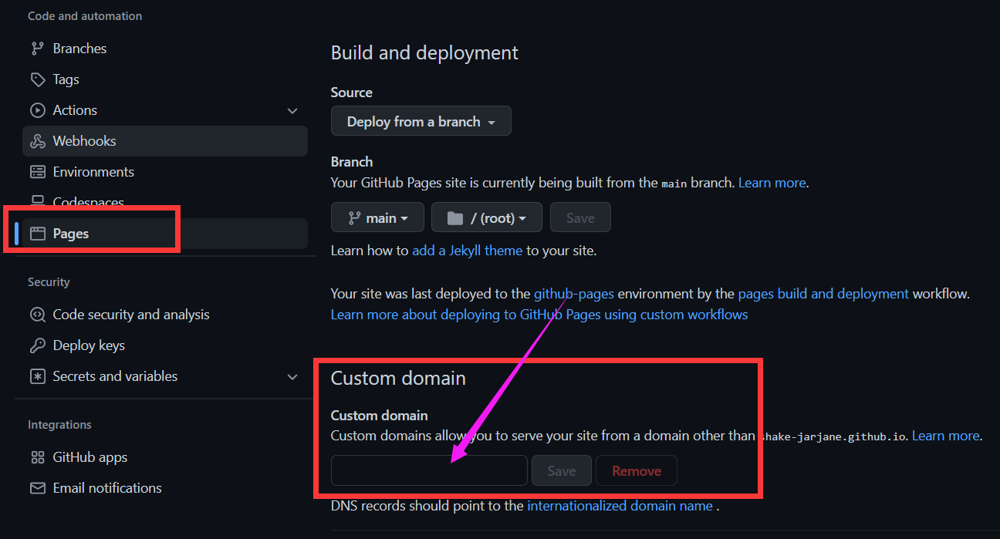

此时 你的项目文件了会多一个 `CNAME` 文件，文件内容就是刚刚填写的域名，这个 `CNAME` 文件你也手动在 Github 仓库里进行进行创建，一样的道理。

然后泡杯咖啡等待几分钟就可以通过域名来访问网站了。

:::tip 补充
有时候已经部署成功过了，明明没改什么就突然间部署不上去了，一直显示 **time out**，如果不是因为你的文件大小超出 Github 的限制，则有可能是因为服务器和网络的问题，等过一会再部署应该就正常了，太频繁的部署也可能会出现类似的问题。如果是在晚上出现的这种情况，那你可以去睡一觉了。
:::

**Over！现在可以开始你愉快的写作之旅了~**

## 参考与致谢

- **[从零搭建自己的个人网站](https://sinnammanyo.cn/blog/start#%E9%83%A8%E7%BD%B2-docusaurus)**
- **[部署 | Docusaurus](https://docusaurus.io/zh-CN/docs/deployment)**
- **[docusaurus搭建博客，利用GitHub Actions自动部署GitHub Pages](https://juejin.cn/post/6936846407051509774)**
- **[克隆别人的仓库，提交到自己的远程仓库的方法](https://blog.csdn.net/GKISX1216/article/details/123155756)**
- **[如何为你的GitHubPages自定义域名](https://www.likecs.com/show-204331570.html)**
- **[GithubPages绑定阿里云域名](https://www.likecs.com/show-204526583.html)**
