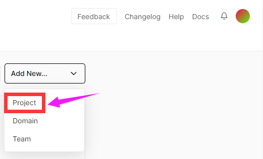
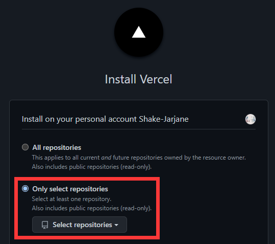
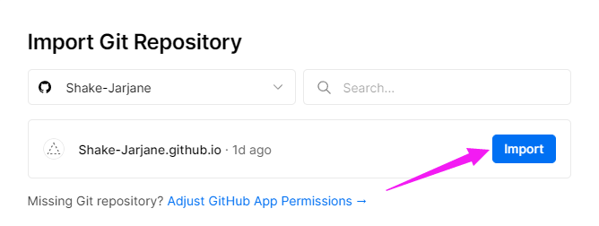
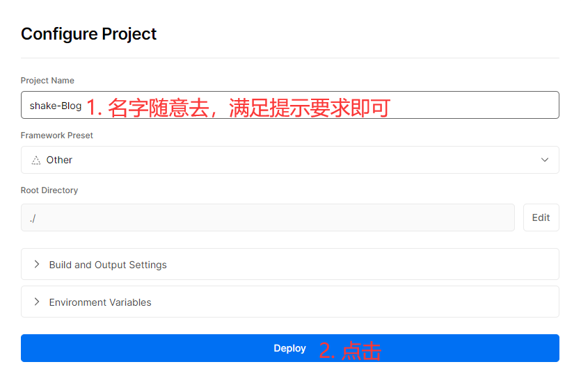
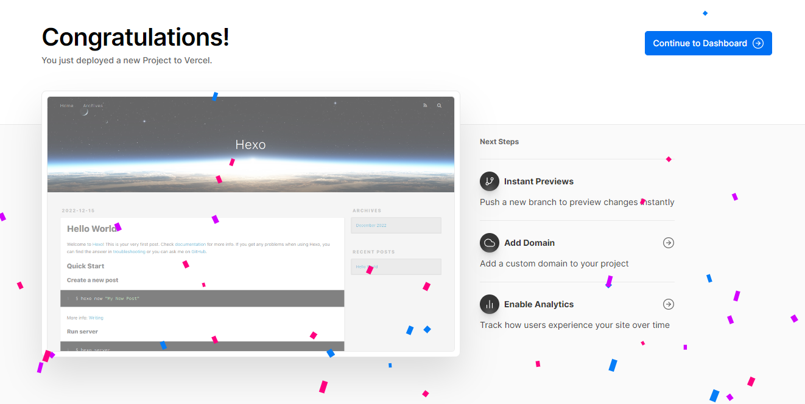

## Vercel 简介

vercel是一个代码托管平台，它能够托管你的静态html界面，甚至能够托管你的 node.js 与 Python 服务端脚本，是不想买服务器的懒人的福音！

## 使用 vercel 部署 Hexo 项目

首先需要一个 vercel 账号，推荐使用 GitHub 关联，这样可以直接在 Vercel 中托管自己的 GitHub 账号。实现部署开发一步到位。

登入之后在右上角点击创建新项目

选择自己部成功的储存静态博客的仓库

点击 Import

然后等待一小会，出现以下界面代表部署成功

