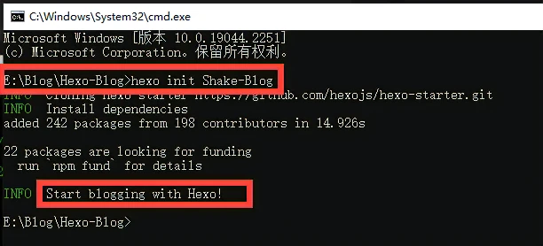
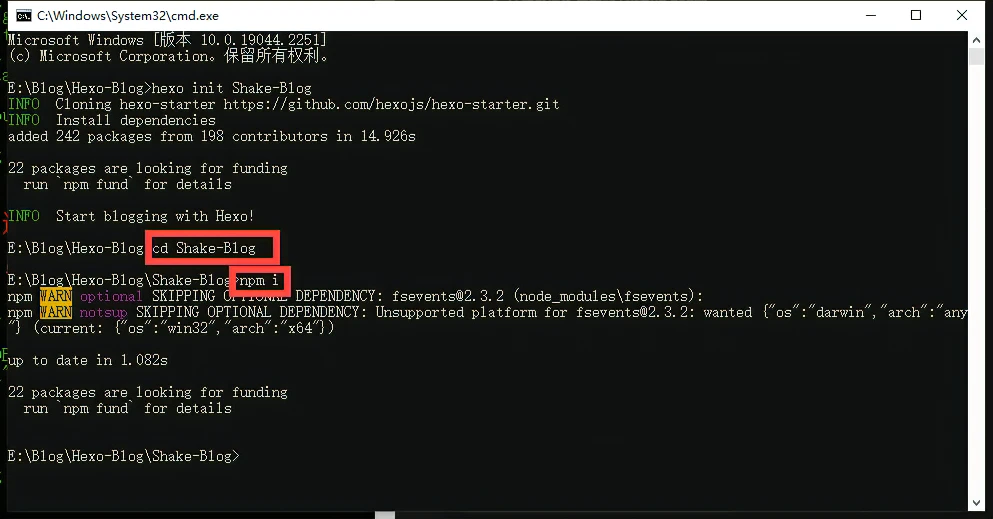
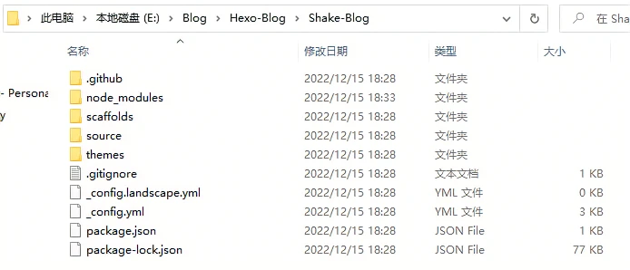
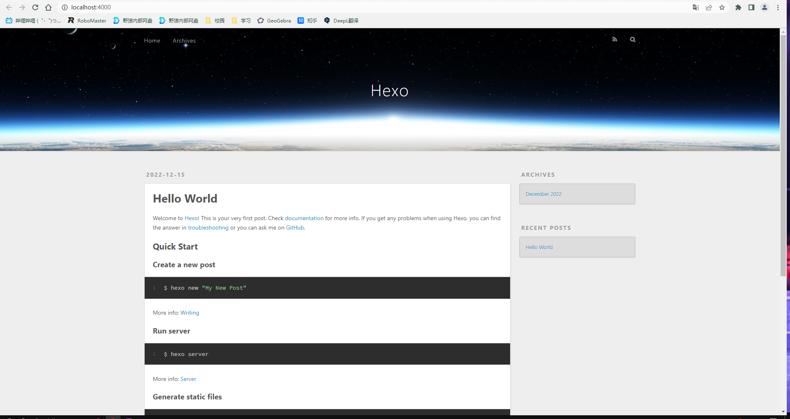
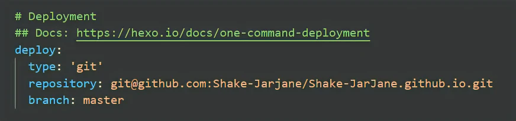
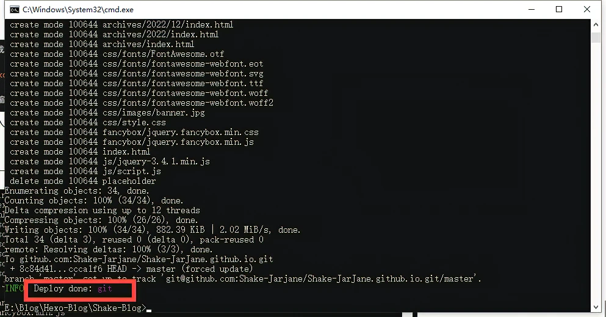
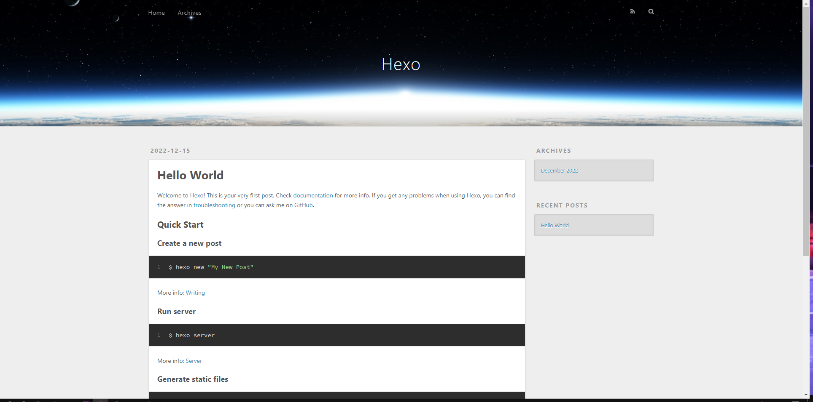

import DisplayFlex from '@site/src/components/DisplayFlex'

## 初始化 Hexo

在博客根目录路径打开 CMD 窗口，并执行如下命令

```bash
hexo init blog-demo(项目名，自定义)
```



进入项目目录，安装相关依赖

```bash
cd blog-demo  //进入blog-demo文件夹
npm i
```



初始化项目后，会出现如下目录结构：




启动 Hexo 项目

```bash
hexo s
```

打开浏览器并访问  `http://localhost:4000/`，显示初始界面就说明已经初步搭建成功





## 将博客挂到 Github Pages

**注意：把博客挂在到 GitHub Pages 的前提是创建了 仓库并配置了 SSH key。**

### 安装 hexo-deployer-git

```bash
npm install hexo-deployer-git --save
```

### 修改 _config.yml 文件

在项目路径的目录下的 _config.yml，就是整个 Hexo 框架的配置文件了。
可以在里面修改大部分配置文件，详细的教程可参考 Hexo 官方文档的[配置描述](https://hexo.io/zh-cn/docs/configuration)。

修改最后一行的配置，将 `repository` 修改为你自己的 GitHub 项目地址即可。
（注意检查自己的主分支是 **main** 还是 **master）**



### 部署到 Github

```bash
hexg cl
hexo g
hexo d
```

如果出现了 Deploy Done 说明部署成功，这时候可以去泡一杯咖啡，稍等几分钟在进行下一步。





现在博客网站地址是 `{username}.github.io`，也可以去定制一个专属与你自己的域名加上个CDN，需要购买，但不是必须的。
