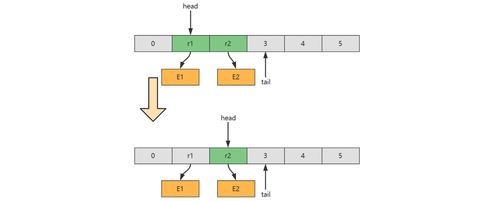
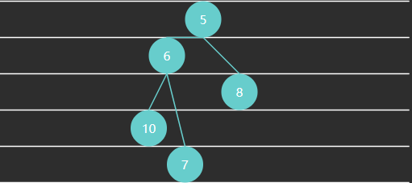
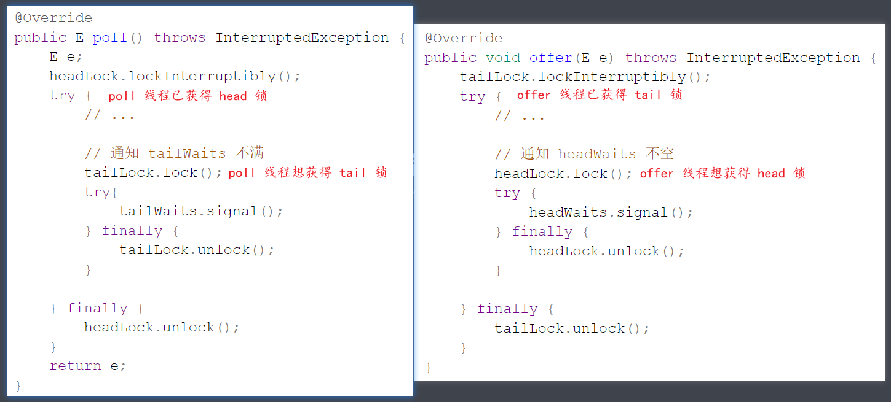

# 3 队列

## 概述

计算机科学中，queue 是以顺序的方式维护的一组数据集合，在一端添加数据，从另一端移除数据。习惯来说，添加的一端称为**尾**，移除的一端称为**头**，就如同生活中的排队买商品

> In computer science, a **queue** is a collection of entities that are maintained in a sequence and can be modified by  the addition of entities at one end of the sequence and the removal of  entities from the other end of the sequence

先定义一个简化的队列接口

```java
public interface Queue<E> {

    /**
     * 向队列尾插入值
     * @param value 待插入值
     * @return 插入成功返回 true, 插入失败返回 false
     */
    boolean offer(E value);

    /**
     * 从对列头获取值, 并移除
     * @return 如果队列非空返回对头值, 否则返回 null
     */
    E poll();

    /**
     * 从对列头获取值, 不移除
     * @return 如果队列非空返回对头值, 否则返回 null
     */
    E peek();

    /**
     * 检查队列是否为空
     * @return 空返回 true, 否则返回 false
     */
    boolean isEmpty();

    /**
     * 检查队列是否已满
     * @return 满返回 true, 否则返回 false
     */
    boolean isFull();
}
```


## 链表实现

下面以**单向环形带哨兵**链表方式来实现队列


代码

```java
public class LinkedListQueue<E>
        implements Queue<E>, Iterable<E> {

    private static class Node<E> {
        E value;
        Node<E> next;

        public Node(E value, Node<E> next) {
            this.value = value;
            this.next = next;
        }
    }

    private Node<E> head = new Node<>(null, null);
    private Node<E> tail = head;
    private int size = 0;
    private int capacity = Integer.MAX_VALUE;

    {
        tail.next = head;
    }

    public LinkedListQueue() {
    }

    public LinkedListQueue(int capacity) {
        this.capacity = capacity;
    }

    @Override
    public boolean offer(E value) {
        if (isFull()) {
            return false;
        }
        Node<E> added = new Node<>(value, head);
        tail.next = added;
        tail = added;
        size++;
        return true;
    }

    @Override
    public E poll() {
        if (isEmpty()) {
            return null;
        }
        Node<E> first = head.next;
        head.next = first.next;
        if (first == tail) {
            tail = head;
        }
        size--;
        return first.value;
    }

    @Override
    public E peek() {
        if (isEmpty()) {
            return null;
        }
        return head.next.value;
    }

    @Override
    public boolean isEmpty() {
        return head == tail;
    }

    @Override
    public boolean isFull() {
        return size == capacity;
    }

    @Override
    public Iterator<E> iterator() {
        return new Iterator<E>() {
            Node<E> p = head.next;
            @Override
            public boolean hasNext() {
                return p != head;
            }
            @Override
            public E next() {
                E value = p.value;
                p = p.next;
                return value;
            }
        };
    }
}
```


## 环形数组实现

**好处**

1. 对比普通数组，起点和终点更为自由，不用考虑数据移动
2. “环”意味着不会存在【越界】问题
3. 数组性能更佳
4. 环形数组比较适合实现有界队列、RingBuffer 等


**下标计算**

例如，数组长度是 5，当前位置是 3 ，向前走 2 步，此时下标为 $(3 + 2)\%5 = 0$


$$
(cur + step) \% length
$$

* cur 当前指针位置
* step 前进步数
* length 数组长度

> 注意：
>
> * 如果 step = 1，也就是一次走一步，可以在 >= length 时重置为 0 即可


**判断空**


**判断满**


满之后的策略可以根据业务需求决定

* 例如我们要实现的环形队列，满之后就拒绝入队

代码

```java
public class ArrayQueue<E> implements Queue<E>, Iterable<E>{

    private int head = 0;
    private int tail = 0;
    private final E[] array;
    private final int length;

    @SuppressWarnings("all")
    public ArrayQueue(int capacity) {
        length = capacity + 1;
        array = (E[]) new Object[length];
    }

    @Override
    public boolean offer(E value) {
        if (isFull()) {
            return false;
        }
        array[tail] = value;
        tail = (tail + 1) % length;
        return true;
    }

    @Override
    public E poll() {
        if (isEmpty()) {
            return null;
        }
        E value = array[head];
        head = (head + 1) % length;
        return value;
    }

    @Override
    public E peek() {
        if (isEmpty()) {
            return null;
        }
        return array[head];
    }

    @Override
    public boolean isEmpty() {
        return tail == head;
    }

    @Override
    public boolean isFull() {
        return (tail + 1) % length == head;
    }

    @Override
    public Iterator<E> iterator() {
        return new Iterator<E>() {
            int p = head;
            @Override
            public boolean hasNext() {
                return p != tail;
            }

            @Override
            public E next() {
                E value = array[p];
                p = (p + 1) % array.length;
                return value;
            }
        };
    }
}
```


**判断空、满方法2**

引入 size 

```java
public class ArrayQueue2<E> implements Queue<E>, Iterable<E> {

    private int head = 0;
    private int tail = 0;
    private final E[] array;
    private final int capacity;
    private int size = 0;

    @SuppressWarnings("all")
    public ArrayQueue2(int capacity) {
        this.capacity = capacity;
        array = (E[]) new Object[capacity];
    }

    @Override
    public boolean offer(E value) {
        if (isFull()) {
            return false;
        }
        array[tail] = value;
        tail = (tail + 1) % capacity;
        size++;
        return true;
    }

    @Override
    public E poll() {
        if (isEmpty()) {
            return null;
        }
        E value = array[head];
        head = (head + 1) % capacity;
        size--;
        return value;
    }

    @Override
    public E peek() {
        if (isEmpty()) {
            return null;
        }
        return array[head];
    }

    @Override
    public boolean isEmpty() {
        return size == 0;
    }

    @Override
    public boolean isFull() {
        return size == capacity;
    }

    @Override
    public Iterator<E> iterator() {
        return new Iterator<E>() {
            int p = head;

            @Override
            public boolean hasNext() {
                return p != tail;
            }

            @Override
            public E next() {
                E value = array[p];
                p = (p + 1) % capacity;
                return value;
            }
        };
    }
}
```


**判断空、满方法3**

* head 和 tail 不断递增，用到索引时，再用它们进行计算，两个问题
  * 如何保证 head 和 tail 自增超过正整数最大值的正确性

  * 如何让取模运算性能更高

* 答案：让 capacity 为 2 的幂

```java
public class ArrayQueue3<E> implements Queue<E>, Iterable<E> {

    private int head = 0;
    private int tail = 0;
    private final E[] array;
    private final int capacity;

    @SuppressWarnings("all")
    public ArrayQueue3(int capacity) {
        if ((capacity & capacity - 1) != 0) {
            throw new IllegalArgumentException("capacity 必须为 2 的幂");
        }
        this.capacity = capacity;
        array = (E[]) new Object[this.capacity];
    }

    @Override
    public boolean offer(E value) {
        if (isFull()) {
            return false;
        }
        array[tail & capacity - 1] = value;
        tail++;
        return true;
    }

    @Override
    public E poll() {
        if (isEmpty()) {
            return null;
        }
        E value = array[head & capacity - 1];
        head++;
        return value;
    }

    @Override
    public E peek() {
        if (isEmpty()) {
            return null;
        }
        return array[head & capacity - 1];
    }

    @Override
    public boolean isEmpty() {
        return tail - head == 0;
    }

    @Override
    public boolean isFull() {
        return tail - head == capacity;
    }

    @Override
    public Iterator<E> iterator() {
        return new Iterator<E>() {
            int p = head;

            @Override
            public boolean hasNext() {
                return p != tail;
            }

            @Override
            public E next() {
                E value = array[p & capacity - 1];
                p++;
                return value;
            }
        };
    }
}
```


# 3.1 双端队列

## 概述

双端队列、队列、栈对比

|                | 定义                               | 特点                   |
| -------------- | ---------------------------------- | ---------------------- |
| 队列           | 一端删除（头）另一端添加（尾）     | First In First Out     |
| 栈             | 一端删除和添加（顶）               | Last In First Out      |
| 双端队列       | 两端都可以删除、添加               |                        |
| 优先级队列     |                                    | 优先级高者先出队       |
| 延时队列       |                                    | 根据延时时间确定优先级 |
| 并发非阻塞队列 | 队列空或满时不阻塞                 |                        |
| 并发阻塞队列   | 队列空时删除阻塞、队列满时添加阻塞 |                        |

> 注1：
>
> * Java 中 LinkedList 即为典型双端队列实现，不过它同时实现了 Queue 接口，也提供了栈的 push pop 等方法
>
> 注2：
>
> * 不同语言，操作双端队列的方法命名有所不同，参见下表
>
>   | 操作     | Java       | JavaScript | C++        | leetCode 641 |
>   | -------- | ---------- | ---------- | ---------- | ------------ |
>   | 尾部插入 | offerLast  | push       | push_back  | insertLast   |
>   | 头部插入 | offerFirst | unshift    | push_front | insertFront  |
>   | 尾部移除 | pollLast   | pop        | pop_back   | deleteLast   |
>   | 头部移除 | pollFirst  | shift      | pop_front  | deleteFront  |
>   | 尾部获取 | peekLast   | at(-1)     | back       | getRear      |
>   | 头部获取 | peekFirst  | at(0)      | front      | getFront     |
>
> * 吐槽一下 leetCode 命名比较 low
>
> * 常见的单词还有 enqueue 入队、dequeue 出队


**接口定义**

```java
public interface Deque<E> {

    boolean offerFirst(E e);

    boolean offerLast(E e);

    E pollFirst();

    E pollLast();

    E peekFirst();

    E peekLast();
    
    boolean isEmpty();

    boolean isFull();
}
```


## 链表实现

```java
/**
 * 基于环形链表的双端队列
 * @param <E> 元素类型
 */
public class LinkedListDeque<E> implements Deque<E>, Iterable<E> {

    @Override
    public boolean offerFirst(E e) {
        if (isFull()) {
            return false;
        }
        size++;
        Node<E> a = sentinel;
        Node<E> b = sentinel.next;
        Node<E> offered = new Node<>(a, e, b);
        a.next = offered;
        b.prev = offered;
        return true;
    }

    @Override
    public boolean offerLast(E e) {
        if (isFull()) {
            return false;
        }
        size++;
        Node<E> a = sentinel.prev;
        Node<E> b = sentinel;
        Node<E> offered = new Node<>(a, e, b);
        a.next = offered;
        b.prev = offered;
        return true;
    }

    @Override
    public E pollFirst() {
        if (isEmpty()) {
            return null;
        }
        Node<E> a = sentinel;
        Node<E> polled = sentinel.next;
        Node<E> b = polled.next;
        a.next = b;
        b.prev = a;
        size--;
        return polled.value;
    }

    @Override
    public E pollLast() {
        if (isEmpty()) {
            return null;
        }
        Node<E> polled = sentinel.prev;
        Node<E> a = polled.prev;
        Node<E> b = sentinel;
        a.next = b;
        b.prev = a;
        size--;
        return polled.value;
    }

    @Override
    public E peekFirst() {
        if (isEmpty()) {
            return null;
        }
        return sentinel.next.value;
    }

    @Override
    public E peekLast() {
        if (isEmpty()) {
            return null;
        }
        return sentinel.prev.value;
    }

    @Override
    public boolean isEmpty() {
        return size == 0;
    }

    @Override
    public boolean isFull() {
        return size == capacity;
    }

    @Override
    public Iterator<E> iterator() {
        return new Iterator<E>() {
            Node<E> p = sentinel.next;
            @Override
            public boolean hasNext() {
                return p != sentinel;
            }

            @Override
            public E next() {
                E value = p.value;
                p = p.next;
                return value;
            }
        };
    }

    static class Node<E> {
        Node<E> prev;
        E value;
        Node<E> next;

        public Node(Node<E> prev, E value, Node<E> next) {
            this.prev = prev;
            this.value = value;
            this.next = next;
        }
    }

    Node<E> sentinel = new Node<>(null, null, null);
    int capacity;
    int size;

    public LinkedListDeque(int capacity) {
        sentinel.next = sentinel;
        sentinel.prev = sentinel;
        this.capacity = capacity;
    }
}
```


## 数组实现

```java
/**
 * 基于循环数组实现, 特点
 * <ul>
 *     <li>tail 停下来的位置不存储, 会浪费一个位置</li>
 * </ul>
 * @param <E>
 */
public class ArrayDeque1<E> implements Deque<E>, Iterable<E> {

    /*
                    h
            t
        0   1   2   3
        b           a
     */
    @Override
    public boolean offerFirst(E e) {
        if (isFull()) {
            return false;
        }
        head = dec(head, array.length);
        array[head] = e;
        return true;
    }

    @Override
    public boolean offerLast(E e) {
        if (isFull()) {
            return false;
        }
        array[tail] = e;
        tail = inc(tail, array.length);
        return true;
    }

    @Override
    public E pollFirst() {
        if (isEmpty()) {
            return null;
        }
        E e = array[head];
        array[head] = null;
        head = inc(head, array.length);
        return e;
    }

    @Override
    public E pollLast() {
        if (isEmpty()) {
            return null;
        }
        tail = dec(tail, array.length);
        E e = array[tail];
        array[tail] = null;
        return e;
    }

    @Override
    public E peekFirst() {
        if (isEmpty()) {
            return null;
        }
        return array[head];
    }

    @Override
    public E peekLast() {
        if (isEmpty()) {
            return null;
        }
        return array[dec(tail, array.length)];
    }

    @Override
    public boolean isEmpty() {
        return head == tail;
    }

    @Override
    public boolean isFull() {
        if (tail > head) {
            return tail - head == array.length - 1;
        } else if (tail < head) {
            return head - tail == 1;
        } else {
            return false;
        }
    }

    @Override
    public Iterator<E> iterator() {
        return new Iterator<E>() {
            int p = head;
            @Override
            public boolean hasNext() {
                return p != tail;
            }

            @Override
            public E next() {
                E e = array[p];
                p = inc(p, array.length);
                return e;
            }
        };
    }

    E[] array;
    int head;
    int tail;

    @SuppressWarnings("unchecked")
    public ArrayDeque1(int capacity) {
        array = (E[]) new Object[capacity + 1];
    }

    static int inc(int i, int length) {
        if (i + 1 >= length) {
            return 0;
        }
        return i + 1;
    }

    static int dec(int i, int length) {
        if (i - 1 < 0) {
            return length - 1;
        }
        return i - 1;
    }
}
```

数组实现中，如果存储的是基本类型，那么无需考虑内存释放，例如


但如果存储的是引用类型，应当设置该位置的引用为 null，以便内存及时释放




# 3.2 优先级队列

## 无序数组实现

**要点**

1. 入队保持顺序
2. 出队前找到优先级最高的出队，相当于一次选择排序

```java
public class PriorityQueue1<E extends Priority> implements Queue<E> {

    Priority[] array;
    int size;

    public PriorityQueue1(int capacity) {
        array = new Priority[capacity];
    }

    @Override // O(1)
    public boolean offer(E e) {
        if (isFull()) {
            return false;
        }
        array[size++] = e;
        return true;
    }

    // 返回优先级最高的索引值
    private int selectMax() {
        int max = 0;
        for (int i = 1; i < size; i++) {
            if (array[i].priority() > array[max].priority()) {
                max = i;
            }
        }
        return max;
    }

    @Override // O(n)
    public E poll() {
        if (isEmpty()) {
            return null;
        }
        int max = selectMax();
        E e = (E) array[max];
        remove(max);
        return e;
    }

    private void remove(int index) {
        if (index < size - 1) {
            System.arraycopy(array, index + 1,
                    array, index, size - 1 - index);
        }
        array[--size] = null; // help GC
    }

    @Override
    public E peek() {
        if (isEmpty()) {
            return null;
        }
        int max = selectMax();
        return (E) array[max];
    }

    @Override
    public boolean isEmpty() {
        return size == 0;
    }

    @Override
    public boolean isFull() {
        return size == array.length;
    }
}
```

* 视频中忘记了 help GC，注意一下


## 有序数组实现

**要点**

1. 入队后排好序，优先级最高的排列在尾部
2. 出队只需删除尾部元素即可

```java
public class PriorityQueue2<E extends Priority> implements Queue<E> {

    Priority[] array;
    int size;

    public PriorityQueue2(int capacity) {
        array = new Priority[capacity];
    }

    // O(n)
    @Override
    public boolean offer(E e) {
        if (isFull()) {
            return false;
        }
        insert(e);
        size++;
        return true;
    }

    // 一轮插入排序
    private void insert(E e) {
        int i = size - 1;
        while (i >= 0 && array[i].priority() > e.priority()) {
            array[i + 1] = array[i];
            i--;
        }
        array[i + 1] = e;
    }

    // O(1)
    @Override
    public E poll() {
        if (isEmpty()) {
            return null;
        }
        E e = (E) array[size - 1];
        array[--size] = null; // help GC
        return e;
    }

    @Override
    public E peek() {
        if (isEmpty()) {
            return null;
        }
        return (E) array[size - 1];
    }

    @Override
    public boolean isEmpty() {
        return size == 0;
    }

    @Override
    public boolean isFull() {
        return size == array.length;
    }
}
```


## 堆实现

计算机科学中，堆是一种基于树的数据结构，通常用**完全二叉树**实现。堆的特性如下

* 在大顶堆中，任意节点 C 与它的父节点 P 符合 $P.value \geq C.value$
* 而小顶堆中，任意节点 C 与它的父节点 P 符合 $P.value \leq C.value$
* 最顶层的节点（没有父亲）称之为 root 根节点

> In computer science, a **heap** is a specialized tree-based data structure which is essentially an almost complete tree that satisfies the **heap property**: in a *max heap*, for any given node C, if P is a parent node of C, then the *key* (the *value*) of P is greater than or equal to the key of C. In a *min heap*, the key of P is less than or equal to the key of C. The node at the "top" of the heap (with no parents) is called the **root** node


例1 - 满二叉树（Full Binary Tree）特点：每一层都是填满的


例2 - 完全二叉树（Complete Binary Tree）特点：最后一层可能未填满，靠左对齐



例3 - 大顶堆


例4 - 小顶堆


完全二叉树可以使用数组来表示


特征

* 如果从索引 0 开始存储节点数据
  * 节点 $i$ 的父节点为 $floor((i-1)/2)$，当 $i>0$ 时
  * 节点 $i$ 的左子节点为 $2i+1$，右子节点为 $2i+2$，当然它们得 $< size$
* 如果从索引 1 开始存储节点数据
  * 节点 $i$ 的父节点为 $floor(i/2)$，当 $i > 1$ 时
  * 节点 $i$ 的左子节点为 $2i$，右子节点为 $2i+1$，同样得 $< size$

代码

```java
public class PriorityQueue4<E extends Priority> implements Queue<E> {

    Priority[] array;
    int size;

    public PriorityQueue4(int capacity) {
        array = new Priority[capacity];
    }

    @Override
    public boolean offer(E offered) {
        if (isFull()) {
            return false;
        }
        int child = size++;
        int parent = (child - 1) / 2;
        while (child > 0 && offered.priority() > array[parent].priority()) {
            array[child] = array[parent];
            child = parent;
            parent = (child - 1) / 2;
        }
        array[child] = offered;
        return true;
    }


    private void swap(int i, int j) {
        Priority t = array[i];
        array[i] = array[j];
        array[j] = t;
    }

    @Override
    public E poll() {
        if (isEmpty()) {
            return null;
        }
        swap(0, size - 1);
        size--;
        Priority e = array[size];
        array[size] = null;
        
        shiftDown(0);        
        return (E) e;
    }

    void shiftDown(int parent) {
        int left = 2 * parent + 1;
        int right = left + 1;
        int max = parent;
        if (left < size && array[left].priority() > array[max].priority()) {
            max = left;
        }
        if (right < size && array[right].priority() > array[max].priority()) {
            max = right;
        }
        if (max != parent) {
            swap(max, parent);
            shiftDown(max);
        }
    }

    @Override
    public E peek() {
        if (isEmpty()) {
            return null;
        }
        return (E) array[0];
    }

    @Override
    public boolean isEmpty() {
        return size == 0;
    }

    @Override
    public boolean isFull() {
        return size == array.length;
    }
}
```


# 3.3 阻塞队列

之前的队列在很多场景下都不能很好地工作，例如

1. 大部分场景要求分离向队列放入（生产者）、从队列拿出（消费者）两个角色、它们得由不同的线程来担当，而之前的实现根本没有考虑线程安全问题
2. 队列为空，那么在之前的实现里会返回 null，如果就是硬要拿到一个元素呢？只能不断循环尝试
3. 队列为满，那么再之前的实现里会返回 false，如果就是硬要塞入一个元素呢？只能不断循环尝试

因此我们需要解决的问题有

1. 用锁保证线程安全
2. 用条件变量让**等待非空线程**与**等待不满线程**进入**等待**状态，而不是不断循环尝试，让 CPU 空转

有同学对线程安全还没有足够的认识，下面举一个反例，两个线程都要执行入队操作（几乎在同一时刻）

```java
public class TestThreadUnsafe {
    private final String[] array = new String[10];
    private int tail = 0;

    public void offer(String e) {
        array[tail] = e;
        tail++;
    }

    @Override
    public String toString() {
        return Arrays.toString(array);
    }

    public static void main(String[] args) {
        TestThreadUnsafe queue = new TestThreadUnsafe();
        new Thread(()-> queue.offer("e1"), "t1").start();
        new Thread(()-> queue.offer("e2"), "t2").start();
    }
}
```

执行的时间序列如下，假设初始状态 tail = 0，在执行过程中由于 CPU 在两个线程之间切换，造成了指令交错

| 线程1          | 线程2          | 说明                                                         |
| -------------- | -------------- | ------------------------------------------------------------ |
| array[tail]=e1 |                | 线程1 向 tail 位置加入 e1 这个元素，但还没来得及执行  tail++ |
|                | array[tail]=e2 | 线程2 向 tail 位置加入 e2 这个元素，覆盖掉了 e1              |
|                | tail++         | tail 自增为1                                                 |
| tail++         |                | tail 自增为2                                                 |
|                |                | 最后状态 tail 为 2，数组为 [e2, null, null ...]              |

糟糕的是，由于指令交错的顺序不同，得到的结果不止以上一种，宏观上造成混乱的效果


## 单锁实现

Java 中要防止代码段交错执行，需要使用锁，有两种选择

* synchronized 代码块，属于关键字级别提供锁保护，功能少
* ReentrantLock 类，功能丰富

以 ReentrantLock 为例

```java
ReentrantLock lock = new ReentrantLock();

public void offer(String e) {
    lock.lockInterruptibly();
    try {
        array[tail] = e;
        tail++;
    } finally {
        lock.unlock();
    }
}
```

只要两个线程执行上段代码时，锁对象是同一个，就能保证 try 块内的代码的执行不会出现指令交错现象，即执行顺序只可能是下面两种情况之一

| 线程1                    | 线程2                    | 说明                                                         |
| ------------------------ | ------------------------ | ------------------------------------------------------------ |
| lock.lockInterruptibly() |                          | t1对锁对象上锁                                               |
| array[tail]=e1           |                          |                                                              |
|                          | lock.lockInterruptibly() | 即使 CPU 切换到线程2，但由于t1已经对该对象上锁，因此线程2卡在这儿进不去 |
| tail++                   |                          | 切换回线程1 执行后续代码                                     |
| lock.unlock()            |                          | 线程1 解锁                                                   |
|                          | array[tail]=e2           | 线程2 此时才能获得锁，执行它的代码                           |
|                          | tail++                   |                                                              |

* 另一种情况是线程2 先获得锁，线程1 被挡在外面
* 要明白**保护的本质**，本例中是保护的是 tail 位置读写的安全


事情还没有完，上面的例子是队列还没有放满的情况，考虑下面的代码（这回锁同时保护了 tail 和 size 的读写安全）

```java
ReentrantLock lock = new ReentrantLock();
int size = 0;

public void offer(String e) {
    lock.lockInterruptibly();
    try {
        if(isFull()) {
            // 满了怎么办?
        }
        array[tail] = e;
        tail++;
        
        size++;
    } finally {
        lock.unlock();
    }
}

private boolean isFull() {
    return size == array.length;
}
```

之前是返回 false 表示添加失败，前面分析过想达到这么一种效果：

* 在队列满时，不是立刻返回，而是当前线程进入等待
* 什么时候队列不满了，再唤醒这个等待的线程，从上次的代码处继续向下运行

ReentrantLock 可以配合条件变量来实现，代码进化为

```java
ReentrantLock lock = new ReentrantLock();
Condition tailWaits = lock.newCondition(); // 条件变量
int size = 0;

public void offer(String e) {
    lock.lockInterruptibly();
    try {
        while (isFull()) {
            tailWaits.await();	// 当队列满时, 当前线程进入 tailWaits 等待
        }
        array[tail] = e;
        tail++;
        
        size++;
    } finally {
        lock.unlock();
    }
}

private boolean isFull() {
    return size == array.length;
}
```

* 条件变量底层也是个队列，用来存储这些需要等待的线程，当队列满了，就会将 offer 线程加入条件队列，并暂时释放锁
* 将来我们的队列如果不满了（由 poll 线程那边得知）可以调用 tailWaits.signal() 来唤醒 tailWaits 中首个等待的线程，被唤醒的线程会再次抢到锁，从上次 await 处继续向下运行

思考为何要用 while 而不是 if，设队列容量是 3

| 操作前  | offer(4)                   | offer(5)                     | poll()                     | 操作后    |
| ------- | -------------------------- | ---------------------------- | -------------------------- | --------- |
| [1 2 3] | 队列满，进入tailWaits 等待 |                              |                            | [1 2 3]   |
| [1 2 3] |                            |                              | 取走 1，队列不满，唤醒线程 | [2 3]     |
| [2 3]   |                            | 抢先获得锁，发现不满，放入 5 |                            | [2 3 5]   |
| [2 3 5] | 从上次等待处直接向下执行   |                              |                            | [2 3 5 ?] |

关键点：

* 从 tailWaits 中唤醒的线程，会与新来的 offer 的线程争抢锁，谁能抢到是不一定的，如果后者先抢到，就会导致条件又发生变化
* 这种情况称之为**虚假唤醒**，唤醒后应该重新检查条件，看是不是得重新进入等待


最后的实现代码

```java
/**
 * 单锁实现
 * @param <E> 元素类型
 */
public class BlockingQueue1<E> implements BlockingQueue<E> {
    private final E[] array;
    private int head = 0;
    private int tail = 0;
    private int size = 0; // 元素个数

    @SuppressWarnings("all")
    public BlockingQueue1(int capacity) {
        array = (E[]) new Object[capacity];
    }

    ReentrantLock lock = new ReentrantLock();
    Condition tailWaits = lock.newCondition();
    Condition headWaits = lock.newCondition();

    @Override
    public void offer(E e) throws InterruptedException {
        lock.lockInterruptibly();
        try {
            while (isFull()) {
                tailWaits.await();
            }
            array[tail] = e;
            if (++tail == array.length) {
                tail = 0;
            }
            size++;
            headWaits.signal();
        } finally {
            lock.unlock();
        }
    }

    @Override
    public void offer(E e, long timeout) throws InterruptedException {
        lock.lockInterruptibly();
        try {
            long t = TimeUnit.MILLISECONDS.toNanos(timeout);
            while (isFull()) {
                if (t <= 0) {
                    return;
                }
                t = tailWaits.awaitNanos(t);
            }
            array[tail] = e;
            if (++tail == array.length) {
                tail = 0;
            }
            size++;
            headWaits.signal();
        } finally {
            lock.unlock();
        }
    }

    @Override
    public E poll() throws InterruptedException {
        lock.lockInterruptibly();
        try {
            while (isEmpty()) {
                headWaits.await();
            }
            E e = array[head];
            array[head] = null; // help GC
            if (++head == array.length) {
                head = 0;
            }
            size--;
            tailWaits.signal();
            return e;
        } finally {
            lock.unlock();
        }
    }

    private boolean isEmpty() {
        return size == 0;
    }

    private boolean isFull() {
        return size == array.length;
    }
}
```

* public void offer(E e, long timeout) throws InterruptedException 是带超时的版本，可以只等待一段时间，而不是永久等下去，类似的 poll 也可以做带超时的版本，这个留给大家了


> **注意**
>
> * JDK 中 BlockingQueue 接口的方法命名与我的示例有些差异
>   * 方法 offer(E e) 是非阻塞的实现，阻塞实现方法为 put(E e)
>   * 方法 poll() 是非阻塞的实现，阻塞实现方法为 take()


## 双锁实现

单锁的缺点在于：

* 生产和消费几乎是不冲突的，唯一冲突的是生产者和消费者它们有可能同时修改 size
* 冲突的主要是生产者之间：多个 offer 线程修改 tail
* 冲突的还有消费者之间：多个 poll 线程修改 head

如果希望进一步提高性能，可以用两把锁

* 一把锁保护 tail
* 另一把锁保护 head

```java
ReentrantLock headLock = new ReentrantLock();  // 保护 head 的锁
Condition headWaits = headLock.newCondition(); // 队列空时，需要等待的线程集合

ReentrantLock tailLock = new ReentrantLock();  // 保护 tail 的锁
Condition tailWaits = tailLock.newCondition(); // 队列满时，需要等待的线程集合
```

先看看 offer 方法的初步实现

```java
@Override
public void offer(E e) throws InterruptedException {
    tailLock.lockInterruptibly();
    try {
        // 队列满等待
        while (isFull()) {
            tailWaits.await();
        }
        
        // 不满则入队
        array[tail] = e;
        if (++tail == array.length) {
            tail = 0;
        }
        
        // 修改 size （有问题）
        size++;
        
    } finally {
        tailLock.unlock();
    }
}
```

上面代码的缺点是 size 并不受 tailLock 保护，tailLock 与 headLock 是两把不同的锁，并不能实现互斥的效果。因此，size 需要用下面的代码保证原子性

```java
AtomicInteger size = new AtomicInteger(0);	   // 保护 size 的原子变量

size.getAndIncrement(); // 自增
size.getAndDecrement(); // 自减
```

代码修改为

```java
@Override
public void offer(E e) throws InterruptedException {
    tailLock.lockInterruptibly();
    try {
        // 队列满等待
        while (isFull()) {
            tailWaits.await();
        }
        
        // 不满则入队
        array[tail] = e;
        if (++tail == array.length) {
            tail = 0;
        }
        
        // 修改 size
        size.getAndIncrement();
        
    } finally {
        tailLock.unlock();
    }
}
```

对称地，可以写出 poll 方法

```java
@Override
public E poll() throws InterruptedException {
    E e;
    headLock.lockInterruptibly();
    try {
        // 队列空等待
        while (isEmpty()) {
            headWaits.await();
        }
        
        // 不空则出队
        e = array[head];
        if (++head == array.length) {
            head = 0;
        }
        
        // 修改 size
        size.getAndDecrement();
        
    } finally {
        headLock.unlock();
    }
    return e;
}
```

下面来看一个难题，就是如何通知 headWaits 和 tailWaits 中等待的线程，比如 poll 方法拿走一个元素，通知 tailWaits：我拿走一个，不满了噢，你们可以放了，因此代码改为

```java
@Override
public E poll() throws InterruptedException {
    E e;
    headLock.lockInterruptibly();
    try {
        // 队列空等待
        while (isEmpty()) {
            headWaits.await();
        }
        
        // 不空则出队
        e = array[head];
        if (++head == array.length) {
            head = 0;
        }
        
        // 修改 size
        size.getAndDecrement();
        
        // 通知 tailWaits 不满（有问题）
        tailWaits.signal();
        
    } finally {
        headLock.unlock();
    }
    return e;
}
```

问题在于要使用这些条件变量的 await()， signal() 等方法需要先获得与之关联的锁，上面的代码若直接运行会出现以下错误

```java
java.lang.IllegalMonitorStateException
```

那有同学说，加上锁不就行了吗，于是写出了下面的代码


发现什么问题了？两把锁这么嵌套使用，非常容易出现死锁，如下所示



因此得避免嵌套，两段加锁的代码变成了下面平级的样子


性能还可以进一步提升

1. 代码调整后 offer 并没有同时获取 tailLock 和 headLock 两把锁，因此两次加锁之间会有**空隙**，这个空隙内可能有其它的 offer 线程添加了更多的元素，那么这些线程都要执行 signal()，通知 poll 线程队列非空吗？
   * 每次调用 signal() 都需要这些 offer 线程先获得 headLock 锁，成本较高，要想法减少 offer 线程获得 headLock 锁的次数
   * 可以加一个条件：当 offer 增加前队列为空，即从 0 变化到不空，才由此 offer 线程来通知 headWaits，其它情况不归它管

2. 队列从 0 变化到不空，会唤醒一个等待的 poll 线程，这个线程被唤醒后，肯定能拿到 headLock 锁，因此它具备了唤醒 headWaits 上其它 poll 线程的先决条件。如果检查出此时有其它 offer 线程新增了元素（不空，但不是从0变化而来），那么不妨由此 poll 线程来唤醒其它 poll 线程

这个技巧被称之为级联通知（cascading notifies），类似的原因

3. 在 poll 时队列从满变化到不满，才由此 poll 线程来唤醒一个等待的 offer 线程，目的也是为了减少 poll 线程对 tailLock 上锁次数，剩下等待的 offer 线程由这个 offer 线程间接唤醒

最终的代码为

```java
public class BlockingQueue2<E> implements BlockingQueue<E> {

    private final E[] array;
    private int head = 0;
    private int tail = 0;
    private final AtomicInteger size = new AtomicInteger(0);
    ReentrantLock headLock = new ReentrantLock();
    Condition headWaits = headLock.newCondition();
    ReentrantLock tailLock = new ReentrantLock();
    Condition tailWaits = tailLock.newCondition();

    public BlockingQueue2(int capacity) {
        this.array = (E[]) new Object[capacity];
    }

    @Override
    public void offer(E e) throws InterruptedException {
        int c;
        tailLock.lockInterruptibly();
        try {
            while (isFull()) {
                tailWaits.await();
            }
            array[tail] = e;
            if (++tail == array.length) {
                tail = 0;
            }            
            c = size.getAndIncrement();
            // a. 队列不满, 但不是从满->不满, 由此offer线程唤醒其它offer线程
            if (c + 1 < array.length) {
                tailWaits.signal();
            }
        } finally {
            tailLock.unlock();
        }
        // b. 从0->不空, 由此offer线程唤醒等待的poll线程
        if (c == 0) {
            headLock.lock();
            try {
                headWaits.signal();
            } finally {
                headLock.unlock();
            }
        }
    }

    @Override
    public E poll() throws InterruptedException {
        E e;
        int c;
        headLock.lockInterruptibly();
        try {
            while (isEmpty()) {
                headWaits.await(); 
            }
            e = array[head]; 
            if (++head == array.length) {
                head = 0;
            }
            c = size.getAndDecrement();
            // b. 队列不空, 但不是从0变化到不空，由此poll线程通知其它poll线程
            if (c > 1) {
                headWaits.signal();
            }
        } finally {
            headLock.unlock();
        }
        // a. 从满->不满, 由此poll线程唤醒等待的offer线程
        if (c == array.length) {
            tailLock.lock();
            try {
                tailWaits.signal();
            } finally {
                tailLock.unlock();
            }
        }
        return e;
    }

    private boolean isEmpty() {
        return size.get() == 0;
    }

    private boolean isFull() {
        return size.get() == array.length;
    }

}
```

双锁实现的非常精巧，据说作者 Doug Lea 花了一年的时间才完善了此段代码

