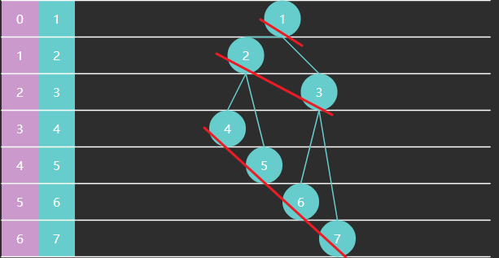

## 2.9 堆

以大顶堆为例，相对于之前的优先级队列，增加了堆化等方法

```java
public class MaxHeap {
    int[] array;
    int size;

    public MaxHeap(int capacity) {
        this.array = new int[capacity];
    }

    /**
     * 获取堆顶元素
     *
     * @return 堆顶元素
     */
    public int peek() {
        return array[0];
    }

    /**
     * 删除堆顶元素
     *
     * @return 堆顶元素
     */
    public int poll() {
        int top = array[0];
        swap(0, size - 1);
        size--;
        down(0);
        return top;
    }

    /**
     * 删除指定索引处元素
     *
     * @param index 索引
     * @return 被删除元素
     */
    public int poll(int index) {
        int deleted = array[index];
        swap(index, size - 1);
        size--;
        down(index);
        return deleted;
    }

    /**
     * 替换堆顶元素
     * @param replaced 新元素
     */
    public void replace(int replaced) {
        array[0] = replaced;
        down(0);
    }

    /**
     * 堆的尾部添加元素
     *
     * @param offered 新元素
     * @return 是否添加成功
     */
    public boolean offer(int offered) {
        if (size == array.length) {
            return false;
        }
        up(offered);
        size++;
        return true;
    }

    // 将 offered 元素上浮: 直至 offered 小于父元素或到堆顶
    private void up(int offered) {
        int child = size;
        while (child > 0) {
            int parent = (child - 1) / 2;
            if (offered > array[parent]) {
                array[child] = array[parent];
            } else {
                break;
            }
            child = parent;
        }
        array[child] = offered;
    }

    public MaxHeap(int[] array) {
        this.array = array;
        this.size = array.length;
        heapify();
    }

    // 建堆
    private void heapify() {
        // 如何找到最后这个非叶子节点  size / 2 - 1
        for (int i = size / 2 - 1; i >= 0; i--) {
            down(i);
        }
    }

    // 将 parent 索引处的元素下潜: 与两个孩子较大者交换, 直至没孩子或孩子没它大
    private void down(int parent) {
        int left = parent * 2 + 1;
        int right = left + 1;
        int max = parent;
        if (left < size && array[left] > array[max]) {
            max = left;
        }
        if (right < size && array[right] > array[max]) {
            max = right;
        }
        if (max != parent) { // 找到了更大的孩子
            swap(max, parent);
            down(max);
        }
    }

    // 交换两个索引处的元素
    private void swap(int i, int j) {
        int t = array[i];
        array[i] = array[j];
        array[j] = t;
    }

    public static void main(String[] args) {

        int[] array = {1, 2, 3, 4, 5, 6, 7};
        MaxHeap maxHeap = new MaxHeap(array);
        System.out.println(Arrays.toString(maxHeap.array));
    }
}
```


**建堆**

Floyd 建堆算法作者（也是之前龟兔赛跑判环作者）：


1. 找到最后一个非叶子节点
2. 从后向前，对每个节点执行下潜

一些规律

* 一棵满二叉树节点个数为 $2^h-1$，如下例中高度 $h=3$ 节点数是 $2^3-1=7$
* 非叶子节点范围为 $[0, size/2-1]$


算法时间复杂度分析



下面看交换次数的推导：设节点高度为 3

|           | 本层节点数 | 高度 | 下潜最多交换次数（高度-1） |
| --------- | ---------- | ---- | -------------------------- |
| 4567 这层 | 4          | 1    | 0                          |
| 23这层    | 2          | 2    | 1                          |
| 1这层     | 1          | 3    | 2                          |

每一层的交换次数为：节点个数*此节点交换次数，总的交换次数为
$$
\begin{aligned}
& 4 * 0 + 2 * 1 + 1 * 2 \\

& \frac{8}{2}*0 + \frac{8}{4}*1 + \frac{8}{8}*2 \\

& \frac{8}{2^1}*0 + \frac{8}{2^2}*1 + \frac{8}{2^3}*2\\

\end{aligned}
$$
即
$$
\sum_{i=1}^{h}(\frac{2^h}{2^i}*(i-1))
$$
在 https://www.wolframalpha.com/ 输入

```
Sum[\(40)Divide[Power[2,x],Power[2,i]]*\(40)i-1\(41)\(41),{i,1,x}]
```

推导出 
$$
2^h -h -1
$$
其中 $2^h \approx n$，$h \approx \log_2{n}$，因此有时间复杂度 $O(n)$

