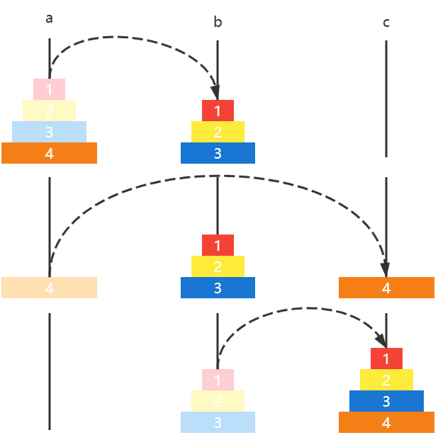
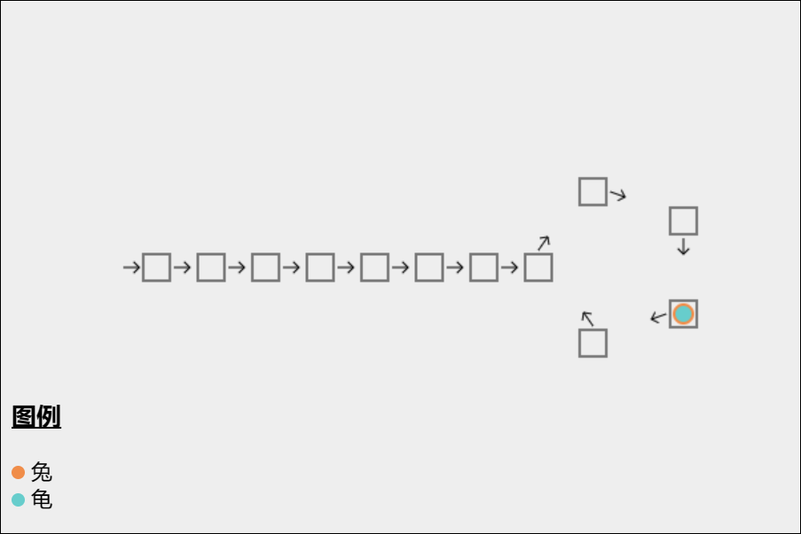

# 三. 练习

## 3.1 时间复杂度

用函数 $f(n)$ 表示算法效率与数据规模的关系，假设每次解决问题需要 1 微秒（$10^{-6}$ 秒），进行估算：

1. 如果 $f(n) = n^2$ 那么 1 秒能解决多少次问题？1 天呢？
2. 如果 $f(n) = log_2(n)$  那么 1 秒能解决多少次问题？1 天呢？
3. 如果 $f(n) = n!$ 那么 1 秒能解决多少次问题？1 天呢？


参考解答

1. 1秒 $\sqrt{10^6} = 1000$ 次，1 天 $\sqrt{10^6 * 3600 * 24} \approx 293938$ 次
2. 1秒 $2^{1,000,000}$ 次，一天 $2^{86,400,000,000}$
3. 推算如下
   * $10! = 3,628,800$ 1秒能解决 $1,000,000$ 次，因此次数为 9 次
   * $14!=87,178,291,200$，一天能解决 $86,400,000,000$ 次，因此次数为 13 次


## 3.2 二分查找

* [69. x 的平方根 - 力扣（LeetCode）](https://leetcode.cn/problems/sqrtx/)


### E01. 二分查找-力扣 704 题

**要点**：减而治之，可以用递归或非递归实现

给定一个 n 个元素有序的（升序）整型数组 nums 和一个目标值 target  ，写一个函数搜索 nums 中的 target，如果目标值存在返回下标，否则返回 -1

例如

```java
输入: nums = [-1,0,3,5,9,12], target = 9
输出: 4
解释: 9 出现在 nums 中并且下标为 4
    
输入: nums = [-1,0,3,5,9,12], target = 2
输出: -1
解释: 2 不存在 nums 中因此返回 -1    
```

**参考答案**：略，可以用讲过的任意一种二分求解


### E02. 搜索插入位置-力扣 35 题

**要点**：理解谁代表插入位置

给定一个排序数组和一个目标值

* 在数组中找到目标值，并返回其索引
* 如果目标值不存在于数组中，返回它将会被按顺序插入的位置

例如

```
输入: nums = [1,3,5,6], target = 5
输出: 2

输入: nums = [1,3,5,6], target = 2
输出: 1

输入: nums = [1,3,5,6], target = 7
输出: 4
```


**参考答案1**：用二分查找基础版代码改写，基础版中，找到返回 m，没找到 i 代表插入点，因此有

```java
public int searchInsert(int[] a, int target) {
    int i = 0, j = a.length - 1;
    while (i <= j) {
        int m = (i + j) >>> 1;
        if (target < a[m]) {
            j = m - 1;
        } else if (a[m] < target) {
            i = m + 1;
        } else {
            return m;
        }
    }
    return i; // 原始 return -1
}
```


**参考答案2**：用二分查找平衡版改写，平衡版中

* 如果 target == a[i] 返回 i 表示找到
* 如果 target < a[i]，例如 target = 2，a[i] = 3，这时就应该在 i 位置插入 2
* 如果 a[i] < target，例如 a[i] = 3，target = 4，这时就应该在 i+1 位置插入 4

```java
public static int searchInsert(int[] a, int target) {
    int i = 0, j = a.length;
    while (1 < j - i) {
        int m = (i + j) >>> 1;
        if (target < a[m]) {
            j = m;
        } else {
            i = m;
        }
    }
    return (target <= a[i]) ? i : i + 1;
    // 原始 (target == a[i]) ? i : -1;
}
```


**参考答案3**：用 leftmost 版本解，返回值即为插入位置（并能处理元素重复的情况）

```java
public int searchInsert(int[] a, int target) {
    int i = 0, j = a.length - 1;
    while(i <= j) {
        int m = (i + j) >>> 1;
        if(target <= a[m]) {
            j = m - 1;
        } else {
            i = m + 1;
        } 
    }
    return i;
}
```


### E03. 搜索开始结束位置-力扣 34 题

给你一个按照非递减顺序排列的整数数组 nums，和一个目标值 target。请你找出给定目标值在数组中的开始位置和结束位置。

如果数组中不存在目标值 target，返回 [-1, -1]。

你必须设计并实现时间复杂度为 O(log n) 的算法解决此问题


例如

```
输入：nums = [5,7,7,8,8,10], target = 8
输出：[3,4]

输入：nums = [5,7,7,8,8,10], target = 6
输出：[-1,-1]

输入：nums = [], target = 0
输出：[-1,-1]
```


**参考答案**

```java
class Solution {

    public int[] searchRange(int[] nums, int target) {
        return new int[]{left(nums,target),right(nums,target)};
    }
    public int left(int[] a,int target){
        int i=0,j=a.length -1;
        int candidate = -1;
        while(i<=j){
            int m=(i+j)>>>1;
            if (target < a[m]){
                j =m-1;
            }else if (a[m]<target){
                i = m+1;
            }else{
                candidate=m;
                j = m-1;
            }
        }
        return candidate;
    }
    public int right(int[] a,int target){
        int i=0,j=a.length -1;
        int candidate = -1;
        while(i<=j){
            int m=(i+j)>>>1;
            if (target < a[m]){
                j =m-1;
            }else if (a[m]<target){
                i = m+1;
            }else{
                candidate=m;
                i = m+1;
            }
        }
        return candidate;
    }
}
```

### E03.  [搜索旋转排序数组](https://leetcode.cn/problems/search-in-rotated-sorted-array/)-力扣 33 题

整数数组 nums 按升序排列，数组中的值互不相同 。
在传递给函数之前，nums 在预先未知的某个下标 k（0 <= k < nums.length）上进行了 旋转，使数组变为 $[nums[k], nums[k+1], ..., nums[n-1], nums[0], nums[1], ..., nums[k-1]]$（下标 从 0 开始 计数）。例如， $[0,1,2,4,5,6,7]$ 在下标 3 处经旋转后可能变为 $[4,5,6,7,0,1,2]$ 。
给你 旋转后 的数组 nums 和一个整数 target ，如果 nums 中存在这个目标值 target ，则返回它的下标，否则返回 -1 。
你必须设计一个时间复杂度为 $O(log n)$ 的算法解决此问题。

```java
class Solution {
    public int search(int[] nums, int target) {
        int lo = 0, hi = nums.length - 1;
        while (lo <= hi) {
            int mid = lo + (hi - lo) / 2;
            if (nums[mid] == target) {
                return mid;
            }
            
            // 先根据 nums[0] 与 target 的关系判断目标值是在左半段还是右半段
            if (target >= nums[0]) {
                // 目标值在左半段时，若 mid 在右半段，则将 mid 索引的值改成 inf
                if (nums[mid] < nums[0]) {
                    nums[mid] = Integer.MAX_VALUE;
                }
            } else {
                // 目标值在右半段时，若 mid 在左半段，则将 mid 索引的值改成 -inf
                if (nums[mid] >= nums[0]) {
                    nums[mid] = Integer.MIN_VALUE;
                }
            }

            if (nums[mid] < target) {
                lo = mid + 1;
            } else {
                hi = mid - 1;
            }
        }
        return -1;
    }
    
}
```

## 3.3 递归 - single recursion

### E03. 二分查找

```java
public static int binarySearch(int[] a, int target) {
    return recursion(a, target, 0, a.length - 1);
}

public static int recursion(int[] a, int target, int i, int j) {
    if (i > j) {
        return -1;
    }
    int m = (i + j) >>> 1;
    if (target < a[m]) {
        return recursion(a, target, i, m - 1);
    } else if (a[m] < target) {
        return recursion(a, target, m + 1, j);
    } else {
        return m;
    }
}
```


### E04. 冒泡排序

```java
public static void main(String[] args) {
    int[] a = {3, 2, 6, 1, 5, 4, 7};
    bubble(a, 0, a.length - 1);
    System.out.println(Arrays.toString(a));
}

private static void bubble(int[] a, int low, int high) {
    if(low == high) {
        return;
    }
    int j = low;
    for (int i = low; i < high; i++) {
        if (a[i] > a[i + 1]) {
            swap(a, i, i + 1);
            j = i;
        }
    }
    bubble(a, low, j);
}

private static void swap(int[] a, int i, int j) {
    int t = a[i];
    a[i] = a[j];
    a[j] = t;
}
```

* low 与 high 为未排序范围
* j 表示的是未排序的边界，下一次递归时的 high
  * 发生交换，意味着有无序情况
  * 最后一次交换（以后没有无序）时，左侧 i 仍是无序，右侧 i+1 已然有序
* 视频中讲解的是只考虑 high 边界的情况，参考以上代码，理解在 low .. high 范围内的处理方法


### E05. 插入排序

```java
public static void main(String[] args) {
    int[] a = {3, 2, 6, 1, 5, 7, 4};
    insertion(a, 1, a.length - 1);
    System.out.println(Arrays.toString(a));
}

private static void insertion(int[] a, int low, int high) {
    if (low > high) {
        return;
    }
    int i = low - 1;
    int t = a[low];
    while (i >= 0 && a[i] > i) {
        a[i + 1] = a[i];
        i--;
    }
    if(i + 1 != low) {
        a[i + 1] = t;
    }    
    insertion(a, low + 1, high);
}
```

* 已排序区域：[0 .. i .. low-1]
* 未排序区域：[low .. high]
* 视频中讲解的是只考虑 low 边界的情况，参考以上代码，理解 low-1 ..  high 范围内的处理方法
* 扩展：利用二分查找 leftmost 版本，改进寻找插入位置的代码


### E06. 约瑟夫问题[^4]

$n$ 个人排成圆圈，从头开始报数，每次数到第 $m$ 个人（$m$ 从 $1$ 开始）杀之，继续从下一个人重复以上过程，求最后活下来的人是谁？


**方法1**

根据最后的存活者 a 倒推出它在上一轮的索引号

| f(n,m) | 本轮索引 | 为了让 a 是这个索引，上一轮应当这样排 | 规律        |
| ------ | -------- | ------------------------------------- | ----------- |
| f(1,3) | 0        | x x x a                               | (0 + 3) % 2 |
| f(2,3) | 1        | x x x 0 a                             | (1 + 3) % 3 |
| f(3,3) | 1        | x x x 0 a                             | (1 + 3) % 4 |
| f(4,3) | 0        | x x x a                               | (0 + 3) % 5 |
| f(5,3) | 3        | x x x 0 1 2 a                         | (3 + 3) % 6 |
| f(6,3) | 0        | x x x a                               |             |


**方法2**

设 n 为总人数，m 为报数次数，解返回的是这些人的索引，从0开始

| f(n, m) | 解                       | 规律  |
| ------- | ------------------------ | ----- |
| f(1, 3) | 0                        |       |
| f(2, 3) | 0 1 => 1                 | 3%2=1 |
| f(3, 3) | 0 1 2 => 0 1             | 3%3=0 |
| f(4, 3) | 0 1 2 3 => 3 0 1         | 3%4=3 |
| f(5, 3) | 0 1 2 3 4  => 3 4 0 1    | 3%5=3 |
| f(6, 3) | 0 1 2 3 4 5 => 3 4 5 0 1 | 3%6=3 |

**一. 找出等价函数**

规律：下次报数的起点为 $k = m \% n$

* 首次出列人的序号是 $k-1$，剩下的的 $n-1$ 个人重新组成约瑟夫环
* 下次从 $k$ 开始数，序号如下
  * $k,\ k+1, \ ...\ ,\ 0,\ 1,\ k-2$，如上例中 $3\ 4\ 5\ 0\ 1$

这个函数称之为 $g(n-1,m)$，它的最终结果与 $f(n,m)$ 是相同的。


**二. 找到映射函数**

现在想办法找到 $g(n-1,m)$ 与 $f(n-1, m)$ 的对应关系，即
$$
\begin{aligned}
3 \rightarrow 0 \\
4 \rightarrow 1 \\
5 \rightarrow 2 \\
0 \rightarrow 3 \\
1 \rightarrow 4 \\
\end{aligned}
$$
映射函数为
$$
\begin{aligned}
mapping(x) = 
\begin{cases}
x-k & x=[k..n-1] \\
x+n-k & x=[0..k-2]
\end{cases}
\end{aligned}
$$
等价于下面函数
$$
mapping(x) = (x + n - k)\%{n}
$$
代入测试一下
$$
\begin{aligned}
3 \rightarrow (3+6-3)\%6 \rightarrow 0 \\
4 \rightarrow (4+6-3)\%6 \rightarrow 1 \\
5 \rightarrow (5+6-3)\%6 \rightarrow 2 \\
0 \rightarrow (0+6-3)\%6 \rightarrow 3 \\
1 \rightarrow (1+6-3)\%6 \rightarrow 4 \\
\end{aligned}
$$
综上有
$$
f(n-1,m) = mapping(g(n-1,m))
$$


**三. 求逆映射函数**

映射函数是根据 x 计算 y，逆映射函数即根据 y 得到 x
$$
mapping^{-1}(x) = (x + k)\%n
$$
代入测试一下
$$
\begin{aligned}
0 \rightarrow (0+3)\%6 \rightarrow 3 \\
1 \rightarrow (1+3)\%6 \rightarrow 4 \\
2 \rightarrow (2+3)\%6 \rightarrow 5 \\
3 \rightarrow (3+3)\%6 \rightarrow 0 \\
4 \rightarrow (4+3)\%6 \rightarrow 1 \\
\end{aligned}
$$
因此可以求得
$$
g(n-1,m) = mapping^{-1}(f(n-1,m))
$$


**四. 递推式**

代入推导
$$
\begin{aligned}
f(n,m) = \ & g(n-1,m) \\
= \ & mapping^{-1}(f(n-1,m)) \\
= \ & (f(n-1,m) + k) \% n \\
= \ & (f(n-1,m) + m\%n) \% n \\
= \ & (f(n-1,m) + m) \% n \\
\end{aligned}
$$
最后一步化简是利用了模运算法则

$(a+b)\%n = (a\%n + b\%n) \%n$  例如 

* $(6+6)\%5 = 2 = (6+6\%5)\%5$
* $(6+5)\%5 = 1 = (6+5\%5)\%5$
* $(6+4)\%5 = 0 = (6+4\%5)\%5$

最终递推式
$$
\begin{aligned}
f(n,m) = 
\begin{cases}
(f(n-1,m) + m) \% n & n>1\\
0 & n = 1
\end{cases}
\end{aligned}
$$


## 3.4 递归 - multi recursion


### E02. 汉诺塔[^2]

Tower of Hanoi，是一个源于印度古老传说：大梵天创建世界时做了三根金刚石柱，在一根柱子从下往上按大小顺序摞着 64 片黄金圆盘，大梵天命令婆罗门把圆盘重新摆放在另一根柱子上，并且规定

* 一次只能移动一个圆盘
* 小圆盘上不能放大圆盘

下面的动图演示了4片圆盘的移动方法


使用程序代码模拟圆盘的移动过程，并估算出时间复杂度


**思路**

* 假设每根柱子标号 a，b，c，每个圆盘用 1，2，3 ... 表示其大小，圆盘初始在 a，要移动到的目标是 c

* 如果只有一个圆盘，此时是最小问题，可以直接求解

  * 移动圆盘1 $a \mapsto c$  

  

* 如果有两个圆盘，那么

  * 圆盘1 $a \mapsto b$ 
  * 圆盘2 $a \mapsto c$
  * 圆盘1 $b \mapsto c$

  

* 如果有三个圆盘，那么

  * 圆盘12 $a \mapsto b$
  * 圆盘3 $a \mapsto c$
  * 圆盘12 $b \mapsto c$

  

* 如果有四个圆盘，那么
  * 圆盘 123 $a \mapsto b$
  * 圆盘4 $a \mapsto c$
  * 圆盘 123 $b \mapsto c$




**题解**

```java
public class E02HanoiTower {


    /*
             源 借 目
        h(4, a, b, c) -> h(3, a, c, b)
                         a -> c
                         h(3, b, a, c)
     */
    static LinkedList<Integer> a = new LinkedList<>();
    static LinkedList<Integer> b = new LinkedList<>();
    static LinkedList<Integer> c = new LinkedList<>();

    static void init(int n) {
        for (int i = n; i >= 1; i--) {
            a.add(i);
        }
    }

    static void h(int n, LinkedList<Integer> a, 
                  LinkedList<Integer> b, 
                  LinkedList<Integer> c) {
        if (n == 0) {
            return;
        }
        h(n - 1, a, c, b);
        c.addLast(a.removeLast());
        print();
        h(n - 1, b, a, c);
    }

    private static void print() {
        System.out.println("-----------------------");
        System.out.println(a);
        System.out.println(b);
        System.out.println(c);
    }

    public static void main(String[] args) {
        init(3);
        print();
        h(3, a, b, c);
    }
}
```


### E03. 杨辉三角[^1]


**分析**

把它斜着看

```
        1
      1   1
    1   2   1
  1   3   3   1
1   4   6   4   1
```

* 行 $i$，列 $j$，那么 $[i][j]$ 的取值应为 $[i-1][j-1] + [i-1][j]$
* 当 $j=0$ 或 $i=j$ 时，$[i][j]$ 取值为 $1$


**题解**

```java
public static void print(int n) {
    for (int i = 0; i < n; i++) {
        if (i < n - 1) {
            System.out.printf("%" + 2 * (n - 1 - i) + "s", " ");
        }

        for (int j = 0; j < i + 1; j++) {
            System.out.printf("%-4d", element(i, j));
        }
        System.out.println();
    }
}

public static int element(int i, int j) {
    if (j == 0 || i == j) {
        return 1;
    }
    return element(i - 1, j - 1) + element(i - 1, j);
}
```


**优化1**

是 multiple recursion，因此很多递归调用是重复的，例如

* recursion(3, 1) 分解为
  * recursion(2, 0) + recursion(2, 1) 
* 而 recursion(3, 2) 分解为
  * recursion(2, 1) + recursion(2, 2)

这里 recursion(2, 1) 就重复调用了，事实上它会重复很多次，可以用 static AtomicInteger counter = new AtomicInteger(0) 来查看递归函数的调用总次数

事实上，可以用 **memoization** 来进行优化：

```java
public static void print1(int n) {
    int[][] triangle = new int[n][];
    for (int i = 0; i < n; i++) {
        // 打印空格
        triangle[i] = new int[i + 1];
        for (int j = 0; j <= i; j++) {
            System.out.printf("%-4d", element1(triangle, i, j));
        }
        System.out.println();
    }
}

public static int element1(int[][] triangle, int i, int j) {
    if (triangle[i][j] > 0) {
        return triangle[i][j];
    }

    if (j == 0 || i == j) {
        triangle[i][j] = 1;
        return triangle[i][j];
    }
    triangle[i][j] = element1(triangle, i - 1, j - 1) + element1(triangle, i - 1, j);
    return triangle[i][j];
}
```

* 将数组作为递归函数内可以访问的遍历，如果 $triangle[i][j]$ 已经有值，说明该元素已经被之前的递归函数计算过，就不必重复计算了


**优化2**

```java
public static void print2(int n) {
    int[] row = new int[n];
    for (int i = 0; i < n; i++) {
        // 打印空格
        createRow(row, i);
        for (int j = 0; j <= i; j++) {
            System.out.printf("%-4d", row[j]);
        }
        System.out.println();
    }
}

private static void createRow(int[] row, int i) {
    if (i == 0) {
        row[0] = 1;
        return;
    }
    for (int j = i; j > 0; j--) {
        row[j] = row[j - 1] + row[j];
    }
}
```

> 注意：还可以通过每一行的前一项计算出下一项，不必借助上一行，这与杨辉三角的另一个特性有关，暂不展开了


力扣对应题目，但递归不适合在力扣刷高分，因此只列出相关题目，不做刷题讲解了

* [118. 杨辉三角 - 力扣（LeetCode）](https://leetcode.cn/problems/pascals-triangle/)
* [119. 杨辉三角 II - 力扣（LeetCode）](https://leetcode.cn/problems/pascals-triangle-ii/solution/yang-hui-san-jiao-ii-by-leetcode-solutio-shuk/)


## 3.5 链表

### E01. 反转单向链表-力扣 206 题

对应力扣题目 [206. 反转链表 - 力扣（LeetCode）](https://leetcode.cn/problems/reverse-linked-list/)

```
输入：head = [1,2,3,4,5]
输出：[5,4,3,2,1]

输入：[1,2]
输出：[2,1]

输入：[]
输出：[]
```


**方法1**

构造一个新链表，从**旧链表**依次拿到每个节点，创建新节点添加至**新链表**头部，完成后新链表即是倒序的

```java
public ListNode reverseList(ListNode o1) {
    ListNode n1 = null;
    ListNode p = o1;
    while (p != null) {
        n1 = new ListNode(p.val, n1);
        p = p.next;
    }
    return n1;
}
```

评价：简单直白，就是得新创建节点对象


**方法2**

与方法1 类似，构造一个新链表，从**旧链表头部**移除节点，添加到**新链表头部**，完成后新链表即是倒序的，区别在于原题目未提供节点外层的容器类，这里提供一个，另外一个区别是并不去构造新节点

```java
static class List {
    ListNode head;

    public List(ListNode head) {
        this.head = head;
    }

    public ListNode removeFirst(){
        ListNode first = head;
        if (first != null) {
            head = first.next;
        }
        return first;
    }

    public void addFirst(ListNode first) {
        first.next = head;
        head = first;
    }
}
```

代码

```java
public ListNode reverseList(ListNode head) {
    List list1 = new List(head);
    List list2 = new List(null);
    ListNode first;
    while ((first = list1.removeFirst()) != null) {
        list2.addFirst(first);
    }
    return list2.head;
}
```

评价：更加面向对象，如果实际写代码而非刷题，更多会这么做


**方法3**

递归，在**归**时让 $5 \rightarrow 4$，$4 \rightarrow 3$ ...

首先，写一个递归方法，返回值用来拿到最后一个节点

```java
public ListNode reverseList(ListNode p) {
    if (p == null || p.next == null) { // 不足两个节点
        return p; // 最后一个节点
    }
    ListNode last = reverseList(p.next);
    return last;
}
```

* 注意1：递归终止条件是 curr.next == null，目的是到最后一个节点就结束递归，与之前递归遍历不一样
* 注意2：需要考虑空链表即 p == null 的情况

可以先测试一下

```java
ListNode o5 = new ListNode(5, null);
ListNode o4 = new ListNode(4, o5);
ListNode o3 = new ListNode(3, o4);
ListNode o2 = new ListNode(2, o3);
ListNode o1 = new ListNode(1, o2);
ListNode n1 = new E01Leetcode206().reverseList(o1);
System.out.println(n1);
```

会打印

```
[5]
```

下面为**伪码**调用过程，假设节点分别是 $1 \rightarrow 2 \rightarrow 3 \rightarrow 4 \rightarrow 5 \rightarrow null$，先忽略返回值

```java
reverseList(ListNode p = 1) {
    reverseList(ListNode p = 2) {
    	reverseList(ListNode p = 3) {
    		reverseList(ListNode p = 4) {
    			reverseList(ListNode p = 5) {
    				if (p == null || p.next == null) {
                        return p; // 返回5
                    }
				}
                // 此时p是4, p.next是5
			}
            // 此时p是3, p.next是4
		}
        // 此时p是2, p.next是3
	}
    // 此时p是1, p.next是2
}
```

接下来，从 p = 4 开始，要让 $5 \rightarrow 4$，$4 \rightarrow 3$ ...

```java
reverseList(ListNode p = 1) {
    reverseList(ListNode p = 2) {
    	reverseList(ListNode p = 3) {
    		reverseList(ListNode p = 4) {
    			reverseList(ListNode p = 5) {
    				if (p == null || p.next == null) {
                        return p; // 返回5
                    }
				}
                // 此时p是4, p.next是5, 要让5指向4,代码写成 p.next.next=p
                // 还要注意4要指向 null, 否则就死链了
			}
            // 此时p是3, p.next是4
		}
        // 此时p是2, p.next是3
	}
    // 此时p是1, p.next是2
}
```

最终代码为：

```java
public ListNode reverseList(ListNode p) {    
    if (p == null || p.next == null) { // 不足两个节点
        return p; // 最后一个节点
    }
    ListNode last = reverseList(p.next);
    p.next.next = p;
    p.next = null;
    return last;
}
```

Q：为啥不能在**递**的过程中倒序？

A：比如

* $ 1 \rightarrow 2 \rightarrow 3 $ 如果递的过程中让 $2 \rightarrow 1$ 那么此时 $2 \rightarrow 3$ 就被覆盖，不知道接下来递给谁
* 而归的时候让 $3 \rightarrow 2$ 不会影响上一层的 $1 \rightarrow 2$

评价：单向链表没有 prev 指针，但利用递归的特性【记住了】链表每次调用时相邻两个节点是谁


**方法4**

从链表每次拿到第二个节点，将其从链表断开，插入头部，直至它为 null 结束

1. 设置指针 o1(旧头)、n1(新头)、o2(旧老二)，分别指向第一，第一，第二节点

$\frac{n1 \ o1}{1} \rightarrow \frac{o2}{2} \rightarrow 3 \rightarrow 4 \rightarrow 5 \rightarrow null$

2. 将 o2 节点从链表断开，即 o1 节点指向第三节点

$ \frac{n1 \ o1}{1} \rightarrow 3 \rightarrow 4 \rightarrow 5 \rightarrow null$ ，$\frac{o2}{2}$

3. o2 节点链入链表头部，即

$\frac{o2}{2} \rightarrow \frac{n1 \ o1}{1} \rightarrow 3 \rightarrow 4 \rightarrow 5 \rightarrow null$

4. n1 指向 o2

$\frac{n1 \ o2}{2} \rightarrow \frac{o1}{1} \rightarrow 3 \rightarrow 4 \rightarrow 5 \rightarrow null$

5. o2 指向 o1 的下一个节点，即

$\frac{n1}{2} \rightarrow \frac{o1}{1} \rightarrow \frac{o2}{3} \rightarrow 4 \rightarrow 5 \rightarrow null$

6. 重复以上 $2\sim5$ 步，直到 o2 指向 null

7. 还应当考虑边界条件，即链表中不满两个元素时，无需走以上逻辑


参考答案

```java
public ListNode reverseList(ListNode o1) {    
    if (o1 == null || o1.next == null) { // 不足两个节点
        return o1;
    }
    ListNode o2 = o1.next;
    ListNode n1 = o1;
    while (o2 != null) {
        o1.next = o2.next; 
        o2.next = n1;
        n1 = o2;
        o2 = o1.next;
    }
    return n1;
}
```


**方法5**

要点：把链表分成两部分，思路就是不断从链表2的头，往链表1的头搬移

1. n1 指向 null，代表**新链表**一开始没有元素，o1 指向**原链表**的首节点

$\frac{n1}{null}$，$\frac{o1}{1} \rightarrow 2 \rightarrow 3 \rightarrow 4 \rightarrow 5 \rightarrow null$

2. 开始循环，o2 指向**原链表**次节点

$\frac{n1}{null}$，$\frac{o1}{1} \rightarrow \frac{o2}{2} \rightarrow 3 \rightarrow 4 \rightarrow 5 \rightarrow null$

3. 搬移

$\frac{o1}{1} \rightarrow \frac{n1}{null}$  ， $\frac{o2}{2} \rightarrow 3 \rightarrow 4 \rightarrow 5 \rightarrow null$

4. 指针复位

$\frac{n1}{1} \rightarrow null$ ， $\frac{o1 \ o2}{2} \rightarrow 3 \rightarrow 4 \rightarrow 5 \rightarrow null$

5. 重复 $2\sim4$ 步
6. 当 o1 = null 时退出循环


**参考答案**

```java
public ListNode reverseList(ListNode o1) {
    if (o1 == null || o1.next == null) {
        return o1;
    }
    ListNode n1 = null;
    while (o1 != null) {
        ListNode o2 = o1.next;
        o1.next = n1;
        n1 = o1;
        o1 = o2;
    }
    return n1;
}
```

评价：本质上与方法2 相同，只是方法2更为面向对象


### E02. 根据值删除节点-力扣 203 题

例如

```
输入：head = [1,2,6,3,6], val = 6
输出：[1,2,3]

输入：head = [], val = 1
输出：[]

输入：head = [7,7,7,7], val = 7
输出：[]
```


**方法1**

图中 s 代表 sentinel 哨兵（如果不加哨兵，则删除第一个节点要特殊处理），例如要删除 6

```
p1   p2
s -> 1 -> 2 -> 6 -> 3 -> 6 -> null
```

* 如果 p2 不等于目标，则 p1，p2 不断后移

```
	 p1   p2
s -> 1 -> 2 -> 6 -> 3 -> 6 -> null

	 	  p1   p2
s -> 1 -> 2 -> 6 -> 3 -> 6 -> null
```

* p2 == 6，删除它，注意 p1 此时保持不变，p2 后移

```
	 	  p1   p2
s -> 1 -> 2 -> 3 -> 6 -> null
```

* p2 不等于目标，则 p1，p2 不断后移

```
	 	  	   p1   p2
s -> 1 -> 2 -> 3 -> 6 -> null
```

* p2 == 6，删除它，注意 p1 此时保持不变，p2 后移

```
	 	  	   p1   p2
s -> 1 -> 2 -> 3 -> null
```

* p2 == null 退出循环

最后代码

```java
public ListNode removeElements(ListNode head, int val) {
    ListNode sentinel = new ListNode(-1, head);
    ListNode p1 = sentinel;
    ListNode p2;
    while ((p2 = p1.next) != null) {
        if (p2.val == val) {
            p1.next = p2.next;
        } else {
            p1 = p1.next;
        }
    }
    return sentinel.next;
}
```


**方法2**

思路，递归函数负责返回：从当前节点（我）开始，完成删除的子链表

1. 若我与 v 相等，应该返回下一个节点递归结果
2. 若我与 v 不等，应该返回我，但我的 next 应该更新（让我能带上后续删过的子链表）

```java
removeElements(ListNode p=1, int v=6){
    1.next=removeElements(ListNode p=2, int v=6){
    	2.next=removeElements(ListNode p=6, int v=6){
    		removeElements(ListNode p=3, int v=6){
    			3.next=removeElements(ListNode p=6, int v=6){
    				removeElements(ListNode p=null, int v=6){
    					// 没有节点,返回
                        return null
					}
				}
                return 3
			}
		}
        return 2
    }
    return 1
}
```

代码

```java
public ListNode removeElements(ListNode head, int val) {
    if (head == null) {
        return null;
    }
    if (head.val == val) {
        return removeElements(head.next, val);
    } else {
        head.next = removeElements(head.next, val);
        return head;
    }
}
```


### E03.  删除倒数节点-力扣 19 题

例如

```
输入：head = [1,2,3,4,5], n = 2
输出：[1,2,3,5]

输入：head = [1], n = 1
输出：[]

输入：head = [1,2], n = 1
输出：[1]
```

另外题目提示

* 链表至少一个节点
* n 只会在合理范围


**方法1**

思路，写一个递归函数，用来返回下一个节点的倒数序号

```java
recursion(ListNode p=1, int n=2) {
    recursion(ListNode p=2, int n=2) {
    	recursion(ListNode p=3, int n=2) {
    		recursion(ListNode p=4, int n=2) {
    			recursion(ListNode p=5, int n=2) {
    				recursion(ListNode p=null, int n=2) {
    					return 0; // 最内层序号0
					}
                    return 1; // 上一次返回值+1
				}
                return 2;
			}
            if(返回值 == n == 2) {
                // 删除 next
            }
            return 3;
		}
        return 4;
	}
    return 5;
}
```

但上述代码有一个问题，就是若删除的是第一个节点，它没有上一个节点，因此可以加一个哨兵来解决

代码

```java
public ListNode removeNthFromEnd(ListNode head, int n) {
    ListNode sentinel = new ListNode(-1, head);
    recursion(sentinel, n);
    return sentinel.next;
}

public int recursion(ListNode p, int n) {
    if (p == null) {
        return 0;
    }
    int nth = recursion(p.next, n);
    if (nth == n) {
        p.next = p.next.next;
    }
    return nth + 1;
}
```

Q：p.next.next 不怕空指针吗？

A：

* p 是待删除节点的上一个节点，如果能递归回到 p，那么 p.next 肯定有值，不会是 null
* 且题目说明了 n >=1，不会因为 nth == 0 而让 p.next 指向最后的 null


**方法2**

快慢指针，p1 指向待删节点的上一个，p2 先走 n + 1 步

```java
i=0
p2
s -> 1 -> 2 -> 3 -> 4 -> 5 -> null

     i=1
     p2
s -> 1 -> 2 -> 3 -> 4 -> 5 -> null

          i=2
          p2
s -> 1 -> 2 -> 3 -> 4 -> 5 -> null

               i=3 从此开始 p1 p2 依次向右平移, 直到 p2 移动到末尾
p1             p2
s -> 1 -> 2 -> 3 -> 4 -> 5 -> null

               p1             p2
s -> 1 -> 2 -> 3 -> 4 -> 5 -> null
```

代码

```java
public ListNode removeNthFromEnd(ListNode head, int n) {
    ListNode s = new ListNode(-1, head);
    ListNode p1 = s;
    ListNode p2 = s;
    for (int i = 0; i < n + 1; i++) {
        p2 = p2.next;
    }
    while (p2 != null) {
        p1 = p1.next;
        p2 = p2.next;
    }
    p1.next = p1.next.next;
    return s.next;
}
```


**方法3**

```java
public ListNode removeNthFromEnd(ListNode head, int n) {
    Composite c = recursion(head, n);
    return c.node;
}

static class Composite {
    ListNode node;
    int nth;

    public Composite(ListNode node, int nth) {
        this.node = node;
        this.nth = nth;
    }
}

public Composite recursion(ListNode p, int n) {
    if (p == null) {
        return new Composite(null, 1);
    }
    Composite c = recursion(p.next, n);
    if (c.nth != n) {
        p.next = c.node;
        c.node = p;
    }
    c.nth +=1;
    return c;
}
```


### E04. 有序链表去重-力扣 83 题

例如

```
输入：head = [1,1,2]
输出：[1,2]

输入：head = [1,1,2,3,3]
输出：[1,2,3]
```

注意：**重复元素保留一个**

**方法1**

```
p1   p2
1 -> 1 -> 2 -> 3 -> 3 -> null
```

* p1.val == p2.val 那么删除 p2，注意 p1 此时保持不变

```
p1   p2
1 -> 2 -> 3 -> 3 -> null
```

* p1.val != p2.val 那么 p1，p2 向后移动

```java
     p1   p2
1 -> 2 -> 3 -> 3 -> null
         
          p1   p2
1 -> 2 -> 3 -> 3 -> null     
```

* p1.val == p2.val 那么删除 p2

```
          p1   p2
1 -> 2 -> 3 -> null   
```

* 当 p2 == null 退出循环

代码

```java
public ListNode deleteDuplicates(ListNode head) {
    // 链表节点 < 2
    if (head == null || head.next == null) {
        return head;
    }
    // 链表节点 >= 2
    ListNode p1 = head;
    ListNode p2;
    while ((p2 = p1.next) != null) {
        if (p1.val == p2.val) {
            p1.next = p2.next;
        } else {
            p1 = p1.next;
        }
    }
    return head;
}
```


**方法2**

递归函数负责返回：从当前节点（我）开始，完成去重的链表

1. 若我与 next 重复，返回 next
2. 若我与 next 不重复，返回我，但 next 应当更新

```java
deleteDuplicates(ListNode p=1) {
    deleteDuplicates(ListNode p=1) {
        1.next=deleteDuplicates(ListNode p=2) {
            2.next=deleteDuplicates(ListNode p=3) {
                deleteDuplicates(ListNode p=3) {
					// 只剩一个节点，返回
                    return 3
                }                
            }
            return 2
        }
        return 1
    }
}
```

代码

```java
public ListNode deleteDuplicates(ListNode p) {
    if (p == null || p.next == null) {
        return p;
    }
    if(p.val == p.next.val) {
        return deleteDuplicates(p.next);
    } else {
        p.next = deleteDuplicates(p.next);
        return p;
    }
}
```


### E05. 有序链表去重-力扣 82 题

例如

```
输入：head = [1,2,3,3,4,4,5]
输出：[1,2,5]

输入：head = [1,1,1,2,3]
输出：[2,3]
```

注意：**重复元素一个不留**

**方法1**

递归函数负责返回：从当前节点（我）开始，完成去重的链表

1. 若我与 next 重复，一直找到下一个不重复的节点，以它的返回结果为准
2. 若我与 next 不重复，返回我，同时更新 next

```java
deleteDuplicates(ListNode p = 1) {
    // 找下个不重复的
	deleteDuplicates(ListNode p = 1) {
        deleteDuplicates(ListNode p = 1) {
			deleteDuplicates(ListNode p = 2) {
                2.next=deleteDuplicates(ListNode p = 3) {
					// 只剩一个节点，返回
                    return 3
                }
                return 2
			}
        }
    }
}
```

代码

```java
public ListNode deleteDuplicates(ListNode p) {
    if (p == null || p.next == null) {
        return p;
    }
    if (p.val == p.next.val) {
        ListNode x = p.next.next;
        while (x != null && x.val == p.val) {
            x = x.next;
        }
        return deleteDuplicates(x);
    } else {
        p.next = deleteDuplicates(p.next);
        return p;
    }
}
```


**方法2**

p1 是待删除的上一个节点，每次循环对比 p2、p3 的值

* 如果 p2 与 p3 的值重复，那么 p3 继续后移，直到找到与 p2 不重复的节点，p1 指向 p3 完成删除
* 如果 p2 与 p3 的值不重复，p1，p2，p3 向后平移一位，继续上面的操作
* p2 或 p3 为 null 退出循环
  * p2 为 null 的情况，比如链表为 1 1 1 null


```
p1 p2 p3
s, 1, 1, 1, 2, 3, null

p1 p2    p3
s, 1, 1, 1, 2, 3, null

p1 p2       p3
s, 1, 1, 1, 2, 3, null

p1 p3
s, 2, 3, null

p1 p2 p3
s, 2, 3, null

   p1 p2 p3
s, 2, 3, null
```


代码

```java
public ListNode deleteDuplicates(ListNode head) {
    if (head == null || head.next == null) {
        return head;
    }

    ListNode s = new ListNode(-1, head);
    ListNode p1 = s;
    ListNode p2;
    ListNode p3;
    while ((p2 = p1.next) != null && (p3 = p2.next) != null) {
        if (p2.val == p3.val) {
            while ((p3 = p3.next) != null 
                   && p3.val == p2.val) {
            }
            p1.next = p3;
        } else {
            p1 = p1.next;
        }
    }
    return s.next;
}
```


### E06. 合并有序链表-力扣 21 题

例

```
输入：l1 = [1,2,4], l2 = [1,3,4]
输出：[1,1,2,3,4,4]
    
输入：l1 = [], l2 = []
输出：[]

输入：l1 = [], l2 = [0]
输出：[0]
```

**方法1**

* 谁小，把谁链给 p，p 和小的都向后平移一位
* 当 p1、p2 有一个为 null，退出循环，把不为 null 的链给 p

```
p1
1	3	8	9	null

p2
2	4	null

p		
s	null
```

代码

```java
public ListNode mergeTwoLists(ListNode p1, ListNode p2) {
    ListNode s = new ListNode(-1, null);
    ListNode p = s;
    while (p1 != null && p2 != null) {
        if (p1.val < p2.val) {
            p.next = p1;
            p1 = p1.next;
        } else {
            p.next = p2;
            p2 = p2.next;
        }
        p = p.next;
    }
    if (p1 != null) {
        p.next = p1;
    }
    if (p2 != null) {
        p.next = p2;
    }
    return s.next;
}
```

* 可以自行验证**例**中后两种情况


**方法2**

递归函数应该返回

* 更小的那个链表节点，并把它剩余节点与另一个链表再次递归
* 返回之前，更新此节点的 next

```java
mergeTwoLists(p1=[1,3,8,9], p2=[2,4]) {
    1.next=mergeTwoLists(p1=[3,8,9], p2=[2,4]) {
        2.next=mergeTwoLists(p1=[3,8,9], p2=[4]) {            
            3.next=mergeTwoLists(p1=[8,9], p2=[4]) {
                4.next=mergeTwoLists(p1=[8,9], p2=null) {
                    return [8,9]
                }
                return 4
            }
            return 3
        }
        return 2
    }
	return 1
}
```


### E07. 合并多个有序链表-力扣 23 题

例

```
输入：lists = [[1,4,5],[1,3,4],[2,6]]
输出：[1,1,2,3,4,4,5,6]
解释：链表数组如下：
[
  1->4->5,
  1->3->4,
  2->6
]
将它们合并到一个有序链表中得到。
1->1->2->3->4->4->5->6
```


**方法1**

递归

```java
public ListNode mergeKLists(ListNode[] lists) {
    if (lists.length == 0) {
        return null;
    }
    return merge(lists, 0, lists.length - 1);
}

public ListNode split(ListNode[] lists, int i, int j) {
    System.out.println(i + " " + j);
    if (j == i) {
        return lists[i];
    }
    int m = (i + j) >>> 1;
    return mergeTwoLists(
        split(lists, i, m),
        split(lists, m + 1, j)
    );
}
```

还可以用优先级队列求解，这个放在后面讲


### E08. 查找链表中间节点-力扣 876 题

例如

```
输入：[1,2,3,4,5]
输出：此列表中的结点 3 (序列化形式：[3,4,5])

输入：[1,2,3,4,5,6]
输出：此列表中的结点 4 (序列化形式：[4,5,6])
```

* **偶数**节点时，中间点是靠右的那个

解法：快慢指针，快指针一次走两步，慢指针一次走一步，当快指针到链表结尾时，慢指针恰好走到链表的一半

```java
public ListNode middleNode(ListNode head) {
    ListNode p1 = head;	// 慢指针，中间点
    ListNode p2 = head;	// 快指针
    while (p2 != null && p2.next != null) {
        p1 = p1.next;
        p2 = p2.next;
        p2 = p2.next;
    }
    return p1;
}
```


### E09. 回文链表-力扣 234 题

所谓回文指正着读、反着读，结果一样，例如

```
[1,2,2,1]
[1,2,3,2,1]
```

它们都是回文链表，不是回文的例子

```
[1,2,3,1]  --反过来-->  [1,3,2,1]
```


解法

```java
/*
    步骤1. 找中间点
    步骤2. 中间点后半个链表反转
    步骤3. 反转后链表与原链表逐一比较
*/
public boolean isPalindrome(ListNode head) {
    ListNode middle = middle(head);
    ListNode newHead = reverse(middle);
    while (newHead != null) {
        if (newHead.val != head.val) {
            return false;
        }
        newHead = newHead.next;
        head = head.next;
    }
    return true;
}

private ListNode reverse(ListNode o1) {
    ListNode n1 = null;
    while (o1 != null) {
        ListNode o2 = o1.next;
        o1.next = n1;
        n1 = o1;
        o1 = o2;
    }
    return n1;
}

private ListNode middle(ListNode head) {
    ListNode p1 = head; // 慢
    ListNode p2 = head; // 快
    while (p2 != null && p2.next != null) {
        p1 = p1.next;
        p2 = p2.next.next;
    }
    return p1;
}
```


优化后解法

```java
public boolean isPalindrome(ListNode h1) {
    if (h1 == null || h1.next == null) {
        return true;
    }
    ListNode p1 = h1; 	// 慢指针，中间点
    ListNode p2 = h1; 	// 快指针
    ListNode n1 = null;	// 新头
    ListNode o1 = h1;	// 旧头
    // 快慢指针找中间点
    while (p2 != null && p2.next != null) {
        p1 = p1.next;
        p2 = p2.next.next;

        // 反转前半部分
        o1.next = n1;
        n1 = o1;
        o1 = p1;
    }
    if (p2 != null) { // 节点数为奇数
        p1 = p1.next;
    }
    // 同步比较新头和后半部分
    while (n1 != null) {
        if (n1.val != p1.val) {
            return false;
        }
        p1 = p1.next;
        n1 = n1.next;
    }
    return true;
}
```


### E10. 环形链表-力扣 141 题

本题以及下题，实际是 Floyd's Tortoise and Hare Algorithm （Floyd 龟兔赛跑算法）[^3]

> 除了 Floyd 判环算法外，还有其它的判环算法，详见 https://en.wikipedia.org/wiki/Cycle_detection



如果链表上存在环，那么在环上以不同速度前进的两个指针必定会在某个时刻相遇。算法分为两个阶段

阶段1

* 龟一次走一步，兔子一次走两步
* 当兔子能走到终点时，不存在环
* 当兔子能追上龟时，可以判断存在环

阶段2

* 从它们第一次相遇开始，龟回到起点，兔子保持原位不变
* 龟和兔子一次都走一步
* 当再次相遇时，地点就是环的入口

为什么呢？

* 设起点到入口走 a 步（本例是 7），绕环一圈长度为 b（本例是 5），
* 那么**从起点开始，走 a + 绕环 n 圈，都能找到环入口**
* 第一次相遇时
  * 兔走了 a + 绕环 n 圈（本例 2 圈） + k，k 是它们相遇距环入口位置（本例 3，不重要）
  * 龟走了 a + 绕环 n 圈（本例 0 圈） + k，当然它绕的圈数比兔少
  * 兔走的距离是龟的两倍，所以**龟走的** = 兔走的 - 龟走的 = **绕环 n 圈**
* 而前面分析过，如果走 a + 绕环 n 圈，都能找到环入口，因此从相遇点开始，再走 a 步，就是环入口


阶段1 参考代码（判断是否有环）

```java
public boolean hasCycle(ListNode head) {
    ListNode h = head; // 兔
    ListNode t = head; // 龟
    while (h != null && h.next != null) {
        t = t.next;
        h = h.next.next;
        if(h == t){
            return true;
        }
    }
    return false;
}
```


### E11. 环形链表-力扣 142 题

阶段2 参考代码（找到环入口）

```java
public ListNode detectCycle(ListNode head) {
    ListNode t = head; // 龟
    ListNode h = head; // 兔
    while (h != null && h.next != null) {
        t = t.next;
        h = h.next.next;
        if (h == t) {
            t = head;
            while (true) {
                if (h == t) {
                    return h;
                }
                h = h.next;
                t = t.next;
            }
        }
    }
    return null;
}
```

* 还有一道扩展题目，也可以用判环算法思想来解：就是 287 题，寻找重复数


### Ex1. 删除节点-力扣 237 题

这道题目比较简单，留给大家自己练习

例如

```
输入：head = [4,5,1,9], node = 5
输出：[4,1,9]


输入：head = [4,5,1,9], node = 1
输出：[4,5,9]
```

注意：被删除的节点**不是**末尾节点

**参考答案**

```java
public class Ex1Leetcode237 {
    /**
     *
     * @param node 待删除节点, 题目已说明肯定不是最后一个节点
     */
    public void deleteNode(ListNode node) {
        node.val = node.next.val;		// 下一个节点值赋值给待"删除"节点
        node.next = node.next.next;		// 把下一个节点删除
    }

    public static void main(String[] args) {
        ListNode o5 = new ListNode(5, null);
        ListNode o4 = new ListNode(4, o5);
        ListNode o3 = new ListNode(3, o4);
        ListNode o2 = new ListNode(2, o3);
        ListNode o1 = new ListNode(1, o2);
        System.out.println(o1);
        new E0xLeetcode237().deleteNode(o3);
        System.out.println(o1);
    }
}
```

输出

```
[1,2,3,4,5]
[1,2,4,5]
```


### Ex2. 共尾链表-力扣 160 题

原题叫做**相交**链表，个人觉得用**共尾**链表更形象些，此题更像是一道脑筋急转弯，留给大家练习

例如，下图的两个链表 [1, 2, 4, 5] 与 [3, 4, 5] 它们中 [4, 5] 是相同的，此时应返回节点 4


非共尾的情况，如下图所示，此时返回 null


思路，称两个链表为 a=[1, 2, 4, 5]，b=[3, 4, 5]，图中用 N 代表 null

1. 遍历 a，遇到 null 时改道遍历 b
2. 与此同时，遍历 b，遇到 null 时改道遍历 a
3. 在此过程中，如果**遇到相同**的节点，即为找寻目标，返回即可，如下图中的第二次出现的 4
4. 相同节点应该比较其**引用值**，图中数字只是为了便于区分

```
1	2	4	5	N	3	4	5	N
3	4	5	N	1	2	4	5	N
```

如果两个链表长度相同，则可以更早找到目标，例如 a=[1, 4, 5]，b=[3, 4, 5]，第一次出现 4 时，即可返回

```
1	4	5	N	3	4	5	N
3	4	5	N	1	4	5	N
```

如果是非共尾的情况，如 a=[1, 2, 4]，b=[3, 5]，可以看到，唯一相等的情况，是遍历到最后那个 N 此时退出循环

```
1	2	4	N	3	5	N
3	5	N	1	2	4	N
```

代码

```java
public ListNode getIntersectionNode(ListNode a, ListNode b) {
    ListNode p1 = a;
    ListNode p2 = b;
    while (true) {
        if (p1 == p2) {
            return p1;
        }
        if (p1 == null) {
            p1 = b;
        } else {
            p1 = p1.next;
        }
        if (p2 == null) {
            p2 = a;
        } else {
            p2 = p2.next;
        }            
    }
}
```


## 3.6 数组

### E01. 合并有序数组

将数组内两个区间内的有序元素合并

例

```
[1, 5, 6, 2, 4, 10, 11]
```

可以视作两个有序区间

```
[1, 5, 6] 和 [2, 4, 10, 11]
```

合并后，结果仍存储于原有空间

```
[1, 2, 4, 5, 6, 10, 11]
```


**方法1**

递归

* 每次递归把更小的元素复制到结果数组

```java
merge(left=[1,5,6],right=[2,4,10,11],a2=[]){
    merge(left=[5,6],right=[2,4,10,11],a2=[1]){
        merge(left=[5,6],right=[4,10,11],a2=[1,2]){
            merge(left=[5,6],right=[10,11],a2=[1,2,4]){
                merge(left=[6],right=[10,11],a2=[1,2,4,5]){
                    merge(left=[],right=[10,11],a2=[1,2,4,5,6]){
						// 拷贝10，11
                    }
                }
            }
        }
    }
}
```

代码

```java
public static void merge(int[] a1, int i, int iEnd, int j, int jEnd,
                              int[] a2, int k) {
    if (i > iEnd) {
        System.arraycopy(a1, j, a2, k, jEnd - j + 1);
        return;
    }
    if (j > jEnd) {
        System.arraycopy(a1, i, a2, k, iEnd - i + 1);
        return;
    }
    if (a1[i] < a1[j]) {
        a2[k] = a1[i];
        merge(a1, i + 1, iEnd, j, jEnd, a2, k + 1);
    } else {
        a2[k] = a1[j];
        merge(a1, i, iEnd, j + 1, jEnd, a2, k + 1);
    }
}
```

测试

```java
int[] a1 = {1, 5, 6, 2, 4, 10, 11};
int[] a2 = new int[a1.length];
merge(a1, 0, 2, 3, 6, a2, 0);
```


**方法2**

代码

```java
public static void merge(int[] a1, int i, int iEnd,
                             int j, int jEnd,
                             int[] a2) {
    int k = i;
    while (i <= iEnd && j <= jEnd) {
        if (a1[i] < a1[j]) {
            a2[k] = a1[i];
            i++;
        } else {
            a2[k] = a1[j];
            j++;
        }
        k++;
    }
    if (i > leftEnd) {
        System.arraycopy(a1, j, a2, k, jEnd - j + 1);
    }
    if (j > rightEnd) {
        System.arraycopy(a1, i, a2, k, iEnd - i + 1);
    }
}
```

测试

```java
int[] a1 = {1, 5, 6, 2, 4, 10, 11};
int[] a2 = new int[a3.length];
merge(a1, 0, 2, 3, 6, a2);
```


归并排序代码备份

```java
public static void split(int[] a1, int i, int j, int[] a2) {
    System.out.println("i=" + i + " j=" + j + " a1=" + Arrays.toString(Arrays.copyOfRange(a1, i, j + 1)));
    if (i == j) {
        return;
    }
    int m = (i + j) >>> 1;
    split(a1, i, m, a2);
    split(a1, m + 1, j, a2);
    //merge(a1, i, m, m+1, j, a2); // 非递归
    //merge(a1, i, m, m + 1, j, a2, i); // 递归
    System.arraycopy(a2, i, a1, i, (j - i + 1));
    System.out.println("i=" + i + " m=" + m + " j=" + j + " a1=" + Arrays.toString(a1) + " a2=" + Arrays.toString(a2));
}


int[] a1 = {1, 5, 6, 2, 4, 10, 11};
int[] a2 = new int[a1.length];
split(a1, 0, a1.length - 1, a2);
System.out.println(Arrays.toString(a1));
```


## 3.7 队列

### E01. 二叉树层序遍历-力扣 102 题

```java
class Solution {
    public List<List<Integer>> levelOrder(TreeNode root) {
        List<List<Integer>> result = new ArrayList<>();
        if(root == null) {
            return result;
        }
        LinkedListQueue<TreeNode> queue = new LinkedListQueue<>();
        queue.offer(root);
        int c1 = 1;		// 本层节点个数
        while (!queue.isEmpty()) {
            int c2 = 0; 	// 下层节点个数
            List<Integer> level = new ArrayList<>();
            for (int i = 0; i < c1; i++) {
                TreeNode node = queue.poll();
                level.add(node.val);
                if (node.left != null) {
                    queue.offer(node.left);
                    c2++;
                }
                if (node.right != null) {
                    queue.offer(node.right);
                    c2++;
                }
            }
            c1 = c2;
            result.add(level);
        }
        return result;
    }

    // 自定义队列
    static class LinkedListQueue<E> {

        private static class Node<E> {
            E value;
            Node<E> next;

            public Node(E value, Node<E> next) {
                this.value = value;
                this.next = next;
            }
        }

        private final Node<E> head = new Node<>(null, null);
        private Node<E> tail = head;
        int size = 0;
        private int capacity = Integer.MAX_VALUE;

        {
            tail.next = head;
        }

        public LinkedListQueue() {
        }

        public LinkedListQueue(int capacity) {
            this.capacity = capacity;
        }

        public boolean offer(E value) {
            if (isFull()) {
                return false;
            }
            Node<E> added = new Node<>(value, head);
            tail.next = added;
            tail = added;
            size++;
            return true;
        }

        public E poll() {
            if (isEmpty()) {
                return null;
            }
            Node<E> first = head.next;
            head.next = first.next;
            if (first == tail) {
                tail = head;
            }
            size--;
            return first.value;
        }

        public E peek() {
            if (isEmpty()) {
                return null;
            }
            return head.next.value;
        }

        public boolean isEmpty() {
            return head == tail;
        }

        public boolean isFull() {
            return size == capacity;
        }
    }
}
```


### Ex1. 设计队列-力扣 622 题

由于与课堂例题差别不大，这里只给出参考解答

基于链表的实现

```java
public class Ex1Leetcode622 {

    private static class Node {
        int value;
        Node next;
        Node(int value, Node next) {
            this.value = value;
            this.next = next;
        }
    }
    private final Node head = new Node(-1, null);
    private Node tail = head;
    private int size = 0;
    private int capacity = 0;

    {
        tail.next = head;
    }

    public Ex1Leetcode622(int capacity) {
        this.capacity = capacity;
    }

    public boolean enQueue(int value) {
        if(isFull()) {
            return false;
        }
        Node added = new Node(value, head);
        tail.next = added;
        tail = added;
        size++;
        return true;
    }

    public boolean deQueue() {
        if(isEmpty()) {
            return false;
        }
        Node first = head.next;
        head.next = first.next;
        if (first == tail) {
            tail = head;
        }
        size--;
        return true;
    }

    public int Front() {
        if(isEmpty()) {
            return -1;
        }
        return head.next.value;
    }

    public int Rear() {
        if(isEmpty()) {
            return -1;
        }
        return tail.value;
    }

    public boolean isEmpty() {
        return head == tail;
    }

    public boolean isFull() {
        return size == capacity;
    }
}
```

注意：

* Leetcode 的实现里 deQueue（出队）返回值是布尔值，并不会返回队头元素
* 它期望用法是先用 Front 返回对头元素，再 deQueue 出队


## 3.8 栈

### E01. 有效的括号-力扣 20 题

一个字符串中可能出现 `[]` `()` 和 `{}` 三种括号，判断该括号是否有效

有效的例子

```
()[]{}

([{}])

()
```

无效的例子

```
[)

([)]

([]
```

思路

* 遇到左括号, 把要配对的右括号放入栈顶
* 遇到右括号, 若此时栈为空, 返回 false，否则把它与栈顶元素对比
  * 若相等, 栈顶元素弹出, 继续对比下一组
  * 若不等, 无效括号直接返回 false
* 循环结束
  * 若栈为空, 表示所有括号都配上对, 返回 true
  * 若栈不为空, 表示右没配对的括号, 应返回 false

答案（用到了课堂案例中的 ArrayStack 类）

```java
public boolean isValid(String s) {
    ArrayStack<Character> stack = new ArrayStack<>(s.length() / 2 + 1);
    for (int i = 0; i < s.length(); i++) {
        char c = s.charAt(i);
        if (c == '(') {
            stack.push(')');
        } else if (c == '[') {
            stack.push(']');
        } else if (c == '{') {
            stack.push('}');
        } else {
            if (!stack.isEmpty() && stack.peek() == c) {
                stack.pop();
            } else {
                return false;
            }
        }
    }
    return stack.isEmpty();
}
```


### E02. 后缀表达式求值-力扣 120 题

后缀表达式也称为逆波兰表达式，即运算符写在后面

* 从左向右进行计算
* 不必考虑运算符优先级，即不用包含括号

示例

```
输入：tokens = ["2","1","+","3","*"]
输出：9
即：(2 + 1) * 3

输入：tokens = ["4","13","5","/","+"]
输出：6
即：4 + (13 / 5)
```

题目假设

* 数字都视为整数
* 数字和运算符个数给定正确，不会有除零发生

代码

```java
public int evalRPN(String[] tokens) {
    LinkedList<Integer> numbers = new LinkedList<>();
    for (String t : tokens) {
        switch (t) {
            case "+" -> {
                Integer b = numbers.pop();
                Integer a = numbers.pop();
                numbers.push(a + b);
            }
            case "-" -> {
                Integer b = numbers.pop();
                Integer a = numbers.pop();
                numbers.push(a - b);
            }
            case "*" -> {
                Integer b = numbers.pop();
                Integer a = numbers.pop();
                numbers.push(a * b);
            }
            case "/" -> {
                Integer b = numbers.pop();
                Integer a = numbers.pop();
                numbers.push(a / b);
            }
            default -> numbers.push(Integer.parseInt(t));
        }
    }
    return numbers.pop();
}
```


### E03. 中缀表达式转后缀

```java
public class E03InfixToSuffix {
    /*
        思路
        1. 遇到数字, 拼串
        2. 遇到 + - * /
            - 优先级高于栈顶运算符 入栈
            - 否则将栈中高级或平级运算符出栈拼串, 本运算符入栈
        3. 遍历完成, 栈中剩余运算符出栈拼串
            - 先出栈,意味着优先运算
        4. 带 ()
            - 左括号直接入栈
            - 右括号要将栈中直至左括号为止的运算符出栈拼串

        |   |
        |   |
        |   |
        _____

        a+b
        a+b-c
        a+b*c
        a*b+c
        (a+b)*c

     */
    public static void main(String[] args) {
        System.out.println(infixToSuffix("a+b"));
        System.out.println(infixToSuffix("a+b-c"));
        System.out.println(infixToSuffix("a+b*c"));
        System.out.println(infixToSuffix("a*b-c"));
        System.out.println(infixToSuffix("(a+b)*c"));
        System.out.println(infixToSuffix("a+b*c+(d*e+f)*g"));
    }

    static String infixToSuffix(String exp) {
        LinkedList<Character> stack = new LinkedList<>();
        StringBuilder sb = new StringBuilder(exp.length());
        for (int i = 0; i < exp.length(); i++) {
            char c = exp.charAt(i);
            switch (c) {
                case '+', '-', '*', '/' -> {
                    if (stack.isEmpty()) {
                        stack.push(c);
                    } else {
                        if (priority(c) > priority(stack.peek())) {
                            stack.push(c);
                        } else {
                            while (!stack.isEmpty() 
                                   && priority(stack.peek()) >= priority(c)) {
                                sb.append(stack.pop());
                            }
                            stack.push(c);
                        }
                    }
                }
                case '(' -> {
                    stack.push(c);
                }
                case ')' -> {
                    while (!stack.isEmpty() && stack.peek() != '(') {
                        sb.append(stack.pop());
                    }
                    stack.pop();
                }
                default -> {
                    sb.append(c);
                }
            }
        }
        while (!stack.isEmpty()) {
            sb.append(stack.pop());
        }
        return sb.toString();
    }

    static int priority(char c) {
        return switch (c) {
            case '(' -> 0;
            case '*', '/' -> 2;
            case '+', '-' -> 1;
            default -> throw new IllegalArgumentException("不合法字符:" + c);
        };
    }
}
```


### E04. 双栈模拟队列-力扣 232 题

给力扣题目用的**自实现**栈，可以定义为静态内部类

```java
class ArrayStack<E> {

    private E[] array;
    private int top; // 栈顶指针

    @SuppressWarnings("all")
    public ArrayStack(int capacity) {
        this.array = (E[]) new Object[capacity];
    }

    public boolean push(E value) {
        if (isFull()) {
            return false;
        }
        array[top++] = value;
        return true;
    }

    public E pop() {
        if (isEmpty()) {
            return null;
        }
        return array[--top];
    }

    public E peek() {
        if (isEmpty()) {
            return null;
        }
        return array[top - 1];
    }

    public boolean isEmpty() {
        return top == 0;
    }

    public boolean isFull() {
        return top == array.length;
    }
}
```

参考解答，注意：题目已说明

* 调用 push、pop 等方法的次数最多 100

```java
public class E04Leetcode232 {

    /*
        队列头      队列尾
        s1       s2
        顶   底   底   顶
                 abc

        push(a)
        push(b)
        push(c)
        pop()
     */
    ArrayStack<Integer> s1 = new ArrayStack<>(100);
    ArrayStack<Integer> s2 = new ArrayStack<>(100);

    public void push(int x) {
        s2.push(x);
    }

    public int pop() {
        if (s1.isEmpty()) {
            while (!s2.isEmpty()) {
                s1.push(s2.pop());
            }
        }
        return s1.pop();
    }

    public int peek() {
        if (s1.isEmpty()) {
            while (!s2.isEmpty()) {
                s1.push(s2.pop());
            }
        }
        return s1.peek();
    }

    public boolean empty() {
        return s1.isEmpty() && s2.isEmpty();
    }

}
```


### E05. 单队列模拟栈-力扣 225 题

给力扣题目用的**自实现**队列，可以定义为静态内部类

```java
public class ArrayQueue3<E> {

    private final E[] array;
    int head = 0;
    int tail = 0;

    @SuppressWarnings("all")
    public ArrayQueue3(int c) {
        c -= 1;
        c |= c >> 1;
        c |= c >> 2;
        c |= c >> 4;
        c |= c >> 8;
        c |= c >> 16;
        c += 1;
        array = (E[]) new Object[c];
    }
    
    public boolean offer(E value) {
        if (isFull()) {
            return false;
        }        
        array[tail & (array.length - 1)] = value;
        tail++;
        return true;
    }

    public E poll() {
        if (isEmpty()) {
            return null;
        }
        E value = array[head & (array.length - 1)];
        head++;
        return value;
    }

    public E peek() {
        if (isEmpty()) {
            return null;
        }
        return array[head & (array.length - 1)];
    }

    public boolean isEmpty() {
        return head == tail;
    }

    public boolean isFull() {
        return tail - head == array.length;
    }
}
```

参考解答，注意：题目已说明

* 调用 push、pop 等方法的次数最多 100
* 每次调用 pop 和 top 都能保证栈不为空

```java
public class E05Leetcode225 {
    /*
        队列头     队列尾
        cba
        顶           底

        queue.offer(a)
        queue.offer(b)
        queue.offer(c)
     */
    ArrayQueue3<Integer> queue = new ArrayQueue3<>(100);
    int size = 0;
    public void push(int x) {
        queue.offer(x);
        for (int i = 0; i < size; i++) {
            queue.offer(queue.poll());
        }
        size++;
    }

    public int pop() {
        size--;
        return queue.poll();
    }

    public int top() {
        return queue.peek();
    }

    public boolean empty() {
        return queue.isEmpty();
    }
}
```


## 3.9 双端队列

### E01. 二叉树 Z 字层序遍历-力扣 103 题

```java
public class E01Leetcode103 {
    public List<List<Integer>> zigzagLevelOrder(TreeNode root) {
        List<List<Integer>> result = new ArrayList<>();
        if (root == null) {
            return result;
        }
        LinkedList<TreeNode> queue = new LinkedList<>();
        queue.offer(root);
        boolean leftToRight = true;
        int c1 = 1;
        while (!queue.isEmpty()) {
            int c2 = 0;
            LinkedList<Integer> deque = new LinkedList<>();
            for (int i = 0; i < c1; i++) {
                TreeNode n = queue.poll();
                if (leftToRight) {
                    deque.offerLast(n.val);
                } else {
                    deque.offerFirst(n.val);
                }
                if (n.left != null) {
                    queue.offer(n.left);
                    c2++;
                }
                if (n.right != null) {
                    queue.offer(n.right);
                    c2++;
                }
            }
            c1 = c2;
            leftToRight = !leftToRight;
            result.add(deque);
        }

        return result;
    }

    public static void main(String[] args) {
        TreeNode root = new TreeNode(
                new TreeNode(
                        new TreeNode(4),
                        2,
                        new TreeNode(5)
                ),
                1,
                new TreeNode(
                        new TreeNode(6),
                        3,
                        new TreeNode(7)
                )
        );
        List<List<Integer>> lists = new E01Leetcode103().zigzagLevelOrder(root);
        for (List<Integer> list : lists) {
            System.out.println(list);
        }
    }
}
```


### Ex1. 设计双端队列-力扣 641 题

与课堂例题也是差别不大，请参考

## 3.10 优先级队列

### E01. 合并多个有序链表-力扣 23 题

这道题目之前解答过，现在用刚学的优先级队列来实现一下

题目中要从小到大排列，因此选择用小顶堆来实现，自定义小顶堆如下

```java
public class MinHeap {

    ListNode[] array;
    int size;

    public MinHeap(int capacity) {
        array = new ListNode[capacity];
    }

    public void offer(ListNode offered) {
        int child = size++;
        int parent = (child - 1) / 2;
        while (child > 0 && offered.val < array[parent].val) {
            array[child] = array[parent];
            child = parent;
            parent = (child - 1) / 2;
        }
        array[child] = offered;
    }

    public ListNode poll() {
        if (isEmpty()) {
            return null;
        }
        swap(0, size - 1);
        size--;
        ListNode e = array[size];
        array[size] = null; // help GC

        down(0);

        return e;
    }

    private void down(int parent) {
        int left = 2 * parent + 1;
        int right = left + 1;
        int min = parent;
        if (left < size && array[left].val < array[min].val) {
            min = left;
        }
        if (right < size && array[right].val < array[min].val) {
            min = right;
        }
        if (min != parent) {
            swap(min, parent);
            down(min);
        }
    }

    private void swap(int i, int j) {
        ListNode t = array[i];
        array[i] = array[j];
        array[j] = t;
    }

    public boolean isEmpty() {
        return size == 0;
    }
}
```

代码

```java
public class E01Leetcode23 {
    public ListNode mergeKLists(ListNode[] lists) {
        // 1. 使用 jdk 的优先级队列实现
//        PriorityQueue<ListNode> queue = new PriorityQueue<>(Comparator.comparingInt(a -> a.val));
        // 2. 使用自定义小顶堆实现
        MinHeap queue = new MinHeap(lists.length);
        for (ListNode head : lists) {
            if (head != null) {
                queue.offer(head);
            }
        }
        ListNode s = new ListNode(-1, null);
        ListNode p = s;
        while (!queue.isEmpty()) {
            ListNode node = queue.poll();
            p.next = node;
            p = node;
            if (node.next != null) {
                queue.offer(node.next);
            }
        }
        return s.next;
    }
}
```

提问：

* 能否将每个链表的所有元素全部加入堆，再一个个从堆顶移除？

回答：

* 可以是可以，但对空间占用就高了，堆的一个优点就是用有限的空间做事情


## 3.11 堆

### E01. 堆排序

算法描述

1. heapify 建立大顶堆
2. 将堆顶与堆底交换（最大元素被交换到堆底），缩小并下潜调整堆
3. 重复第二步直至堆里剩一个元素

可以使用之前课堂例题的大顶堆来实现

```java
int[] array = {1, 2, 3, 4, 5, 6, 7};
MaxHeap maxHeap = new MaxHeap(array);
System.out.println(Arrays.toString(maxHeap.array));

while (maxHeap.size > 1) {
    maxHeap.swap(0, maxHeap.size - 1);
    maxHeap.size--;
    maxHeap.down(0);
}
System.out.println(Arrays.toString(maxHeap.array));
```


### E02. 数组中第K大元素-力扣 215 题 

小顶堆（可删去用不到代码）

```java
class MinHeap {
    int[] array;
    int size;

    public MinHeap(int capacity) {
        array = new int[capacity];
    }

    private void heapify() {
        for (int i = (size >> 1) - 1; i >= 0; i--) {
            down(i);
        }
    }

    public int poll() {
        swap(0, size - 1);
        size--;
        down(0);
        return array[size];
    }

    public int poll(int index) {
        swap(index, size - 1);
        size--;
        down(index);
        return array[size];
    }

    public int peek() {
        return array[0];
    }

    public boolean offer(int offered) {
        if (size == array.length) {
            return false;
        }
        up(offered);
        size++;
        return true;
    }

    public void replace(int replaced) {
        array[0] = replaced;
        down(0);
    }

    private void up(int offered) {
        int child = size;
        while (child > 0) {
            int parent = (child - 1) >> 1;
            if (offered < array[parent]) {
                array[child] = array[parent];
            } else {
                break;
            }
            child = parent;
        }
        array[child] = offered;
    }

    private void down(int parent) {
        int left = (parent << 1) + 1;
        int right = left + 1;
        int min = parent;
        if (left < size && array[left] < array[min]) {
            min = left;
        }
        if (right < size && array[right] < array[min]) {
            min = right;
        }
        if (min != parent) {
            swap(min, parent);
            down(min);
        }
    }

    // 交换两个索引处的元素
    private void swap(int i, int j) {
        int t = array[i];
        array[i] = array[j];
        array[j] = t;
    }
}
```

题解

```java
public int findKthLargest(int[] numbers, int k) {
    MinHeap heap = new MinHeap(k);
    for (int i = 0; i < k; i++) {
        heap.offer(numbers[i]);
    }
    for (int i = k; i < numbers.length; i++) {
        if(numbers[i] > heap.peek()){
            heap.replace(numbers[i]);
        }
    }
    return heap.peek();
}
```

> 求数组中的第 K 大元素，使用堆并不是最佳选择，可以采用快速选择算法


### E03. 数据流中第K大元素-力扣 703 题 

上题的小顶堆加一个方法

```java
class MinHeap {
    // ...
	public boolean isFull() {
        return size == array.length;
    }
}
```

题解

```java
class KthLargest {

    private MinHeap heap;

    public KthLargest(int k, int[] nums) {
        heap = new MinHeap(k);
        for(int i = 0; i < nums.length; i++) {
            add(nums[i]);
        }
    }
    
    public int add(int val) {
        if(!heap.isFull()){
            heap.offer(val);
        } else if(val > heap.peek()){
            heap.replace(val);
        }
        return heap.peek();
    }
    
}
```

> 求数据流中的第 K 大元素，使用堆最合适不过


### E04. 数据流的中位数-力扣 295 题

可以扩容的 heap, max 用于指定是大顶堆还是小顶堆

```java
public class Heap {
    int[] array;
    int size;
    boolean max;

    public int size() {
        return size;
    }

    public Heap(int capacity, boolean max) {
        this.array = new int[capacity];
        this.max = max;
    }

    /**
     * 获取堆顶元素
     *
     * @return 堆顶元素
     */
    public int peek() {
        return array[0];
    }

    /**
     * 删除堆顶元素
     *
     * @return 堆顶元素
     */
    public int poll() {
        int top = array[0];
        swap(0, size - 1);
        size--;
        down(0);
        return top;
    }

    /**
     * 删除指定索引处元素
     *
     * @param index 索引
     * @return 被删除元素
     */
    public int poll(int index) {
        int deleted = array[index];
        swap(index, size - 1);
        size--;
        down(index);
        return deleted;
    }

    /**
     * 替换堆顶元素
     *
     * @param replaced 新元素
     */
    public void replace(int replaced) {
        array[0] = replaced;
        down(0);
    }

    /**
     * 堆的尾部添加元素
     *
     * @param offered 新元素
     */
    public void offer(int offered) {
        if (size == array.length) {
            grow();
        }
        up(offered);
        size++;
    }

    private void grow() {
        int capacity = size + (size >> 1);
        int[] newArray = new int[capacity];
        System.arraycopy(array, 0,
                newArray, 0, size);
        array = newArray;
    }

    // 将 offered 元素上浮: 直至 offered 小于父元素或到堆顶
    private void up(int offered) {
        int child = size;
        while (child > 0) {
            int parent = (child - 1) / 2;
            boolean cmp = max ? offered > array[parent] : offered < array[parent];
            if (cmp) {
                array[child] = array[parent];
            } else {
                break;
            }
            child = parent;
        }
        array[child] = offered;
    }

    public Heap(int[] array, boolean max) {
        this.array = array;
        this.size = array.length;
        this.max = max;
        heapify();
    }

    // 建堆
    private void heapify() {
        // 如何找到最后这个非叶子节点  size / 2 - 1
        for (int i = size / 2 - 1; i >= 0; i--) {
            down(i);
        }
    }

    // 将 parent 索引处的元素下潜: 与两个孩子较大者交换, 直至没孩子或孩子没它大
    private void down(int parent) {
        int left = parent * 2 + 1;
        int right = left + 1;
        int min = parent;
        if (left < size && (max ? array[left] > array[min] : array[left] < array[min])) {
            min = left;
        }
        if (right < size && (max ? array[right] > array[min] : array[right] < array[min])) {
            min = right;
        }
        if (min != parent) { // 找到了更大的孩子
            swap(min, parent);
            down(min);
        }
    }

    // 交换两个索引处的元素
    private void swap(int i, int j) {
        int t = array[i];
        array[i] = array[j];
        array[j] = t;
    }
}
```

题解

```java
private Heap left = new Heap(10, false);
private Heap right = new Heap(10, true);

/**
 为了保证两边数据量的平衡
 <ul>
  <li>两边数据一样时,加入左边</li>
  <li>两边数据不一样时,加入右边</li>
 </ul>
 但是, 随便一个数能直接加入吗?
 <ul>
  <li>加入左边前, 应该挑右边最小的加入</li>
  <li>加入右边前, 应该挑左边最大的加入</li>
 </ul>
 */
public void addNum(int num) {
    if (left.size() == right.size()) {
        right.offer(num);
        left.offer(right.poll());
    } else {
        left.offer(num);
        right.offer(left.poll());
    }
}

/**
 * <ul>
 *     <li>两边数据一致, 左右各取堆顶元素求平均</li>
 *     <li>左边多一个, 取左边元素</li>
 * </ul>
 */
public double findMedian() {
    if (left.size() == right.size()) {
        return (left.peek() + right.peek()) / 2.0;
    } else {
        return left.peek();
    }
}
```

> 本题还可以使用平衡二叉搜索树求解，不过代码比两个堆复杂


## 3.12 二叉树

### E04. 对称二叉树-力扣 101 题

```java
public boolean isSymmetric(TreeNode root) {
    return check(root.left, root.right);
}

public boolean check(TreeNode left, TreeNode right) {
    // 若同时为 null
    if (left == null && right == null) {
        return true;
    }
    // 若有一个为 null (有上一轮筛选，另一个肯定不为 null)
    if (left == null || right == null) {
        return false;
    }
    if (left.val != right.val) {
        return false;
    }
    return check(left.left, right.right) && check(left.right, right.left);
}
```

类似题目：Leetcode 100 题 - 相同的树


### E05. 二叉树最大深度-力扣 104 题

**后序遍历求解**

```java
/*
    思路：
    1. 得到左子树深度, 得到右子树深度, 二者最大者加一, 就是本节点深度
    2. 因为需要先得到左右子树深度, 很显然是后序遍历典型应用
    3. 关于深度的定义：从根出发, 离根最远的节点总边数,
        注意: 力扣里的深度定义要多一

        深度2         深度3         深度1
        1            1            1
       / \          / \
      2   3        2   3
                        \
                         4
 */
public int maxDepth(TreeNode node) {
    if (node == null) {
        return 0; // 非力扣题目改为返回 -1
    }
    int d1 = maxDepth(node.left);
    int d2 = maxDepth(node.right);
    return Integer.max(d1, d2) + 1;
}
```


**后序遍历求解-非递归**

```java
/*
    思路：
    1. 使用非递归后序遍历, 栈的最大高度即为最大深度
 */
public int maxDepth(TreeNode root) {
    TreeNode curr = root;
    LinkedList<TreeNode> stack = new LinkedList<>();
    int max = 0;
    TreeNode pop = null;
    while (curr != null || !stack.isEmpty()) {
        if (curr != null) {
            stack.push(curr);
            int size = stack.size();
            if (size > max) {
                max = size;
            }
            curr = curr.left;
        } else {
            TreeNode peek = stack.peek();
            if(peek.right == null || peek.right == pop) {
                pop = stack.pop();
            } else {
                curr = peek.right;
            }
        }
    }
    return max;
}
```


**层序遍历求解**

```java
/*
    思路：
    1. 使用层序遍历, 层数即最大深度
 */
public int maxDepth(TreeNode root) {
    if(root == null) {
        return 0;
    }
    Queue<TreeNode> queue = new LinkedList<>();
    queue.offer(root);
    int level = 0;
    while (!queue.isEmpty()) {
        level++;
        int size = queue.size();
        for (int i = 0; i < size; i++) {
            TreeNode node = queue.poll();
            if (node.left != null) {
                queue.offer(node.left);
            }
            if (node.right != null) {
                queue.offer(node.right);
            }
        }
    }
    return level;
}
```


### E06. 二叉树最小深度-力扣 111 题

**后序遍历求解**

```java
public int minDepth(TreeNode node) {
    if (node == null) {
        return 0;
    }
    int d1 = minDepth(node.left);
    int d2 = minDepth(node.right);
    if (d1 == 0 || d2 == 0) {
        return d1 + d2 + 1;
    }
    return Integer.min(d1, d2) + 1;
}
```

相较于求最大深度，应当考虑：

* 当右子树为 null，应当返回左子树深度加一
* 当左子树为 null，应当返回右子树深度加一

上面两种情况满足时，不应该再把为 null 子树的深度 0 参与最小值比较，例如这样

```
    1
   /
  2
```

* 正确深度为 2，若把为 null 的右子树的深度 0 考虑进来，会得到错误结果 1

```
    1
     \
      3
       \
        4
```

* 正确深度为 3，若把为 null 的左子树的深度 0 考虑进来，会得到错误结果 1


**层序遍历求解**

遇到的第一个叶子节点所在层就是最小深度

例如，下面的树遇到的第一个叶子节点 3 所在的层就是最小深度，其他 4，7 等叶子节点深度更深，也更晚遇到

```
     1
    / \     
   2   3
  / \
 4   5 
    /
   7 
```

代码

```java
public int minDepth(TreeNode root) {
    if(root == null) {
        return 0;
    }
    Queue<TreeNode> queue = new LinkedList<>();
    queue.offer(root);
    int level = 0;
    while (!queue.isEmpty()) {
        level++;
        int size = queue.size();
        for (int i = 0; i < size; i++) {
            TreeNode node = queue.poll();
            if (node.left == null && node.right == null) {
                return level;
            }
            if (node.left != null) {
                queue.offer(node.left);
            }
            if (node.right != null) {
                queue.offer(node.right);
            }
        }
    }
    return level;
}
```

效率会高于之前后序遍历解法，因为找到第一个叶子节点后，就无需后续的层序遍历了


### E07. 翻转二叉树-力扣 226 题

```java
public TreeNode invertTree(TreeNode root) {
    fn(root);
    return root;
}

private void fn(TreeNode node){
    if (node == null) {
        return;
    }
    TreeNode t = node.left;
    node.left = node.right;
    node.right = t;
    fn(node.left);
    fn(node.right);
}
```

先交换、再递归或是先递归、再交换都可以


### E08. 后缀表达式转二叉树

```java
static class TreeNode {
    public String val;
    public TreeNode left;
    public TreeNode right;

    public TreeNode(String val) {
        this.val = val;
    }

    public TreeNode(TreeNode left, String val, TreeNode right) {
        this.left = left;
        this.val = val;
        this.right = right;
    }

    @Override
    public String toString() {
        return this.val;
    }
}

/*
    中缀表达式           (2-1)*3
    后缀（逆波兰）表达式   21-3*

    1.遇到数字入栈
    2.遇到运算符, 出栈两次, 与当前节点建立父子关系, 当前节点入栈

    栈
    |   |
    |   |
    |   |
    _____

    表达式树
        *
       / \
      -   3
     / \
    2   1

    21-3*
 */
public TreeNode constructExpressionTree(String[] tokens) {
    LinkedList<TreeNode> stack = new LinkedList<>();
    for (String t : tokens) {
        switch (t) {
            case "+", "-", "*", "/" -> { // 运算符
                TreeNode right = stack.pop();
                TreeNode left = stack.pop();
                TreeNode parent = new TreeNode(t);
                parent.left = left;
                parent.right = right;
                stack.push(parent);
            }
            default -> { // 数字
                stack.push(new TreeNode(t));
            }
        }
    }
    return stack.peek();
}
```


### E09. 根据前序与中序遍历结果构造二叉树-力扣 105 题

* 先通过前序遍历结果定位根节点
* 再结合中序遍历结果切分左右子树

```java
public class E09Leetcode105 {

    /*
        preOrder = {1,2,4,3,6,7}
        inOrder = {4,2,1,6,3,7}

        根 1
            pre         in
        左  2,4         4,2
        右  3,6,7       6,3,7


        根 2
        左 4

        根 3
        左 6
        右 7
     */

    public TreeNode buildTree(int[] preOrder, int[] inOrder) {
        if (preOrder.length == 0) {
            return null;
        }
        // 创建根节点
        int rootValue = preOrder[0];
        TreeNode root = new TreeNode(rootValue);
        // 区分左右子树
        for (int i = 0; i < inOrder.length; i++) {
            if (inOrder[i] == rootValue) {
                // 0 ~ i-1 左子树
                // i+1 ~ inOrder.length -1 右子树
                int[] inLeft = Arrays.copyOfRange(inOrder, 0, i); // [4,2]
                int[] inRight = Arrays.copyOfRange(inOrder, i + 1, inOrder.length); // [6,3,7]

                int[] preLeft = Arrays.copyOfRange(preOrder, 1, i + 1); // [2,4]
                int[] preRight = Arrays.copyOfRange(preOrder, i + 1, inOrder.length); // [3,6,7]

                root.left = buildTree(preLeft, inLeft); // 2
                root.right = buildTree(preRight, inRight); // 3
                break;
            }
        }
        return root;
    }

}
```

* 代码可以进一步优化，涉及新数据结构，以后实现


### E10. 根据中序与后序遍历结果构造二叉树-力扣 106 题  

* 先通过后序遍历结果定位根节点
* 再结合中序遍历结果切分左右子树

```java
public TreeNode buildTree(int[] inOrder, int[] postOrder) {
    if (inOrder.length == 0) {
        return null;
    }
    // 根
    int rootValue = postOrder[postOrder.length - 1];
    TreeNode root = new TreeNode(rootValue);
    // 切分左右子树
    for (int i = 0; i < inOrder.length; i++) {
        if (inOrder[i] == rootValue) {
            int[] inLeft = Arrays.copyOfRange(inOrder, 0, i);
            int[] inRight = Arrays.copyOfRange(inOrder, i + 1, inOrder.length);

            int[] postLeft = Arrays.copyOfRange(postOrder, 0, i);
            int[] postRight = Arrays.copyOfRange(postOrder, i, postOrder.length - 1);

            root.left = buildTree(inLeft, postLeft);
            root.right = buildTree(inRight, postRight);
            break;
        }
    }
    return root;
}
```

* 代码可以进一步优化，涉及新数据结构，以后实现


# 附录

## 参考文章

[^1]: 也称为 Pascal's triangle https://en.wikipedia.org/wiki/Pascal%27s_triangle

[^2]: 汉诺塔图片资料均来自 https://en.wikipedia.org/wiki/Tower_of_Hanoi

[^3]: 龟兔赛跑动画来自于 [Floyd's Hare and Tortoise Algorithm Demo - One Step! Code (onestepcode.com)](https://onestepcode.com/floyd-hare-tortoise-algorithm-demo/)

[^4]: Josephus problem 主要参考 https://en.wikipedia.org/wiki/Josephus_problem

## 落选题目

### 反转字符数组

```java
public static void main(String[] args) {
    char[] array = "abcde".toCharArray();
    recursion(array, 0, array.length - 1);
    System.out.println(Arrays.toString(array));
}

public static void recursion(char[] array, int i, int j) {
    if (i >= j) {
        return;
    }
    swap(array, i, j);
    recursion(array, ++i, --j);
}

public static void swap(char[] array, int i, int j) {
    char c = array[i];
    array[i] = array[j];
    array[j] = c;
}
```

* 第一次交换的是 array[0] 和 array[4]
* 第二次交换的是 array[1] 和 array[3]
* 第三次 i = j = 2，开始返回
* 如果 array.length 是偶数，则会在 i > j 时返回


## 力扣高评价题目列表

引用自 [面试最常考的 100 道算法题分类整理！ - 知乎 (zhihu.com)](https://zhuanlan.zhihu.com/p/449686402)

> 带 ✔️ 是本课程讲解过的

- **[1. Two Sum (两数之和)](https://link.zhihu.com/?target=https%3A//leetcode-cn.com/problems/two-sum/)**, Easy, 11757 likes ✔️
- **[2. Add Two Numbers (两数相加)](https://link.zhihu.com/?target=https%3A//leetcode-cn.com/problems/add-two-numbers/)**, Medium, 6524 likes
- **[3. Longest Substring Without Repeating Characters (无重复字符的最长子串)](https://link.zhihu.com/?target=https%3A//leetcode-cn.com/problems/longest-substring-without-repeating-characters/)**, Medium, 5845 likes ✔️
- **[4. Median of Two Sorted Arrays (寻找两个正序数组的中位数)](https://link.zhihu.com/?target=https%3A//leetcode-cn.com/problems/median-of-two-sorted-arrays/)**, Hard, 4303 likes
- **[5. Longest Palindromic Substring (最长回文子串)](https://link.zhihu.com/?target=https%3A//leetcode-cn.com/problems/longest-palindromic-substring/)**, Medium, 3896 likes
- **[15. 3Sum (三数之和)](https://link.zhihu.com/?target=https%3A//leetcode-cn.com/problems/3sum/)**, Medium, 3582 likes
- **[53. Maximum Subarray (最大子序和)](https://link.zhihu.com/?target=https%3A//leetcode-cn.com/problems/maximum-subarray/)**, Easy, 3533 likes
- **[7. Reverse Integer (整数反转)](https://link.zhihu.com/?target=https%3A//leetcode-cn.com/problems/reverse-integer/)**, Easy, 2970 likes
- **[11. Container With Most Water (盛最多水的容器)](https://link.zhihu.com/?target=https%3A//leetcode-cn.com/problems/container-with-most-water/)**, Medium, 2659 likes
- **[42. Trapping Rain Water (接雨水)](https://link.zhihu.com/?target=https%3A//leetcode-cn.com/problems/trapping-rain-water/)**, Hard, 2552 likes
- **[20. Valid Parentheses (有效的括号)](https://link.zhihu.com/?target=https%3A//leetcode-cn.com/problems/valid-parentheses/)**, Easy, 2544 likes ✔️
- **[10. Regular Expression Matching (正则表达式匹配)](https://link.zhihu.com/?target=https%3A//leetcode-cn.com/problems/regular-expression-matching/)**, Hard, 2273 likes
- **[26. Remove Duplicates from Sorted Array (删除有序数组中的重复项)](https://link.zhihu.com/?target=https%3A//leetcode-cn.com/problems/remove-duplicates-from-sorted-array/)**, Easy, 2146 likes ✔️
- **[136. Single Number (只出现一次的数字)](https://link.zhihu.com/?target=https%3A//leetcode-cn.com/problems/single-number/)**, Easy, 1958 likes ✔️
- **[22. Generate Parentheses (括号生成)](https://link.zhihu.com/?target=https%3A//leetcode-cn.com/problems/generate-parentheses/)**, Medium, 1946 likes
- **[206. Reverse Linked List (反转链表)](https://link.zhihu.com/?target=https%3A//leetcode-cn.com/problems/reverse-linked-list/)**, Easy, 1886 likes ✔️
- **[21. Merge Two Sorted Lists (合并两个有序链表)](https://link.zhihu.com/?target=https%3A//leetcode-cn.com/problems/merge-two-sorted-lists/)**, Easy, 1832 likes ✔️
- **[70. Climbing Stairs (爬楼梯)](https://link.zhihu.com/?target=https%3A//leetcode-cn.com/problems/climbing-stairs/)**, Easy, 1791 likes ✔️
- **[300. Longest Increasing Subsequence (最长递增子序列)](https://link.zhihu.com/?target=https%3A//leetcode-cn.com/problems/longest-increasing-subsequence/)**, Medium, 1773 likes
- **[121. Best Time to Buy and Sell Stock (买卖股票的最佳时机)](https://link.zhihu.com/?target=https%3A//leetcode-cn.com/problems/best-time-to-buy-and-sell-stock/)**, Easy, 1766 likes
- **[72. Edit Distance (编辑距离)](https://link.zhihu.com/?target=https%3A//leetcode-cn.com/problems/edit-distance/)**, Hard, 1743 likes
- **[14. Longest Common Prefix (最长公共前缀)](https://link.zhihu.com/?target=https%3A//leetcode-cn.com/problems/longest-common-prefix/)**, Easy, 1707 likes
- **[198. House Robber (打家劫舍)](https://link.zhihu.com/?target=https%3A//leetcode-cn.com/problems/house-robber/)**, Medium, 1585 likes
- **[9. Palindrome Number (回文数)](https://link.zhihu.com/?target=https%3A//leetcode-cn.com/problems/palindrome-number/)**, Easy, 1568 likes
- **[146. LRU Cache (LRU 缓存机制)](https://link.zhihu.com/?target=https%3A//leetcode-cn.com/problems/lru-cache/)**, Medium, 1544 likes
- **[19. Remove Nth Node From End of List (删除链表的倒数第 N 个结点)](https://link.zhihu.com/?target=https%3A//leetcode-cn.com/problems/remove-nth-node-from-end-of-list/)**, Medium, 1494 likes ✔️
- **[33. Search in Rotated Sorted Array (搜索旋转排序数组)](https://link.zhihu.com/?target=https%3A//leetcode-cn.com/problems/search-in-rotated-sorted-array/)**, Medium, 1493 likes
- **[46. Permutations (全排列)](https://link.zhihu.com/?target=https%3A//leetcode-cn.com/problems/permutations/)**, Medium, 1484 likes
- **[101. Symmetric Tree (对称二叉树)](https://link.zhihu.com/?target=https%3A//leetcode-cn.com/problems/symmetric-tree/)**, Easy, 1483 likes ✔️
- **[84. Largest Rectangle in Histogram (柱状图中最大的矩形)](https://link.zhihu.com/?target=https%3A//leetcode-cn.com/problems/largest-rectangle-in-histogram/)**, Hard, 1472 likes
- **[39. Combination Sum (组合总和)](https://link.zhihu.com/?target=https%3A//leetcode-cn.com/problems/combination-sum/)**, Medium, 1466 likes
- **[13. Roman to Integer (罗马数字转整数)](https://link.zhihu.com/?target=https%3A//leetcode-cn.com/problems/roman-to-integer/)**, Easy, 1436 likes
- **[23. Merge k Sorted Lists (合并K个升序链表)](https://link.zhihu.com/?target=https%3A//leetcode-cn.com/problems/merge-k-sorted-lists/)**, Hard, 1436 likes ✔️
- **[17. Letter Combinations of a Phone Number (电话号码的字母组合)](https://link.zhihu.com/?target=https%3A//leetcode-cn.com/problems/letter-combinations-of-a-phone-number/)**, Medium, 1436 likes
- **[322. Coin Change (零钱兑换)](https://link.zhihu.com/?target=https%3A//leetcode-cn.com/problems/coin-change/)**, Medium, 1414 likes
- **[32. Longest Valid Parentheses (最长有效括号)](https://link.zhihu.com/?target=https%3A//leetcode-cn.com/problems/longest-valid-parentheses/)**, Hard, 1400 likes
- **[287. Find the Duplicate Number (寻找重复数)](https://link.zhihu.com/?target=https%3A//leetcode-cn.com/problems/find-the-duplicate-number/)**, Medium, 1325 likes
- **[122. Best Time to Buy and Sell Stock II (买卖股票的最佳时机 II)](https://link.zhihu.com/?target=https%3A//leetcode-cn.com/problems/best-time-to-buy-and-sell-stock-ii/)**, Easy, 1306 likes
- **[160. Intersection of Two Linked Lists (相交链表)](https://link.zhihu.com/?target=https%3A//leetcode-cn.com/problems/intersection-of-two-linked-lists/)**, Easy, 1302 likes ✔️
- **[55. Jump Game (跳跃游戏)](https://link.zhihu.com/?target=https%3A//leetcode-cn.com/problems/jump-game/)**, Medium, 1292 likes
- **[76. Minimum Window Substring (最小覆盖子串)](https://link.zhihu.com/?target=https%3A//leetcode-cn.com/problems/minimum-window-substring/)**, Hard, 1280 likes
- **[200. Number of Islands (岛屿数量)](https://link.zhihu.com/?target=https%3A//leetcode-cn.com/problems/number-of-islands/)**, Medium, 1270 likes
- **[78. Subsets (子集)](https://link.zhihu.com/?target=https%3A//leetcode-cn.com/problems/subsets/)**, Medium, 1269 likes
- **[31. Next Permutation (下一个排列)](https://link.zhihu.com/?target=https%3A//leetcode-cn.com/problems/next-permutation/)**, Medium, 1260 likes
- **[96. Unique Binary Search Trees (不同的二叉搜索树)](https://link.zhihu.com/?target=https%3A//leetcode-cn.com/problems/unique-binary-search-trees/)**, Medium, 1257 likes
- **[148. Sort List (排序链表)](https://link.zhihu.com/?target=https%3A//leetcode-cn.com/problems/sort-list/)**, Medium, 1248 likes
- **[236. Lowest Common Ancestor of a Binary Tree (二叉树的最近公共祖先)](https://link.zhihu.com/?target=https%3A//leetcode-cn.com/problems/lowest-common-ancestor-of-a-binary-tree/)**, Medium, 1238 likes ✔️
- **[25. Reverse Nodes in k-Group (K 个一组翻转链表)](https://link.zhihu.com/?target=https%3A//leetcode-cn.com/problems/reverse-nodes-in-k-group/)**, Hard, 1230 likes
- **[6. ZigZag Conversion (Z 字形变换)](https://link.zhihu.com/?target=https%3A//leetcode-cn.com/problems/zigzag-conversion/)**, Medium, 1226 likes
- **[152. Maximum Product Subarray (乘积最大子数组)](https://link.zhihu.com/?target=https%3A//leetcode-cn.com/problems/maximum-product-subarray/)**, Medium, 1223 likes
- **[215. Kth Largest Element in an Array (数组中的第K个最大元素)](https://link.zhihu.com/?target=https%3A//leetcode-cn.com/problems/kth-largest-element-in-an-array/)**, Medium, 1211 likes ✔️
- **[8. String to Integer (atoi) (字符串转换整数 (atoi))](https://link.zhihu.com/?target=https%3A//leetcode-cn.com/problems/string-to-integer-atoi/)**, Medium, 1168 likes
- **[41. First Missing Positive (缺失的第一个正数)](https://link.zhihu.com/?target=https%3A//leetcode-cn.com/problems/first-missing-positive/)**, Hard, 1163 likes
- **[283. Move Zeroes (移动零)](https://link.zhihu.com/?target=https%3A//leetcode-cn.com/problems/move-zeroes/)**, Easy, 1162 likes
- **[141. Linked List Cycle (环形链表)](https://link.zhihu.com/?target=https%3A//leetcode-cn.com/problems/linked-list-cycle/)**, Easy, 1161 likes ✔️
- **[98. Validate Binary Search Tree (验证二叉搜索树)](https://link.zhihu.com/?target=https%3A//leetcode-cn.com/problems/validate-binary-search-tree/)**, Medium, 1156 likes ✔️
- **[124. Binary Tree Maximum Path Sum (二叉树中的最大路径和)](https://link.zhihu.com/?target=https%3A//leetcode-cn.com/problems/binary-tree-maximum-path-sum/)**, Hard, 1152 likes
- **[105. Construct Binary Tree from Preorder and Inorder Traversal (从前序与中序遍历序列构造二叉树)](https://link.zhihu.com/?target=https%3A//leetcode-cn.com/problems/construct-binary-tree-from-preorder-and-inorder-traversal/)**, Medium, 1149 likes ✔️
- **[34. Find First and Last Position of Element in Sorted Array (在排序数组中查找元素的第一个和最后一个位置)](https://link.zhihu.com/?target=https%3A//leetcode-cn.com/problems/find-first-and-last-position-of-element-in-sorted-array/)**, Medium, 1137 likes ✔️
- **[239. Sliding Window Maximum (滑动窗口最大值)](https://link.zhihu.com/?target=https%3A//leetcode-cn.com/problems/sliding-window-maximum/)**, Hard, 1114 likes
- **[142. Linked List Cycle II (环形链表 II)](https://link.zhihu.com/?target=https%3A//leetcode-cn.com/problems/linked-list-cycle-ii/)**, Medium, 1097 likes ✔️
- **[139. Word Break (单词拆分)](https://link.zhihu.com/?target=https%3A//leetcode-cn.com/problems/word-break/)**, Medium, 1097 likes
- **[45. Jump Game II (跳跃游戏 II)](https://link.zhihu.com/?target=https%3A//leetcode-cn.com/problems/jump-game-ii/)**, Medium, 1094 likes
- **[169. Majority Element (多数元素)](https://link.zhihu.com/?target=https%3A//leetcode-cn.com/problems/majority-element/)**, Easy, 1089 likes
- **[234. Palindrome Linked List (回文链表)](https://link.zhihu.com/?target=https%3A//leetcode-cn.com/problems/palindrome-linked-list/)**, Easy, 1072 likes ✔️
- **[62. Unique Paths (不同路径)](https://link.zhihu.com/?target=https%3A//leetcode-cn.com/problems/unique-paths/)**, Medium, 1072 likes
- **[189. Rotate Array (旋转数组)](https://link.zhihu.com/?target=https%3A//leetcode-cn.com/problems/rotate-array/)**, Medium, 1057 likes
- **[94. Binary Tree Inorder Traversal (二叉树的中序遍历)](https://link.zhihu.com/?target=https%3A//leetcode-cn.com/problems/binary-tree-inorder-traversal/)**, Easy, 1052 likes ✔️
- **[56. Merge Intervals (合并区间)](https://link.zhihu.com/?target=https%3A//leetcode-cn.com/problems/merge-intervals/)**, Medium, 1051 likes
- **[88. Merge Sorted Array (合并两个有序数组)](https://link.zhihu.com/?target=https%3A//leetcode-cn.com/problems/merge-sorted-array/)**, Easy, 1041 likes ✔️
- **[560. Subarray Sum Equals K (和为K的子数组)](https://link.zhihu.com/?target=https%3A//leetcode-cn.com/problems/subarray-sum-equals-k/)**, Medium, 1036 likes
- **[279. Perfect Squares (完全平方数)](https://link.zhihu.com/?target=https%3A//leetcode-cn.com/problems/perfect-squares/)**, Medium, 1035 likes
- **[35. Search Insert Position (搜索插入位置)](https://link.zhihu.com/?target=https%3A//leetcode-cn.com/problems/search-insert-position/)**, Easy, 1005 likes
- **[24. Swap Nodes in Pairs (两两交换链表中的节点)](https://link.zhihu.com/?target=https%3A//leetcode-cn.com/problems/swap-nodes-in-pairs/)**, Medium, 996 likes
- **[85. Maximal Rectangle (最大矩形)](https://link.zhihu.com/?target=https%3A//leetcode-cn.com/problems/maximal-rectangle/)**, Hard, 983 likes
- **[28. Implement strStr() (实现 strStr())](https://link.zhihu.com/?target=https%3A//leetcode-cn.com/problems/implement-strstr/)**, Easy, 982 likes
- **[92. Reverse Linked List II (反转链表 II)](https://link.zhihu.com/?target=https%3A//leetcode-cn.com/problems/reverse-linked-list-ii/)**, Medium, 980 likes
- **[155. Min Stack (最小栈)](https://link.zhihu.com/?target=https%3A//leetcode-cn.com/problems/min-stack/)**, Easy, 979 likes
- **[79. Word Search (单词搜索)](https://link.zhihu.com/?target=https%3A//leetcode-cn.com/problems/word-search/)**, Medium, 979 likes
- **[27. Remove Element (移除元素)](https://link.zhihu.com/?target=https%3A//leetcode-cn.com/problems/remove-element/)**, Easy, 967 likes
- **[51. N-Queens (N 皇后)](https://link.zhihu.com/?target=https%3A//leetcode-cn.com/problems/n-queens/)**, Hard, 965 likes
- **[75. Sort Colors (颜色分类)](https://link.zhihu.com/?target=https%3A//leetcode-cn.com/problems/sort-colors/)**, Medium, 961 likes
- **[102. Binary Tree Level Order Traversal (二叉树的层序遍历)](https://link.zhihu.com/?target=https%3A//leetcode-cn.com/problems/binary-tree-level-order-traversal/)**, Medium, 960 likes ✔️
- **[48. Rotate Image (旋转图像)](https://link.zhihu.com/?target=https%3A//leetcode-cn.com/problems/rotate-image/)**, Medium, 960 likes
- **[95. Unique Binary Search Trees II (不同的二叉搜索树 II)](https://link.zhihu.com/?target=https%3A//leetcode-cn.com/problems/unique-binary-search-trees-ii/)**, Medium, 955 likes
- **[64. Minimum Path Sum (最小路径和)](https://link.zhihu.com/?target=https%3A//leetcode-cn.com/problems/minimum-path-sum/)**, Medium, 954 likes
- **[406. Queue Reconstruction by Height (根据身高重建队列)](https://link.zhihu.com/?target=https%3A//leetcode-cn.com/problems/queue-reconstruction-by-height/)**, Medium, 947 likes
- **[226. Invert Binary Tree (翻转二叉树)](https://link.zhihu.com/?target=https%3A//leetcode-cn.com/problems/invert-binary-tree/)**, Easy, 941 likes ✔️
- **[437. Path Sum III (路径总和 III)](https://link.zhihu.com/?target=https%3A//leetcode-cn.com/problems/path-sum-iii/)**, Medium, 937 likes
- **[104. Maximum Depth of Binary Tree (二叉树的最大深度)](https://link.zhihu.com/?target=https%3A//leetcode-cn.com/problems/maximum-depth-of-binary-tree/)**, Easy, 937 likes ✔️
- **[237. Delete Node in a Linked List (删除链表中的节点)](https://link.zhihu.com/?target=https%3A//leetcode-cn.com/problems/delete-node-in-a-linked-list/)**, Easy, 936 likes ✔️
- **[337. House Robber III (打家劫舍 III)](https://link.zhihu.com/?target=https%3A//leetcode-cn.com/problems/house-robber-iii/)**, Medium, 929 likes
- **[18. 4Sum (四数之和)](https://link.zhihu.com/?target=https%3A//leetcode-cn.com/problems/4sum/)**, Medium, 918 likes
- **[91. Decode Ways (解码方法)](https://link.zhihu.com/?target=https%3A//leetcode-cn.com/problems/decode-ways/)**, Medium, 904 likes
- **[207. Course Schedule (课程表)](https://link.zhihu.com/?target=https%3A//leetcode-cn.com/problems/course-schedule/)**, Medium, 897 likes
- **[37. Sudoku Solver (解数独)](https://link.zhihu.com/?target=https%3A//leetcode-cn.com/problems/sudoku-solver/)**, Hard, 897 likes
- **[175. Combine Two Tables (组合两个表)](https://link.zhihu.com/?target=https%3A//leetcode-cn.com/problems/combine-two-tables/)**, Easy, 891 likes
- **[416. Partition Equal Subset Sum (分割等和子集)](https://link.zhihu.com/?target=https%3A//leetcode-cn.com/problems/partition-equal-subset-sum/)**, Medium, 886 likes
- **[238. Product of Array Except Self (除自身以外数组的乘积)](https://link.zhihu.com/?target=https%3A//leetcode-cn.com/problems/product-of-array-except-self/)**, Medium, 885 likes
- **[114. Flatten Binary Tree to Linked List (二叉树展开为链表)](https://link.zhihu.com/?target=https%3A//leetcode-cn.com/problems/flatten-binary-tree-to-linked-list/)**, Medium, 877 likes ✔️
