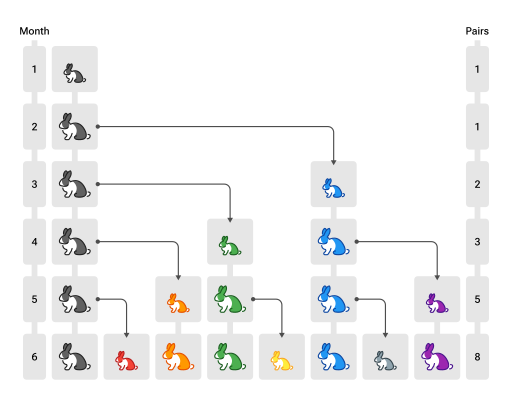

## 概述

**定义**

计算机科学中，递归是一种解决计算问题的方法，其中解决方案取决于同一类问题的更小子集

> In computer science, **recursion** is a method of solving a computational problem where the solution depends on solutions to smaller instances of the same problem.

比如单链表递归遍历的例子：

```java
void f(Node node) {
    if(node == null) {
        return;
    }
    println("before:" + node.value)
    f(node.next);
    println("after:" + node.value)
}
```

说明：

1. 自己调用自己，如果说每个函数对应着一种解决方案，自己调用自己意味着解决方案是一样的（有规律的）
2. 每次调用，函数处理的数据会较上次缩减（子集），而且最后会缩减至无需继续递归
3. 内层函数调用（子集处理）完成，外层函数才能算调用完成


**原理**

假设链表中有 3 个节点，value 分别为 1，2，3，以上代码的执行流程就类似于下面的**伪码**

```java
// 1 -> 2 -> 3 -> null  f(1)

void f(Node node = 1) {
    println("before:" + node.value) // 1
    void f(Node node = 2) {
        println("before:" + node.value) // 2
        void f(Node node = 3) {
            println("before:" + node.value) // 3
            void f(Node node = null) {
                if(node == null) {
                    return;
                }
            }
            println("after:" + node.value) // 3
        }
        println("after:" + node.value) // 2
    }
    println("after:" + node.value) // 1
}
```


**思路**

1. 确定能否使用递归求解
2. 推导出递推关系，即父问题与子问题的关系，以及递归的结束条件


例如之前遍历链表的递推关系为
$$
\begin{aligned}
f(n) = 
\begin{cases}
stop & n = null \\
f(n.next) & n \neq null
\end{cases}
\end{aligned}
$$


* 深入到最里层叫做**递**
* 从最里层出来叫做**归**
* 在**递**的过程中，外层函数内的局部变量（以及方法参数）并未消失，**归**的时候还可以用到


## 单路递归 Single Recursion

**E01. 阶乘**

用递归方法求阶乘 

* 阶乘的定义 $n!= 1⋅2⋅3⋯(n-2)⋅(n-1)⋅n$，其中 $n$ 为自然数，当然 $0! = 1$

* 递推关系


$$
\begin{aligned}
f(n) = 
\begin{cases}
1 & n = 1\\
n * f(n-1) & n > 1
\end{cases}
\end{aligned}
$$

代码

```java
private static int f(int n) {
    if (n == 1) {
        return 1;
    }
    return n * f(n - 1);
}
```

拆解**伪码**如下，假设 n 初始值为 3

```java
f(int n = 3) { // 解决不了,递
    return 3 * f(int n = 2) { // 解决不了,继续递
        return 2 * f(int n = 1) {
            if (n == 1) { // 可以解决, 开始归
                return 1;
            }
        }
    }
}
```


**E02. 反向打印字符串**

用递归反向打印字符串，n 为字符在整个字符串 str 中的索引位置

* **递**：n 从 0 开始，每次 n + 1，一直递到 n == str.length() - 1
* **归**：从 n == str.length() 开始归，从归打印，自然是逆序的

递推关系
$$
\begin{aligned}
f(n) = 
\begin{cases}
stop & n = str.length() \\
f(n+1) & 0 \leq n \leq str.length() - 1
\end{cases}
\end{aligned}
$$
代码为

```java
public static void reversePrint(String str, int index) {
    if (index == str.length()) {
        return;
    }
    reversePrint(str, index + 1);
    System.out.println(str.charAt(index));
}
```

拆解**伪码**如下，假设字符串为 "abc"

```java
void reversePrint(String str, int index = 0) {
    void reversePrint(String str, int index = 1) {
        void reversePrint(String str, int index = 2) {
            void reversePrint(String str, int index = 3) { 
                if (index == str.length()) {
                    return; // 开始归
                }
            }
            System.out.println(str.charAt(index)); // 打印 c
        }
        System.out.println(str.charAt(index)); // 打印 b
    }
    System.out.println(str.charAt(index)); // 打印 a
}
```


## 多路递归 Multi Recursion

**E01. 斐波那契数列**

* 之前的例子是每个递归函数只包含一个自身的调用，这称之为 single recursion
* 如果每个递归函数例包含多个自身调用，称之为 multi recursion

**递推关系**
$$
\begin{aligned}
f(n) = 
\begin{cases}
0 & n=0 \\
1 & n=1 \\
f(n-1) + f(n-2) & n>1
\end{cases}
\end{aligned}
$$


下面的表格列出了数列的前几项

| *F*0 | *F*1 | *F*2 | *F*3 | *F*4 | *F*5 | *F*6 | *F*7 | *F*8 | *F*9 | *F*10 | *F*11 | *F*12 | *F*13 |
| ---- | ---- | ---- | ---- | ---- | ---- | ---- | ---- | ---- | ---- | ----- | ----- | ----- | ----- |
| 0    | 1    | 1    | 2    | 3    | 5    | 8    | 13   | 21   | 34   | 55    | 89    | 144   | 233   |

**实现**

```java
public static int f(int n) {
    if (n == 0) {
        return 0;
    }
    if (n == 1) {
        return 1;
    }
    return f(n - 1) + f(n - 2);
}
```

**执行流程**


* 绿色代表正在执行（对应递），灰色代表执行结束（对应归）
* 递不到头，不能归，对应着深度优先搜索

**时间复杂度**

* 递归的次数也符合斐波那契规律，$2 * f(n+1)-1$
* 时间复杂度推导过程
  * 斐波那契通项公式 $f(n) = \frac{1}{\sqrt{5}}*({\frac{1+\sqrt{5}}{2}}^n - {\frac{1-\sqrt{5}}{2}}^n)$
  * 简化为：$f(n) = \frac{1}{2.236}*({1.618}^n - {(-0.618)}^n)$
  * 带入递归次数公式 $2*\frac{1}{2.236}*({1.618}^{n+1} - {(-0.618)}^{n+1})-1$
  * 时间复杂度为 $\Theta(1.618^n)$


> 1. 更多 Fibonacci 参考[^1][^2][^3]
> 2. 以上时间复杂度分析，未考虑大数相加的因素


**变体1 - 兔子问题[^1]**



* 第一个月，有一对未成熟的兔子（黑色，注意图中个头较小）
* 第二个月，它们成熟
* 第三个月，它们能产下一对新的小兔子（蓝色）
* 所有兔子遵循相同规律，求第 $n$ 个月的兔子数

**分析**

兔子问题如何与斐波那契联系起来呢？设第 n 个月兔子数为 $f(n)$

* $f(n)$ = 上个月兔子数 + 新生的小兔子数
* 而【新生的小兔子数】实际就是【上个月成熟的兔子数】
* 因为需要一个月兔子就成熟，所以【上个月成熟的兔子数】也就是【上上个月的兔子数】
* 上个月兔子数，即 $f(n-1)$
* 上上个月的兔子数，即 $f(n-2)$

因此本质还是斐波那契数列，只是从其第一项开始


**变体2 - 青蛙爬楼梯**

* 楼梯有 $n$ 阶
* 青蛙要爬到楼顶，可以一次跳一阶，也可以一次跳两阶
* 只能向上跳，问有多少种跳法

**分析**

| n    | 跳法                                                | 规律                                                         |
| ---- | --------------------------------------------------- | ------------------------------------------------------------ |
| 1    | (1)                                                 | 暂时看不出                                                   |
| 2    | (1,1)  (2)                                          | 暂时看不出                                                   |
| 3    | (1,1,1)  (1,2)  (2,1)                               | 暂时看不出                                                   |
| 4    | (1,1,1,1)    (1,2,1)    (2,1,1)<br />(1,1,2)  (2,2) | 最后一跳，跳一个台阶的，基于f(3)<br />最后一跳，跳两个台阶的，基于f(2) |
| 5    | ...                                                 | ...                                                          |

* 因此本质上还是斐波那契数列，只是从其第二项开始

* 对应 leetcode 题目 [70. 爬楼梯 - 力扣（LeetCode）](https://leetcode.cn/problems/climbing-stairs/)


## 递归优化-记忆法

上述代码存在很多重复的计算，例如求 $f(5)$ 递归分解过程


可以看到（颜色相同的是重复的）：

* $f(3)$ 重复了 2 次
* $f(2)$ 重复了 3 次
* $f(1)$ 重复了 5 次
* $f(0)$ 重复了 3 次

随着  $n$ 的增大，重复次数非常可观，如何优化呢？


**Memoization** 记忆法（也称备忘录）是一种优化技术，通过存储函数调用结果（通常比较昂贵），当再次出现相同的输入（子问题）时，就能实现加速效果，改进后的代码

```java
public static void main(String[] args) {
    int n = 13;
    int[] cache = new int[n + 1];
    Arrays.fill(cache, -1);
    cache[0] = 0;
    cache[1] = 1;
    System.out.println(f(cache, n));
}

public static int f(int[] cache, int n) {
    if (cache[n] != -1) {
        return cache[n];
    }

    cache[n] = f(cache, n - 1) + f(cache, n - 2);
    return cache[n];
}
```

优化后的图示，只要结果被缓存，就**不会执行其子问题**


* 改进后的时间复杂度为 $O(n)$
* 请自行验证改进后的效果
* 请自行分析改进后的空间复杂度

> **注意**
>
> 1. 记忆法是动态规划的一种情况，强调的是自顶向下的解决
> 2. 记忆法的本质是空间换时间


## 递归优化-尾递归

**爆栈**

用递归做 $n + (n-1) + (n-2) ... + 1$

```java
public static long sum(long n) {
    if (n == 1) {
        return 1;
    }
    return n + sum(n - 1);
}
```

在我的机器上  $n = 12000$ 时，爆栈了

```
Exception in thread "main" java.lang.StackOverflowError
	at Test.sum(Test.java:10)
	at Test.sum(Test.java:10)
	at Test.sum(Test.java:10)
	at Test.sum(Test.java:10)
	at Test.sum(Test.java:10)
	...
```

为什么呢？

* 每次方法调用是需要消耗一定的栈内存的，这些内存用来存储方法参数、方法内局部变量、返回地址等等
* 方法调用占用的内存需要等到**方法结束时**才会释放
* 而递归调用我们之前讲过，不到最深不会回头，最内层方法没完成之前，外层方法都结束不了
  * 例如，$sum(3)$ 这个方法内有个需要执行 $3 + sum(2)$，$sum(2)$ 没返回前，加号前面的 $3$ 不能释放 
  * 看下面伪码

```java
long sum(long n = 3) {
    return 3 + long sum(long n = 2) {
        return 2 + long sum(long n = 1) {
            return 1;
        }
    }
}
```


**尾调用**

如果函数的最后一步是调用一个函数，那么称为尾调用，例如

```js
function a() {
    return b()
}
```


下面三段代码**不能**叫做尾调用

```js
function a() {
    const c = b()
    return c
}
```

* 因为最后一步并非调用函数

```js
function a() {
    return b() + 1
}
```

* 最后一步执行的是加法

```js
function a(x) {
    return b() + x
}
```

* 最后一步执行的是加法


**一些语言**[^4]的编译器能够对尾调用做优化，例如

```js
function a() {
    // 做前面的事
    return b() 
}

function b() {
    // 做前面的事
    return c()
}

function c() {
    return 1000
}

a()
```

没优化之前的**伪码**

```js
function a() {
    return function b() {
        return function c() {
            return 1000
        }
    }
}
```

优化后**伪码**如下

```js
a()
b()
c()
```

为何尾递归才能优化？

调用 a 时

* a 返回时发现：没什么可留给 b 的，将来返回的结果 b 提供就可以了，用不着我 a 了，我的内存就可以释放

调用 b 时

* b 返回时发现：没什么可留给 c 的，将来返回的结果 c 提供就可以了，用不着我 b 了，我的内存就可以释放

如果调用 a 时

* 不是尾调用，例如 return b() + 1，那么 a 就不能提前结束，因为它还得利用 b 的结果做加法


**尾递归**

尾递归是尾调用的一种特例，也就是最后一步执行的是同一个函数


**尾递归避免爆栈**

安装 Scala


Scala 入门

```scala
object Main {
  def main(args: Array[String]): Unit = {
    println("Hello Scala")
  }
}
```

* Scala 是 java 的近亲，java 中的类都可以拿来重用
* 类型是放在变量后面的
* Unit 表示无返回值，类似于 void
* 不需要以分号作为结尾，当然加上也对


还是先写一个会爆栈的函数

```scala
def sum(n: Long): Long = {
    if (n == 1) {
        return 1
    }
    return n + sum(n - 1)
}
```

* Scala 最后一行代码若作为返回值，可以省略 return

不出所料，在 $n = 11000$ 时，还是出了异常

```scala
println(sum(11000))

Exception in thread "main" java.lang.StackOverflowError
	at Main$.sum(Main.scala:25)
	at Main$.sum(Main.scala:25)
	at Main$.sum(Main.scala:25)
	at Main$.sum(Main.scala:25)
	...
```


这是因为以上代码，还不是尾调用，要想成为尾调用，那么：

1. 最后一行代码，必须是一次函数调用
2. 内层函数必须**摆脱**与外层函数的关系，内层函数**执行后**不依赖于外层的变量或常量

```scala
def sum(n: Long): Long = {
    if (n == 1) {
        return 1
    }
    return n + sum(n - 1)  // 依赖于外层函数的 n 变量
}
```

如何让它执行后就摆脱对 n 的依赖呢？

* 不能等递归回来再做加法，那样就必须保留外层的 n
* 把 n 当做内层函数的一个参数传进去，这时 n 就属于内层函数了
* 传参时就完成累加, 不必等回来时累加

```
sum(n - 1, n + 累加器)
```


改写后代码如下

```scala
@tailrec
def sum(n: Long, accumulator: Long): Long = {
    if (n == 1) {
        return 1 + accumulator
    } 
    return sum(n - 1, n + accumulator)
}
```

* accumulator 作为累加器
* @tailrec 注解是 scala 提供的，用来检查方法是否符合尾递归
* 这回 sum(10000000, 0) 也没有问题，打印 50000005000000


执行流程如下，以**伪码**表示 $sum(4, 0)$

```scala
// 首次调用
def sum(n = 4, accumulator = 0): Long = {
    return sum(4 - 1, 4 + accumulator)
}

// 接下来调用内层 sum, 传参时就完成了累加, 不必等回来时累加，当内层 sum 调用后，外层 sum 空间没必要保留
def sum(n = 3, accumulator = 4): Long = {
    return sum(3 - 1, 3 + accumulator)
}

// 继续调用内层 sum
def sum(n = 2, accumulator = 7): Long = {
    return sum(2 - 1, 2 + accumulator)
}

// 继续调用内层 sum, 这是最后的 sum 调用完就返回最后结果 10, 前面所有其它 sum 的空间早已释放
def sum(n = 1, accumulator = 9): Long = {
    if (1 == 1) {
        return 1 + accumulator
    }
}
```

本质上，尾递归优化是将函数的**递归**调用，变成了函数的**循环**调用


**改循环避免爆栈**

```java
public static void main(String[] args) {
    long n = 100000000;
    long sum = 0;
    for (long i = n; i >= 1; i--) {
        sum += i;
    }
    System.out.println(sum);
}
```


## 递归时间复杂度-Master theorem[^5]

若有递归式
$$
T(n) = aT(\frac{n}{b}) + f(n)
$$
其中 

* $T(n)$ 是问题的运行时间，$n$ 是数据规模
* $a$ 是子问题个数
* $T(\frac{n}{b})$ 是子问题运行时间，每个子问题被拆成原问题数据规模的 $\frac{n}{b}$
* $f(n)$ 是除递归外执行的计算

令 $x = \log_{b}{a}$，即 $x = \log_{Sub-problem reduction factor}{n}$

那么
$$
\begin{aligned}
T(n) = 
\begin{cases}
\Theta(n^x) & f(n) = O(n^c) and c \lt x\\
\Theta(n^x\log{n}) & f(n) = \Theta(n^x)\\
\Theta(n^c) & f(n) = \Omega(n^c) and c \gt x
\end{cases}
\end{aligned}
$$

**例1**

$T(n) = 2T(\frac{n}{2}) + n^4$ 

* 此时 $x = 1 < 4$，由后者决定整个时间复杂度 $\Theta(n^4)$
* 如果觉得对数不好算，可以换为求【$b$ 的几次方能等于 $a$】


**例2**

$T(n) = T(\frac{7n}{10}) + n$

* $a=1, b=\frac{10}{7}, x=0, c=1$
* 此时 $x = 0 < 1$，由后者决定整个时间复杂度 $\Theta(n)$


**例3**

$T(n) = 16T(\frac{n}{4}) + n^2$

* $a=16, b=4, x=2, c=2$
* 此时 $x=2 = c$，时间复杂度 $\Theta(n^2 \log{n})$


**例4**

$T(n)=7T(\frac{n}{3}) + n^2$

* $a=7, b=3, x=1.?, c=2$
* 此时 $x = \log_{3}{7} < 2$，由后者决定整个时间复杂度 $\Theta(n^2)$


**例5**

$T(n) = 7T(\frac{n}{2}) + n^2$

* $a=7, b=2, x=2.?, c=2$
* 此时 $x = log_2{7} > 2$，由前者决定整个时间复杂度 $\Theta(n^{\log_2{7}})$


**例6**

$T(n) = 2T(\frac{n}{4}) + \sqrt{n}$

* $a=2, b=4, x = 0.5, c=0.5$
* 此时 $x = 0.5 = c$，时间复杂度 $\Theta(\sqrt{n}\ \log{n})$


**例7. 二分查找递归**

```java
int f(int[] a, int target, int i, int j) {
    if (i > j) {
        return -1;
    }
    int m = (i + j) >>> 1;
    if (target < a[m]) {
        return f(a, target, i, m - 1);
    } else if (a[m] < target) {
        return f(a, target, m + 1, j);
    } else {
        return m;
    }
}
```

* 子问题个数 $a = 1$
* 子问题数据规模缩小倍数 $b = 2$
* 除递归外执行的计算是常数级 $c=0$

$T(n) = T(\frac{n}{2}) + n^0$

* 此时 $x=0 = c$，时间复杂度 $\Theta(\log{n})$


**例8. 归并排序递归**

```python
void split(B[], i, j, A[])
{
    if (j - i <= 1)                    
        return;                                
    m = (i + j) / 2;             
    
    // 递归
    split(A, i, m, B);  
    split(A, m, j, B); 
    
    // 合并
    merge(B, i, m, j, A);
}
```

* 子问题个数 $a=2$
* 子问题数据规模缩小倍数 $b=2$
* 除递归外，主要时间花在合并上，它可以用 $f(n) = n$ 表示

$T(n) = 2T(\frac{n}{2}) + n$

* 此时 $x=1=c$，时间复杂度 $\Theta(n\log{n})$


**例9. 快速排序递归**

```python
algorithm quicksort(A, lo, hi) is 
  if lo >= hi || lo < 0 then 
    return
  
  // 分区
  p := partition(A, lo, hi) 
  
  // 递归
  quicksort(A, lo, p - 1) 
  quicksort(A, p + 1, hi) 
```

* 子问题个数 $a=2$
* 子问题数据规模缩小倍数
  * 如果分区分的好，$b=2$
  * 如果分区没分好，例如分区1 的数据是 0，分区 2 的数据是 $n-1$
* 除递归外，主要时间花在分区上，它可以用 $f(n) = n$ 表示


情况1 - 分区分的好

$T(n) = 2T(\frac{n}{2}) + n$

* 此时 $x=1=c$，时间复杂度 $\Theta(n\log{n})$


情况2 - 分区没分好

$T(n) = T(n-1) + T(1) + n$

* 此时不能用主定理求解


## 递归时间复杂度-展开求解

像下面的递归式，都不能用主定理求解

**例1 - 递归求和**

```java
long sum(long n) {
    if (n == 1) {
        return 1;
    }
    return n + sum(n - 1);
}
```

$T(n) = T(n-1) + c$，$T(1) = c$

下面为展开过程

$T(n) = T(n-2) + c + c$

$T(n) = T(n-3) + c + c + c$

...

$T(n) = T(n-(n-1)) + (n-1)c$ 

* 其中 $T(n-(n-1))$ 即 $T(1)$
* 带入求得 $T(n) = c + (n-1)c = nc$

时间复杂度为 $O(n)$


**例2 - 递归冒泡排序**

```java
void bubble(int[] a, int high) {
    if(0 == high) {
        return;
    }
    for (int i = 0; i < high; i++) {
        if (a[i] > a[i + 1]) {
            swap(a, i, i + 1);
        }
    }
    bubble(a, high - 1);
}
```

$T(n) = T(n-1) + n$，$T(1) = c$

下面为展开过程

$T(n) = T(n-2) + (n-1) + n$

$T(n) = T(n-3) + (n-2) + (n-1) + n$

...

$T(n) = T(1) + 2 + ... + n = T(1) + (n-1)\frac{2+n}{2} = c + \frac{n^2}{2} + \frac{n}{2} -1$

时间复杂度 $O(n^2)$

> 注：
>
> * 等差数列求和为 $n*\frac{\vert b-e \vert}{2}$ 


**例3 - 递归快排**

快速排序分区没分好的极端情况

$T(n) = T(n-1) + T(1) + n$，$T(1) = c$

$T(n) = T(n-1) + c + n$

下面为展开过程

$T(n) = T(n-2) + c + (n-1) + c + n$

$T(n) = T(n-3) + c + (n-2) + c + (n-1) + c + n$

...

$T(n) = T(n-(n-1)) + (n-1)c + 2+...+n = \frac{n^2}{2} + \frac{2cn+n}{2} -1$

时间复杂度 $O(n^2)$


不会推导的同学可以进入 https://www.wolframalpha.com/

* 例1 输入 f(n) = f(n - 1) + c, f(1) = c
* 例2 输入 f(n) = f(n - 1) + n, f(1) = c
* 例3 输入 f(n) = f(n - 1) + n + c, f(1) = c


# 附录

## 参考文章

[^1]: Fibonacci 介绍：https://en.wikipedia.org/wiki/Fibonacci_number
[^2]: [几种计算Fibonacci数列算法的时间复杂度比较 - 知乎 (zhihu.com)](https://zhuanlan.zhihu.com/p/165877869)
[^3]: 几种斐波那契数列算法比较 [Fast Fibonacci algorithms (nayuki.io)](https://www.nayuki.io/page/fast-fibonacci-algorithms)
[^4]: 我知道的有 C++，Scala
[^5]: 与主定理类似的还有 Akra–Bazzi method，https://en.wikipedia.org/wiki/Akra%E2%80%93Bazzi_method
