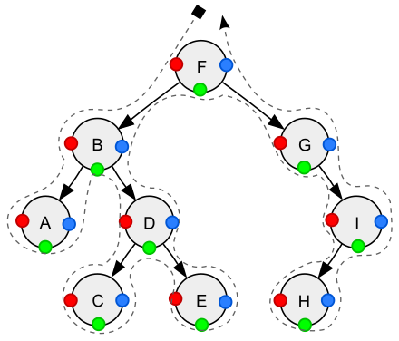

## 概述

二叉树是这么一种树状结构：每个节点最多有两个孩子，左孩子和右孩子

## 二叉树

重要的二叉树结构

* 完全二叉树（complete binary tree）是一种二叉树结构，除最后一层以外，每一层都必须填满，填充时要遵从先左后右
* 平衡二叉树（balance binary tree）是一种二叉树结构，其中每个节点的左右子树高度相差不超过 1


### 存储

存储方式分为两种

1. 定义树节点与左、右孩子引用（TreeNode）
2. 使用数组，前面讲堆时用过，若以 0 作为树的根，索引可以通过如下方式计算
   * 父 = floor((子 - 1) / 2)
   * 左孩子 = 父 * 2 + 1
   * 右孩子 = 父 * 2 + 2


### 遍历

遍历也分为两种

1. 广度优先遍历（Breadth-first order）：尽可能先访问距离根最近的节点，也称为层序遍历
2. 深度优先遍历（Depth-first order）：对于二叉树，可以进一步分成三种（要深入到叶子节点）
   1. pre-order 前序遍历，对于每一棵子树，先访问该节点，然后是左子树，最后是右子树
   2. in-order 中序遍历，对于每一棵子树，先访问左子树，然后是该节点，最后是右子树
   3. post-order 后序遍历，对于每一棵子树，先访问左子树，然后是右子树，最后是该节点


#### 广度优先


| 本轮开始时队列 | 本轮访问节点 |
| -------------- | ------------ |
| [1]            | 1            |
| [2, 3]         | 2            |
| [3, 4]         | 3            |
| [4, 5, 6]      | 4            |
| [5, 6]         | 5            |
| [6, 7, 8]      | 6            |
| [7, 8]         | 7            |
| [8]            | 8            |
| []             |              |

1. 初始化，将根节点加入队列
2. 循环处理队列中每个节点，直至队列为空
3. 每次循环内处理节点后，将它的孩子节点（即下一层的节点）加入队列

> 注意
>
> * 以上用队列来层序遍历是针对  TreeNode 这种方式表示的二叉树
>
> * 对于数组表现的二叉树，则直接遍历数组即可，自然为层序遍历的顺序


#### 深度优先


| 栈暂存    | 已处理                                     | 前序遍历 | 中序遍历 |
| --------- | ------------------------------------------ | -------- | -------- |
| [1]       | 1 ✔️ 左💤 右💤                                | 1        |          |
| [1, 2]    | 2✔️ 左💤 右💤<br />1✔️ 左💤 右💤                 | 2        |          |
| [1, 2, 4] | 4✔️ 左✔️ 右✔️<br />2✔️ 左💤 右💤<br />1✔️ 左💤 右💤 | 4        | 4        |
| [1, 2]    | 2✔️ 左✔️ 右✔️<br />1✔️ 左💤 右💤                 |          | 2        |
| [1]       | 1✔️ 左✔️ 右💤                                 |          | 1        |
| [1, 3]    | 3✔️ 左💤 右💤<br />1✔️ 左✔️ 右💤                 | 3        |          |
| [1, 3, 5] | 5✔️ 左✔️ 右✔️<br />3✔️ 左💤 右💤<br />1✔️ 左✔️ 右💤 | 5        | 5        |
| [1, 3]    | 3✔️ 左✔️ 右💤<br />1✔️ 左✔️ 右💤                 |          | 3        |
| [1, 3, 6] | 6✔️ 左✔️ 右✔️<br />3✔️ 左✔️ 右💤<br />1✔️ 左✔️ 右💤 | 6        | 6        |
| [1, 3]    | 3✔️ 左✔️ 右✔️<br />1✔️ 左✔️ 右💤                 |          |          |
| [1]       | 1✔️ 左✔️ 右✔️                                 |          |          |
| []        |                                            |          |          |

#### 递归实现

```java
/**
 * <h3>前序遍历</h3>
 * @param node 节点
 */
static void preOrder(TreeNode node) {
    if (node == null) {
        return;
    }
    System.out.print(node.val + "\t"); // 值
    preOrder(node.left); // 左
    preOrder(node.right); // 右
}

/**
 * <h3>中序遍历</h3>
 * @param node 节点
 */
static void inOrder(TreeNode node) {
    if (node == null) {
        return;
    }
    inOrder(node.left); // 左
    System.out.print(node.val + "\t"); // 值
    inOrder(node.right); // 右
}

/**
 * <h3>后序遍历</h3>
 * @param node 节点
 */
static void postOrder(TreeNode node) {
    if (node == null) {
        return;
    }
    postOrder(node.left); // 左
    postOrder(node.right); // 右
    System.out.print(node.val + "\t"); // 值
}
```


#### 非递归实现

**前序遍历**

```java
LinkedListStack<TreeNode> stack = new LinkedListStack<>();
TreeNode curr = root;

while (!stack.isEmpty() || curr != null) {
    if (curr != null) {
        stack.push(curr);
        System.out.println(curr);
        curr = curr.left;
    } else {
        TreeNode pop = stack.pop();
        curr = pop.right;
    }

}
```

**中序遍历**

```java
LinkedListStack<TreeNode> stack = new LinkedListStack<>();
TreeNode curr = root;

while (!stack.isEmpty() || curr != null) {
    if (curr != null) {
        stack.push(curr);
        curr = curr.left;
    } else {
        TreeNode pop = stack.pop();
        System.out.println(pop);
        curr = pop.right;
    }
}
```

**后序遍历**

```java
LinkedListStack<TreeNode> stack = new LinkedListStack<>();
TreeNode curr = root;
TreeNode pop = null;

while (!stack.isEmpty() || curr != null) {
    if (curr != null) {
        stack.push(curr);
        curr = curr.left;
    } else {
        TreeNode peek = stack.peek();
        if (peek.right == null || peek.right == pop) {
            pop = stack.pop();
            System.out.println(pop);
        } else {
            curr = peek.right;
        }
    }
}
```

对于后序遍历，向回走时，需要处理完右子树才能 pop 出栈。如何知道右子树处理完成呢？

* 如果栈顶元素的 $right \equiv null$ 表示没啥可处理的，可以出栈

* 如果栈顶元素的 $right \neq null$，

  * 那么使用 lastPop 记录最近出栈的节点，即表示从这个节点向回走
  * 如果栈顶元素的 $right==lastPop$ 此时应当出栈


对于前、中两种遍历，实际以上代码从右子树向回走时，并未走完全程（stack 提前出栈了）后序遍历以上代码是走完全程了

**统一写法**

下面是一种统一的写法，依据后序遍历修改

```java
LinkedList<TreeNode> stack = new LinkedList<>();

TreeNode curr = root; // 代表当前节点
TreeNode pop = null; // 最近一次弹栈的元素
while (curr != null || !stack.isEmpty()) {
    if (curr != null) {
        colorPrintln("前: " + curr.val, 31);
        stack.push(curr); // 压入栈，为了记住回来的路
        curr = curr.left;
    } else {
        TreeNode peek = stack.peek();
        // 右子树可以不处理, 对中序来说, 要在右子树处理之前打印
        if (peek.right == null) {
            colorPrintln("中: " + peek.val, 36);
            pop = stack.pop();
            colorPrintln("后: " + pop.val, 34);
        }
        // 右子树处理完成, 对中序来说, 无需打印
        else if (peek.right == pop) {
            pop = stack.pop();
            colorPrintln("后: " + pop.val, 34);
        }
        // 右子树待处理, 对中序来说, 要在右子树处理之前打印
        else {
            colorPrintln("中: " + peek.val, 36);
            curr = peek.right;
        }
    }
}

public static void colorPrintln(String origin, int color) {
    System.out.printf("\033[%dm%s\033[0m%n", color, origin);
}
```

一张图演示三种遍历



* 红色：前序遍历顺序
* 绿色：中序遍历顺序
* 蓝色：后续遍历顺序