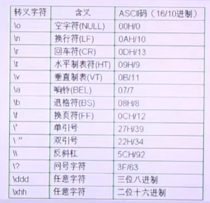
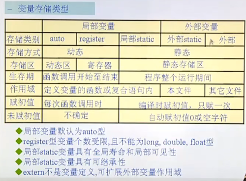
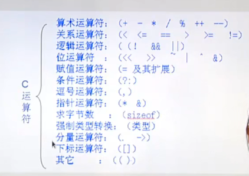
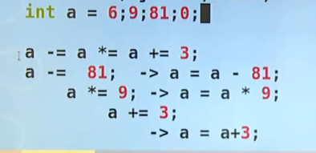
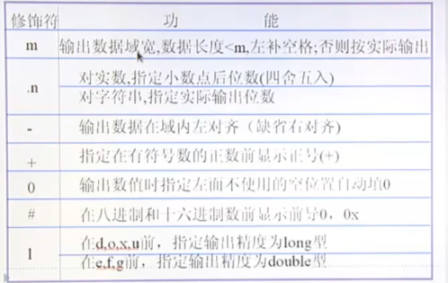

# 再次了解C
## c的历史
- 1960 原型A语言->ALGOL语言
- 1963 CPL语言
- 1967 BCPL
- 1970 B语言
- 1973 C语言

## C语言特点
1. 基础性语言
2. 语法简洁 紧凑 方便 灵活(得益于指针)
3. 运算符 数据结构丰富
4. 结构化 模块化编程
5. 移植性好 执行效率高
6. **允许直接对硬件操作**

## 学习建议
1. 概念的正确性
2. 动手能力
3. 主动阅读优秀的程序段
4. 大量练习,编程是技术不是理论

## 学习思路
1. 基本概念
2. 数据类型 运算符 表达式
3. 输入输出
4. 流程控制
5. 数组
6. 指针
7. 函数
8. 构造类型
9. 动态内存管理
10. 常用库函数 
11. 调试工具和调试技巧

## 环境搭建与"Hello world"
## 环境
- 当前测试环境是安装了基于`Redhat`的`Rocky`发行版，搭建在``ESXI 6.4``虚拟机上
```bash
[root@node1 ~]# gcc --version
gcc (GCC) 11.3.1 20221121 (Red Hat 11.3.1-4)
Copyright © 2021 Free Software Foundation, Inc.
本程序是自由软件；请参看源代码的版权声明。本软件没有任何担保；
包括没有适销性和某一专用目的下的适用性担保。
# uname -a
Linux node1 5.14.0-284.11.1.el9_2.x86_64 #1 SMP PREEMPT_DYNAMIC Tue May 9 17:09:15 UTC 2023 x86_64 x86_64 x86_64 GNU/Linux
```

### "Hello world"
```c
#inlcude <stdio.h>
#include <stdlib.h>

int main(void){
    printf("hello world\n");
    exit(0);
}
```

gcc 编译c的源文件过程:

``` bash
gcc -v
线程模型：posix
Supported LTO compression algorithms: zlib zstd
gcc 版本 11.3.1 20221121 (Red Hat 11.3.1-4) (GCC)
```

**C源文件->预处理->编译->汇编->链接->可执行文件**

完整过程
- 预处理
``` bash
gcc -E hello.c > hello.i
```
- 编译
``` bash
gcc -S hello.i 
```
- 汇编
``` bash
gcc -c hello.s 
```
- 链接->可执行文件
```c
gcc hello.o -o hello
```

或者
``` bash
gcc hello.c -o hello
```

又或者
``` bash
make hello
```

执行
``` bash
./hello

hello world
```

# 基本概念

## 怎么写代码
### 头文件的重要性
在c中，如果没有出现函数原型，就默认函数的返回值是int(老版本GCC)
```c
#include <stdio.h>

int main()
{
    int *num = malloc(sizeof(int));
    *num = 100;
    printf("%d\n",*num);
    return 0;
}
```

``` bash
hello.c: 在函数‘main’中:
hello.c:5:23: 警告：隐式声明函数‘malloc’ [-Wimplicit-function-declaration]
    5 |     int *num = (int *)malloc(sizeof(int));
          |                       ^```~~
          hello.c:5:23: 警告：隐式声明与内建函数‘malloc’不兼容
```
- 正确写法
```c
#include <stdio.h>
#include <stdlib.h>
int main()
{
    int *num = (int *)malloc(sizeof(int));
    return 0;
}
```

## 数据类型 运算符 表达式
- 基本类型
  - 数值类型
    - short
    - int
    - long
    - float
    - double
  - 字符类型
- 构造类型
  - 数组
  - 结构体 struct
  - 共用体 union
  - 枚举类型 enum
- 指针类型
- 空类型 void

``` bash
254 -> unsigned int -> 32bit
(254)10 = (1111 1110)2 = (376)8 = (FE)16

254
B11111110(c不认识这个表示)
0376
0xFE
```


#### 类型转换
隐式转化：

```c
int i;
float f;
double d;
char ch;
//混合运算往精度高的类型靠
ch + i -> i
f - d -> d

(ch + i) - (float - double) -> double
```

#### bool类型

```c
#include <stdio.h>
#include <stdlib.h>
#include <stdbool.h> //标准bool类型头文件
int main() {
  bool a = false;
  printf("a = %d\n", a);
  exit(0);
}
```

#### 浮点型的失真问题

```c
int func(float f) {
  if (f < 0) {
    return -1;
  } else if (fabs(f-0) <= 1e-6) 
  { //极限方法 double fabs (double x) 返回浮点数 x 的绝对值
    return 0;
  } else {
  return 1;
  }
}
```

####  char 类型

**在iso c中 `char`有无符号是未定义行为**

#### 关于0的不同解释

```c
0(整形) '0'(字符常量) "0"(字符串常量) '\0'(字符常量)
```

#### 类型匹配问题
数据类型要和后续代码中所使用的输入输出要相匹配(小心自相矛盾)

:::tip
比如说对于定义了无符号整型，由于某些原因要赋值给整型，有可能会溢出int的范围
:::

```c
#include <stdlib.h>
#include <stdio.h>

int main() {
  unsigned int a;
  a = 1 << 31;
  printf("%d", a);
}

```

正确

```c
#include <stdlib.h>
#include <stdio.h>

int main() {
  unsigned int a;
  a = 1 << 31;
  printf("%ud", a);
}

```

## 常量与变量
### 常量
- 整形常量(int)： 1 890
- 实型常量(float)： 1.2 3.14
- 字符常量(char)： `` '\t' '\n' '\0' '\015'(8进制) '\x7f' '\018'(错误的表示！！三个数是8进制标识不出现8)``
- 字符串常量(构造类型来构造)： ``"" "a" "abXYZ" "abc\n\021\010"(a b c \n \021 \0 1 8)``
- 标识常量:  ``#define``，在预处理阶段，不检查语法，只是简单的替换。



##### 宏``#define``的用法
###### 直接替换宏体直接内容
> 这个部分在预处理的过程中不检测语法

```c
#include <stdlib.h>
#include <stdio.h>

#define PI 3.1415926 //预处理解决掉了
#define ADD 2+3
// 正确写法
//#define ADD (2+3)
int main() {
	int a,b,c;
	a * PI; //在预处理会被直接替换为宏体内容
	b + PI;
	c / PI;
  printf("%f\n", PI);
  printf("%d\n", ADD * ADD);
}
:! gcc -E `PWD`/main.c
```

预编译结果：

```c
# 3 "main.c" 2
# 8 "main.c"
int main() {
 int a,b,c;
 a * 3.1415926;
 b + 3.1415926;
 c / 3.1415926;
  printf("%f\n", 3.1415926);
  printf("%d\n", 2+3 * 2+3); //完整替换这里会出现优先级问题
  exit(0);
}
```

:::tip 
建议在宏体内容括上括号
:::

###### 直接替换宏体函数
```c
#include <stdlib.h>
#include <stdio.h>

#define MAX(a,b) ((a) > (b) ? (a) : (b))

int main() {
  int a = 3, b = 5;
  printf("%d\n",MAX(a, b));
}
/**
# 6 "main.c"
int main() {
  int a = 3, b = 5;
  printf("%d\n",(a > b ? a : b));

}
*/
```

如果把宏体加上括号就会出现以下情况：

```bash
[root@node1 ~]# cat main.c 
#include <stdlib.h>
#include <stdio.h>

#define MAX(a,b) ((a) > (b) ? (a) : (b))

int main() {
  int a = 3, b = 5;
  printf("%d\n",MAX(a++, b++));
  printf("%d\t %d\n",a,b);
}
[root@node1 ~]# ./main 
6
4        7 #这里原本是5会自增两次
#预编译结果
# 6 "main.c"
int main() {
  int a = 3, b = 5;
  printf("%d\n",((a++) > (b++) ? (a++) : (b++))); #一目了然确定了问题所在
  printf("%d\t %d\n",a,b);
}
```

:::tip
在标准C对于以上无解，但我们可以用以下不是标准C方法技巧解决
:::

```c
#include <stdlib.h>
#include <stdio.h>

#define MAX(a,b) \
({int A=a,B=b; ((A) > (B) ? (A) : (B));})
//#define MAX(a,b) \
//({typeof(a) A=a,B=b; ((A) > (B) ? (A) : (B));}) typeof(a)获取a的类型来定义
//必须加括号
int main() {
  int a = 3, b = 5;
  printf("%d\n",MAX(a++, b++));
  printf("%d\n",MAX(a++, b++));
}
#预编译结果
# 6 "main.c"
int main() {
  int a = 3, b = 5;
  printf("%d\n",({int A=a++,B=b++; ((A) > (B) ? (A) : (B));}));
  printf("%d\n",({int A=a++,B=b++; ((A) > (B) ? (A) : (B));}));
}
```

:::danger
在程序的预处理阶段，占编译时间，不占运行时间(没有函数调用的消耗)，但不检查语法(比较危险)
:::

### 变量
``[存储类型] 数据类型 标识符 = 值``
> TYPE  NAME  = VALUE

- 标识符：由字母、数字、下划线组成且不能以数字开头的一个标识序列。如下文法：
```c
letter -> a|b|...z|A|B|...|Z|_
digit -> 0|1|...|9
identifier -> letter(letter|digit)*
标识符： [_a-zA-Z][_a-zA-Z0-9]*
```
- 存储类型:
	- ``auto``：(默认) 自动分配空间(没有指定存储类型时，缺省为auto，自动分配与回收)，分配在栈空间上。**得出的数值随机**
	- ``register`` ：(建议型)寄存器类型 ``建议编译器分配在寄存器上``  只能定义局部变量，不能定义全局变量，大小有限制，只能定义32位大小的数据类型，比如``double``就不可以。因为寄存器没有地址，所以一个register类型的变量无法打印出地址查看或使用。
	- ``inline``：从C++引入
	- ``static``：(静态型) 一定自动初始化为0值或空值并且static变量的值有继承性。另外常用来修饰一个变量或者函数(防止当前函数对外扩展)
	- ``extern``： (说明型) 意味着不能改变被说明的量的值或类型，可以用来扩展外部变量的作用域（不能写extern int a=1;来给外部整形变量a幅初值1编译会报错的）
- 数据类型 = 基本数据类型 + 构造类型
- 值：注意匹配数据类型即可

:::tip
这里寄存器指的是x86/AMD的寄存器，把微机和单片机以及其他架构的处理器搞混了，学了微机原理你就知道了，PC机的CPU的寄存器是靠寄存器的名字寻址的，不是靠地址寻址的，所以PC机的寄存器是没有地址的。
:::

#### 变量的生命周期与作用范围
##### static 与 auto
```c
#include <stdlib.h>
#include <stdio.h>

void func() {
  static int x = 1;
  x++;
  printf("%p->%d\n", &x ,x);
}

int main() {
  func();
  func();
  func();
}
```
以上代码结果：
```bash
[root@node1 ~]# ./main
0x404024->2
0x404024->3
0x404024->4

#不使用static存储类型结果：
[root@node1 ~]# ./main
0x7ffffa47fc4c->2
0x7ffffa47fc4c->2
0x7ffffa47fc4c->2
```
##### 全局变量与局部变量
> 全局变量的概念是从变量定义开始到代码结束 
> 局变量的概念是从变量定义开始到代码块结束（语句体）

:::tip
作用范围永远是内部屏蔽外部的
:::
```c
#include <stdio.h>
#include <stdlib.h>

int i=0;

void fun (void){
        for(i= 0;i<5;i++)
                printf("%c",'*');
        printf("\n");
        printf("[%s]%d\n", __FUNCTION__, i);
}
int main(){
        for( i= 0;i<5;i++)
                fun();
        exit(0);
}
//运行结果：
cc     fun.c   -o fun
*****
[fun]5
```

##### 补充project工程实现
> 多个c文件

:::tip
使用 ``vim * -p`` 打开文件夹下所有文件，使用gt命令切换文件编辑。
:::
```c

#include <stdio.h>
#include <stdlib.h>

#include "proj.h"
int i=10;
int main(){
        printf("[%s]:i = %d\n",__FUNCTION__,i);
        fun();
        exit(0);
}
```

```c
//proj.c
#include <stdio.h>
#include <stdlib.h>
#include "proj.h"
int i =100;
void fun(void){
        printf("[%s]:i = %d\n",__FUNCTION__,i);
        exit(0);
}
```

```h
#ifndef PROJ_H__
#define PROJ_H__
void fun(void);
#endif
```
结果会冲突：
```bash
[root@node1 minproject]# gcc main.c proj.c
/usr/bin/ld: /tmp/cc2v50cH.o:(.data+0x0): multiple definition of `i'; /tmp/cc63AEzU.o:(.data+0x0): first defined here
collect2: 错误：ld 返回 1
```

加了static后编译成功：

```bash
[root@node1 minproject]# gcc main.c proj.c
[root@node1 minproject]# ls
a.out  main.c  proj.c  proj.h
[root@node1 minproject]# ./a.out 
[main]:i = 10
[fun]:i = 100
```

:::tip
以上例子说明常用来修饰一个变量或者函数(防止当前函数对外扩展)
:::

同理在函数前面添加static：
```c
static void fun(void){
        printf("[%s]:i = %d\n",__FUNCTION__,i);
        exit(0);
}
```
结果如下：
```bash
[root@node1 minproject]# gcc main.c proj.c
proj.c:5:1: 错误：对‘fun’的静态声明出现在非静态声明之后 #这里是语法错误
    5 | static void fun(void){
      | ^~~~~~
In file included from proj.c:3:
proj.h:3:6: 附注：previous declaration of ‘fun’ with type ‘void(void)’
    3 | void fun(void);
      |      ^~~
[root@node1 minproject]# vim proj.h
[root@node1 minproject]# gcc main.c proj.c
In file included from main.c:4:
proj.h:3:13: 警告：‘fun’使用过但从未定义
    3 | static void fun(void);#这里是运行错误
      |             ^~~
/usr/bin/ld: /tmp/ccVlu3p6.o: in function `main':
main.c:(.text+0x21): undefined reference to `fun'
collect2: 错误：ld 返回 1
```
:::tip
以上例子也说明了``static``常用来修饰一个变量或者函数(防止当前函数对外扩展)，如何解决static隐藏函数？可以使用非静态函数call_fun来间接调用静态函数（就像面向对象的思路，c也可以间接完成面向对象的设计）。
:::

##### extern的用法
```c
#ifndef EXTERN_H__
#define EXTERN_H__
void func();

#endif
```

```c
#include "extern.h"

extern int i; // 不定义 而是引用了其他地方的i ，也可以不用声明数据类型，编译器会帮你补充
int func() {
  printf("[%s]%d\n", __FUNCTION__, i);
}
```

```c
#include "stdlib.h"
#include "stdio.h"
#include "extern.h"

int i = 10;

int main() {
  printf("[%s]%d\n", __FUNCTION__, i);
}
```




## 运算符与表达式
### 运算符


#### 逻辑运算符的短路性
```c
#include <stdio.h>
#include <stdlib.h>

int main() {
  int a = 1, b = 2, c = 3, d = 4;
  int m = 1, n = 1;
  //逻辑与和或的短路性
  (m = a > b) && (n = c > d);
  //与运算如果左边的表达式为假没必要运算右边的表达式
  //或运算如果左边的表达式为真没必要运算右边的表达式
  printf("m = %d\n n = %d\n", m, n); // m : 0 n : 1
}
```

#### 等号(赋值)扩展运算的顺序

> 从右往左计算数值

#### 求字节数sizeof

```c
#include <stdio.h>
#include <stdlib.h>

int main() {
  printf("%lu, %lu, %lu, %lu, %lu, %lu, %lu\n",
         sizeof(int),sizeof(short), sizeof(long),
         sizeof(double), sizeof(float), sizeof(char), sizeof(void*));
}

4, 2, 8, 8, 4, 1, 8

```

#### 位运算

- | 按位或
- & 按位与
- ^ 按位异或
- ~ 按位取反

> 应用

- 将操作数中的第n位置1 其他位不变 ``num = num | 1 << n;``
- 将操作数中的第n位置0 其他位不变 ``num = num & ~(1<<n);``
- 测试第n位: if(num & (1<<n))


## I/O操作
- 标准IO
- 文件IO
### 格式化输入输出
#### printf()
```bash
int printf(const char *format, ...);

format: "%[修饰符] 格式字符"
printf(format,输出表项);
```

```bash
RETURN VALUE
    Upon  successful  return,  these  functions  return  the number of characters printed (excluding the null byte used to end output to strings). 
    The functions snprintf() and vsnprintf() do not write more  than  size  byte(including  the  terminating  null byte ('\0')).  If the output was truncated due to this limit, then the return value is the number of characters (exclud‐ing  the  terminating  null  byte) which would have been written to the final string if enough space had been available.  Thus, a return value of  size  or more means that the output was truncated.  (See also below under NOTES.)
	If an output error is encountered, a negative value is returned.
	
	成功返回后，这些函数将返回打印的字符数（不包括用于结束字符串输出的空字节）。
    函数 snprintf()和 vsnprintf()写入的字节不会超过大小字节（包括终止空字节 （'0'））。 如果输出由于此限制而被截断，则返回值是字符数（不包括终止空字节），如果有足够的可用空间，该字符数将写入最终字符串。 因此，大小或更大的返回值意味着输出被截断。 （另请参阅下面的注释。
	如果遇到输出错误，则返回负值。
```



##### 格式化输出注意事项
:::tip
如果没有数字没有类型定义的话。在数字后面添加单位L，表示把数字识别成long类型
尤其是在单独数字运算的时候。
:::

```bash
[root@node1 ~]# make main
cc     main.c   -o main
main.c: 在函数‘main’中:
main.c:3:25: 警告：integer overflow in expression of type ‘int’ results in ‘784224832’ [-Woverflow]
    3 | #define TIME (6670*60*24*3659)
      |                         ^
main.c:5:30: 附注：in expansion of macro ‘TIME’
    5 |         printf("times=%ld\n",TIME);
      |                              ^~~~
```

:::tip
如果是单纯是字符串的话，会扫描字符是否有``%``，如果没有就直接输出。

如果输出表项参数没有对应的话，不会报严重的错误。如果没有，对应会查找压栈的二进制数来格式输出。
:::

##### 刷新缓冲区(``\n``)

```c
int main() {
  printf("[%s:%d] before while().", __FUNCTION__, __LINE__);
  while(1);
  printf("[%s:%d] after while().", __FUNCTION__, __LINE__);
}
//运行结果是没有输出的，全缓冲设备下
```

:::danger
如果没有换行输出``\n``，会在以下情况输出缓冲区：1、缓冲区满 2、程序运行结束(会刷新缓存) 
:::

正确写法
```c
#include <stdlib.h>
#include <stdio.h>

int main() {
  printf("[%s:%d] before while().]\n", __FUNCTION__, __LINE__);
  // 或者
  //printf("[%s:%d] before while().", __FUNCTION__, __LINE__);
  //fflush(stdout); 
  while(1);
  printf("[%s:%d] after while().", __FUNCTION__, __LINE__);
}

```

#### scanf()

```bash
int scanf(const char *format, ...);

format: "%[修饰符] 格式字符"
printf(format,&输出表项);

其中输入格式要匹配，这是重点

```

```c
int main() {
  int i;
  scanf("%d", &i); //不能输入\n
  printf("%d\n", i);
}
```

:::danger
scanf 在使用 `%s` 的时候要特别小心，他会识别到间隔符就结束输入。如果出现越界的情况，输出结果是正常的，但是内存上已经出现了错误。
:::

```c
#include <stdio.h>
#include <stdlib.h>

int main() {
  char S[3]; //只能接受到3个字符
  //数组不用输入地址符，本身数字标识就是地址。
  scanf("%s", S); // 如果输入 abcdef
  printf("%s", S); // 可能会出现段错误
}

```
##### 输入在循环中的使用

:::danger
 scanf 在循环中使用的时候要特别小心，如果scanf 不匹配你的输入的话，会跳过输入，一直循环其他语句如果不加判断的话会死循环
:::

> 为什么会出现以上警告？因为scanf有缓存区，当输入非法字符（要求的类型与输入的类型不符合），scanf会直接跳过，该输入及不会被接受也不会被清除，被存放在scanf的缓存区，当下次调用scanf函数时，会直接从缓存区读取非法字符，造成死循环。

以下是用判断控制scanf()的返回正确性：

> scanf 的返回值说明

```bash
RETURN VALUE
    成功后，这些函数返回成功匹配和分配的输入项数;在早期编译器匹配失败的情况下，这可能少于规定，甚至为零。
    The  value  EOF  is returned if the end of input is reached before either thefirst successful conversion or a matching failure occurs.  EOF  is  also  re-turned  if  a  read  error  occurs, in which case the error indicator for the stream (see ferror(3)) is set, and errno is set to indicate the error.
```


```c
int main() {
  int ret = 0;
  int d = 0;
  
  while(1) {
    ret = scanf("%d, d);
    if (ret == -1) {
      perror("Error");
      break;
    }
    printf("&d\n", d);
  }
  exit(0);
}
```

 ##### 处理换行
> 在输入格式定义为%c时候，根据%c，scanf会读取每一个字符，包括空白。而其他格式字符，会跳过空白字符。``\n`` 会正常当做输入进行处理，但这换行没意义的情况占绝大多数，所以我们需要对他进行处理。

- 使用scanf修饰符中的抑制符：``*``

```c
int main() {
  int i = 0;
  char c = 0;
  
  scanf("%d", &i);
  scanf("%*c%c", &c);//抑制符吃掉一个换行符
  // 或者
  //getchar(); //吃掉换行
  //scanf("%c", &c);
  printf("i = %d, c = %c", i, c);
}
```

### 字符输入输出

#### getchar
```bash
int getchar(void);
RETURN VALUE
    fgetc(), getc(), and getchar() return the character read as an unsigned  char cast to an int or EOF(-1) on end of file or error.
```
#### putchar

```bash
int putchar(int c);
RETURN VALUE
    fputc(),  putc(),  and  putchar() return the character written as an unsigned char cast to an int or EOF on error.
    可以理解返回值为字符的ASCII码
```

### 字符串输入输出
#### gets() 

:::danger
No check for buffer overrun is performed , gets 函数是危险的（但是还是可以正常输出），但是！如果你字符越界到栈保护元素，会直接报错；建议使用fget()函数或者getline()。
:::

```bash
char *gets(char *s);
	gets() reads a line from stdin into the buffer pointed to by s until either aterminating newline or EOF, which it replaces with a null  byte  ('\0').   No check for buffer overrun is performed (see BUGS below).
```

#### puts()

```bash
int puts(const char *s);
	puts() writes the string s and a trailing newline to stdout.
```

# 流程控制

> 由于流程再熟悉不过了，所以就不用参考了，但是如何以有限状态机(switch-case语句来体现)来思考程序则极为重要。

注意事项：
- switch的case 参数只能常量或常量表达式，记得判断后需要break。
- if-goto:(慎用，但不是不能用)：
> 无条件跳转会破坏结构化编程，不能跨函数跳转（不能恢复现场），C++抛出异常用类似的goto。
```c
loop:
	sum += i;
	i++;
	if(i <= 100)
		goto loop;
	printf("\n");
```
- 死循环的写法：
	- while(1)
	- for(;;;);
	- ctrl+c杀死死循环


## 遇到流程出错

> 如果在条件与判断语句遇到出错的情况下，可以使用 ``_exit(0)`` 来停止程序不刷新缓冲区等，也可以使用信号量``sig``让操作系统来判断与debug。

# 数组
构造类型 连续存放
## 一维数组
[存储类型] 数据类型 标识符[下标]
### 初始化

- static

```c
static int a[10];
```

- {}

```c
int a[3] = {1, 2, 3};
```

### 元素引用
- arr[i]
- arr+i

#### 数组名

一个**常量**

```c
#include <stdio.h>
#include <stdlib.h>

int main() {
  int arr[3] = {1, 2, 3};
  printf("%ld\n", sizeof(arr));
  // 下面这句是错的
  arr = {4, 5, 6};
  for (int i = 0;i < sizeof(arr)/sizeof(int);i++) {
    printf("%d", *(arr+i));
  }
}

```


### 数组越界
c对数组不进行越界检查，需要格外小心

### 练习

```c
#include <stdio.h>
#include <stdlib.h>

int main() {
  int fib[10] = {1, 1};

  for (int i = 2;i < 10;i++) {
    fib[i] = fib[i-1]+ fib[i-2];
  }
  for (int i = 0;i < 10;i++) {
    printf("%d ", fib[i]);
  }
}

```


```c
#include <stdio.h>
#include <stdlib.h>

int main() {
  int arr[] = {2, 3, 5, 4, 6, 7, 1, 9};
  for (int i = 0;i < sizeof(arr)/sizeof(int);i++) {
    for (int j = 0;j < sizeof(arr)/sizeof(int)-1-i;j++) {
      if(arr[j] > arr[j+1]) {
        int tmp = arr[j];
        arr[j] = arr[j+1];
        arr[j+1] = tmp;
      }
    }
  }
  for (int i = 0;i < sizeof(arr)/sizeof(int);i++) {
    printf("%d ", arr[i]);
  }
}

```

```c
#include <stdio.h>
#include <stdlib.h>

int main() {
  int arr[] = {3, 2, 5, 4, 9, 7, 1, 6};
  for (int i = 0;i < sizeof(arr)/sizeof(int);i++) {
    int m = i;
    for (int j = i+1;j < sizeof(arr)/sizeof(int);j++) {
      if(arr[j] < arr[m]) {
        m = j;
      }
    }
    if (m != i) {
      int tmp = arr[i];
      arr[i] = arr[m];
      arr[m] = tmp;
    }
  }
  for (int i = 0; i < sizeof(arr) / sizeof(int); i++) {
    printf("%d ", arr[i]);
  }
}

```


## 二维数组
[存储类型] 数据类型 标识符[行下标][列下标]

```c
int main() {
  int a[M][N] = {1, 2, 3, 4, 5};
  int b[][N] = {1, 2, 3, 4, 5};
  int c[M][] = {1, 2, 3, 4, 5}; // 错误
  for (int i = 0;i < M;i++) {
    for (int j = 0;j < N;j++) {
      printf("%d ", *(a+i+j*));
    }
  }
}
```

#### 深入理解二维数组
a[2][3] = b[3] + c[3]
a[0] = b[0]
a[1] = c[0]


## 字符数组
### 定义以及初始化
[存储类型] char 标识符[]

**注意部分初始化的时候，剩余部分会自动初始化为'\0'**

### IO
scanf 无法获取带有分隔符的字符串(`\t`, `\n`, ` `)


### 常用函数
- strlen & sizeof
- strcpy & strncpy
- strcat & strncat
- strcmp & strncmp

> 单词统计

```c
#include <stdio.h>
#include <stdlib.h>
#include <string.h>

#define STRSIZE 1024

int main() {
  char str[STRSIZE] = {};
  fgets(str, STRSIZE, stdin);
  int count= 0, flag = 0;

  for (int i = 0;str[i] != '\0';i++){
    if (str[i] == ' ') {
      flag = 0;
    } else if(!flag) {
      count++;
      flag = 1;
    }
  }
  printf("%d\n", count);
}

```

# 指针

64位环境 指针类型占用8个字节
32位环境 指针类型占用4个字节

## 变量与地址
变量对某块内存的抽象表示
指针 == 地址 变量名 == 抽象出来的某块空间的别名

## 指针与指针变量

```c
int i = 1;
int *p = &i;
int ** q = &p;


```

## 直接访问与间接访问

```c
i = 1;
&i = 0x2000;
p = 0x2000;
&p = 0x3000;
*p = 1;
q = 0x3000;
&q = 0x4000;
*q = 0x2000;
**q = 1;
```

## 空指针与野指针


## 空类型

```c
char *s = "hello";
void *i = s;
```

## 定义与初始化的写法


## 指针运算
& * 关系运算 ++ --

## 指针与数组

### 指针与一维数组

```c
#include <stdlib.h>
#include <stdio.h>

int main () {
  int a[3] = {1, 2, 3};
  // a是常量 p是变量
  int *p = a;

  for (int i = 0;i < sizeof(a)/sizeof(*a);i++) {
    printf("%p -> %d\n", p+i, *(p+i));
  }
}

```

**`p++` != `p+1`**

```c
#include <stdlib.h>
#include <stdio.h>

int main () {
  int a[3];
  int *p = a;

  for (int i = 0;i < sizeof(a)/sizeof(*a);i++) {
    scanf("%d", p++);
  }

  for (int i = 0;i < sizeof(a)/sizeof(*a);i++) {
    printf("%d\n", *(p++));
  }
}

```

### 指针与二维数组
```c
#include <stdlib.h>
#include <stdio.h>

int main() {
  int a[2][3] = {{1, 2, 3},{ 4, 5, 6}};
  int (*p)[3] = a;

  for (int i = 0;i < sizeof(a)/sizeof(*a);i++) {
    for (int j = 0;j < sizeof(*a)/sizeof(**a);j++) {
      printf("%d ", *(*(p+i)+j));
    }
  }
}

```

```c
#include <stdlib.h>
#include <stdio.h>

int main() {
  int a[2][3] = {{1, 2, 3},{ 4, 5, 6}};
  int *p = &a[0][0];

  for (int i = 0;i < sizeof(a)/sizeof(*a);i++) {
    for (int j = 0;j < sizeof(*a)/sizeof(**a);j++) {
      printf("%d ",*(p+(i * sizeof(*a)/sizeof(**a))+j));
    }
  }
}

```

## const与指针

```c
const float pi = 3.14; // 常量化变量
```

> 先看到指针就是指针 先看到常量就是常量

- 常量指针 指向的内存不能通过这个指针修改

```c
const int* p;

int const *p;

char *strcpy(char *restrict dest, const char *src); // src是源字符串 不应该被修改
```

- 指针常量 指向的位置不能变 可以通过这个指针修改内存的值

```c

int *const p;

const int *const p;
```


## 指针数组与数组指针
### 指针数组

```c
int *arr[3]
```

指针数组排序

```c
#include <stdio.h>
#include <stdlib.h>
#include <string.h>

int main() {
  char *name[5] = {"golang", "java", "c", "dart", "erlang"};

  int k;
  char *tmp;
  for (int i = 0;i < (sizeof(name)/sizeof(*name))-1;i++) {
    k = i;
    for (int j = i+1;j < (sizeof(name)/sizeof(*name));j++) {
      if (strcmp(name[k], name[j]) > 0) {
        k = j;
      }
    }
    if (k != i) {
      tmp = name[i];
      name[i] = name[k];
      name[k] = tmp;
    }
  }

  for (int i = 0;i < (sizeof(name)/sizeof(*name));i++) {
    printf("%s\n", *(name+i));
  }
}

```

### 数组指针

```c
int a[2][3] = {{1, 2, 3},{ 4, 5, 6}};
int (*p)[3] = a;
```

```c
#include <stdlib.h>
#include <stdio.h>

int main() {
  int a[2][3] = {{1, 2, 3},{ 4, 5, 6}};
  int (*p)[3] = a;

  for (int i = 0;i < sizeof(a)/sizeof(*a);i++) {
    for (int j = 0;j < sizeof(*a)/sizeof(**a);j++) {
      printf("%d ", *(*(p+i)+j));
    }
  }
}

```

## 多级指针
没啥好说的

# 函数

## 函数的定义

```c
#include <stdlib.h>
#include <stdio.h>

int main() {
  exit(printf("Hello!\n"));
}

```

## 函数的传参
- 值传递
- 地址传递
- 全局变量

## 函数的调用
- 嵌套

```c
#include <stdlib.h>
#include <stdio.h>

int max(int a, int b, int c) {
  int tmp = a > b ? a : b;
  return tmp > c ? tmp : c;
}

int min(int a, int b, int c) {
  int tmp = a < b ? a : b;
  return tmp < c ? tmp : c;
}

int dist(int a, int b, int c) {
  return max(a, b, c) - min(a, b, c);
}

int main() {
  printf("%d\n", dist(8, 5, 10));
}

```

- 递归

```c
#include <stdio.h>
#include <stdlib.h>

int func(int n) {
  if (n < 0) {
    return -1;
  }
  if (n == 1 || n == 2) {
    return 1;
  }
  return func(n-1) + func(n-2);
}

int main() {
  int n;
  scanf("%d", &n);
  printf("fib %d = %d", n, func(n));
  exit(0);
}

```


```c
#include <stdio.h>
#include <stdlib.h>

int func(int n) {
  if (n < 0) {
    return -1;
  }
  if (n == 0 || n == -1) {
    return 1;
  }
  return n * func(n - 1);
}

int main() {
  int n;
  scanf("%d", &n);
  printf("%d! = %d", n, func(n));
  exit(0);
}

```

## 函数与数组

```c
#include <stdlib.h>
#include <stdio.h>

// 注意这里的int *arr 的大小是8个字节 是一个普通的指针不是数组 所以一定要传大小
void printarr(int *arr, int size) {
  for (int i = 0;i < size;i++) {
    printf("%d ", *(arr+i));
  }
  printf("\n");
}

int main() {
  int arr[] = {1, 2, 3, 4, 5};
  printarr(arr, sizeof(arr)/sizeof(*arr));
}

```

```c
#include <stdlib.h>
#include <stdio.h>

void printarr(int *arr, int size) {
  for (int i = 0;i < size;i++) {
    printf("%d ", *(arr+i));
  }
  printf("\n");
}

void printarr2(int (*p)[3], int m , int n) {
  for (int i = 0;i < m;i++) {
    for (int j =0;j < n;j++) {
      printf("%4d ", *(*(p+i)+j));
    }
    printf("\n");
  }
}

int main() {
  int arr[][3] = {1, 2, 3, 4, 5, 6};
  printarr2(arr, 2, 3);
}

```

## 函数的指针
- 指针函数

```c
#include <stdio.h>
#include <stdlib.h>

#define M 2
#define N 3

int *findnum(int (*p)[N], int num) {
  if (num > M - 1) {
    return NULL;
  }
  return *(p + num);
}

int main() {
  int arr[M][N] = {{1, 2, 3},{ 4, 5, 6}};

  int *res = findnum(arr, 1);

  for (int i = 0; i < N; i++) {
    printf("%d ", *(res + i));
  }
}
```

- 函数指针
`类型 (*指针名)(形参)`

- 函数指针数组
`类型 (*数组名[下标]) (形参)`

指向指针函数的函数指针数组

```c
int *(*funcp[N])(int)
```

实际例子
```c
int pthread_create(pthread_t *restrict thread,
                          const pthread_attr_t *restrict attr,
                          void *(*start_routine)(void *),
                          void *restrict arg);
```

# 构造类型
## 结构体
### 产生及意义
描述复杂的数据类型
### 类型描述

```c
struct node_st{
  type1 name1;
  type2 name2;
  ...
};
```

### 嵌套定义

```c
struct day {
  int H;
  int M;
  int S;
};

struct student_st{
  char *name;
  struct day day;
};
```

### 定义变量 初始化以及成员引用
- 结构体 .
- 结构体指针 ->

```c

struct A {
  int i;
  char c;
  float f;
};

int main() {
  // TYPE NAME = VALUE;
  struct A a = {123, 'A', 2.22}; // 初始化
  struct A a_ = { .c = 'A', .f = 2.22}; // 部分初始化
  struct A *ap = { .c = 'A', .f = 2.22}; // 部分初始化
  
  printf("%d %c %.2f\n",a.i, a.c, a.f); // 成员引用
  // 123 A 2.22
  printf("%d %c %.2f\n",a_.i, a_.c, a_.f); // 成员引用
  // 0 A 2.22
  printf("%d %c %.2f\n",ap->i, ap->c, ap->f); // 成员引用
  // 0 A 2.22
}
```

### 占用内存空间大小
`addr % sizeof(type)` 不能整除的话就要继续往下偏移

```c
#include <stdio.h>
#include <stdlib.h>

struct A {
  int i;
  char c;
  float f;
};

// 可以使用下面的方法取消对齐 常用于网络通信
struct B {
  int i;
  char c;
  float f;
}__attribute__((packed));

int main() {
  struct A a;
  struct B b;

  printf("A = %ld\n", sizeof(a));
  printf("B = %ld\n", sizeof(b));
}

```

## 共用体
### 产生及意义
N选一 多个成员共用一块空间 取最大的成员的类型大小作为共用体的类型大小
### 类型描述

```c
union test_un{
  int i;
  float f;
  double d;
  char ch;
};
```

### 嵌套定义
同结构体 可以互相嵌套

###  定义变量 初始化以及成员引用
成员引用：
- u.成员名
- up->成员名

> 32位的无符号数的高16位和低16位相加

```c
#include <stdlib.h>
#include <stdio.h>
#include <stdint.h>

int main() {
  uint32_t i = 0x11223344;
  printf("%x\n", (i>>16)+(i&0xFFFF));
}
```

另一种写法
```c
#include <stdlib.h>
#include <stdio.h>
#include <stdint.h>

union {
  struct {
    uint16_t i;
    uint16_t j;
  }x;
  uint32_t y;
}u;

int main() {
  uint32_t i = 0x11223344;
  printf("%x\n", (i>>16)+(i&0xFFFF));

  u.y = 0x11223344;
  printf("%x\n", u.x.i + u.x.j);
}

```

## 枚举

```c
enum 标识符{
  成员1;
  ...
};
```

```c
enum dar {
  MON = 1,
  TUS,
  WEB,
  THR,
  FRI,
  SAT,
  SUN,
};

int main() {
  enum day a = FRI;
  
  printf("%d\n", a);
}
```

```c
enum status {
  RUNNING = 1,
  STOP,
  PAUSE,
};

struct job {
  int id;
  int state;
  time_t start, end;
};

int main() {
  struct job_st job1;
  
  switch(jobs.state) {
    case RUNNING:
      // TODO
      break;
    case STOP:
      // TODO
      break;
    case PAUSE:
      // TODO
      break;
    default:
      // TODO
      abort();
  }
}

```

## typedef

`typedef type typename`

```c
typedef int INT

int main() {
  INT i = 9;
}
```

> typedef 和 define 的区别

```c
#define IP int *
type int *IP;

int main() {
  // 宏
  IP p, q;
  int *p, q; // 一个int * 一个int
  
  // typedef
  IP p, q;
  int *p, *q; // 两个int *
}
```

> 数组

```c
typedef int ARR[6]; // int [6] 改名为 ARR

ARR a; // int a[6];
```

> 结构体

```c
typedef struct {
  int i;
  float f;
}NODE, *NODEP;
```

> 函数

```c
typedef int *FUNC(int)
```

> 函数指针

```c
typedef int* (*FUNCP)(int)
```

# 动态内存管理
- malloc
- calloc
- realloc
- free
**谁申请谁释放**

```c
#include <stdlib.h>
#include <stdio.h>

int main() {
  int *ip = malloc(sizeof(int));

  *ip = 1;

  printf("%d\n", *ip);
  free(ip);
}

```

> 动态数组

```c
#include <stdlib.h>
#include <stdio.h>

int main() {
  int *p;
  int num = 5;
  p = malloc(num * sizeof(int));

  for (int i = 0;i < num;i++) {
    scanf("%d", p+i);
  }
  for (int i = 0;i < num; i++) {
    printf("%d ", *(p+i));
  }

  printf("\n");
  exit(0);
}

```

> 内存申请与函数传值

```c
#include <stddef.h>
#include <stdlib.h>
#include <stdio.h>

void func1(void *p, size_t size) {

  if(p == NULL) {
    return;
  }
  p = malloc(size);
}

void func2(int **p, size_t size) {

  if(*p == NULL) {
    return;
  }
  *p = malloc(size);
}

void *func3(void *p, size_t size) {
  if(p == NULL) {
    return NULL;
  }
  p = malloc(size);
  return p;
}

int main() {
  int num = 100;
  int *p = NULL;

  func1(p, num); // 内存会泄露

  func2(&p, num); // 传递二级指针

  p = func3(p, num); // 将申请的内存返回

  free(p);
  exit(0);
}

```


### free的理解

```c
#include <stddef.h>
#include <stdlib.h>
#include <stdio.h>

void func2(int **p, size_t size) {

  if(*p == NULL) {
    return;
  }
  *p = malloc(size);
}

int main() {
  int num = 100;
  int *p = NULL;

  func2(&p, num); // 传递二级指针

  free(p);
  // p = NULL;
  
  *p = 123;
  printf("%d\n", *p); // 这个指针已经是野指针了 
  
  exit(0);
}
```

- free代表着变量p不再拥有原来指向内存空间的引用权限
- free后最好马上将指针置NULL

# Makefile
工程管理 依赖管理

- makefile(用户自定义 更高优先级)
- Makefile(默认)

``` makefile
mytool:main.o tool1.o tool2.o
  gcc main.o tool1.o tool2.o -o mytool

main.o:main.c
  gcc main.c -c -Wall -g -o main.o
tool1.o:tool1.c
  gcc tool1.c -c -Wall -g -o tool1.o
tool2.o:tool2.c
  gcc tool2.c -c -Wall -g -o tool2.o
  
```


``` makefile
OBJS=main.o tool1.o tool2.o
CC=gcc

mytool:$(OBJS)
  $(CC) $(OBJS) -o mytool

main.o:main.c
  $(CC) main.c -c -Wall -g -o main.o
tool1.o:tool1.c
  $(CC) tool1.c -c -Wall -g -o tool1.o
tool2.o:tool2.c
  $(CC) tool2.c -c -Wall -g -o tool2.o
 
clean:
  $(RM) $(OBJS) mytool -r
```

> ``$^`` 表示在上一句依赖关系中被依赖的所有文件
> ``$@`` 表示在上一句依赖关系中依赖项的目标文件

``` makefile
CFLAGS=-Wall -g -c
OBJS=main.o tool1.o tool2.o
CC=gcc

mytool:$(OBJS)
  $(CC) $^ -o $@

main.o:main.c
  $(CC) $^ $(CFLAGS) -o $@
tool1.o:tool1.c
  $(CC) $^ $(CFLAGS) -o $@
tool2.o:tool2.c
  $(CC) $^ $(CFLAGS) -o $@
 
clean:
  $(RM) $(OBJS) mytool -r
```

> % 表示同一个名字

``` makefile
CFLAGS=-Wall -g -c
OBJS=main.o tool1.o tool2.o
CC=gcc

mytool:$(OBJS)
  $(CC) $^ -o $@

%.o:%.c
  $(CC) $^ $(CFLAGS) -o $@
 
clean:
  $(RM) $(OBJS) mytool -r
```