## 有限自动机？
- 一般我们会用**状态图**来描述一个**有限自动机**（Finite Automata）。它有且只有一个**起始状态**（在状态图中，一个从不知道什么地方来的箭头指向的状态），有一些**接受状态**（状态图中有两个圈圈起来的状态）。
- 有限自动机的输出是**接受**或者**拒绝**。
- 下图是一个有限自动机 （我们叫它$M_1$），它能接受所有以0开头，1结尾的串。

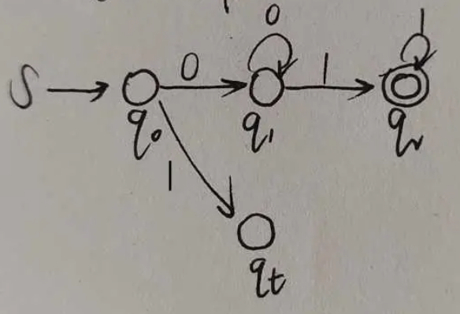

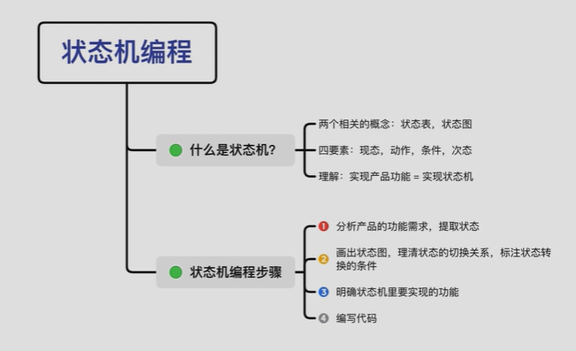
## 自动机编程步骤

1. 产品需求，提取状态
2. 画出状态图，理清状态切换关系
3. 明确某个状态要实现的功能
4. 编写代码

## 洗衣机示例状态分析

### 需求说明
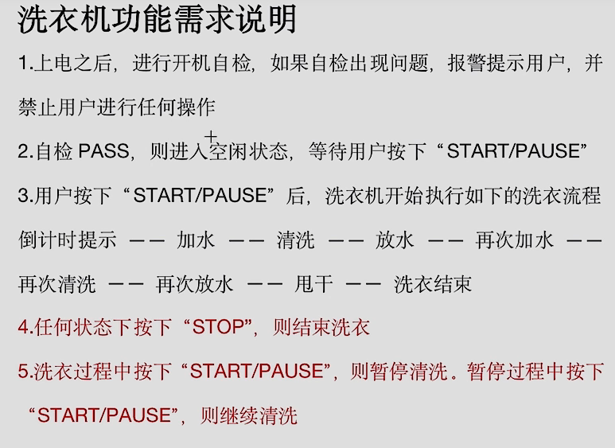
### 自动机流程
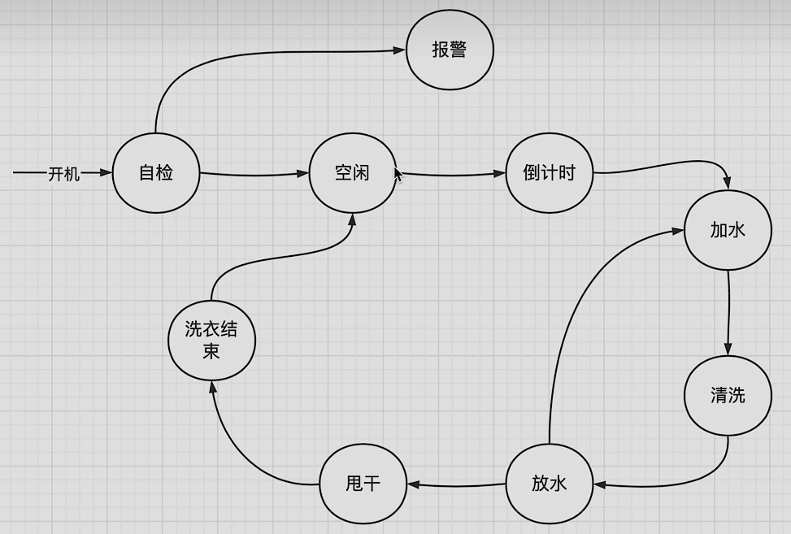

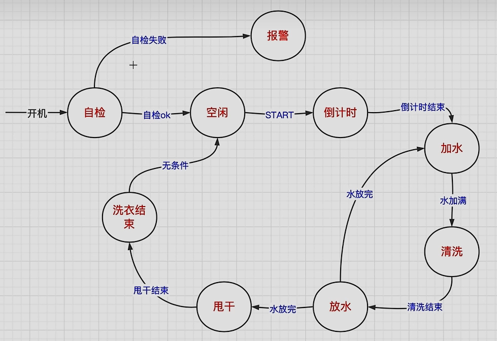

### 伪代码实现

```c
init();
while(1)
{
	global_check();
	switch(step)
	{
		case 1:{
			if(!auto_check())
				step = 2;
			else step = 18;
		}break;
		case 2: {
			if(!wait_for_user())
			{
				step = 3;
			}
		}break;
		case 3: {
			if(!start_countdown())
			{
				step = 4;
			}
		}break;
		case 4: {
			if(!let_water_in())
			{
				step = 5;
			}
		}break;
		case 5: {
			if(!do_wash())
			{
				step = 6;
			}
		}break;
		case 6: {
			if(!let_water_out() && count_wash != 2)
			{
				step = 4;
			}else if(!let_water_out() && count_wash == 2)
			{
				step = 7;
			}
		}break;
		case 7: {
			if(!do_dry())
			{
				step = 8;
			}
		}break;
		case 5: {
			finished();
			step = 2;
		}break;
		case 18: {
			while(1){
				alarm();
			}
		}break;
		default: break;
	}
}
```

## 开关自加1示例

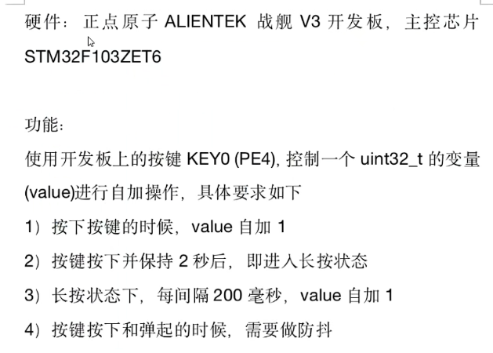

### 自动机

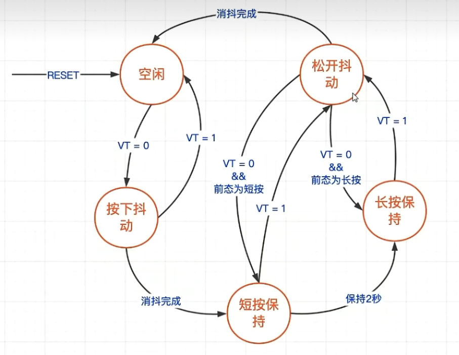
### 代码
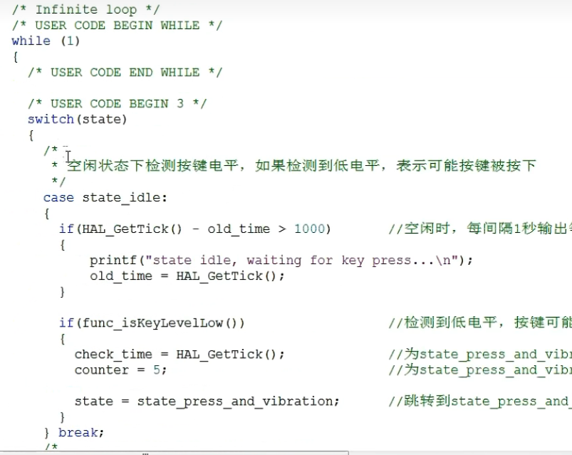

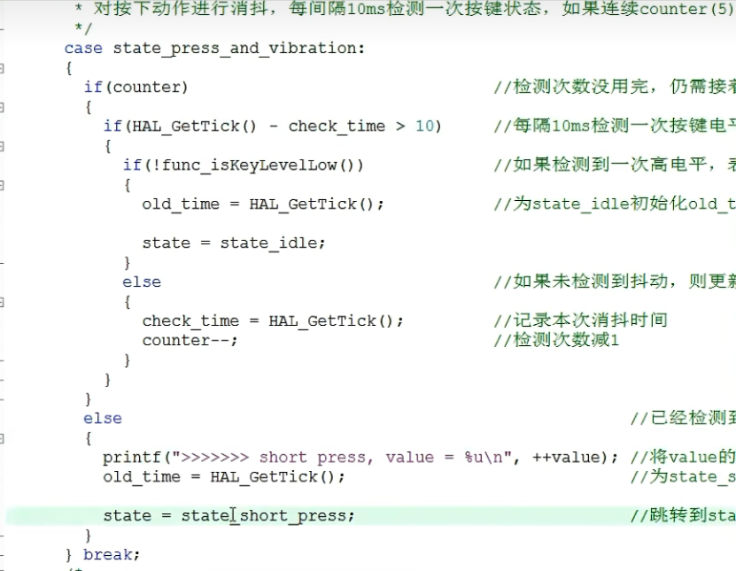

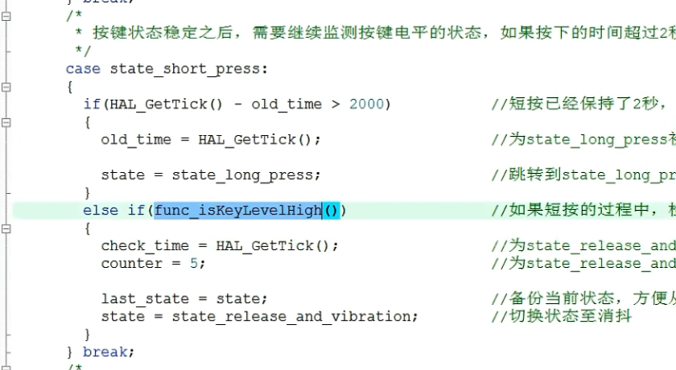

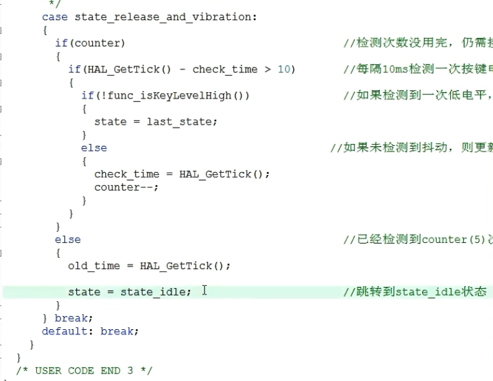

### TLS握手过程

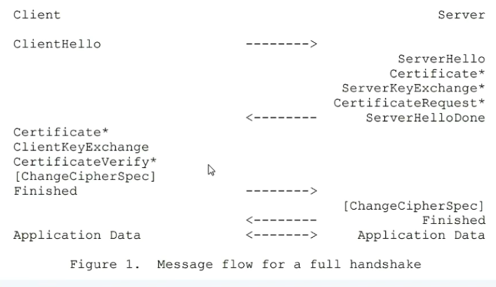

