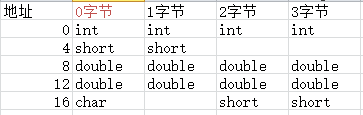

## 指针部分

> 64位环境 指针类型占用8个字节
> 
> 32位环境 指针类型占用4个字节

### 变量与地址
> 变量对某块内存的抽象表示

``指针 -> 地址 ``

``变量名 -> 抽象出来的某块空间的别名``

### 指针与指针变量

```c
int i = 1;
int *p = &i; //用于存放整型的指针
int ** q = &p; //*q指的是取q里面的地址值
```

:::note
TYPE NAME = VALUE 要区分``int *p = &i;``是定义``int *`` 类型的`p`，再把p取`i`的地址
:::

以下是各变量的值：
```c
i = 1;
&i = 0x2000;
p = 0x2000;
&p = 0x3000;
*p = 1;

q = 0x3000;
&q = 0x4000;
*q = 0x2000; //*q即是p的地址，不用刻意考虑什么多级指针
**q = 1;
```

:::tip
指针的大小不取决于数据类型，但是在定义的时候，需要定义**数据类型**来帮助其在运算的时候读取值的时候获取多少位来代表值。
:::

### 定义与初始化
#### 空指针与野指针

```c
int *p = NULL; //空指针
int *p = 0x40303; //野指针
```

:::tip
空指针(NULL为宏，在预编译的时候补充为``((void *)0)``)
:::

:::danger
如果只定义了``int *p``并对其取值，可能会出现段错误，如果你对没有权限赋值的进行赋值的结果，肯定出现段错误。所以如果不确定指针的内容，请把他赋值为``NULL``
:::

#### void类型指针

> 百搭类型，所有类型的值可以赋给他，也可以把他赋给其他类型。

```c
char *s = "hello";
void *i = s; //对字符串指针的赋值
```

#### 指针运算
& * 关系运算 ++ --

### 指针与数组

#### 指针与一维数组

```c {10-11}
#include <stdlib.h>
#include <stdio.h>

int main () {
  int a[3] = {1, 2, 3};
  // a是常量 p是变量
  int *p = a;

  for (int i = 0;i < sizeof(a)/sizeof(*a);i++) {
    printf("%p -> %d\n", p+i, *(p+i));
    //这里的p+i是指针运算，代表往下数i个的p的数据类型长度
  }
}
```

> p+1为什么不是单纯的p变量加一请参考章节[指针与指针变量](#指针与指针变量)的笔记。同时需要注意，在以上描述中数组``a[i]``，`a`是常量，`p`是变量

用以下方式可以表示数组：

``a[i]: a[i]=*(a+i)=*(p+i)=p[i]``


:::danger
对于`p++`  -> `p = p + 1 `；`p+1` -> `p+1` 。由两关系式，可以看出`p++ != p+1`
:::

```c {12-14}
#include <stdlib.h>
#include <stdio.h>

int main () {
  int a[3];
  int *p = a;

  for (int i = 0;i < sizeof(a)/sizeof(*a);i++) {
    scanf("%d", p++);
  }

  for (int i = 0;i < sizeof(a)/sizeof(*a);i++) {
    printf("%d\n", *(p++));  //这里的p变量没有回退到赋值开始地址
  }
}
```

```c {17-19}
#include <stdio.h>
#include <stdlib.h> //exit(0);
#include <string.h> 
#define STRSIZE 1024

int main() {
        int a[3];
        int *p=a;
        int i;
        for(i=0;i<sizeof(a)/sizeof(*a);i++){
                scanf("%d",p++);
        }
        for(i=0;i<sizeof(a)/sizeof(*a);i++){
                printf("%p->%d\n",&a[i],a[i]);
        }
		p=a;
        for(i=0;i<sizeof(a)/sizeof(*a);i++,p++){
          printf("%p->%d\n",p,*p);
        }
}
/* 以下是错误输出
1
2
3
0x7ffcc71063a8->1
0x7ffcc71063ac->2
0x7ffcc71063b0->3

0x7ffcc71063ac->1
0x7ffcc71063b0->2
0x7ffcc71063b4->3
*/
```

:::tip
以上代码中``p++``是放在for语句下，原因是如果``printf("%p->%d\n",p,*p++);``写这样的话printf函数是自右向左进行参数压栈计算，会把p自加后赋值给p，导致第一个参数不是我们想要的，需要注意。
:::

数组还可以这样定义：
```c
int *p = (int [3]){1,2,3} //匿名数组
```

#### 指针与二维数组
> 二维数组本质上是一维数组的扩展，也是在内存上连续存储，所以不用通过二级指针来定义他，可以通过行列转换进行表示。

:::tip
``a[i][j] = *(*(p+i)+j)`` 也就是说，数组``a[i]``存储了每一行地址，行指针变为列指针(``*(p+i)+j``)确定数值的地址。
:::

```c
#include <stdlib.h>
#include <stdio.h>

int main() {
  int a[2][3] = {{1, 2, 3},{ 4, 5, 6}};
  int (*p)[3] = a;

  for (int i = 0;i < sizeof(a)/sizeof(*a);i++) {
    for (int j = 0;j < sizeof(*a)/sizeof(**a);j++) {
      printf("%d ", *(*(p+i)+j));
    }
  }
}
```

```c
#include <stdlib.h>
#include <stdio.h>

int main() {
  int a[2][3] = {{1, 2, 3},{ 4, 5, 6}};
  int *p = &a[0][0];

  for (int i = 0;i < sizeof(a)/sizeof(*a);i++) {
    for (int j = 0;j < sizeof(*a)/sizeof(**a);j++) {
      printf("%d ",*(p+(i * sizeof(*a)/sizeof(**a))+j));
    }
  }
}
```

#### 数组指针
> 一个指针指向一个数组，也就是二维数组的另外一种实现

``[存储类型] 数据类型 (*指针名)[下标] = 值``

```c
int a[2][3] = {{1, 2, 3},{ 4, 5, 6}};
int *p = *a
int (*p)[3] = a;
```

```c
#include <stdlib.h>
#include <stdio.h>

int main() {
  int a[2][3] = {{1, 2, 3},{ 4, 5, 6}};
  int (*p)[3] = a;

  for (int i = 0;i < sizeof(a)/sizeof(*a);i++) {
    for (int j = 0;j < sizeof(*a)/sizeof(**a);j++) {
      printf("%d ", *(*(p+i)+j));
    }
  }
}

```

#### 指针数组
> 放指针的数组

``[存储类型] 数据类型 *数组名[下标] = 值``

指针数组排序代码：
```c
#include <stdio.h>
#include <stdlib.h>
#include <string.h>

int main() {
  char *name[5] = {"golang", "java", "c", "dart", "erlang"};
  int k;
  char *tmp;
  for (int i = 0;i < (sizeof(name)/sizeof(*name))-1;i++) {
    k = i;
    for (int j = i+1;j < (sizeof(name)/sizeof(*name));j++) {
      if (strcmp(name[k], name[j]) > 0) {
        k = j;
      }
    }
    if (k != i) {
      tmp = name[i];
      name[i] = name[k];
      name[k] = tmp;
    }
  }
  for (int i = 0;i < (sizeof(name)/sizeof(*name));i++) {
    printf("%s\n", *(name+i));
  }
}

```

#### 字符数组指针
##### 字符指针和字符数组的区别
字符数组指针见以下代码示例：
```c {5-6}
char str[]="Hello world!"//*str
char *p = str;
puts(p);

str = "name" //这个是不允许的，str是常量
strcpy(str,"world");//赋值请使用内置string.h的函数
```

```c {3}
char *str = "hello";
printf("%d %d\n",sizeof(str),strlen(str));
strcpy(str,"world");
puts(str);
```

以上代码会出现以下报错：
```bash
[root@node1 ~]# ./main
8 5
段错误 (核心已转储)
```

:::note
**出现以上报错的原因**
原因是str指向的是"hello"常量，字符常量，常量无法改变。使用``str="world"``代替即可。当然如果是字符数组``str[]``则应该使用``strcpy(str,"world")``函数。
:::

#### const与指针
> const 是把某些变量转变为常量

```c
const float pi = 3.14; // 常量化变量
//如何修改？但是这是没有意义的操作
float *p = &pi;
*p = 3.14159
```

#### 指针常量与常量指针的区别
> 如何识别？先看到指针就是指针 先看到常量就是常量

- 常量指针-指向的内存内容不能通过这个指针修改
```c
const int *p;
int const *p;
```

- 指针常量-指向的地址不能变但是可以通过这个指针修改内存的值
```c
int *const p;
const int *const p;
```

:::tip
不管是指针常量还是常量指针，他的限制是不能通过你定义的变量来改变你把变量变成常量的事实，但是你还是可以通过其他方式把里面的内容修改过来。
同时常量还可以保证你的内容不被修改，应用在工程上，主要体现在数据的保护。
:::

### 多级指针
> 多级指针有点像链表意义只是把内容存放了下一层地址，没有实际内容，实际的有具体的内容在多级指针末尾。

## 函数

### 函数的定义
`数据类型 函数名([数据类型 形参名,数据类型 形参名...])

```c
#include <stdlib.h>
#include <stdio.h>

int main(int argc,char *argv[]) {
//argc终端传递了多少参数，*argv[]参数列表
  exit(printf("Hello!\n"));
}

```

:::note
- 一个进程的返回状态是给父进程看的
- ``int argc,char *argv[]`` main的参数具体意思是命令行传递了多少参数，包括**执行命令本身**
:::

### 函数的传参
- 值传递
- 地址传递
> 特别经典的swap()交换函数问题
- 全局变量

### 函数的调用

#### 嵌套
```c
#include <stdlib.h>
#include <stdio.h>

int max(int a, int b, int c) {
  int tmp = a > b ? a : b;
  return tmp > c ? tmp : c;
}

int min(int a, int b, int c) {
  int tmp = a < b ? a : b;
  return tmp < c ? tmp : c;
}

int dist(int a, int b, int c) {
  return max(a, b, c) - min(a, b, c);
}

int main() {
  printf("%d\n", dist(8, 5, 10));
}

```

#### 递归
> 一个函数间接或直接调用自身，这里详细的练习可以去刷算法

```c title="斐波那契递归递归实现"
#include <stdio.h>
#include <stdlib.h>

int func(int n) {
  if (n < 0) {
    return -1;      //结束条件
  }
  if (n == 1 || n == 2) {
    return 1;
  }
  return func(n-1) + func(n-2);
}

int main() {
  int n;
  scanf("%d", &n);
  printf("fib %d = %d", n, func(n));
  exit(0);
}

```

```c title="阶乘递归实现"
#include <stdio.h>
#include <stdlib.h>

int func(int n) {
  if (n < 0) {
    return -1;
  }
  if (n == 0 || n == -1) {
    return 1;
  }
  return n * func(n - 1);
}

int main() {
  int n;
  scanf("%d", &n);
  printf("%d! = %d", n, func(n));
  exit(0);
}

```

### 函数与数组
- 一维数组
```c {5} title="用指针传递数组"
#include <stdlib.h>
#include <stdio.h>

// int *arr 的大小是8个字节,看不出数组是多大的，不能使用sizeof判断
void printarr(int *arr, int size) {
  for (int i = 0;i < size;i++) {
    printf("%d ", *(arr+i));
  }
  printf("\n");
}

int main() {
  int arr[] = {1, 2, 3, 4, 5};
  printarr(arr, sizeof(arr)/sizeof(*arr));
}

```

:::danger
注意这里的``int *arr`` 的大小是8个字节 是一个普通的指针不是数组，同样的如果定义为``int p[]``也是代表一个指针而不是整个数组，所以一定要传大小来判断数组大小。
:::

- 二维数组
```c title="指针二维数组传参"
#include <stdlib.h>
#include <stdio.h>

void printarr2(int (*p)[3], int m , int n) { 
//这是二级指针，也可以把二维数组当中大的一位数组来使用
  for (int i = 0;i < m;i++) {
    for (int j =0;j < n;j++) {
      printf("%4d ", *(*(p+i)+j));
    }
    printf("\n");
  }
}

int main() {
  int arr[][3] = {1, 2, 3, 4, 5, 6};
  printarr2(arr, 2, 3);
}

```

- 字符数组传参

```c title="字符串拷贝"
char *mystrcpy(char *dest, const char * src){
	char *ret = dest;
	if(dest != NULL && src !=NULL)
		while((*dest++ = *src++) != '\0')
	return ret;
}
```

```c title="字符串n个前拷贝"
char *mystrncpy(char *dest,const char* src,size_t n){
	int i;
	for(i = 0;i < n && (dest[i]=src[i]); i++);
	//赋值语句的返回值是所赋的值
	for(;i<n;i++)
		dest[i] = '\0';
	return dest
}
```

:::note
``(dest[i]=src[i])``赋值语句的返回值是所赋的值，当src为空``\0``的符号，结果返回假。
**size_t** 是一些C/C++标准在stddef.h中定义的，size_t 类型表示C中任何对象所能达到的最大长度，它是无符号整数。
:::

### 函数的指针
#### 指针函数
> 返回值为指针的函数

``数据类型 * 函数名(形参)``

```c  title="查找二维数组的第几行内容"
#include <stdio.h>
#include <stdlib.h>

#define M 2
#define N 3

int *findnum(int (*p)[], int num) {
  if (num > M - 1) {
    return NULL;
  }
  return *(p + num);
}

int main() {
  int arr[M][N] = {{1, 2, 3},{ 4, 5, 6}};

  int *res = findnum(arr, 1);

  for (int i = 0; i < N; i++) {
    printf("%d ", *(res + i));
  }
}
```

#### 函数指针
> 指向函数的指针变量

`数据类型 (*指针名)(形参)`

```c
int (*p)(int); //一个指针指向函数
```

```c {4} title="函数指针说明"
int add(int a,int b){
 return a+b;
}
int (int,int) *p //这里就是函数指针的定义，是抽象概念上的，与函数具体地址无关
//也可以写做
int (*p)(int,int);
p=add; //函数的入口地址
ret = p
```

:::tip
``int (int,int)``这个是以上代码add函数的抽象，是函数的最本质的内容，而函数名(地址常量)只是标识是一段代码所关联的入口地址，但是这个地址是可以变化的。
:::

#### 函数指针数组
> 指向函数的指针数组

`数据类型 (*数组名[下标]) (形参)`

```c
int (*funcp[N])(int)
```

#### 指向指针函数的函数指针数组

```c
int *(*funcp[N])(int)
```

:::tip
有了函数名，为什么还要定义指向函数的指针呢？
为了传输**函数名**过去，这种叫做**回调函数**。
:::

实际例子：
```c 
void qsort(void *base, size_t nmemb, size_t size,
                  int (*compar)(const void *, const void *));
```

```c
int pthread_create(pthread_t *restrict thread,
                          const pthread_attr_t *restrict attr,
                          void *(*start_routine)(void *),
                          void *restrict arg);
```

## 构造类型

### 结构体

#### 产生及意义

描述复杂的数据类型

#### 类型描述
> 建议结构体声明在函数外

```c
struct [node_st] {  //可以没有结构体名字，但是要在定义的时候初始化。
  type1 name1;
  type2 name2;
  ...
  
}; //要以分号结尾
```

:::tip
	结构体的任何描述不占用空间，只有实例化结构体才开辟空间，实例化后是由按照描述的顺序顺序开辟存储。
:::

#### 嵌套定义

```c title="嵌套定义"
#define NAMESIZE 32
struct birthday_st{
	int year;
	int month;
	int day;

};
struct student_st{
	int id;
	char name[NAMESIZE];
	struct birthday_st birth1; 
	struct birthday_st{  //也可以嵌套描述
	int year;
	int month;
	int day;
	}birth2; //请注意变量名
	int math;
	int chinese;
};
int main()
{
	struct student_st stu ={10011,"Alan",{2011,11,11},98,97};
	struct student_st stu ={.math = 98,.chinese = 97};
printf("%..%",stu.id,stu.name,stu.birth.year,stu.birth.month,stu.birth.day,stu.math,stu.chinese)
}

```

#### 定义变量初始化以及成员引用
- 成员引用：``变量名.成员名``
- 结构体指针：``指针->成员名`` ，``(*指针).成员名``

```c title="变量初始化示例"
struct A {
  int i;
  char c;
  float f;
};

int main() {
  // TYPE NAME = VALUE;
  struct A a = {123, 'A', 2.22}; // 初始化
  struct A a_ = { .c = 'A', .f = 2.22}; // 部分初始化
  struct A *ap = { .c = 'A', .f = 2.22}; // 部分初始化
  
  printf("%d %c %.2f\n",a.i, a.c, a.f); // 成员引用
  // 123 A 2.22
  printf("%d %c %.2f\n",a_.i, a_.c, a_.f); // 成员引用
  // 0 A 2.22
  printf("%d %c %.2f\n",ap->i, ap->c, ap->f); // 成员引用
  // 0 A 2.22
  
}
```

#### 占用内存空间大小

##### 结构体对齐

计算各类型在标准结构体中的占用空间：`addr % sizeof(type)` 如果不能整除的话``addr``就要继续加一直到整除。

:::tip
这里涉及到计算机组成原理的存储边界对齐设计：
- 字地址：4的倍数  
- 半字地址：2的倍数  
- 双字地址：8的倍数  
- 字节地址：任意


:::

1. 结构体(struct)的数据成员,第一个数据成员存放的地址为结构体变量偏移量为0的地址处.
2. 其他结构体成员自身对齐时,存放的地址为min{有效对齐值为自身对齐值, 指定对齐值} 的最小整数倍的地址处。注:自身对齐值:结构体变量里每个成员的自身大小
3. 总体对齐时,字节大小是min{所有成员中自身对齐值最大的, 指定对齐值} 的整数倍。

```c
#include <stdio.h>
#include <stdlib.h>

struct A {
  int i;
  char c;
  float f;
};

// 可以使用下面的方法取消对齐 常用于网络通信
struct B {
  int i;
  char c;
  float f;
}__attribute__((packed));

int main() {
  struct A a;
  struct B b;

  printf("A = %ld\n", sizeof(a));
  printf("B = %ld\n", sizeof(b));
}

```

:::tip
在进行网络编程时候，为了统一字节流不要出现因为对齐而造成的空格，使用宏``__attribute__((packed))``指定取消对齐，``__attribute__`` ((packed)) 的作用就是告诉编译器取消结构在编译过程中的优化对齐，按照实际占用字节数进行对齐，是GCC特有的语法。
:::

#### 函数传参结构体
- 直接在函数定义结构体
```c
void func(struct simp_st b); //这个形参的定义会把全部的成员变量传过去
```
缺点：会把全部的成员变量传过去，是的函数参数消耗大。

- 把结构体的指针传过去
```c
struct simp_st a;
struct simp_st *p = &a;
void func(struct simp_st *p); //指针的大小都是固定的
```
优点：节省开销，工程上的应用

#### 结构体应用

```c title="结构体学生信息管理"
#include <stdio.h>
#include <stdlib.h>
#include <string.h>
#define NAMESIZE 32

struct student_st
{
    int id;
    char name[NAMESIZE];
    int math;
    int chinese;
};
void stu_set(struct student_st *p, const struct student_st *q)
{
    *p = *q; // 结构体内容可以直接赋值
    /*
        p->id = q -> id ;
        strncpy(P->name,"Alan",NAMESIZE);//因为name不能直接赋字符常量值
        p->math = 90;
        p->chinese = 98;
    */
}
void stu_show(struct student_st *p)
{
    printf("%d %s %d %d\n", p->id, p->name, p->math, p->chinese);
}
void stu_changename(struct student_st *p, const char *newname)
{
    strcpy(p->name, newname);
}
void menu(void)
{
    printf("1 set\n2 change name\n3 show\n");
}
int main()
{
    struct student_st stu, tmp;
    int choice;
    do
    {
        menu();
        int ret = scanf("%d".& choice);
        if (ret != 1)
        {
            break;
        }
        switch (choice)
        {
        case 1:
            scanf("%d%s%d%d", &tmp.id, tmp.name, &tmp.math, &tmp.chinese);
            stu_set(&stu, &temp);
            break;
        case 2:
            stu_changename(&stu, "wrm244");
            break;
        case 3:
            stu_show(&stu);
            break;
        default:
            exit(1);
        }
    } while (1);
    exit(1);
}
```

### 共用体
#### 产生及意义
>多个成员共用一块空间，取最大的成员的类型大小作为共用体的类型大小，比如说你的性别可以有男女，但只有一个可选项。

#### 类型描述

``union 共用体名{};``

```c
union test_un{
  int i;
  float f;
  double d;
  char ch;
};
```

:::note
定义赋值之后只对一个成员变量有效，这里的有效指的是有意义。
:::

#### 嵌套定义

同结构体，可以互相嵌套。
```c
union
{
	int a;
	double d;
	struct
	{
		int srr[10];
		float f;
	}c;
};
```
以上代码的占用空间大小为44。
##### 嵌套的应用
- 判断大小端
- 32位的数高十六位与第十六位相加
```c
union{
	struct
	{
		uint16_t i;
		uint16_t j;
	}x;
	uint32_t y;
}a;

a.y = 0x11223344;
a.x.i + a.x.j //为答案

```

####  定义变量初始化以及成员引用
- 成员引用：``变量名.成员名``
- union指针：``指针->成员名`` ，``(*指针).成员名``

> 32位的无符号数的高16位和低16位相加

```c
#include <stdlib.h>
#include <stdio.h>
#include <stdint.h>

int main() {
  uint32_t i = 0x11223344;
  printf("%x\n", (i>>16)+(i&0xFFFF));
}
```

另一种写法
```c
#include <stdlib.h>
#include <stdio.h>
#include <stdint.h>

union {
  struct {
    uint16_t i;
    uint16_t j;
  }x;
  uint32_t y;
}u;

int main() {
  uint32_t i = 0x11223344;
  printf("%x\n", (i>>16)+(i&0xFFFF));

  u.y = 0x11223344;
  printf("%x\n", u.x.i + u.x.j);
}

```

#### 位域
> 用这个来定义的话，在移殖的时候会冲突
```c
union
{
	struct
	{
		char a:1;
		char b:2;
		char c:1;
	}x;
	char y;
}w;

int main()
{   w.y = 1;
	printf(w.x.a)
	exit(0);
}
```

### 枚举
``enum 标识符{};``

```c
enum 标识符{
  成员1;
  ...
};
```

```c
enum day {
  MON = 1,
  TUS,
  WEB,
  THR,
  FRI,
  SAT,
  SUN,
};

int main() {
  enum day a = FRI;
  
  printf("%d\n", a);
}
```

```c
enum status {
  RUNNING = 1,
  STOP,
  PAUSE,
};

struct job {
  int id;
  int state;
  time_t start, end;
};

int main() {
  struct job_st job1;
  
  switch(jobs.state) {
    case RUNNING:
      // TODO
      break;
    case STOP:
      // TODO
      break;
    case PAUSE:
      // TODO
      break;
    default:
      // TODO
      abort();
  }
}

```

### typedef
> 对已有的数据类型进行改名

`typedef type typename`

```c
typedef int INT

int main() {
  INT i = 9;
}
```

- typedef 和 define 的区别
```c
#define IP int *
typedef int *IP;

int main() {
  // 宏
  IP p, q;
  int *p, q; // 一个int * 一个int
  
  // typedef
  IP p, q;
  int *p, *q; // 两个int *
}
```

- 数组
```c
typedef int ARR[6]; // int [6] 改名为 ARR

ARR a; // int a[6];
```

 - 结构体

```c
typedef struct {
  int i;
  float f;
}NODE, *NODEP;
```

- 函数

```c
typedef int *FUNC(int)
```

- 函数指针

```c
typedef int* (*FUNCP)(int)

FUNCP P; --> int *(*P)(int);
```

## 动态内存管理
- malloc
- calloc
- realloc
- free
**谁申请谁释放**

```c
#include <stdlib.h>
#include <stdio.h>

int main() {
  int *ip = malloc(sizeof(int));

  *ip = 1;

  printf("%d\n", *ip);
  free(ip);
}

```

> 动态数组

```c
#include <stdlib.h>
#include <stdio.h>

int main() {
  int *p;
  int num = 5;
  p = malloc(num * sizeof(int));

  for (int i = 0;i < num;i++) {
    scanf("%d", p+i);
  }
  for (int i = 0;i < num; i++) {
    printf("%d ", *(p+i));
  }

  printf("\n");
  exit(0);
}

```

> 内存申请与函数传值

```c
#include <stddef.h>
#include <stdlib.h>
#include <stdio.h>

void func1(void *p, size_t size) {

  if(p == NULL) {
    return;
  }
  p = malloc(size);
}

void func2(int **p, size_t size) {

  if(*p == NULL) {
    return;
  }
  *p = malloc(size);
}

void *func3(void *p, size_t size) {
  if(p == NULL) {
    return NULL;
  }
  p = malloc(size);
  return p;
}

int main() {
  int num = 100;
  int *p = NULL;

  func1(p, num); // 内存会泄露

  func2(&p, num); // 传递二级指针

  p = func3(p, num); // 将申请的内存返回

  free(p);
  exit(0);
}

```


#### free的理解

```c
#include <stddef.h>
#include <stdlib.h>
#include <stdio.h>

void func2(int **p, size_t size) {

  if(*p == NULL) {
    return;
  }
  *p = malloc(size);
}

int main() {
  int num = 100;
  int *p = NULL;

  func2(&p, num); // 传递二级指针

  free(p);
  // p = NULL;
  
  *p = 123;
  printf("%d\n", *p); // 这个指针已经是野指针了 
  
  exit(0);
}
```

- free代表着变量p不再拥有原来指向内存空间的引用权限
- free后最好马上将指针置NULL

## Makefile
> 工程管理依赖管理

- makefile(用户自定义 更高优先级)
- Makefile(默认)

``` makefile
mytool:main.o tool1.o tool2.o
  gcc main.o tool1.o tool2.o -o mytool  
main.o:main.c
  gcc main.c -c -Wall -g -o main.o
tool1.o:tool1.c
  gcc tool1.c -c -Wall -g -o tool1.o
tool2.o:tool2.c
  gcc tool2.c -c -Wall -g -o tool2.o
  
```


``` makefile
OBJS=main.o tool1.o tool2.o
CC=gcc

mytool:$(OBJS)
  $(CC) $(OBJS) -o mytool

main.o:main.c
  $(CC) main.c -c -Wall -g -o main.o
tool1.o:tool1.c
  $(CC) tool1.c -c -Wall -g -o tool1.o
tool2.o:tool2.c
  $(CC) tool2.c -c -Wall -g -o tool2.o
 
clean:
  $(RM) $(OBJS) mytool -r
```

> ``$^`` 表示在上一句依赖关系中被依赖的所有文件
> ``$@`` 表示在上一句依赖关系中依赖项的目标文件

``` makefile
CFLAGS=-Wall -g -c
OBJS=main.o tool1.o tool2.o
CC=gcc

mytool:$(OBJS)
  $(CC) $^ -o $@

main.o:main.c
  $(CC) $^ $(CFLAGS) -o $@
tool1.o:tool1.c
  $(CC) $^ $(CFLAGS) -o $@
tool2.o:tool2.c
  $(CC) $^ $(CFLAGS) -o $@
 
clean:
  $(RM) $(OBJS) mytool -r
```

> % 表示同一个名字

``` makefile
CFLAGS=-Wall -g -c
OBJS=main.o tool1.o tool2.o
CC=gcc

mytool:$(OBJS)
  $(CC) $^ -o $@

%.o:%.c
  $(CC) $^ $(CFLAGS) -o $@
 
clean:
  $(RM) $(OBJS) mytool -r
```
