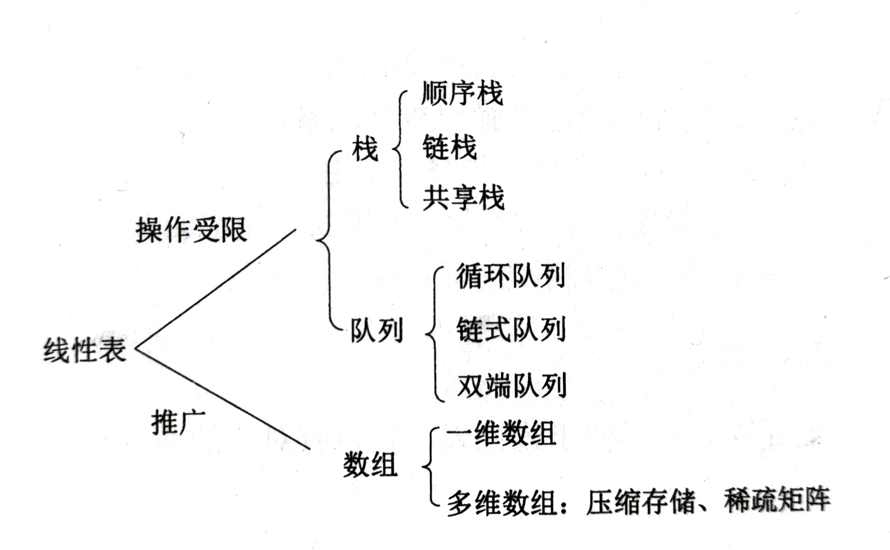
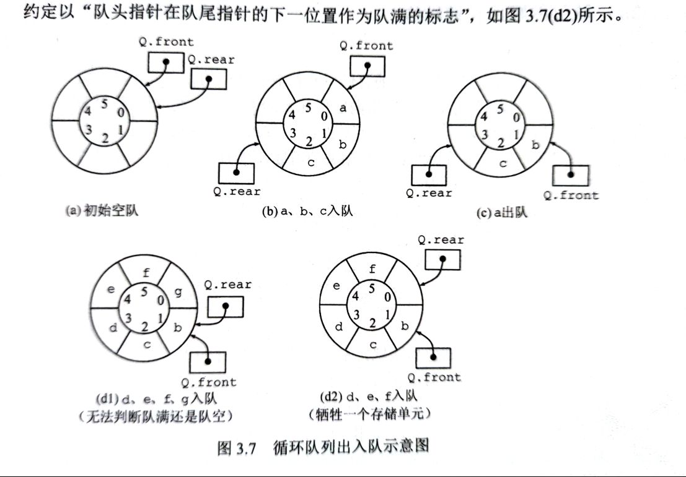

## 栈
### 顺序栈数据结构
```c
typedef int datatype;
typedef struct node_st{
    datatype data[MAXSIZE];
    int top;
}sqstack;

sqstack* st_create(void);
void st_destroy(sqstack *s);
int st_isempty(sqstack *s);
int st_push(sqstack *s, datatype *data);
int st_pop(sqstack *s, datatype *data);
void st_travel(sqstack *s, void (*pri)(datatype));
int st_top(sqstack *s, datatype *data);

```
#### 代码
```c
sqstack* st_create(void){
    sqstack *st;
    st = malloc(sizeof(*st));
    if(st == NULL)
        return NULL;
    st->top = -1;
    return st;

}
void st_destroy(sqstack *s){
    free(s);
}
int st_isempty(sqstack *s){
    return s->top == -1;
}
int st_push(sqstack *s, datatype *data){
    if(s->top == MAXSIZE - 1)
        return -1;
    s->data[++s->top] = *data;
    return 0;
}
int st_pop(sqstack *s, datatype *data){
    if(s->top==-1)
        return -1;
    *data = s->data[s->top--];
    return 0;
}
void st_travel(sqstack *s, void (*pri)(datatype)){
    if(st_isempty(s))
        return;
    for (size_t i = 0; i <= s->top; i++)
    {
        pri(s->data[i]);
    }
    
}
int st_top(sqstack *s, datatype *data){
    if(st_isempty(s))
        return -1;
    *data = s->data[s->top];
    return 0;
}
```

### 链式栈
```c
#include<stdio.h>
#include "stack.h" //参考双向链表函数封装

STACK *stack_create(int initsize){
    return llist_create(initsize);
}

int stack_push(STACK *ptr, const void *data){
    return llist_insert(ptr, data, LLIST_FORWARD);
}

int always_match(const void *p1, const void *p2){
    return 0;
}
int stack_pop(STACK *ptr, void *data){
    return llist_fetch(ptr,(void *)0,always_match, data);
}

void stack_destroy(STACK *ptr){
    llist_destory(ptr);
}
```

## 队列

### 顺序循环队列数据结构

```c
typedef int datatype;
#define MAXSIZE 100
typedef struct node_st{
    datatype data[MAXSIZE];
    int head,tail;
}sqqueue;

sqqueue *qu_create();
int qu_isempty(sqqueue *);
int qu_enqueue(sqqueue *,datatype *);
int qu_dequeue(sqqueue *,datatype *);
void qu_travel(sqqueue *);
void qu_clear(sqqueue *);
void qu_destroy(sqqueue *);

```

#### 函数代码
```c
sqqueue *qu_create(){
    sqqueue *sq;
    sq = malloc(sizeof(*sq));
    if(sq == NULL)
        return NULL;
    sq->head = 0;
    sq->tail = 0;
}
int qu_isempty(sqqueue *sq){
    return sq->head==sq->tail;
}
int qu_enqueue(sqqueue *sq,datatype *data){
    if((sq->tail+1)%MAXSIZE == sq->head){
        return -1;
    }
    sq->tail=(sq->tail +1)%MAXSIZE;
    sq->data[sq->tail]=*data;
    return 0;
}
int qu_dequeue(sqqueue *sq,datatype *data){
    if(qu_isempty(sq))
        return -1;
    sq->head = (sq->head+1)%MAXSIZE;
    *data = sq->data[sq->head];
    return 0;
}
void qu_travel(sqqueue *sq){
    if(sq->head==sq->tail)
        return ;
    int i=(sq->head+1)%MAXSIZE;
    while (i!=sq->tail)
    {
        printf("%d",sq->data[i]);
        i = (i+1)%MAXSIZE;
    }
    printf("%d\n",sq->data[i]);
    
}
void qu_clear(sqqueue *sq){
    sq->head = sq->tail;
}
void qu_destroy(sqqueue *sq){
    free(sq);
}
```