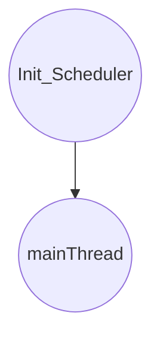
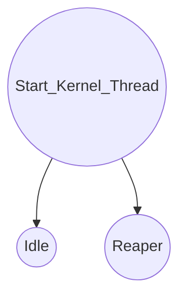

## GeekOS进程状态及转换


GeekOS系统最早创建的内核进程有Idle、Reaper和Main三个进程，它们由Init_Scheduler函数创建：最先初始化一个核态进程mainThread，并将该进程作为当前运行进程，函数最后还调用Start_Kernel_Thread 函数创建了两个系统进程Idle和Reaper。 所以，Idle、Reaper和Main三个进程是系统中最早存在的进程。




## GeekOS的用户态进程
在GeekOS中为了区分用户态进程和内核进程，在Kernel_Thread结构体中设置了一个字段 userContext，指向用户态进程上下文。对于内核进程来说，这个指针为空，而用户态进程都拥有自己的用户上下文（User_Context）。因此，在GeekOS中要判断一个进程是内核进程还是用户态进程，只要通过userContext字段是否为空来判断。


## User_Context结构结构
```c title="User_Context结构结构"
struct User_Context {  
    #define NUM_USER_LDT_ENTRIES 3  
    struct Segment_Descriptor ldt[NUM_USER_LDT_ENTRIES]; // 用户LDT  
    struct Segment_Descriptor* ldtDescriptor; // LDT描述符    
    char* memory; // 指向用户空间    
    ulong_t size; // 用户空间的大小    
    ushort_t ldtSelector; // ldt选择子    
    ushort_t csSelector;  // cs选择子    
    ushort_t ssSelector;  // ss选择子    
    ushort_t dsSelector;  // ds选择子    
    pde_t *pageDir;     // 页表指针    
    ulong_t entryAddr;    // 用户程序入口地址    
    ulong_t argBlockAddr;  // 参数块地址    
    ulong_t stackPointerAddr; // 用户态进程的栈指针    
    int refCount;  // 引用数    
    struct File *fileList[USER_MAX_FILES]; // 打开文件列表    
    int fileCount;  // 打开文件计数  
};
```
## 用户态进程空间 
每个用户态进程都拥有属于自己的内存段空间，如：代码段、数据段、栈段等，每个段有一个段描述符（segment descriptor），并且每个进程有一个段描述符表（Local Descriptor Table），用于保存该进程的所有段描述符。操作系统中还设置一个全局描述符表（GDT，Global Descriptor Table），用于记录了系统中所有进程的ldt描述符。


### 用户态进程创建LDT的步骤
- 调用函数Allocate_Segment_Descriptor()新建一个LDT描述符；
- 调用函数Selector()新建一个LDT选择子；
- 调用函数Init_Code_Segment_Descriptor()初始化一个文本段描述符；
- 调用函数Init_Data_Segment_Descriptor()初始化一个数据段描述符；
- 调用函数Selector()新建一个数据段选择子；
- 调用函数Selector()新建一个文本（可执行代码）段选择子。


## 用户态进程创建流程


## 项目实现
1. Spawn函数
> “src/GeekOS/user.c”文件中的函数Spawn()，其功能是生成一个新的用户级进程:
```c title="Spawn函数的功能"
int Spawn(const char *program, const char *command, struct Kernel_Thread **pThread)
//参数说明：Program对应的是要读入内存缓冲区的可执行文件
//Command是用户执行程序执行时的命令行字符串
//pThread是存放指向刚创建进程的指针。
```
Spawn函数主要完成的主要功能是：
- 调用Read_Fully函数将名为program的可执行文件全部读入内存缓冲区。
- 调用Parse_ELF_Executable函数，分析ELF格式文件。Parse_ELF_Executable函数功能在项目1中已经实现。
- 调用Load_User_Program将可执行程序的程序段和数据段等装入内存，初始化User_context数据结构。
- 调用Start_User_Thread函数创建一个进程并使该进程进入准备运行队列。

2. Load_User_Program函数
```c title="/src/geekos/userseg.c"
int Load_User_Program(char *exeFileData, ulong_t exeFileLength,
struct Exe_Format *exeFormat, const char *command,
struct User_Context **pUserContext)
/* 参数说明：
exeFileData——保存在内存缓冲中的用户程序可执行文件；
exeFileLength——可执行文件的长度；
exeFormat——调用Parse_ELF_Executable函数得到的可执行文件格式信息；
command——用户输入的命令行，包括可执行文件的名称及其他参数；
pUserContext——指向User_Conetxt的指针，是本函数完成用户上下文初始化的对象
*/

1. “src/GeekOS/user.c”文件中的函数Spawn()，其功能是生成一个新的用户级进程；
```
Load_User_Program主要实现功能如下：
1. 根据Parse_ELF_Executable函数的执行结果Exe_Format中的Exe_Segment结构提供的用户程序段信息，用户命令参数及用户态进程栈大小计算用户态进程所需的最大内存空间，即要分配给用户态进程的内存空间。
2. 为用户程序分配内存空间，并初始化。
3. 根据Exe_Segment提供的用户段信息初始化代码段、数据段以及栈段的段描述符和段选择子。
4. 根据段信息将用户程序中的各段内容复制到分配的用户内存空间。
5. 根据Exe_Format结构初始化User_Context结构中的用户态进程代码段入口entry字段，并根据command参数初始化用户内存空间中的参数块。
6. 初始化User_Context结构的用户打开文件列表，并添加标准输入输出文件。
7. 将初始化完毕的User_Context指针赋予*pUserContext，返回0表示成功。

```c title="src/GeekOS/user.c | Spawn()生成一个新的用户级进程"
int Spawn(const char *program, const char *command, struct Kernel_Thread **pThread) {     
    int res; 

    /* 读取 ELF 文件 */     
    char *exeFileData = NULL; 
    ulong_t exeFileLength = 0;     
    res = Read_Fully(program, (void**)&exeFileData, &exeFileLength); 
    //将名为program的可执行文件全部读入内存缓冲区
    
    if (res != 0)     
    {                
        if (exeFileData != NULL) Free(exeFileData);         
        return ENOTFOUND;     
    } 

    /* 分析 ELF 文件 */     
    struct Exe_Format exeFormat;     
    res = Parse_ELF_Executable(exeFileData, exeFileLength, &exeFormat);     
    if (res != 0)     
    {                 
        if (exeFileData != NULL) Free(exeFileData);         
        return res;     
    }

    /* 加载用户程序 */     
    struct User_Context *userContext = NULL;     
    res = Load_User_Program(exeFileData, exeFileLength, &exeFormat, command, &userContext);     
    if (res != 0)     
    {                
        if (exeFileData != NULL) Free(exeFileData);         
        if (userContext != NULL) Destroy_User_Context(userContext);         
        return res;     
    }     
    if (exeFileData != NULL) Free(exeFileData);     
    exeFileData = NULL;     

    /* 开始用户进程 */     
    struct Kernel_Thread *thread = NULL;     
    thread = Start_User_Thread(userContext, false);     
    /* 超出内存 创建新进程失败 */     
    if (thread == NULL) 
    {         
        if (userContext != NULL) Destroy_User_Context(userContext);
             return ENOMEM;     
    }

    KASSERT(thread->refCount == 2);
    /* 返回核心进程的指针 */ 
    *pThread = thread; 
    return 0; 
}
```
2. "src/GeekOS/user.c"文件中的函数`Switch_To_User_Context()`，调度程序在执行一个新的进程前调用该函数以切换用户地址空间；
```c title="src/GeekOS/user.c | Switch_To_User_Context()"
void Switch_To_User_Context(struct Kernel_Thread* kthread, struct Interrupt_State* state)
{
    /*
     * Hint: Before executing in user mode, you will need to call
     * the Set_Kernel_Stack_Pointer() and Switch_To_Address_Space()
     * functions.
     */

    //之前最近使用过的 userContxt
    static struct User_Context* s_currentUserContext;

    //指向User_Conetxt的指针，并初始化为准备切换的进程
    struct User_Context* userContext = kthread->userContext;

    KASSERT(!Interrupts_Enabled());

    //userContext为0表示此进程为核心态进程就不用切换地址空间
    if (userContext == 0) return;

    if (userContext != s_currentUserContext)
    {
        //为用户态进程时则切换地址空间
        Switch_To_Address_Space(userContext);
        //新进程的核心栈指针 
        ulong_t esp0 = ((ulong_t)kthread->stackPage) + PAGE_SIZE;
        //设置内核堆栈指针
        Set_Kernel_Stack_Pointer(esp0);
        //保存新的 userContxt
        s_currentUserContext = userContext;
    }
}
```
3. "src/GeekOS/elf.c"”"文件中的函数Parse_ELF_Executable（）。该函数的实现项目1已经完成。
4. "src/GeekOS/userseg.c"文件中主要是实现一些为实现对"src/GeekOS/user.c"中高层操作支持的函数。
`Create_User_Context()`,用于创建并初始化一个用户上下文结构:
```c title="src/GeekOS/userseg.c | Create_User_Context(),用于创建并初始化一个用户上下文结构"
/**需在此文件各函数前增加一个函数，此函数的功能是按给定的大小创建一个用户级进程上下文，具体实现如下：  
函数功能:按给定的大小创建一个用户级进程上下文**/
static struct User_Context* Create_User_Context(ulong_t size) 
{     
    struct User_Context *userContext;
    size = Round_Up_To_Page(size);     
    userContext = (struct User_Context *)Malloc(sizeof(struct User_Context));
    /* 内存分配成功则继续为 userContext 下的 memory 分配内存空间 */
    if (userContext == NULL)     
    {
         return NULL;
    }     
    userContext->memory = (char *)Malloc(size);     
    if (userContext->memory == NULL)
    {         
         Free(userContext);         
         return NULL;
    }     
    memset(userContext->memory, '\0', size);
    userContext->size = size; 

    /* 新建一个 LDT 描述符 */     
    userContext->ldtDescriptor = Allocate_Segment_Descriptor();     
    if (userContext->ldtDescriptor == NULL)
    {                
         Free(userContext->memory);         
         return NULL;     
    }     
    /* 初始化段描述符 */
    Init_LDT_Descriptor(userContext->ldtDescriptor, userContext->ldt, NUM_USER_LDT_ENTRIES);     
    /* 新建一个 LDT 选择子 */
    userContext->ldtSelector = Selector(KERNEL_PRIVILEGE, true, Get_Descriptor_Index(userContext->ldtDescriptor));     
    /* 新建一个代码段描述符 */     
    Init_Code_Segment_Descriptor(&userContext->ldt[0], (ulong_t)userContext->memory, size / PAGE_SIZE, USER_PRIVILEGE);
    /* 新建一个数据段描述符 */     
    Init_Data_Segment_Descriptor(&userContext->ldt[1], (ulong_t)userContext->memory, size / PAGE_SIZE, USER_PRIVILEGE);     
    /* 新建数据段和代码段选择子 */
    userContext->csSelector = Selector(USER_PRIVILEGE, false, 0); 
    userContext->dsSelector = Selector(USER_PRIVILEGE, false, 1);
    /* 将引用数清零 */     
    userContext->refCount = 0; 

    return userContext; 
} 
```
`Destroy_User_Context()`函数的功能是释放用户态进程占用的内存资源。
```c title="src/GeekOS/userseg.c | Destroy_User_Context(),释放用户态进程占用的内存资源"
void Destroy_User_Context(struct User_Context* userContext) 
{     
    KASSERT(userContext->refCount == 0);     
    /* 释放 LDT descriptor */     
    Free_Segment_Descriptor(userContext->ldtDescriptor);     
    /* 释放内存空间 */     
    Disable_Interrupts();     
    Free(userContext->memory);     
    Free(userContext);     
    Enable_Interrupts(); 
}
```
`Load_User_Program()`函数的功能通过加载可执行文件镜像创建新进程的User_Context结构。
```c title="src/GeekOS/userseg.c | Load_User_Program(),加载可执行文件镜像创建新进程的User_Context结构"
int Load_User_Program(char *exeFileData, ulong_t exeFileLength,     
struct Exe_Format *exeFormat, const char *command,     
struct User_Context **pUserContext) 
{     
    unsigned int i;     
    struct User_Context *userContext = NULL; 

    /* 要分配的最大内存空间 */     
    ulong_t maxva = 0;     
    /* 计算用户态进程所需的最大内存空间 */     
    for (i = 0; i < exeFormat->numSegments; i++)     
    {         
        struct Exe_Segment *segment = &exeFormat->segmentList[i];        
        ulong_t topva = segment->startAddress + segment->sizeInMemory;        
        if (topva > maxva) maxva = topva; 
    } 
    /* 程序参数数目 */     
    unsigned int numArgs;     
    /* 获取参数块的大小 */     
    ulong_t argBlockSize;     
    Get_Argument_Block_Size(command, &numArgs, &argBlockSize);     
    /* 用户进程大小 = 参数块总大小 + 进程堆栈大小(8192) */     
    ulong_t size = Round_Up_To_Page(maxva) + DEFAULT_USER_STACK_SIZE;     
    /* 参数块地址 */     
    ulong_t argBlockAddr = size;     
    size += argBlockSize;     
    /* 按相应大小创建一个进程 */     
    userContext = Create_User_Context(size);     
    /* 如果进程创建失败则返回错误信息 */     
    if (userContext == NULL)     
    {                  
        return -1;     
    } 

    /* 将用户程序中的各段内容复制到分配的用户内存空间 */     
    for (i = 0; i < exeFormat->numSegments; i++)     
    {        
        struct Exe_Segment *segment = &exeFormat->segmentList[i];        
        memcpy(userContext->memory + segment->startAddress,                
                exeFileData + segment->offsetInFile,                
                segment->lengthInFile);    
    } 

    /* 格式化参数块 */     
    Format_Argument_Block(userContext->memory + argBlockAddr, numArgs, argBlockAddr, command);     
    /* 初始化数据段、堆栈段及代码段信息 */     
    userContext->entryAddr = exeFormat->entryAddr;     
    userContext->argBlockAddr = argBlockAddr;     
    userContext->stackPointerAddr = argBlockAddr; 

    /* 将初始化完毕的 User_Context 赋给*pUserContext */     
    *pUserContext = userContext; 

    return 0; 
} 

```
`Copy_From_User()`和`Copy_To_User()`函数的功能是在用户地址空间和内核地址空间之间复制数据，在分段存储器管理模式下，只要段有效，调用memcpy函数就可以实现这两个函数的功能。
```c title="src/GeekOS/userseg.c | Copy_From_User()"
bool Copy_From_User(void* destInKernel, ulong_t srcInUser, ulong_t bufSize) 
{     
    struct User_Context* userContext = g_currentThread->userContext;     
    /* 如果访问的用户内存空间非法(越界访问)，则直接返回失败 */     
    if (!Validate_User_Memory(userContext, srcInUser, bufSize))         
        return false;     
    /* 拷贝当前用户内存空间数据到系统内核空间 */     
    memcpy(destInKernel, userContext->memory + srcInUser, bufSize);     
    /* 拷贝成功则返回 1 */     
    return true; 
} 
```
```c title="src/GeekOS/userseg.c | Copy_To_User()"
bool Copy_To_User(ulong_t destInUser, void* srcInKernel, ulong_t bufSize) 
{     
    struct User_Context* userContext = g_currentThread->userContext;     
    /* 如果需要拷贝的内容超出用户内存空间(越界)，则直接返回失败 */     
    if (!Validate_User_Memory(userContext, destInUser, bufSize))         
        return false;     
    /* 拷贝当前系统内核空间数据到用户内存空间 */     
    memcpy(userContext->memory + destInUser, srcInKernel, bufSize);     
    /* 拷贝成功则返回 1 */     
    return true; 
}
```
`Switch_To_Address_Space()`函数的功能是通过将进程的LDT装入到LDT寄存器来激活用户的地址空间。
```c title="src/GeekOS/userseg.c | Switch_To_Address_Space(),激活用户的地址空间"
void Switch_To_Address_Space(struct User_Context *userContext) 
{     
    /* 切换到新的局部描述符表(LDT) */     
    ushort_t ldtSelector = userContext->ldtSelector;     
    __asm__ __volatile__ (     
    "lldt %0"     
    :     
    : "a" (ldtSelector)     
    ); 
}
```
5. "src/GeekOS/kthread.c"文件中的Start_User_Thread函数和Setup_User_Thread函数。
> 修改/project2/src/geekos/kthread.c 文件，添加头文件"#include <geekos/user.h>"。
`Setup_User_Thread()`函数的功能是为进程初始化内核栈，栈中是为进程首次进入用户态运行时设置处理器状态要使用的数据。
```c title="src/GeekOS/kthread.c | Setup_User_Thread(),为进程初始化内核栈"
/*
 * Set up the a user mode thread.
 */
void Setup_User_Thread(
    struct Kernel_Thread* kthread, struct User_Context* userContext)
{
    /*
     * Push the argument to the thread start function, and the
     * return address (the Shutdown_Thread function, so the thread will
     * go away cleanly when the start function returns).
     */
    ulong_t eflags = EFLAGS_IF;     
    unsigned int csSelector = userContext->csSelector;  /* CS 选择子 */     
    unsigned int dsSelector = userContext->dsSelector;  /* DS 选择子 */ 

    /* 调用 Attach_User_Context 加载用户上下文 */  
    Attach_User_Context(kthread, userContext); 

    /* 初始化用户态进程堆栈，使之看上去像刚被中断运行一样 */     
    /* 分别调用 Push 函数将以下数据压入堆栈 */     
    Push(kthread, dsSelector);  /* DS 选择子 */     
    Push(kthread, userContext->stackPointerAddr);  /* 堆栈指针 */     
    Push(kthread, eflags);  /* Eflags */     
    Push(kthread, csSelector);  /* CS 选择子 */     
    Push(kthread, userContext->entryAddr);  /* 程序计数器 */     
    Push(kthread, 0);  /* 错误代码(0) */     
    Push(kthread, 0);  /* 中断号(0) */ 

//    if (uthreadDebug)         
//      Print("Entry addr=%lx\n", userContext->entryAddr); 

    /* 初始化通用寄存单元，向 esi 传递参数块地址 */     
    Push(kthread, 0);  /* eax */     
    Push(kthread, 0);  /* ebx */     
    Push(kthread, 0);  /* ecx */     
    Push(kthread, 0);  /* edx */     
    Push(kthread, userContext->argBlockAddr);  /* esi */     
    Push(kthread, 0);  /* edi */     
    Push(kthread, 0);  /* ebp */ 

    /* 初始化数据段寄存单元 */     
    Push(kthread, dsSelector);  /* ds */     
    Push(kthread, dsSelector);  /* es */     
    Push(kthread, dsSelector);  /* fs */     
    Push(kthread, dsSelector);  /* gs */ 
}

```
`Start_User_Thread()`是一个高层操作，该函数使用User_Context对象开始一个新进程。
```c title="src/GeekOS/kthread.c | Start_User_Thread(),User_Context对象开始一个新进程"
/*
 * Start a user-mode thread (i.e., a process), using given user context.
 * Returns pointer to the new thread if successful, null otherwise.
 */
struct Kernel_Thread*
Start_User_Thread(struct User_Context* userContext, bool detached)
{
    /* 如果传入的用户上下文字段为空(非用户态进程)则返回错误 */     
    if (userContext == NULL)     
    {                
        return NULL;    
    } 

    /* 建立用户态进程 */     
    struct Kernel_Thread *kthread = Create_Thread(PRIORITY_USER, detached);     
    if (kthread == NULL) 
    {                  
        return NULL;     
    }     
    Setup_User_Thread(kthread, userContext);     

    /* 将新创建的进程加入就绪进程队列 */     
    Make_Runnable_Atomic(kthread); 

    /* 新用户态进程创建成功，返回指向该进程的指针 */    
    return kthread; 
}

```
6. "src/GeekOS/syscall.c"文件中主要是实现用户程序要求内核进行服务的一些系统调用函数定义。
 `Copy_User_String()`，用于在 Sys_PrintString 中使用
```c title="/src/geekos/syscall.c | Copy_User_String()"
/* 添加函数 Copy_User_String 以便在函数 Sys_PrintString 中使用 */
static int Copy_User_String(ulong_t uaddr, ulong_t len,
 ulong_t maxLen, char **pStr)
{
    int result = 0;
    char *str;
    /* 字符串超过最大长度 */
    if (len > maxLen) return EINVALID;
    /* 为字符串分配内存空间 */
    str = (char*)Malloc(len + 1);
    if (str == 0){
        return ENOMEM;
        goto fail;
    }
    /* 从用户内存空间中复制字符串到系统内核空间 */
    if (!Copy_From_User(str, uaddr, len))
    {
        result = EINVALID;
        Free(str);
        goto fail;
    }
    str[len] = '\0';
    /* 拷贝成功 */
    *pStr = str;
fail:
    return result;
}
```
`Sys_Exit()`函数
```c title="/src/geekos/syscall.c | Sys_Exit()"
static int Sys_Exit(struct Interrupt_State* state)
{
    Exit(state->ebx);
}
```
`Sys_PrintString()`函数
```c title="/src/geekos/syscall.c | Sys_PrintString()"
static int Sys_PrintString(struct Interrupt_State* state)
{
    int result = 0;//返回值    
    uint_t length = state->ecx;//字符串长度
    uchar_t* buf = 0;
    if (length > 0){
        /* 将字符串复制到系统内核空间 */
        if (Copy_User_String(state->ebx, length, 1023, (char**)&buf) != 0)
            goto done;
        /* 输出字符串到控制台 */
        Put_Buf(buf, length);
    }
done:
    if (buf != NULL) Free(buf);
    return result;
}
```
`Sys_GetKey()`函数
```c title="/src/geekos/syscall.c | Sys_GetKey()"
static int Sys_GetKey(struct Interrupt_State* state)
{
    /* 返回按键码 */
    /* /geekos/keyboard.c
    Keycode Wait_For_Key(void) */
    return Wait_For_Key();
}
```
`Sys_GetCursor()`函数
```c title="/src/geekos/syscall.c"
static int Sys_GetCursor(struct Interrupt_State* state)
{
    /* 获取当前光标所在屏幕位置(行和列) */
    int row, col;
    Get_Cursor(&row, &col);
     if (!Copy_To_User(state->ebx, &row, sizeof(int)) ||
 !Copy_To_User(state->ecx, &col, sizeof(int)))
        return -1;
    return 0;
}
```
`Sys_SetAttr()`函数
```c title="/src/geekos/syscall.c"
static int Sys_SetAttr(struct Interrupt_State* state)
{
    /* 设置当前文本显示格式 */
    /* /geekos/screen.c
    void Set_Current_Attr(uchar_t attrib) */
    Set_Current_Attr((uchar_t)state->ebx);
    return 0;
}
```
`Sys_PutCursor()`函数
```c title="/src/geekos/syscall.c"
static int Sys_PutCursor(struct Interrupt_State* state)
{
    /* 设置光标的位置(行和列) */
    return Put_Cursor(state->ebx, state->ecx) ? 0 : -1;
}
```
`Sys_Spawn()`函数
```c title="/src/geekos/syscall.c"
static int Sys_Spawn(struct Interrupt_State* state)
{
    int res;//程序返回值
    char *program = 0;//进程名称
    char *command = 0;//用户命令
    struct Kernel_Thread *process;
    /* 复制程序名和命令字符串到用户内存空间 */
    res = Copy_User_String(state->ebx, state->ecx, VFS_MAX_PATH_LEN, &program);
    if (res != 0)
    {//从用户空间复制进程名称
        goto fail;
    }
    res = Copy_User_String(state->edx, state->esi, 1023, &command);
    if (res != 0)
    {//从用户空间复制用户命令   
        goto fail;
    }
    /* 生成用户进程 */
    Enable_Interrupts();//开中断
    res = Spawn(program, command, &process);//得到进程名称和用户命令后便可生成一个新进程
    if (res == 0) {//若成功则返回新进程ID号   
        KASSERT(process != 0);   
        res = process->pid;  
    }  
    Disable_Interrupts();//关中断
 fail:
    if (program != 0) 
        Free(program);
    if (command != 0) 
        Free(command);
    return res;
}
```
`Sys_Wait()`函数
```c title="/src/geekos/syscall.c"
static int Sys_Wait(struct Interrupt_State* state)
{
    int exitCode;
    /* 查找需要等待的进程 */
    struct Kernel_Thread *kthread = Lookup_Thread(state->ebx);
    /* 如果没有找到需要等待的进程，则返回错误代码 */
    if (kthread == 0) return -1;
    /* 等待指定进程结束 */
    Enable_Interrupts();
    exitCode = Join(kthread);
    Disable_Interrupts();
    return exitCode;
}
```
`Sys_GetPID()`函数。
```c title="/src/geekos/syscall.c"
static int Sys_GetPID(struct Interrupt_State* state)
{
    /* 返回当前进程的 ID(PID) */
    return g_currentThread->pid;
}
```
7. 在main.c文件中改写生成第一个用户态进程的函数调用：`Spawn_Init_Process(void)` 。
```c title="/src/geekos/main.c"
static void Spawn_Init_Process(void)
{
    struct Kernel_Thread *pThread;
    Spawn("/c/shell.exe","/c/shell.exe",&pThread); 
}
```
输入设置以外的命令字符，到指令路径找相应程序，新建立进程执行，如：b,c,long,null(均放在project2/src/user/下)


## 课后作业
1. GeekOS 系统启动后运行的第一个用户级线程是什么？
> 答：shell。
2. GeekOS 系统中，内核级线程和用户级线程有什么区别？
> 答：进程结构不同.内核进程没有User_Context 结构体，只有Kernel_Thread结构体。
而用户进程既拥有Kernel_Thread结构体，也拥有User_Context 结构体。User_Context 结构体保存了用户栈地址、段描述符、段选择子、用户程序入口地址等内容。栈空间不同。每个进程都有自己的栈，内核进程有1个栈，内核栈；用户有两个栈空间，内核栈和用户栈空间。用户栈的空间指向用户地址空间，内核栈的空间指向内核地址空间。当进程在用户态运行（Ring3）时，CPU栈指针寄存器指向的 用户栈地址，使用用户栈。当进程运行在内核态时（Ring0），CPU栈指针寄存器指向的是内核栈空间地址，使用的是内核栈。其中用户栈地址保存在User_Context结构体中，内核栈地址保存在Kernel_Thread结构体中。
3. 什么是全局描述表？什么是局部描述表？
4. 在GeekOS系统内核中，如何由ELF文件创建一个用户级线程？
5. 在GeekOS系统内核中，如何选择一个建立好的用户级线程来运行？

## 参考与致谢
- [GeekOS课程设计-project2_geekos](https://blog.csdn.net/qq_35008279/article/details/79648917)