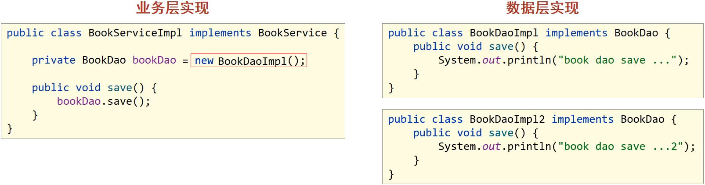

## Spring相关概念

### 初识Spring

在这一节，主要通过以下两个点来了解下Spring:

#### Spring家族

从[官网](https://spring.io)我们可以大概了解到：

- Spring能做什么:用以开发web、微服务以及分布式系统等,光这三块就已经占了JavaEE开发的九成多。
- Spring并不是单一的一个技术，而是一个大家族，可以从官网的`Projects`中查看其包含的所有技术。
- Spring发展到今天已经形成了一种开发的生态圈,Spring提供了若干个项目,每个项目用于完成特定的功能。
- Spring已形成了完整的生态圈，也就是说我们可以完全使用Spring技术完成整个项目的构建、设计与开发。
- Spring有若干个项目，可以根据需要自行选择，把这些个项目组合起来，起了一个名称叫全家桶，如下图所示

    


#### 了解Spring发展史

 接下来我们介绍下Spring Framework这个技术是如何来的呢?


Spring发展史

- IBM(IT公司-国际商业机器公司)在1997年提出了EJB思想,早期的JAVAEE开发大都基于该思想。
- Rod Johnson(Java和J2EE开发领域的专家)在2002年出版的`Expert One-on-One J2EE Design and Development`,书中有阐述在开发中使用EJB该如何做。
- Rod Johnson在2004年出版的`Expert One-on-One J2EE Development without EJB`,书中提出了比EJB思想更高效的实现方案，并且在同年将方案进行了具体的落地实现，这个实现就是Spring1.0。
- 随着时间推移，版本不断更新维护，目前最新的是Spring5
  - Spring1.0是纯配置文件开发
  - Spring2.0为了简化开发引入了注解开发，此时是配置文件加注解的开发方式
  - Spring3.0已经可以进行纯注解开发，使开发效率大幅提升，我们的课程会以注解开发为主
  - Spring4.0根据JDK的版本升级对个别API进行了调整
  - Spring5.0已经全面支持JDK8，现在Spring最新的是5系列所以建议大家把JDK安装成1.8版

### Spring系统架构

#### 系统架构图

- Spring Framework是Spring生态圈中最基础的项目，是其他项目的根基。

- Spring Framework的发展也经历了很多版本的变更，每个版本都有相应的调整

  

- Spring Framework的5版本目前没有最新的架构图，而最新的是4版本，所以接下来主要研究的是4的架构图

  

  (1)核心层

  - Core Container:核心容器，这个模块是Spring最核心的模块，其他的都需要依赖该模块

  (2)AOP层

  - AOP:面向切面编程，它依赖核心层容器，目的是在不改变原有代码的前提下对其进行功能增强
  - Aspects:Aspects是对AOP思想的具体实现

  (3)数据层

  - Data Access:数据访问，Spring全家桶中有对数据访问的具体实现技术
  - Data Integration:数据集成，Spring支持整合其他的数据层解决方案，比如Mybatis
  - Transactions:事务，Spring中事务管理是Spring AOP的一个具体实现，重点内容

  (4)Web层

  - 这一层的内容将在SpringMVC框架具体学习

  (5)Test层

  - Spring主要整合了Junit来完成单元测试和集成测试

#### 学习路线

- Spring的IOC/DI
- Spring的AOP
- AOP的具体应用,事务管理
- IOC/DI的具体应用,整合Mybatis


### Spring核心概念


在Spring核心概念这部分内容中主要包含`IOC/DI`、`IOC容器`和`Bean`,那么问题就来了，这些都是什么呢?

#### 目前项目中的问题

分析代码在编写过程中遇到的问题:



(1)业务层需要调用数据层的方法，就需要在业务层new数据层的对象

(2)如果数据层的实现类发生变化，那么业务层的代码也需要跟着改变，发生变更后，都需要进行编译打包和重部署

(3)所以，现在代码在编写的过程中存在的问题是：耦合度偏高

针对这个问题，该如何解决呢?


我们就想，如果能把框中的内容给去掉，不就可以降低依赖了么，但是又会引入新的问题，去掉以后程序能运行么?

答案肯定是不行，因为bookDao没有赋值为Null，强行运行就会出空指针异常。

所以现在的问题就是，业务层不想new对象，运行的时候又需要这个对象，该咋办呢?

针对这个问题，Spring就提出了一个解决方案:

- 使用对象时，在程序中不要主动使用new产生对象，转换为由外部提供对象

这种实现思就是Spring的一个核心概念

#### IOC、IOC容器、Bean、DI

1. IOC（Inversion of Control）控制反转

(1)什么是控制反转呢？

- 使用对象时，由主动new产生对象转换为由**外部提供对象**，此过程中对象创建控制权由程序转移到外部，此思想称为控制反转。

(2)Spring和IOC之间的关系是什么呢?

- Spring技术对IOC思想进行了实现
- Spring提供了一个容器，称为IOC容器，用来充当IOC思想中的"外部"
- IOC思想中的`别人外部`指的就是Spring的IOC容器

(3)IOC容器的作用以及内部存放的是什么?

- IOC容器负责对象的创建、初始化等一系列工作，其中包含了数据层和业务层的类对象
- 被创建或被管理的对象在IOC容器中统称为Bean
- IOC容器中放的就是一个个的Bean对象

(4)当IOC容器中创建好service和dao对象后，程序能正确执行么?

- 不行，因为service运行需要依赖dao对象
- IOC容器中虽然有service和dao对象
- 但是service对象和dao对象没有任何关系
- 需要把dao对象交给service,也就是说要**绑定service和dao对象之间的关系**

像这种在容器中建立对象与对象之间的绑定关系就要用到DI:

2. DI（Dependency Injection）依赖注入


(1)什么是依赖注入呢?

- 在容器中建立bean与bean之间的依赖关系的整个过程，称为依赖注入

(2)IOC容器中哪些bean之间要建立依赖关系呢?

- 这个需要程序员根据业务需求提前建立好关系，如业务层需要依赖数据层，service就要和dao建立依赖关系

介绍完Spring的IOC和DI的概念后，我们会发现这两个概念的最终目标就是:充分解耦，具体实现靠:

- 使用IOC容器管理bean(IOC)
- 在IOC容器内将有依赖关系的bean进行关系绑定（DI）
- 最终结果为:使用对象时不仅可以直接从IOC容器中获取，并且**获取到的bean已经绑定了所有的依赖关系**.

#### 核心概念小结

(1)什么IOC/DI思想?

- IOC:控制反转，控制反转的是对象的创建权
- DI:依赖注入，绑定对象与对象之间的依赖关系

(2)什么是IOC容器?

Spring创建了一个容器用来存放所创建的对象，这个容器就叫IOC容器

(3)什么是Bean?

容器中所存放的一个个对象就叫Bean或Bean对象


对于DI的入门案例，我们依然先`分析思路`然后再`代码实现`，

#### 入门案例思路分析

(1)要想实现依赖注入，必须要基于IOC管理Bean

- DI的入门案例要依赖于前面IOC的入门案例

(2)Service中使用new形式创建的Dao对象是否保留?

- 需要删除掉，最终要使用IOC容器中的bean对象

(3)Service中需要的Dao对象如何进入到Service中?

- 在Service中提供方法，让Spring的IOC容器可以通过该方法传入bean对象

(4)Service与Dao间的关系如何描述?

- 使用配置文件

#### 入门案例代码实现

> 需求:基于IOC入门案例，在BookServiceImpl类中删除new对象的方式，使用Spring的DI完成Dao层的注入
>
> 1.删除业务层中使用new的方式创建的dao对象
>
> 2.在业务层提供BookDao的setter方法
>
> 3.在配置文件中添加依赖注入的配置
>
> 4.运行程序调用方法

##### 步骤1: 去除代码中的new

在BookServiceImpl类中，删除业务层中使用new的方式创建的dao对象

```java
public class BookServiceImpl implements BookService {
    //删除业务层中使用new的方式创建的dao对象
    private BookDao bookDao;

    public void save() {
        System.out.println("book service save ...");
        bookDao.save();
    }
}
```

##### 步骤2:为属性提供setter方法

在BookServiceImpl类中,为BookDao提供setter方法

```java
public class BookServiceImpl implements BookService {
    //删除业务层中使用new的方式创建的dao对象
    private BookDao bookDao;

    public void save() {
        System.out.println("book service save ...");
        bookDao.save();
    }
    //提供对应的set方法
    public void setBookDao(BookDao bookDao) {
        this.bookDao = bookDao;
    }
}

```

##### 步骤3:修改配置完成注入

在配置文件中添加依赖注入的配置

```xml
<?xml version="1.0" encoding="UTF-8"?>
<beans xmlns="http://www.springframework.org/schema/beans"
       xmlns:xsi="http://www.w3.org/2001/XMLSchema-instance"
       xsi:schemaLocation="http://www.springframework.org/schema/beans http://www.springframework.org/schema/beans/spring-beans.xsd">
    <!--bean标签标示配置bean
    	id属性标示给bean起名字
    	class属性表示给bean定义类型
	-->
    <bean id="bookDao" class="com.itheima.dao.impl.BookDaoImpl"/>

    <bean id="bookService" class="com.itheima.service.impl.BookServiceImpl">
        <!--配置server与dao的关系-->
        <!--property标签表示配置当前bean的属性
        		name属性表示配置哪一个具体的属性
        		ref属性表示参照哪一个bean
		-->
        <property name="bookDao" ref="bookDao"/>
    </bean>

</beans>
```
:::tip
注意配置中的两个bookDao的含义是不一样的

- name="bookDao"中`bookDao`的作用是让Spring的IOC容器在获取到名称后，将首字母大写，前面加set找对应的`setBookDao()`方法进行对象注入(获取set方法)
- ref="bookDao"中`bookDao`的作用是让Spring能在IOC容器中找到id为`bookDao`的Bean对象给`bookService`进行注入
- 综上所述，对应关系如下:

:::


##### 步骤4:运行程序

运行，测试结果为：


## 入门案例

### IOC入门案例

对于入门案例，我们得先`分析思路`然后再`代码实现`

#### 入门案例思路分析

(1)Spring是使用容器来管理bean对象的，那么管什么? 

- 主要管理项目中所使用到的类对象，比如(Service和Dao)

(2)如何将被管理的对象告知IOC容器?

-  使用配置文件

(3)被管理的对象交给IOC容器，要想从容器中获取对象，就先得思考如何获取到IOC容器?

- Spring框架提供相应的接口

(4)IOC容器得到后，如何从容器中获取bean?

- 调用Spring框架提供对应接口中的方法

(5)使用Spring导入哪些坐标?

- 用别人的东西，就需要在pom.xml添加对应的依赖

#### 入门案例代码实现

> 需求分析:将BookServiceImpl和BookDaoImpl交给Spring管理，并从容器中获取对应的bean对象进行方法调用。
>
> 1.创建Maven的java项目
>
> 2.pom.xml添加Spring的依赖jar包
>
> 3.创建BookService,BookServiceImpl，BookDao和BookDaoImpl四个类
>
> 4.resources下添加spring配置文件，并完成bean的配置
>
> 5.使用Spring提供的接口完成IOC容器的创建
>
> 6.从容器中获取对象进行方法调用

##### 步骤1:创建Maven项目


##### 步骤2:添加Spring的依赖jar包

pom.xml

```xml
<dependencies>
    <dependency>
        <groupId>org.springframework</groupId>
        <artifactId>spring-context</artifactId>
        <version>5.2.10.RELEASE</version>
    </dependency>
    <dependency>
        <groupId>junit</groupId>
        <artifactId>junit</artifactId>
        <version>4.12</version>
        <scope>test</scope>
    </dependency>
</dependencies>
```

##### 步骤3:添加案例中需要的类

创建BookService,BookServiceImpl，BookDao和BookDaoImpl四个类

```java
public interface BookDao {
    public void save();
}
public class BookDaoImpl implements BookDao {
    public void save() {
        System.out.println("book dao save ...");
    }
}
public interface BookService {
    public void save();
}
public class BookServiceImpl implements BookService {
    private BookDao bookDao = new BookDaoImpl();
    public void save() {
        System.out.println("book service save ...");
        bookDao.save();
    }
}
```

##### 步骤4:添加spring配置文件

resources下添加spring配置文件applicationContext.xml，并完成bean的配置


##### 步骤5:在配置文件中完成bean的配置

```xml
<?xml version="1.0" encoding="UTF-8"?>
<beans xmlns="http://www.springframework.org/schema/beans"
       xmlns:xsi="http://www.w3.org/2001/XMLSchema-instance"
       xsi:schemaLocation="http://www.springframework.org/schema/beans http://www.springframework.org/schema/beans/spring-beans.xsd">
 
    <!--bean标签标示配置bean
    	id属性标示给bean起名字
    	class属性表示给bean定义类型
	-->
	<bean id="bookDao" class="com.wrm244.dao.impl.BookDaoImpl"/>
    <bean id="bookService" class="com.wrm244.service.impl.BookServiceImpl"/>

</beans>
```

**==注意事项：bean定义时id属性在同一个上下文中(配置文件)不能重复==**

##### 步骤6:获取IOC容器

使用Spring提供的接口完成IOC容器的创建，创建App类，编写main方法

```java
public class App {
    public static void main(String[] args) {
        //获取IOC容器
		ApplicationContext ctx = new ClassPathXmlApplicationContext("applicationContext.xml"); 
    }
}
```

##### 步骤7:从容器中获取对象进行方法调用

```java
public class App {
    public static void main(String[] args) {
        //获取IOC容器
		ApplicationContext ctx = new ClassPathXmlApplicationContext("applicationContext.xml"); 
//        BookDao bookDao = (BookDao) ctx.getBean("bookDao");
//        bookDao.save();
        BookService bookService = (BookService) ctx.getBean("bookService");
        bookService.save();
    }
}
```

##### 步骤8:运行程序

测试结果为：


Spring的IOC入门案例已经完成，但是在`BookServiceImpl`的类中依然存在`BookDaoImpl`对象的new操作，它们之间的耦合度还是比较高，这块该如何解决，就需要用到下面的`DI:依赖注入`。

### DI入门案例
