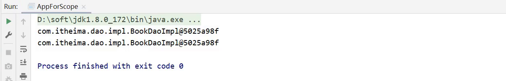
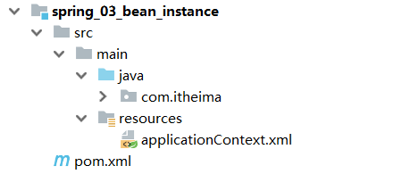
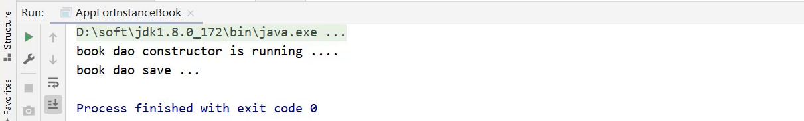
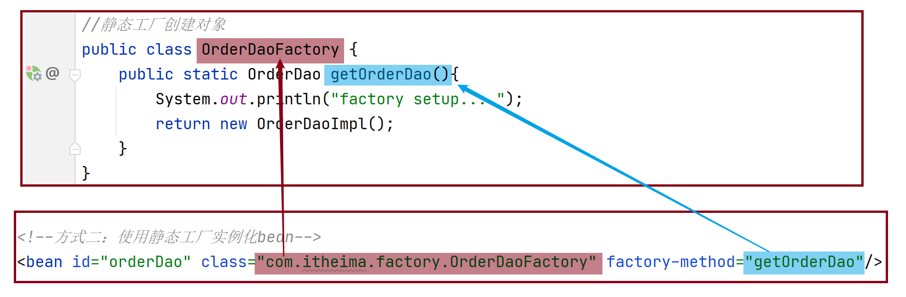
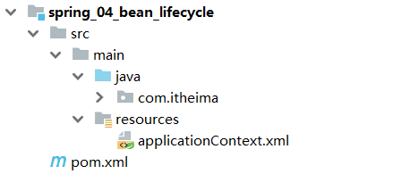
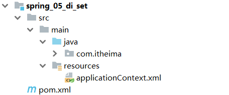
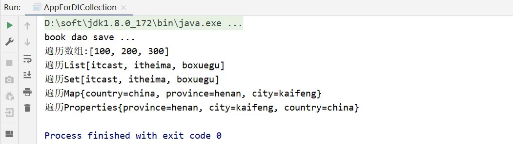

## IOC相关内容

通过前面两个案例，我们已经学习了`bean如何定义配置`，`DI如何定义配置`以及`容器对象如何获取`的内容，接下来主要是把这三块内容展开进行详细的讲解，深入的学习下这三部分的内容，首先是bean基础配置。

### bean基础配置

对于bean的配置中，主要会讲解`bean基础配置`,`bean的别名配置`,`bean的作用范围配置`(重点),这三部分内容：

#### bean基础配置(id与class)

对于bean的基础配置，在前面的案例中已经使用过:

```
<bean id="" class=""/>
```

其中，bean标签的功能、使用方式以及id和class属性的作用，我们通过一张图来描述下


这其中需要大家重点掌握的是:**bean标签的id和class属性的使用**。

**思考：**

- class属性能不能写接口如`BookDao`的类全名呢?

答案肯定是不行，因为接口是没办法创建对象的。

- 前面提过为bean设置id时，id必须唯一，但是如果由于命名习惯而产生了分歧后，该如何解决?

在解决这个问题之前，我们需要准备下开发环境，对于开发环境我们可以有两种解决方案:

- 使用前面IOC和DI的案例

- 重新搭建一个新的案例环境,目的是方便大家查阅代码

  - 搭建的内容和前面的案例是一样的，内容如下：

    

#### bean的name属性

环境准备好后，接下来就可以在这个环境的基础上来学习下bean的别名配置，

首先来看下别名的配置说明:


##### 步骤1：配置别名

打开spring的配置文件applicationContext.xml

```xml
<?xml version="1.0" encoding="UTF-8"?>
<beans xmlns="http://www.springframework.org/schema/beans"
       xmlns:xsi="http://www.w3.org/2001/XMLSchema-instance"
       xsi:schemaLocation="http://www.springframework.org/schema/beans http://www.springframework.org/schema/beans/spring-beans.xsd">

    <!--name:为bean指定别名，别名可以有多个，使用逗号，分号，空格进行分隔-->
    <bean id="bookService" name="service service4 bookEbi" class="com.wrm244.service.impl.BookServiceImpl">
        <property name="bookDao" ref="bookDao"/>
    </bean>

    <!--scope：为bean设置作用范围，可选值为单例singloton，非单例prototype-->
    <bean id="bookDao" name="dao" class="com.wrm244.dao.impl.BookDaoImpl"/>
</beans>
```

**说明:Ebi全称Enterprise Business Interface，翻译为企业业务接口**

##### 步骤2:根据名称容器中获取bean对象

```java
public class AppForName {
    public static void main(String[] args) {
        ApplicationContext ctx = new ClassPathXmlApplicationContext("applicationContext.xml");
        //此处根据bean标签的id属性和name属性的任意一个值来获取bean对象
        BookService bookService = (BookService) ctx.getBean("service4");
        bookService.save();
    }
}
```

##### 步骤3:运行程序

测试结果为：


注意事项:

- bean依赖注入的ref属性指定bean，必须在容器中存在

  

- 如果不存在,则会报错，如下:

  

  这个错误大家需要特别关注下:

  

  获取bean无论是通过id还是name获取，如果无法获取到，将抛出异常``NoSuchBeanDefinitionException``

#### bean作用范围scope配置

关于bean的作用范围是bean属性配置的一个重点内容。

看到这个作用范围，我们就得思考bean的作用范围是来控制bean哪块内容的?

我们先来看下`bean作用范围的配置属性`:


##### 验证IOC容器中对象是否为单例

###### 验证思路

​	同一个bean获取两次，将对象打印到控制台，看打印出的地址值是否一致。

###### 具体实现

- 创建一个AppForScope的类，在其main方法中来验证

  ```java
  public class AppForScope {
      public static void main(String[] args) {
          ApplicationContext ctx = new 
              ClassPathXmlApplicationContext("applicationContext.xml");
  
          BookDao bookDao1 = (BookDao) ctx.getBean("bookDao");
          BookDao bookDao2 = (BookDao) ctx.getBean("bookDao");
          System.out.println(bookDao1);
          System.out.println(bookDao2);
      }
  }
  ```

- 打印，观察控制台的打印结果

  

- 结论:默认情况下，Spring创建的bean对象都是单例的

获取到结论后，问题就来了，那如果我想创建出来非单例的bean对象，该如何实现呢?

##### 配置bean为非单例

在Spring配置文件中，配置scope属性来实现bean的非单例创建

- 在Spring的配置文件中，修改`<bean>`的scope属性

  ```xml
  <bean id="bookDao" name="dao" class="com.wrm244.dao.impl.BookDaoImpl" scope=""/>
  ```

- 将scope设置为`singleton`

  ```xml
  <bean id="bookDao" name="dao" class="com.wrm244.dao.impl.BookDaoImpl" scope="singleton"/>
  ```

  运行AppForScope，打印看结果

  

- 将scope设置为`prototype`

  ```
  <bean id="bookDao" name="dao" class="com.wrm244.dao.impl.BookDaoImpl" scope="prototype"/>
  ```

  运行AppForScope，打印看结果

  

- 结论，使用bean的`scope`属性可以控制bean的创建是否为单例：

  - `singleton`默认为单例
  - `prototype`为原型

##### scope使用后续思考

介绍完`scope`属性以后，我们来思考几个问题:

- 为什么bean默认为单例?
  - bean为单例的意思是在Spring的IOC容器中只会有该类的一个对象
  - bean对象只有一个就避免了对象的频繁创建与销毁，达到了bean对象的复用，性能高
- bean在容器中是单例的，会不会产生线程安全问题?
  - 如果对象是有状态对象，即该对象有成员变量可以用来存储数据的，
  - 因为所有请求线程共用一个bean对象，所以会存在线程安全问题。
  - 如果对象是无状态对象，即该对象没有成员变量没有进行数据存储的，
  - 因方法中的局部变量在方法调用完成后会被销毁，所以不会存在线程安全问题。
- 哪些bean对象适合交给容器进行管理?
  - 表现层对象
  - 业务层对象
  - 数据层对象
  - 工具对象
- 哪些bean对象不适合交给容器进行管理?
  - 封装实例的域对象，因为会引发线程安全问题，所以不适合。

#### bean基础配置小结

关于bean的基础配置中，需要大家掌握以下属性:


### bean实例化

对象已经能交给Spring的IOC容器来创建了，但是容器是如何来创建对象的呢?

就需要研究下`bean的实例化过程`，在这块内容中主要解决两部分内容，分别是

- bean是如何创建的
- 实例化bean的三种方式，`构造方法`,`静态工厂`和`实例工厂`

在讲解这三种创建方式之前，我们需要先确认一件事:

bean本质上就是对象，对象在new的时候会使用构造方法完成，那创建bean也是使用构造方法完成的。

基于这个知识点出发，我们来验证spring中bean的三种创建方式，

#### 环境准备

为了方便大家阅读代码，重新准备个开发环境，

- 创建一个Maven项目
- pom.xml添加依赖
- resources下添加spring的配置文件applicationContext.xml

这些步骤和前面的都一致，大家可以快速的拷贝即可，最终项目的结构如下:



#### 构造方法实例化

在上述的环境下，我们来研究下Spring中的第一种bean的创建方式`构造方法实例化`:

##### 步骤1:准备需要被创建的类

准备一个BookDao和BookDaoImpl类

```java

public interface BookDao {
    public void save();
}

public class BookDaoImpl implements BookDao {
    public void save() {
        System.out.println("book dao save ...");
    }

}
```

##### 步骤2:将类配置到Spring容器

```xml
<?xml version="1.0" encoding="UTF-8"?>
<beans xmlns="http://www.springframework.org/schema/beans"
       xmlns:xsi="http://www.w3.org/2001/XMLSchema-instance"
       xsi:schemaLocation="http://www.springframework.org/schema/beans http://www.springframework.org/schema/beans/spring-beans.xsd">

	<bean id="bookDao" class="com.wrm244.dao.impl.BookDaoImpl"/>

</beans>
```

##### 步骤3:编写运行程序

```java
public class AppForInstanceBook {
    public static void main(String[] args) {
        ApplicationContext ctx = new 
            ClassPathXmlApplicationContext("applicationContext.xml");
        BookDao bookDao = (BookDao) ctx.getBean("bookDao");
        bookDao.save();

    }
}
```

##### 步骤4:类中提供构造函数测试

在BookDaoImpl类中添加一个无参构造函数，并打印一句话，方便观察结果。

```java
public class BookDaoImpl implements BookDao {
    public BookDaoImpl() {
        System.out.println("book dao constructor is running ....");
    }
    public void save() {
        System.out.println("book dao save ...");
    }

}
```

运行程序，如果控制台有打印构造函数中的输出，说明Spring容器在创建对象的时候也走的是构造函数



##### 步骤5:将构造函数改成private测试

```java
public class BookDaoImpl implements BookDao {
    private BookDaoImpl() {
        System.out.println("book dao constructor is running ....");
    }
    public void save() {
        System.out.println("book dao save ...");
    }

}
```

运行程序，能执行成功,说明内部走的依然是构造函数,能访问到类中的私有构造方法,显而易见Spring底层用的是反射


##### 步骤6:构造函数中添加一个参数测试

```java
public class BookDaoImpl implements BookDao {
    private BookDaoImpl(int i) {
        System.out.println("book dao constructor is running ....");
    }
    public void save() {
        System.out.println("book dao save ...");
    }

}
```

运行程序，

程序会报错，说明Spring底层使用的是类的无参构造方法。


#### 分析Spring的错误信息

接下来，我们主要研究下Spring的报错信息来学一学如阅读。

- 错误信息从下往上依次查看，因为上面的错误大都是对下面错误的一个包装，最核心错误是在最下面
- Caused by: java.lang.NoSuchMethodException: com.wrm244.dao.impl.BookDaoImpl.`<init>`()
  - Caused by 翻译为`引起`，即出现错误的原因
  - java.lang.NoSuchMethodException:抛出的异常为`没有这样的方法异常`
  - com.wrm244.dao.impl.BookDaoImpl.`<init>`():哪个类的哪个方法没有被找到导致的异常，`<init>`()指定是类的构造方法，即该类的无参构造方法

如果最后一行错误获取不到错误信息，接下来查看第二层:

Caused by: org.springframework.beans.BeanInstantiationException: Failed to instantiate [com.wrm244.dao.impl.BookDaoImpl]: No default constructor found; nested exception is java.lang.NoSuchMethodException: com.wrm244.dao.impl.BookDaoImpl.`<init>`()

- nested:嵌套的意思，后面的异常内容和最底层的异常是一致的
- Caused by: org.springframework.beans.BeanInstantiationException: Failed to instantiate [com.wrm244.dao.impl.BookDaoImpl]: No default constructor found; 
  - Caused by: `引发`
  - BeanInstantiationException:翻译为`bean实例化异常`
  - No default constructor found:没有一个默认的构造函数被发现

看到这其实错误已经比较明显，给大家个练习，把倒数第三层的错误分析下吧:

Exception in thread "main" org.springframework.beans.factory.BeanCreationException: Error creating bean with name 'bookDao' defined in class path resource [applicationContext.xml]: Instantiation of bean failed; nested exception is org.springframework.beans.BeanInstantiationException: Failed to instantiate [com.wrm244.dao.impl.BookDaoImpl]: No default constructor found; nested exception is java.lang.NoSuchMethodException: com.wrm244.dao.impl.BookDaoImpl.`<init>`()。

至此，关于Spring的构造方法实例化就已经学习完了，因为每一个类默认都会提供一个无参构造函数，所以其实真正在使用这种方式的时候，我们什么也不需要做。这也是我们以后比较常用的一种方式。

#### 静态工厂实例化

接下来研究Spring中的第二种bean的创建方式`静态工厂实例化`:

##### 工厂方式创建bean

在讲这种方式之前，我们需要先回顾一个知识点是使用工厂来创建对象的方式:

(1)准备一个OrderDao和OrderDaoImpl类

```java
public interface OrderDao {
    public void save();
}

public class OrderDaoImpl implements OrderDao {
    public void save() {
        System.out.println("order dao save ...");
    }
}
```

(2)创建一个工厂类OrderDaoFactory并提供一个静态方法

```java
//静态工厂创建对象
public class OrderDaoFactory {
    public static OrderDao getOrderDao(){
        return new OrderDaoImpl();
    }
}
```

(3)编写AppForInstanceOrder运行类，在类中通过工厂获取对象

```java
public class AppForInstanceOrder {
    public static void main(String[] args) {
        //通过静态工厂创建对象
        OrderDao orderDao = OrderDaoFactory.getOrderDao();
        orderDao.save();
    }
}
```

(4)运行后，可以查看到结果


如果代码中对象是通过上面的这种方式来创建的，如何将其交给Spring来管理呢?

##### 静态工厂实例化

这就要用到Spring中的静态工厂实例化的知识了，具体实现步骤为:

(1)在spring的配置文件application.properties中添加以下内容:

```xml
<bean id="orderDao" class="com.wrm244.factory.OrderDaoFactory" factory-method="getOrderDao"/>
```

class:工厂类的类全名

factory-mehod:具体工厂类中创建对象的方法名

对应关系如下图:



(2)在AppForInstanceOrder运行类，使用从IOC容器中获取bean的方法进行运行测试

```java
public class AppForInstanceOrder {
    public static void main(String[] args) {
        ApplicationContext ctx = new ClassPathXmlApplicationContext("applicationContext.xml");

        OrderDao orderDao = (OrderDao) ctx.getBean("orderDao");

        orderDao.save();

    }
}
```

(3)运行后，可以查看到结果


看到这，可能有人会问了，你这种方式在工厂类中不也是直接new对象的，和我自己直接new没什么太大的区别，而且静态工厂的方式反而更复杂，这种方式的意义是什么?

主要的原因是:

- 在工厂的静态方法中，我们除了new对象还可以做其他的一些业务操作，这些操作必不可少,如:

```java
public class OrderDaoFactory {
    public static OrderDao getOrderDao(){
        System.out.println("factory setup....");//模拟必要的业务操作
        return new OrderDaoImpl();
    }
}
```

之前new对象的方式就无法添加其他的业务内容，重新运行，查看结果:


介绍完静态工厂实例化后，这种方式一般是用来兼容早期的一些老系统，所以了解为主。

#### 实例工厂与FactoryBean

接下来继续来研究Spring的第三种bean的创建方式`实例工厂实例化`:

##### 环境准备

(1)准备一个UserDao和UserDaoImpl类

```java
public interface UserDao {
    public void save();
}

public class UserDaoImpl implements UserDao {

    public void save() {
        System.out.println("user dao save ...");
    }
}
```

(2)创建一个工厂类OrderDaoFactory并提供一个普通方法，注意此处和静态工厂的工厂类不一样的地方是方法不是静态方法

```java
public class UserDaoFactory {
    public UserDao getUserDao(){
        return new UserDaoImpl();
    }
}
```

(3)编写AppForInstanceUser运行类，在类中通过工厂获取对象

```java
public class AppForInstanceUser {
    public static void main(String[] args) {
        //创建实例工厂对象
        UserDaoFactory userDaoFactory = new UserDaoFactory();
        //通过实例工厂对象创建对象
        UserDao userDao = userDaoFactory.getUserDao();
        userDao.save();
}
```

(4)运行后，可以查看到结果


对于上面这种实例工厂的方式如何交给Spring管理呢?

##### 实例工厂实例化

具体实现步骤为:

(1)在spring的配置文件中添加以下内容:

```xml
<bean id="userFactory" class="com.wrm244.factory.UserDaoFactory"/>
<bean id="userDao" factory-method="getUserDao" factory-bean="userFactory"/>
```

实例化工厂运行的顺序是:

- 创建实例化工厂对象,对应的是第一行配置

- 调用对象中的方法来创建bean，对应的是第二行配置

  - factory-bean:工厂的实例对象

  - factory-method:工厂对象中的具体创建对象的方法名,对应关系如下:

    

factory-mehod:具体工厂类中创建对象的方法名

(2)在AppForInstanceUser运行类，使用从IOC容器中获取bean的方法进行运行测试

```java
public class AppForInstanceUser {
    public static void main(String[] args) {
        ApplicationContext ctx = new 
            ClassPathXmlApplicationContext("applicationContext.xml");
        UserDao userDao = (UserDao) ctx.getBean("userDao");
        userDao.save();
    }
}
```

(3)运行后，可以查看到结果


实例工厂实例化的方式就已经介绍完了，配置的过程还是比较复杂，所以Spring为了简化这种配置方式就提供了一种叫`FactoryBean`的方式来简化开发。

##### FactoryBean的使用

具体的使用步骤为:

(1)创建一个UserDaoFactoryBean的类，实现FactoryBean接口，重写接口的方法

```java
public class UserDaoFactoryBean implements FactoryBean<UserDao> {
    //代替原始实例工厂中创建对象的方法
    public UserDao getObject() throws Exception {
        return new UserDaoImpl();
    }
    //返回所创建类的Class对象
    public Class<?> getObjectType() {
        return UserDao.class;
    }
}
```

(2)在Spring的配置文件中进行配置

```xml
<bean id="userDao" class="com.wrm244.factory.UserDaoFactoryBean"/>
```

(3)AppForInstanceUser运行类不用做任何修改，直接运行


这种方式在Spring去整合其他框架的时候会被用到，所以这种方式需要大家理解掌握。

查看源码会发现，FactoryBean接口其实会有三个方法，分别是:

```java
T getObject() throws Exception;

Class<?> getObjectType();

default boolean isSingleton() {
		return true;
}
```

方法一:getObject()，被重写后，在方法中进行对象的创建并返回

方法二:getObjectType(),被重写后，主要返回的是被创建类的Class对象

方法三:没有被重写，因为它已经给了默认值，从方法名中可以看出其作用是设置对象是否为单例，默认true，从意思上来看，我们猜想默认应该是单例，如何来验证呢?

思路很简单，就是从容器中获取该对象的多个值，打印到控制台，查看是否为同一个对象。

```java
public class AppForInstanceUser {
    public static void main(String[] args) {
        ApplicationContext ctx = new 
            ClassPathXmlApplicationContext("applicationContext.xml");
        UserDao userDao1 = (UserDao) ctx.getBean("userDao");
        UserDao userDao2 = (UserDao) ctx.getBean("userDao");
        System.out.println(userDao1);
        System.out.println(userDao2);
    }
}
```

打印结果，如下:


通过验证，会发现默认是单例，那如果想改成单例具体如何实现?

只需要将isSingleton()方法进行重写，修改返回为false，即可

```java
//FactoryBean创建对象
public class UserDaoFactoryBean implements FactoryBean<UserDao> {
    //代替原始实例工厂中创建对象的方法
    public UserDao getObject() throws Exception {
        return new UserDaoImpl();
    }

    public Class<?> getObjectType() {
        return UserDao.class;
    }

    public boolean isSingleton() {
        return false;
    }
}
```

重新运行AppForInstanceUser，查看结果


从结果中可以看出现在已经是非单例了，但是一般情况下我们都会采用单例，也就是采用默认即可。所以isSingleton()方法一般不需要进行重写。

#### bean实例化小结

通过这一节的学习，需要掌握:

(1)bean是如何创建的呢?

```
构造方法
```

(2)Spring的IOC实例化对象的三种方式分别是:

- 构造方法(常用)
- 静态工厂(了解)
- 实例工厂(了解)
  - FactoryBean(实用)

这些方式中，重点掌握`构造方法`和`FactoryBean`即可。

需要注意的一点是，构造方法在类中默认会提供，但是如果重写了构造方法，默认的就会消失，在使用的过程中需要注意，如果需要重写构造方法，最好把默认的构造方法也重写下。

### bean的生命周期

关于bean的相关知识还有最后一个是`bean的生命周期`,对于生命周期，我们主要围绕着`bean生命周期控制`来讲解:

- 首先理解下什么是生命周期?
  - 从创建到消亡的完整过程,例如人从出生到死亡的整个过程就是一个生命周期。
- bean生命周期是什么?
  - bean对象从创建到销毁的整体过程。
- bean生命周期控制是什么?
  - 在bean创建后到销毁前做一些事情。

现在我们面临的问题是如何在bean的创建之后和销毁之前把我们需要添加的内容添加进去。

#### 环境准备

还是老规矩，为了方便大家后期代码的阅读，我们重新搭建下环境:

- 创建一个Maven项目
- pom.xml添加依赖
- resources下添加spring的配置文件applicationContext.xml

这些步骤和前面的都一致，大家可以快速的拷贝即可，最终项目的结构如下:



(1)项目中添加BookDao、BookDaoImpl、BookService和BookServiceImpl类

```java
public interface BookDao {
    public void save();
}

public class BookDaoImpl implements BookDao {
    public void save() {
        System.out.println("book dao save ...");
    }
}

public interface BookService {
    public void save();
}

public class BookServiceImpl implements BookService{
    private BookDao bookDao;

    public void setBookDao(BookDao bookDao) {
        this.bookDao = bookDao;
    }

    public void save() {
        System.out.println("book service save ...");
        bookDao.save();
    }
}
```

(2)resources下提供spring的配置文件

```xml
<?xml version="1.0" encoding="UTF-8"?>
<beans xmlns="http://www.springframework.org/schema/beans"
       xmlns:xsi="http://www.w3.org/2001/XMLSchema-instance"
       xsi:schemaLocation="http://www.springframework.org/schema/beans http://www.springframework.org/schema/beans/spring-beans.xsd">

    <bean id="bookDao" class="com.wrm244.dao.impl.BookDaoImpl"/>
</beans>
```

(3)编写AppForLifeCycle运行类，加载Spring的IOC容器，并从中获取对应的bean对象

```java
public class AppForLifeCycle {
    public static void main( String[] args ) {
        ApplicationContext ctx = new 
        	ClassPathXmlApplicationContext("applicationContext.xml");
        BookDao bookDao = (BookDao) ctx.getBean("bookDao");
        bookDao.save();
    }
}
```

#### 生命周期设置

接下来，在上面这个环境中来为BookDao添加生命周期的控制方法，具体的控制有两个阶段:

- bean创建之后，想要添加内容，比如用来初始化需要用到资源
- bean销毁之前，想要添加内容，比如用来释放用到的资源

##### 步骤1:添加初始化和销毁方法

针对这两个阶段，我们在BooDaoImpl类中分别添加两个方法，方法名任意

```java
public class BookDaoImpl implements BookDao {
    public void save() {
        System.out.println("book dao save ...");
    }
    //表示bean初始化对应的操作
    public void init(){
        System.out.println("init...");
    }
    //表示bean销毁前对应的操作
    public void destory(){
        System.out.println("destory...");
    }
}
```

##### 步骤2:配置生命周期

在配置文件添加配置，如下:

```xml
<bean id="bookDao" class="com.wrm244.dao.impl.BookDaoImpl" init-method="init" destroy-method="destory"/>
```

##### 步骤3:运行程序

运行AppForLifeCycle打印结果为:


从结果中可以看出，init方法执行了，但是destroy方法却未执行，这是为什么呢?

- Spring的IOC容器是运行在JVM中
- 运行main方法后,JVM启动,Spring加载配置文件生成IOC容器,从容器获取bean对象，然后调方法执行
- main方法执行完后，JVM退出，这个时候IOC容器中的bean还没有来得及销毁就已经结束了
- 所以没有调用对应的destroy方法

知道了出现问题的原因，具体该如何解决呢?

#### close关闭容器

- ApplicationContext中没有close方法

- 需要将ApplicationContext更换成ClassPathXmlApplicationContext

  ```java
  ClassPathXmlApplicationContext ctx = new 
      ClassPathXmlApplicationContext("applicationContext.xml");
  ```

- 调用ctx的close()方法

  ```
  ctx.close();
  ```

- 运行程序，就能执行destroy方法的内容

  

#### 注册钩子关闭容器

- 在容器未关闭之前，提前设置好回调函数，让JVM在退出之前回调此函数来关闭容器

- 调用ctx的registerShutdownHook()方法

  ```
  ctx.registerShutdownHook();
  ```

  **注意:** registerShutdownHook在ApplicationContext中也没有

- 运行后，查询打印结果

  

两种方式介绍完后，close和registerShutdownHook选哪个?

相同点:这两种都能用来关闭容器

不同点:close()是在调用的时候关闭，registerShutdownHook()是在JVM退出前调用关闭。

分析上面的实现过程，会发现添加初始化和销毁方法，即需要编码也需要配置，实现起来步骤比较多也比较乱。

Spring提供了两个接口来完成生命周期的控制，好处是可以不用再进行配置`init-method`和`destroy-method`

接下来在BookServiceImpl完成这两个接口的使用:

修改BookServiceImpl类，添加两个接口`InitializingBean`， `DisposableBean`并实现接口中的两个方法`afterPropertiesSet`和`destroy`

```java
public class BookServiceImpl implements BookService, InitializingBean, DisposableBean {
    private BookDao bookDao;
    public void setBookDao(BookDao bookDao) {
        this.bookDao = bookDao;
    }
    public void save() {
        System.out.println("book service save ...");
        bookDao.save(); 
    }
    public void destroy() throws Exception {
        System.out.println("service destroy");
    }
    public void afterPropertiesSet() throws Exception {
        System.out.println("service init");
    }
}
```

重新运行AppForLifeCycle类，


那第二种方式的实现，我们也介绍完了。

**小细节**

- 对于InitializingBean接口中的afterPropertiesSet方法，翻译过来为`属性设置之后`。

- 对于BookServiceImpl来说，bookDao是它的一个属性

- setBookDao方法是Spring的IOC容器为其注入属性的方法

- 思考:afterPropertiesSet和setBookDao谁先执行?

  - 从方法名分析，猜想应该是setBookDao方法先执行

  - 验证思路，在setBookDao方法中添加一句话

    ```java
    public void setBookDao(BookDao bookDao) {
            System.out.println("set .....");
            this.bookDao = bookDao;
        }
    
    ```

  - 重新运行AppForLifeCycle，打印结果如下:

    

    验证的结果和我们猜想的结果是一致的，所以初始化方法会在类中属性设置之后执行。

#### bean生命周期小结

(1)关于Spring中对bean生命周期控制提供了两种方式:

- 在配置文件中的bean标签中添加`init-method`和`destroy-method`属性
- 类实现`InitializingBean`与`DisposableBean`接口，这种方式了解下即可。

(2)对于bean的生命周期控制在bean的整个生命周期中所处的位置如下:

- 初始化容器
  - 1.创建对象(内存分配)
  - 2.执行构造方法
  - 3.执行属性注入(set操作)
  - 4.执行bean初始化方法
- 使用bean
  - 1.执行业务操作
- 关闭/销毁容器
  - 1.执行bean销毁方法

(3)关闭容器的两种方式:

- ConfigurableApplicationContext是ApplicationContext的子类
  - close()方法
  - registerShutdownHook()方法

## DI相关内容

前面我们已经完成了bean相关操作的讲解，接下来就进入第二个大的模块`DI依赖注入`，首先来介绍下Spring中有哪些注入方式?

我们先来思考

- 向一个类中传递数据的方式有几种?
  - 普通方法(set方法)
  - 构造方法
- 依赖注入描述了在容器中建立bean与bean之间的依赖关系的过程，如果bean运行需要的是数字或字符串呢?
  - 引用类型
  - 简单类型(基本数据类型与String)

Spring就是基于上面这些知识点，为我们提供了两种注入方式，分别是:

- setter注入
  - 简单类型
  - 引用类型
- 构造器注入
  - 简单类型
  - 引用类型

依赖注入的方式已经介绍完，接下来挨个学习下:

### setter注入

1. 对于setter方式注入引用类型的方式之前已经学习过，快速回顾下:

- 在bean中定义引用类型属性，并提供可访问的set方法

```java
public class BookServiceImpl implements BookService {
    private BookDao bookDao;
    public void setBookDao(BookDao bookDao) {
        this.bookDao = bookDao;
    }
}
```

- 配置中使用property标签ref属性注入引用类型对象

```xml
<bean id="bookService" class="com.wrm244.service.impl.BookServiceImpl">
	<property name="bookDao" ref="bookDao"/>
</bean>

<bean id="bookDao" class="com.wrm244.dao.imipl.BookDaoImpl"/>
```

#### 环境准备

为了更好的学习下面内容，我们依旧准备一个新环境:

- 创建一个Maven项目
- pom.xml添加依赖
- resources下添加spring的配置文件

这些步骤和前面的都一致，大家可以快速的拷贝即可，最终项目的结构如下:



(1)项目中添加BookDao、BookDaoImpl、UserDao、UserDaoImpl、BookService和BookServiceImpl类

```java
public interface BookDao {
    public void save();
}

public class BookDaoImpl implements BookDao {
    public void save() {
        System.out.println("book dao save ...");
    }
}
public interface UserDao {
    public void save();
}
public class UserDaoImpl implements UserDao {
    public void save() {
        System.out.println("user dao save ...");
    }
}

public interface BookService {
    public void save();
}

public class BookServiceImpl implements BookService{
    private BookDao bookDao;

    public void setBookDao(BookDao bookDao) {
        this.bookDao = bookDao;
    }

    public void save() {
        System.out.println("book service save ...");
        bookDao.save();
    }
}
```

(2)resources下提供spring的配置文件

```xml
<?xml version="1.0" encoding="UTF-8"?>
<beans xmlns="http://www.springframework.org/schema/beans"
       xmlns:xsi="http://www.w3.org/2001/XMLSchema-instance"
       xsi:schemaLocation="http://www.springframework.org/schema/beans http://www.springframework.org/schema/beans/spring-beans.xsd">

    <bean id="bookDao" class="com.wrm244.dao.impl.BookDaoImpl"/>
    <bean id="bookService" class="com.wrm244.service.impl.BookServiceImpl">
        <property name="bookDao" ref="bookDao"/>
    </bean>
</beans>
```

(3)编写AppForDISet运行类，加载Spring的IOC容器，并从中获取对应的bean对象

```java
public class AppForDISet {
    public static void main( String[] args ) {
        ApplicationContext ctx = new ClassPathXmlApplicationContext("applicationContext.xml");
        BookService bookService = (BookService) ctx.getBean("bookService");
        bookService.save();
    }
}
```

接下来，在上面这个环境中来完成setter注入的学习:

#### 注入引用数据类型

> 需求:在bookServiceImpl对象中注入userDao
>
> 1.在BookServiceImpl中声明userDao属性
>
> 2.为userDao属性提供setter方法
>
> 3.在配置文件中使用property标签注入

##### 步骤1:声明属性并提供setter方法

在BookServiceImpl中声明userDao属性，并提供setter方法

```java
public class BookServiceImpl implements BookService{
    private BookDao bookDao;
    private UserDao userDao;
    
    public void setUserDao(UserDao userDao) {
        this.userDao = userDao;
    }
    public void setBookDao(BookDao bookDao) {
        this.bookDao = bookDao;
    }

    public void save() {
        System.out.println("book service save ...");
        bookDao.save();
        userDao.save();
    }
}
```

##### 步骤2:配置文件中进行注入配置

在applicationContext.xml配置文件中使用property标签注入

```xml
<?xml version="1.0" encoding="UTF-8"?>
<beans xmlns="http://www.springframework.org/schema/beans"
       xmlns:xsi="http://www.w3.org/2001/XMLSchema-instance"
       xsi:schemaLocation="http://www.springframework.org/schema/beans http://www.springframework.org/schema/beans/spring-beans.xsd">

    <bean id="bookDao" class="com.wrm244.dao.impl.BookDaoImpl"/>
    <bean id="userDao" class="com.wrm244.dao.impl.UserDaoImpl"/>
    <bean id="bookService" class="com.wrm244.service.impl.BookServiceImpl">
        <property name="bookDao" ref="bookDao"/>
        <property name="userDao" ref="userDao"/>
    </bean>
</beans>
```

##### 步骤3:运行程序

运行AppForDISet类，查看结果，说明userDao已经成功注入。


#### 注入简单数据类型

> 需求：给BookDaoImpl注入一些简单数据类型的数据
>
> 参考引用数据类型的注入，我们可以推出具体的步骤为:
>
> 1.在BookDaoImpl类中声明对应的简单数据类型的属性
>
> 2.为这些属性提供对应的setter方法
>
> 3.在applicationContext.xml中配置

**思考:**

引用类型使用的是`<property name="" ref=""/>`,简单数据类型还是使用ref么?

ref是指向Spring的IOC容器中的另一个bean对象的，对于简单数据类型，没有对应的bean对象，该如何配置?

##### 步骤1:声明属性并提供setter方法

在BookDaoImpl类中声明对应的简单数据类型的属性,并提供对应的setter方法

```java
public class BookDaoImpl implements BookDao {

    private String databaseName;
    private int connectionNum;

    public void setConnectionNum(int connectionNum) {
        this.connectionNum = connectionNum;
    }

    public void setDatabaseName(String databaseName) {
        this.databaseName = databaseName;
    }

    public void save() {
        System.out.println("book dao save ..."+databaseName+","+connectionNum);
    }
}
```

##### 步骤2:配置文件中进行注入配置

在applicationContext.xml配置文件中使用property标签注入

```xml
<?xml version="1.0" encoding="UTF-8"?>
<beans xmlns="http://www.springframework.org/schema/beans"
       xmlns:xsi="http://www.w3.org/2001/XMLSchema-instance"
       xsi:schemaLocation="http://www.springframework.org/schema/beans http://www.springframework.org/schema/beans/spring-beans.xsd">

    <bean id="bookDao" class="com.wrm244.dao.impl.BookDaoImpl">
        <property name="databaseName" value="mysql"/>
     	<property name="connectionNum" value="10"/>
    </bean>
    <bean id="userDao" class="com.wrm244.dao.impl.UserDaoImpl"/>
    <bean id="bookService" class="com.wrm244.service.impl.BookServiceImpl">
        <property name="bookDao" ref="bookDao"/>
        <property name="userDao" ref="userDao"/>
    </bean>
</beans>
```

**说明:**

value:后面跟的是简单数据类型，对于参数类型，Spring在注入的时候会自动转换，但是不能写成

```xml
<property name="connectionNum" value="abc"/>
```

这样的话，spring在将`abc`转换成int类型的时候就会报错。

##### 步骤3:运行程序

运行AppForDISet类，查看结果，说明userDao已经成功注入。


**注意:** 两个property注入标签的顺序可以任意。

对于setter注入方式的基本使用就已经介绍完了，

- 对于引用数据类型使用的是`<property name="" ref=""/>`
- 对于简单数据类型使用的是`<property name="" value=""/>`

### 构造器注入

#### 环境准备

构造器注入也就是构造方法注入，学习之前，还是先准备下环境:

- 创建一个Maven项目
- pom.xml添加依赖
- resources下添加spring的配置文件

这些步骤和前面的都一致，大家可以快速的拷贝即可，最终项目的结构如下:


(1)项目中添加BookDao、BookDaoImpl、UserDao、UserDaoImpl、BookService和BookServiceImpl类

```java
public interface BookDao {
    public void save();
}

public class BookDaoImpl implements BookDao {
    
    private String databaseName;
    private int connectionNum;
    
    public void save() {
        System.out.println("book dao save ...");
    }
}
public interface UserDao {
    public void save();
}
public class UserDaoImpl implements UserDao {
    public void save() {
        System.out.println("user dao save ...");
    }
}

public interface BookService {
    public void save();
}

public class BookServiceImpl implements BookService{
    private BookDao bookDao;

    public void setBookDao(BookDao bookDao) {
        this.bookDao = bookDao;
    }

    public void save() {
        System.out.println("book service save ...");
        bookDao.save();
    }
}
```

(2)resources下提供spring的配置文件

```xml
<?xml version="1.0" encoding="UTF-8"?>
<beans xmlns="http://www.springframework.org/schema/beans"
       xmlns:xsi="http://www.w3.org/2001/XMLSchema-instance"
       xsi:schemaLocation="http://www.springframework.org/schema/beans http://www.springframework.org/schema/beans/spring-beans.xsd">

    <bean id="bookDao" class="com.wrm244.dao.impl.BookDaoImpl"/>
    <bean id="bookService" class="com.wrm244.service.impl.BookServiceImpl">
        <property name="bookDao" ref="bookDao"/>
    </bean>
</beans>
```

(3)编写AppForDIConstructor运行类，加载Spring的IOC容器，并从中获取对应的bean对象

```java
public class AppForDIConstructor {
    public static void main( String[] args ) {
        ApplicationContext ctx = new ClassPathXmlApplicationContext("applicationContext.xml");
        BookService bookService = (BookService) ctx.getBean("bookService");
        bookService.save();
    }
}
```

#### 构造器注入引用数据类型

接下来，在上面这个环境中来完成构造器注入的学习:

> 需求：将BookServiceImpl类中的bookDao修改成使用构造器的方式注入。
>
> 1.将bookDao的setter方法删除掉
>
> 2.添加带有bookDao参数的构造方法
>
> 3.在applicationContext.xml中配置

##### 步骤1:删除setter方法并提供构造方法

在BookServiceImpl类中将bookDao的setter方法删除掉,并添加带有bookDao参数的构造方法

```java
public class BookServiceImpl implements BookService{
    private BookDao bookDao;

    public BookServiceImpl(BookDao bookDao) {
        this.bookDao = bookDao;
    }

    public void save() {
        System.out.println("book service save ...");
        bookDao.save();
    }
}
```

##### 步骤2:配置文件中进行配置构造方式注入

在applicationContext.xml中配置

```xml
<?xml version="1.0" encoding="UTF-8"?>
<beans xmlns="http://www.springframework.org/schema/beans"
       xmlns:xsi="http://www.w3.org/2001/XMLSchema-instance"
       xsi:schemaLocation="http://www.springframework.org/schema/beans http://www.springframework.org/schema/beans/spring-beans.xsd">

    <bean id="bookDao" class="com.wrm244.dao.impl.BookDaoImpl"/>
    <bean id="bookService" class="com.wrm244.service.impl.BookServiceImpl">
        <constructor-arg name="bookDao" ref="bookDao"/>
    </bean>
</beans>
```

**说明:**

标签``<constructor-arg>``中

- name属性对应的值为构造函数中方法形参的参数名，必须要保持一致。

- ref属性指向的是spring的IOC容器中其他bean对象。

##### 步骤3：运行程序

运行AppForDIConstructor类，查看结果，说明bookDao已经成功注入。


#### 构造器注入多个引用数据类型

> 需求:在BookServiceImpl使用构造函数注入多个引用数据类型，比如userDao
>
> 1.声明userDao属性
>
> 2.生成一个带有bookDao和userDao参数的构造函数
>
> 3.在applicationContext.xml中配置注入

##### 步骤1:提供多个属性的构造函数

在BookServiceImpl声明userDao并提供多个参数的构造函数

```java
public class BookServiceImpl implements BookService{
    private BookDao bookDao;
    private UserDao userDao;

    public BookServiceImpl(BookDao bookDao,UserDao userDao) {
        this.bookDao = bookDao;
        this.userDao = userDao;
    }

    public void save() {
        System.out.println("book service save ...");
        bookDao.save();
        userDao.save();
    }
}
```

步骤2:配置文件中配置多参数注入

在applicationContext.xml中配置注入

```xml
<?xml version="1.0" encoding="UTF-8"?>
<beans xmlns="http://www.springframework.org/schema/beans"
       xmlns:xsi="http://www.w3.org/2001/XMLSchema-instance"
       xsi:schemaLocation="http://www.springframework.org/schema/beans http://www.springframework.org/schema/beans/spring-beans.xsd">

    <bean id="bookDao" class="com.wrm244.dao.impl.BookDaoImpl"/>
    <bean id="userDao" class="com.wrm244.dao.impl.UserDaoImpl"/>
    <bean id="bookService" class="com.wrm244.service.impl.BookServiceImpl">
        <constructor-arg name="bookDao" ref="bookDao"/>
        <constructor-arg name="userDao" ref="userDao"/>
    </bean>
</beans>
```

**说明:** 这两个`<contructor-arg>`的配置顺序可以任意

##### 步骤3:运行程序

运行AppForDIConstructor类，查看结果，说明userDao已经成功注入。


#### 构造器注入多个简单数据类型

> 需求:在BookDaoImpl中，使用构造函数注入databaseName和connectionNum两个参数。
>
> 参考引用数据类型的注入，我们可以推出具体的步骤为:
>
> 1.提供一个包含这两个参数的构造方法
>
> 2.在applicationContext.xml中进行注入配置

##### 步骤1:添加多个简单属性并提供构造方法

修改BookDaoImpl类，添加构造方法

```java
public class BookDaoImpl implements BookDao {
    private String databaseName;
    private int connectionNum;

    public BookDaoImpl(String databaseName, int connectionNum) {
        this.databaseName = databaseName;
        this.connectionNum = connectionNum;
    }

    public void save() {
        System.out.println("book dao save ..."+databaseName+","+connectionNum);
    }
}
```

##### 步骤2:配置完成多个属性构造器注入

在applicationContext.xml中进行注入配置

```xml
<?xml version="1.0" encoding="UTF-8"?>
<beans xmlns="http://www.springframework.org/schema/beans"
       xmlns:xsi="http://www.w3.org/2001/XMLSchema-instance"
       xsi:schemaLocation="http://www.springframework.org/schema/beans http://www.springframework.org/schema/beans/spring-beans.xsd">

    <bean id="bookDao" class="com.wrm244.dao.impl.BookDaoImpl">
        <constructor-arg name="databaseName" value="mysql"/>
        <constructor-arg name="connectionNum" value="666"/>
    </bean>
    <bean id="userDao" class="com.wrm244.dao.impl.UserDaoImpl"/>
    <bean id="bookService" class="com.wrm244.service.impl.BookServiceImpl">
        <constructor-arg name="bookDao" ref="bookDao"/>
        <constructor-arg name="userDao" ref="userDao"/>
    </bean>
</beans>
```

**说明:** 这两个`<contructor-arg>`的配置顺序可以任意

##### 步骤3:运行程序

运行AppForDIConstructor类，查看结果


上面已经完成了构造函数注入的基本使用，但是会存在一些问题:


- 当构造函数中方法的参数名发生变化后，配置文件中的name属性也需要跟着变
- 这两块存在紧耦合，具体该如何解决?

在解决这个问题之前，需要提前说明的是，这个参数名发生变化的情况并不多，所以上面的还是比较主流的配置方式，下面介绍的，大家都以了解为主。

方式一:删除name属性，添加type属性，按照类型注入

```xml
<bean id="bookDao" class="com.wrm244.dao.impl.BookDaoImpl">
    <constructor-arg type="int" value="10"/>
    <constructor-arg type="java.lang.String" value="mysql"/>
</bean>
```

- 这种方式可以解决构造函数形参名发生变化带来的耦合问题
- 但是如果构造方法参数中有类型相同的参数，这种方式就不太好实现了

方式二:删除type属性，添加index属性，按照索引下标注入，下标从0开始

```xml
<bean id="bookDao" class="com.wrm244.dao.impl.BookDaoImpl">
    <constructor-arg index="1" value="100"/>
    <constructor-arg index="0" value="mysql"/>
</bean>
```

- 这种方式可以解决参数类型重复问题
- 但是如果构造方法参数顺序发生变化后，这种方式又带来了耦合问题

介绍完两种参数的注入方式，具体我们该如何选择呢?

1. 强制依赖使用构造器进行，使用setter注入有概率不进行注入导致null对象出现
   - 强制依赖指对象在创建的过程中必须要注入指定的参数
2. 可选依赖使用setter注入进行，灵活性强
   - 可选依赖指对象在创建过程中注入的参数可有可无
3. Spring框架倡导使用构造器，第三方框架内部大多数采用构造器注入的形式进行数据初始化，相对严谨
4. 如果有必要可以两者同时使用，使用构造器注入完成强制依赖的注入，使用setter注入完成可选依赖的注入
5. 实际开发过程中还要根据实际情况分析，如果受控对象没有提供setter方法就必须使用构造器注入
6. **自己开发的模块推荐使用setter注入**

#### 依赖注入总结
Spring的依赖注入的实现方式:

- setter注入

  - 简单数据类型

    ```xml
    <bean ...>
    	<property name="" value=""/>
    </bean>
    ```

  - 引用数据类型

    ```xml
    <bean ...>
    	<property name="" ref=""/>
    </bean>
    ```

- 构造器注入

  - 简单数据类型

    ```xml
    <bean ...>
    	<constructor-arg name="" index="" type="" value=""/>
    </bean>
    ```

  - 引用数据类型

    ```xml
    <bean ...>
    	<constructor-arg name="" index="" type="" ref=""/>
    </bean>
    ```

- 依赖注入的方式选择上

  - 建议使用setter注入
  - 第三方技术根据情况选择

### 自动配置

前面花了大量的时间把Spring的注入去学习了下，总结起来就一个字麻烦。

问:麻烦在哪?

答:配置文件的编写配置上。

问:有更简单方式么?

答:有，自动配置

什么是自动配置以及如何实现自动配置，就是接下来要学习的内容：

#### 什么是依赖自动装配?

- IoC容器根据bean所依赖的资源在容器中自动查找并注入到bean中的过程称为自动装配

#### 自动装配方式有哪些?

- 按类型（常用）
- 按名称
- 按构造方法
- 不启用自动装配

#### 准备下案例环境

- 创建一个Maven项目
- pom.xml添加依赖
- resources下添加spring的配置文件

这些步骤和前面的都一致，大家可以快速的拷贝即可，最终项目的结构如下:


(1)项目中添加BookDao、BookDaoImpl、BookService和BookServiceImpl类

```java
public interface BookDao {
    public void save();
}

public class BookDaoImpl implements BookDao {
    
    private String databaseName;
    private int connectionNum;
    
    public void save() {
        System.out.println("book dao save ...");
    }
}
public interface BookService {
    public void save();
}

public class BookServiceImpl implements BookService{
    private BookDao bookDao;

    public void setBookDao(BookDao bookDao) {
        this.bookDao = bookDao;
    }

    public void save() {
        System.out.println("book service save ...");
        bookDao.save();
    }
}
```

(2)resources下提供spring的配置文件

```xml
<?xml version="1.0" encoding="UTF-8"?>
<beans xmlns="http://www.springframework.org/schema/beans"
       xmlns:xsi="http://www.w3.org/2001/XMLSchema-instance"
       xsi:schemaLocation="http://www.springframework.org/schema/beans http://www.springframework.org/schema/beans/spring-beans.xsd">

    <bean id="bookDao" class="com.wrm244.dao.impl.BookDaoImpl"/>
    <bean id="bookService" class="com.wrm244.service.impl.BookServiceImpl">
        <property name="bookDao" ref="bookDao"/>
    </bean>
</beans>
```

(3)编写AppForAutoware运行类，加载Spring的IOC容器，并从中获取对应的bean对象

```java
public class AppForAutoware {
    public static void main( String[] args ) {
        ApplicationContext ctx = new ClassPathXmlApplicationContext("applicationContext.xml");
        BookService bookService = (BookService) ctx.getBean("bookService");
        bookService.save();
    }
}
```

#### 完成自动装配的配置

接下来，在上面这个环境中来完成`自动装配`的学习:

自动装配只需要修改applicationContext.xml配置文件即可:

(1)将`<property>`标签删除

(2)在`<bean>`标签中添加autowire属性

首先来实现按照类型注入的配置

```xml
<?xml version="1.0" encoding="UTF-8"?>
<beans xmlns="http://www.springframework.org/schema/beans"
       xmlns:xsi="http://www.w3.org/2001/XMLSchema-instance"
       xsi:schemaLocation="http://www.springframework.org/schema/beans http://www.springframework.org/schema/beans/spring-beans.xsd">

    <bean class="com.wrm244.dao.impl.BookDaoImpl"/>
    <!--autowire属性：开启自动装配，通常使用按类型装配-->
    <bean id="bookService" class="com.wrm244.service.impl.BookServiceImpl" autowire="byType"/>

</beans>
```

注意事项:

- 需要注入属性的类中对应属性的setter方法不能省略
- 被注入的对象必须要被Spring的IOC容器管理
- 按照类型在Spring的IOC容器中如果找到多个对象，会报`NoUniqueBeanDefinitionException`

一个类型在IOC中有多个对象，还想要注入成功，这个时候就需要按照名称注入，配置方式为:

```xml
<?xml version="1.0" encoding="UTF-8"?>
<beans xmlns="http://www.springframework.org/schema/beans"
       xmlns:xsi="http://www.w3.org/2001/XMLSchema-instance"
       xsi:schemaLocation="http://www.springframework.org/schema/beans http://www.springframework.org/schema/beans/spring-beans.xsd">

    <bean class="com.wrm244.dao.impl.BookDaoImpl"/>
    <!--autowire属性：开启自动装配，通常使用按类型装配-->
    <bean id="bookService" class="com.wrm244.service.impl.BookServiceImpl" autowire="byName"/>

</beans>
```

注意事项:

- 按照名称注入中的名称指的是什么?

  

  - bookDao是private修饰的，外部类无法直接方法
  - 外部类只能通过属性的set方法进行访问
  - 对外部类来说，setBookDao方法名，去掉set后首字母小写是其属性名
    - 为什么是去掉set首字母小写?
    - 这个规则是set方法生成的默认规则，set方法的生成是把属性名首字母大写前面加set形成的方法名
  - 所以按照名称注入，其实是和对应的set方法有关，但是如果按照标准起名称，属性名和set对应的名是一致的

- 如果按照名称去找对应的bean对象，找不到则注入Null

- 当某一个类型在IOC容器中有多个对象，按照名称注入只找其指定名称对应的bean对象，不会报错 

两种方式介绍完后，以后用的更多的是按照类型注入。

最后对于依赖注入，需要注意一些其他的配置特征:

1. 自动装配用于引用类型依赖注入，不能对简单类型进行操作
2. 使用按类型装配时（byType）必须保障容器中相同类型的bean唯一，推荐使用
3. 使用按名称装配时（byName）必须保障容器中具有指定名称的bean，因变量名与配置耦合，不推荐使用
4. 自动装配优先级低于setter注入与构造器注入，同时出现时自动装配配置失效

### 集合注入

前面我们已经能完成引入数据类型和简单数据类型的注入，但是还有一种数据类型集合，集合中既可以装简单数据类型也可以装引用数据类型，对于集合，在Spring中该如何注入呢?

先来回顾下，常见的集合类型有哪些?

- 数组
- List
- Set
- Map
- Properties

针对不同的集合类型，该如何实现注入呢?

#### 环境准备

- 创建一个Maven项目
- pom.xml添加依赖
- resources下添加spring的配置文件applicationContext.xml

这些步骤和前面的都一致，大家可以快速的拷贝即可，最终项目的结构如下:


(1)项目中添加添加BookDao、BookDaoImpl类

```java
public interface BookDao {
    public void save();
}

public class BookDaoImpl implements BookDao {
    
public class BookDaoImpl implements BookDao {

    private int[] array;

    private List<String> list;

    private Set<String> set;

    private Map<String,String> map;

    private Properties properties;

     public void save() {
        System.out.println("book dao save ...");

        System.out.println("遍历数组:" + Arrays.toString(array));

        System.out.println("遍历List" + list);

        System.out.println("遍历Set" + set);

        System.out.println("遍历Map" + map);

        System.out.println("遍历Properties" + properties);
    }
	//setter....方法省略，自己使用工具生成
}
```

(2)resources下提供spring的配置文件，applicationContext.xml

```xml
<?xml version="1.0" encoding="UTF-8"?>
<beans xmlns="http://www.springframework.org/schema/beans"
       xmlns:xsi="http://www.w3.org/2001/XMLSchema-instance"
       xsi:schemaLocation="http://www.springframework.org/schema/beans http://www.springframework.org/schema/beans/spring-beans.xsd">

    <bean id="bookDao" class="com.wrm244.dao.impl.BookDaoImpl"/>
</beans>
```

(3)编写AppForDICollection运行类，加载Spring的IOC容器，并从中获取对应的bean对象

```java
public class AppForDICollection {
    public static void main( String[] args ) {
        ApplicationContext ctx = new ClassPathXmlApplicationContext("applicationContext.xml");
        BookDao bookDao = (BookDao) ctx.getBean("bookDao");
        bookDao.save();
    }
}
```

接下来，在上面这个环境中来完成`集合注入`的学习:

下面的所以配置方式，都是在bookDao的bean标签中使用``<property>``进行注入

```xml
<?xml version="1.0" encoding="UTF-8"?>
<beans xmlns="http://www.springframework.org/schema/beans"
       xmlns:xsi="http://www.w3.org/2001/XMLSchema-instance"
       xsi:schemaLocation="http://www.springframework.org/schema/beans http://www.springframework.org/schema/beans/spring-beans.xsd">

    <bean id="bookDao" class="com.wrm244.dao.impl.BookDaoImpl">
        
    </bean>
</beans>
```

#### 注入数组类型数据

```xml
<property name="array">
    <array>
        <value>100</value>
        <value>200</value>
        <value>300</value>
    </array>
</property>
```

#### 注入List类型数据

```xml
<property name="list">
    <list>
        <value>itcast</value>
        <value>wrm244</value>
        <value>boxuegu</value>
        <value>chuanzhihui</value>
    </list>
</property>
```

#### 注入Set类型数据

```xml
<property name="set">
    <set>
        <value>itcast</value>
        <value>wrm244</value>
        <value>boxuegu</value>
        <value>boxuegu</value>
    </set>
</property>
```

#### 注入Map类型数据

```xml
<property name="map">
    <map>
        <entry key="country" value="china"/>
        <entry key="province" value="henan"/>
        <entry key="city" value="kaifeng"/>
    </map>
</property>
```

#### 注入Properties类型数据

```xml
<property name="properties">
    <props>
        <prop key="country">china</prop>
        <prop key="province">henan</prop>
        <prop key="city">kaifeng</prop>
    </props>
</property>
```

配置完成后，运行下看结果:



**说明：**

- property标签表示setter方式注入，构造方式注入constructor-arg标签内部也可以写`<array>`、`<list>`、`<set>`、`<map>`、`<props>`标签
- List的底层也是通过数组实现的，所以`<list>`和`<array>`标签是可以混用
- 集合中要添加引用类型，只需要把`<value>`标签改成`<ref>`标签，这种方式用的比较少