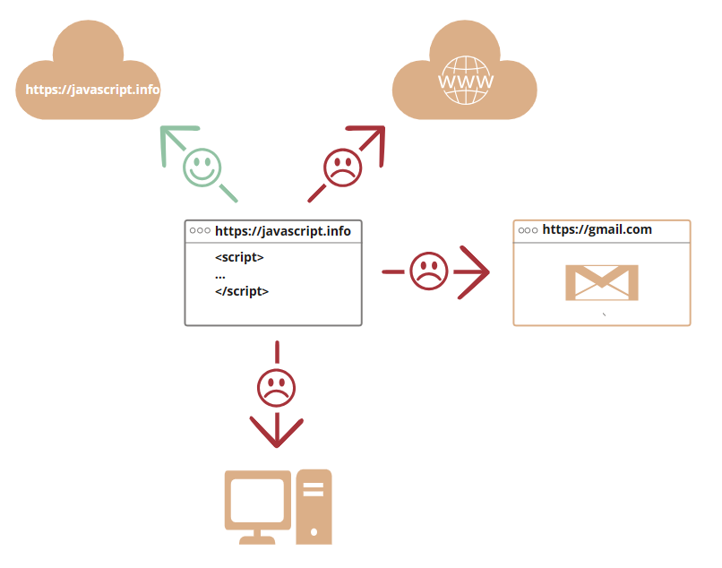
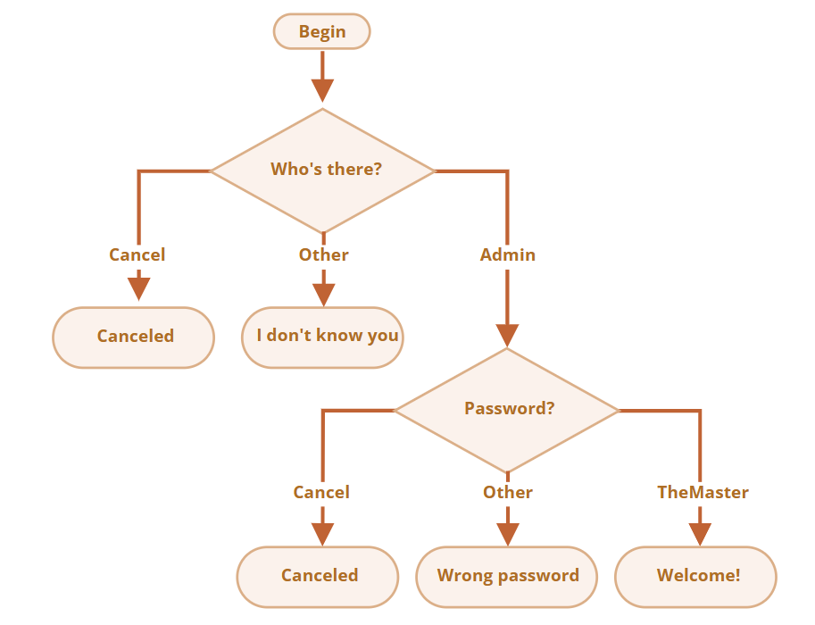

## JavaScript 简介

_JavaScript_ 最初被创建的目的是“使网页更生动”。

这种编程语言写出来的程序被称为 **脚本**。它们可以被直接写在网页的 HTML 中，在页面加载的时候自动执行。

脚本被以纯文本的形式提供和执行。它们不需要特殊的准备或编译即可运行。

### [浏览器中的 JavaScript 不能做什么？](https://zh.javascript.info/intro#liu-lan-qi-zhong-de-javascript-bu-neng-zuo-shi-mo)

为了用户的（信息）安全，在浏览器中的 JavaScript 的能力是受限的。目的是防止恶意网页获取用户私人信息或损害用户数据。

此类限制的例子包括：

- 网页中的 JavaScript 不能读、写、复制和执行硬盘上的任意文件。它没有直接访问操作系统的功能。
    
    现代浏览器允许 JavaScript 做一些文件相关的操作，但是这个操作是受到限制的。仅当用户做出特定的行为，JavaScript 才能操作这个文件。例如，用户把文件“拖放”到浏览器中，或者通过 `<input>` 标签选择了文件。
    
    有很多与相机/麦克风和其它设备进行交互的方式，但是这些都需要获得用户的明确许可。
    
- 不同的标签页/窗口之间通常互不了解。有时候，也会有一些联系，例如一个标签页通过 JavaScript 打开的另外一个标签页。但即使在这种情况下，如果两个标签页打开的不是同一个网站（域名、协议或者端口任一不相同的网站），它们都不能相互通信。
    
    这就是所谓的“同源策略”。为了解决“同源策略”问题，两个标签页必须 **都** 包含一些处理这个问题的特定的 JavaScript 代码，并均允许数据交换。本教程会讲到这部分相关的知识。
    
    这个限制也是为了用户的信息安全。例如，用户打开的 `http://anysite.com` 网页必须不能访问 `http://gmail.com`（另外一个标签页打开的网页）也不能从那里窃取信息。
    
- JavaScript 可以轻松地通过互联网与当前页面所在的服务器进行通信。但是从其他网站/域的服务器中接收数据的能力被削弱了。尽管可以，但是需要来自远程服务器的明确协议（在 HTTP header 中）。这也是为了用户的信息安全。



:::tip
如果在浏览器环境外（例如在服务器上）使用 JavaScript，则不存在此类限制。现代浏览器还允许安装可能会要求扩展权限的插件/扩展。
:::

### JavaScript “上层”语言
不同的人想要不同的功能。JavaScript 的语法也不能满足所有人的需求。

这是正常的，因为每个人的项目和需求都不一样。

因此，最近出现了许多新语言，这些语言在浏览器中执行之前，都会被 **编译**（转化）成 JavaScript。

现代化的工具使得编译速度非常快且透明，实际上允许开发者使用另一种语言编写代码并会将其“自动转换”为 JavaScript。

此类语言的示例有：

- [CoffeeScript](https://coffeescript.org/) 是 JavaScript 的一种语法糖。它引入了更加简短的语法，使我们可以编写更清晰简洁的代码。通常，Ruby 开发者喜欢它。
- [TypeScript](https://www.typescriptlang.org/) 专注于添加“严格的数据类型”以简化开发，以更好地支持复杂系统的开发。由微软开发。
- [Flow](https://flow.org/) 也添加了数据类型，但是以一种不同的方式。由 Facebook 开发。
- [Dart](https://www.dartlang.org/) 是一门独立的语言。它拥有自己的引擎，该引擎可以在非浏览器环境中运行（例如手机应用），它也可以被编译成 JavaScript。由 Google 开发。
- [Brython](https://brython.info/) 是一个 Python 到 JavaScript 的转译器，让我们可以在不使用 JavaScript 的情况下，以纯 Python 编写应用程序。
- [Kotlin](https://kotlinlang.org/docs/reference/js-overview.html) 是一个现代、简洁且安全的编程语言，编写出的应用程序可以在浏览器和 Node 环境中运行。

这样的语言还有很多。当然，即使我们在使用此类编译语言，我们也需要了解 JavaScript。因为了解 JavaScript 才能让我们真正明白我们在做什么。

### 总结

- JavaScript 最开始是专门为浏览器设计的一门语言，但是现在也被用于很多其他的环境。
- JavaScript 作为被应用最广泛的浏览器语言，且与 HTML/CSS 完全集成，具有独特的地位。
- 有很多其他的语言可以被“编译”成 JavaScript，这些语言还提供了更多的功能。建议最好了解一下这些语言，至少在掌握了 JavaScript 之后大致的了解一下。

## 手册与规范

这本书是一个 **教程**。它旨在帮助你由浅入深掌握 JavaScript 这门语言。但是，当你已经熟悉了这门语言的基础知识，你就会需要其他资料。

### 规范
**ECMA-262 规范** 包含了大部分深入的、详细的、规范化的关于 JavaScript 的信息。这份规范明确地定义了这门语言。

但正因其规范化，对于新手来说难以理解。所以，如果你需要关于这门语言细节最权威的信息来源，这份规范就很适合你（去阅读）。但它并不适合日常使用。

每年都会发布一个新版本的规范。最新的规范草案请见 [https://tc39.es/ecma262/](https://tc39.es/ecma262/)。

想了解最新最前沿的功能，包括“即将纳入规范的”（所谓的 “stage 3”），请看这里的提案 [https://github.com/tc39/proposals](https://github.com/tc39/proposals)。

当然，如果你正在做浏览器相关的开发工作，那么本教程的 [第二部分](https://zh.javascript.info/browser-environment) 涵盖了其他规范。

### 手册
- **MDN（Mozilla）JavaScript 索引** 是一个带有用例和其他信息的主要的手册。它是一个获取关于个别语言函数、方法等深入信息的很好的信息来源。
    
    你可以在 [https://developer.mozilla.org/en-US/docs/Web/JavaScript/Reference](https://developer.mozilla.org/en-US/docs/Web/JavaScript/Reference) 阅读它。
    

不过，利用互联网搜索通常是最好的选择。只需在查询时输入“MDN [关键字]”，例如 [https://google.com/search?q=MDN+parseInt](https://google.com/search?q=MDN+parseInt) 搜索 `parseInt` 函数。

### 兼容性表

JavaScript 是一门还在发展中的语言，定期会添加一些新的功能。

要查看它们在基于浏览器的引擎及其他引擎中的支持情况，请看：

- [https://caniuse.com](https://caniuse.com/) —— 每个功能的支持表，例如，查看哪个引擎支持现代加密（cryptography）函数：[https://caniuse.com/#feat=cryptography](https://caniuse.com/#feat=cryptography)。
- [https://kangax.github.io/compat-table](https://kangax.github.io/compat-table) —— 一份列有语言功能以及引擎是否支持这些功能的表格。

所有这些资源在实际开发中都有用武之地，因为它们包含了有关语言细节，以及它们被支持的程度等非常有价值的信息。

为了让你在真正需要深入了解特定功能的时候不会捉襟见肘，请记住它们（或者这一页）。

## Hello, world!

本教程的这一部分内容是关于 JavaScript 语言本身的。

但是，我们需要一个工作环境来运行我们的脚本，由于本教程是在线的，所以浏览器是一个不错的选择。我们会尽可能少地使用浏览器特定的命令（比如 `alert`），所以如果你打算专注于另一个环境（比如 Node.js），你就不必多花时间来关心这些特定指令了。我们将在本教程的 [下一部分](https://zh.javascript.info/ui) 中专注于浏览器中的 JavaScript。

首先，让我们看看如何将脚本添加到网页上。对于服务器端环境（如 Node.js），你只需要使用诸如 `"node my.js"` 的命令行来执行它。

### “script” 标签

可以使用 `<script>` 标签将 JavaScript 程序插入到 HTML 文档的任何位置。


`<script>` 标签中包裹了 JavaScript 代码，当浏览器遇到 `<script>` 标签，代码会自动运行。

### 现代的标记（markup)

`<script>` 标签有一些现在很少用到的特性（attribute），但是我们可以在老代码中找到它们：

`type` 特性：`<script type=…>`

在老的 HTML4 标准中，要求 script 标签有 `type` 特性。通常是 `type="text/javascript"`。这样的特性声明现在已经不再需要。而且，现代 HTML 标准已经完全改变了此特性的含义。现在，它可以用于 JavaScript 模块。但这是一个高阶话题，我们将在本教程的另一部分中探讨 JavaScript 模块。

`language` 特性：`<script language=…>`

这个特性是为了显示脚本使用的语言。这个特性现在已经没有任何意义，因为语言默认就是 JavaScript。不再需要使用它了。

脚本前后的注释。

在非常古老的书籍和指南中，你可能会在 `<script>` 标签里面找到注释，就像这样：

```html
<script type="text/javascript">< !--
    ...
//-- ></script>
```

现代 JavaScript 中已经不这样使用了。这些注释是用于不支持 `<script>` 标签的古老的浏览器隐藏 JavaScript 代码的。由于最近 15 年内发布的浏览器都没有这样的问题，因此这种注释能帮你辨认出一些老掉牙的代码。

### 外部脚本
如果你有大量的 JavaScript 代码，我们可以将它放入一个单独的文件。

脚本文件可以通过 `src` 特性（attribute）添加到 HTML 文件中。

`<script src="/path/to/script.js"></script>`

这里，`/path/to/script.js` 是脚本文件从网站根目录开始的绝对路径。当然也可以提供当前页面的相对路径。例如，`src ="script.js"`，就像 `src="./script.js"`，表示当前文件夹中的 `"script.js"` 文件。我们也可以提供一个完整的 URL 地址，要附加多个脚本，请使用多个标签。

:::tip
一般来说，只有最简单的脚本才嵌入到 HTML 中。更复杂的脚本存放在单独的文件中。

使用独立文件的好处是浏览器会下载它，然后将它保存到浏览器的 缓存 中。

之后，其他页面想要相同的脚本就会从缓存中获取，而不是下载它。所以文件实际上只会下载一次。

这可以节省流量，并使得页面（加载）更快。
:::


### 总结

- 我们可以使用一个 `<script>` 标签将 JavaScript 代码添加到页面中。
- `type` 和 `language` 特性（attribute）不是必需的。
- 外部的脚本可以通过 `<script src="path/to/script.js"></script>` 的方式插入。

## 现代模式，"use strict"

长久以来，JavaScript 不断向前发展且并未带来任何兼容性问题。新的特性被加入，旧的功能也没有改变。

这么做有利于兼容旧代码，但缺点是 JavaScript 创造者的任何错误或不完善的决定也将永远被保留在 JavaScript 语言中。

这种情况一直持续到 2009 年 ECMAScript 5 (ES5) 的出现。ES5 规范增加了新的语言特性并且修改了一些已经存在的特性。为了保证旧的功能能够使用，大部分的修改是默认不生效的。你需要一个特殊的指令 —— `"use strict"` 来明确地激活这些特性。

## 变量

我们可以使用 `var`、`let` 或 `const` 声明变量来存储数据。

- `let` — 现代的变量声明方式。
- `var` — 老旧的变量声明方式。一般情况下，我们不会再使用它。但是，我们会在 [老旧的 "var"](https://zh.javascript.info/var) 章节介绍 `var` 和 `let` 的微妙差别，以防你需要它们。
- `const` — 类似于 `let`，但是变量的值无法被修改。

变量应当以一种容易理解变量内部是什么的方式进行命名。

## 数据类型

JavaScript 中有八种基本的数据类型（译注：前七种为基本数据类型，也称为原始数据类型，而 `object` 为复杂数据类型）。

- 七种原始数据类型：
    - `number` 用于任何类型的数字：整数或浮点数，在 `±(253-1)` 范围内的整数。
    - `bigint` 用于任意长度的整数。
    - `string` 用于字符串：一个字符串可以包含 0 个或多个字符，所以没有单独的单字符类型。
	    在 JavaScript 中，有三种包含字符串的方式。
		
		1. 双引号：`"Hello"`.
		2. 单引号：`'Hello'`.
		3. 反引号：`` `Hello` ``.
		双引号和单引号都是“简单”引用，在 JavaScript 中两者几乎没有什么差别。
		反引号是 **功能扩展** 引号。它们允许我们通过将变量和表达式包装在 `${…}` 中
    - `boolean` 用于 `true` 和 `false`。
    - `null` 用于未知的值 —— 只有一个 `null` 值的独立类型。
    - `undefined` 用于未定义的值 —— 只有一个 `undefined` 值的独立类型。
    - `symbol` 用于唯一的标识符。
- 以及一种非原始数据类型：
    - `object` 用于更复杂的数据结构。

我们可以通过 `typeof` 运算符查看存储在变量中的数据类型。

- 通常用作 `typeof x`，但 `typeof(x)` 也可行。
- 以字符串的形式返回类型名称，例如 `"string"`。
- `typeof null` 会返回 `"object"` —— 这是 JavaScript 编程语言的一个错误，实际上它并不是一个 `object`。

## 交互：alert、prompt 和 confirm

`alert`

显示信息。

`prompt`

显示信息要求用户输入文本。点击确定返回文本，点击取消或按下 Esc 键返回 `null`。

`confirm`

显示信息等待用户点击确定或取消。点击确定返回 `true`，点击取消或按下 Esc 键返回 `false`。

这些方法都是模态的：它们暂停脚本的执行，并且不允许用户与该页面的其余部分进行交互，直到窗口被解除。

上述所有方法共有两个限制：

1. 模态窗口的确切位置由浏览器决定。通常在页面中心。
2. 窗口的确切外观也取决于浏览器。我们不能修改它。

## 类型转换

有三种常用的类型转换：转换为 string 类型、转换为 number 类型和转换为 boolean 类型。

**字符串转换** —— 转换发生在输出内容的时候，也可以通过 `String(value)` 进行显式转换。原始类型值的 string 类型转换通常是很明显的。

**数字型转换** —— 转换发生在进行算术操作时，也可以通过 `Number(value)` 进行显式转换，或者在前面加个`+`运算符。

数字型转换遵循以下规则：

|值|变成……|
|---|---|
|`undefined`|`NaN`|
|`null`|`0`|
|`true / false`|`1 / 0`|
|`string`|“按原样读取”字符串，两端的空白字符（空格、换行符 `\n`、制表符 `\t` 等）会被忽略。空字符串变成 `0`。转换出错则输出 `NaN`。|

**布尔型转换** —— 转换发生在进行逻辑操作时，也可以通过 `Boolean(value)` 进行显式转换。

布尔型转换遵循以下规则：

|值|变成……|
|---|---|
|`0`, `null`, `undefined`, `NaN`, `""`|`false`|
|其他值|`true`|

上述的大多数规则都容易理解和记忆。人们通常会犯错误的值得注意的例子有以下几个：

- 对 `undefined` 进行数字型转换时，输出结果为 `NaN`，而非 `0`。
- 对 `"0"` 和只有空格的字符串（比如：`" "`）进行布尔型转换时，输出结果为 `true`。

## 基础运算符，数学运算

### 数学运算

支持以下数学运算：

- 加法 `+`,
- 减法 `-`,
- 乘法 `*`,
- 除法 `/`,
- 取余 `%`,
- 求幂 `**`.

### 运算符优先级

如果一个表达式拥有超过一个运算符，执行的顺序则由 **优先级** 决定。换句话说，所有的运算符中都隐含着优先级顺序。

从小学开始，我们就知道在表达式 `1 + 2 * 2` 中，乘法先于加法计算。这就是一个优先级问题。乘法比加法拥有 **更高的优先级**。

圆括号拥有最高优先级，所以如果我们对现有的运算顺序不满意，我们可以使用圆括号来修改运算顺序，就像这样：`(1 + 2) * 2`。

在 JavaScript 中有众多运算符。每个运算符都有对应的优先级数字。数字越大，越先执行。如果优先级相同，则按照由左至右的顺序执行。

这是一个摘抄自 Mozilla 的 [优先级表](https://developer.mozilla.org/en-US/docs/Web/JavaScript/Reference/Operators/Operator_Precedence)（你没有必要把这全记住，但要记住一元运算符优先级高于二元运算符）：

|优先级|名称|符号|
|---|---|---|
|…|…|…|
|15|一元加号|`+`|
|15|一元负号|`-`|
|14|求幂|`**`|
|13|乘号|`*`|
|13|除号|`/`|
|12|加号|`+`|
|12|减号|`-`|
|…|…|…|
|2|赋值符|`=`|
|…|…|…|

我们可以看到，“一元加号运算符”的优先级是 `15`，高于“二元加号运算符”的优先级 `12`。这也是为什么表达式 `"+apples + +oranges"` 中的一元加号先生效，然后才是二元加法。

### 位运算符

位运算符把运算元当做 32 位整数，并在它们的二进制表现形式上操作。

这些运算符不是 JavaScript 特有的。大部分的编程语言都支持这些运算符。

下面是位运算符：

- 按位与 ( `&` )
- 按位或 ( `|` )
- 按位异或 ( `^` )
- 按位非 ( `~` )
- 左移 ( `<<` )
- 右移 ( `>>` )
- 无符号右移 ( `>>>` )

这些运算符很少被使用，一般是我们需要在最低级别（位）上操作数字时才使用。我们不会很快用到这些运算符，因为在 Web 开发中很少使用它们。

## 值的比较

### 字符串比较

在比较字符串的大小时，JavaScript 会使用“字典（dictionary）”或“词典（lexicographical）”顺序进行判定。

换言之，字符串是按字符（母）逐个进行比较的。

例如：

```javascript
alert( 'Z' > 'A' ); // true
alert( 'Glow' > 'Glee' ); // true
alert( 'Bee' > 'Be' ); // true
```

字符串的比较算法非常简单：

1. 首先比较两个字符串的首位字符大小。
2. 如果一方字符较大（或较小），则该字符串大于（或小于）另一个字符串。算法结束。
3. 否则，如果两个字符串的首位字符相等，则继续取出两个字符串各自的后一位字符进行比较。
4. 重复上述步骤进行比较，直到比较完成某字符串的所有字符为止。
5. 如果两个字符串的字符同时用完，那么则判定它们相等，否则未结束（还有未比较的字符）的字符串更大。

在上面的第一个例子中，`'Z' > 'A'` 比较在算法的第 1 步就得到了结果。

在第二个例子中，字符串 `Glow` 与 `Glee` 的比较则需要更多步骤，因为需要逐个字符进行比较：

1. `G` 和 `G` 相等。
2. `l` 和 `l` 相等。
3. `o` 比 `e` 大，算法停止，第一个字符串大于第二个。

:::tip
**非真正的字典顺序，而是 Unicode 编码顺序**

在上面的算法中，比较大小的逻辑与字典或电话簿中的排序很像，但也不完全相同。

比如说，字符串比较对字母大小写是敏感的。大写的 `"A"` 并不等于小写的 `"a"`。哪一个更大呢？实际上小写的 `"a"` 更大。这是因为在 JavaScript 使用的内部编码表中（Unicode），小写字母的字符索引值更大。
:::

### [严格相等](https://zh.javascript.info/comparison#yan-ge-xiang-deng)

普通的相等性检查 `==` 存在一个问题，它不能区分出 `0` 和 `false`：

```javascript
alert( 0 == false ); // true
```

也同样无法区分空字符串和 `false`：

```javascript
alert( '' == false ); // true
```


这是因为在比较不同类型的值时，处于相等判断符号 `==` 两侧的值会先被转化为数字。空字符串和 `false` 也是如此，转化后它们都为数字 0。

如果我们需要区分 `0` 和 `false`，该怎么办？

**严格相等运算符 `===` 在进行比较时不会做任何的类型转换。**

换句话说，如果 `a` 和 `b` 属于不同的数据类型，那么 `a === b` 不会做任何的类型转换而立刻返回 `false`。

### 对 null 和 undefined 进行比较

当使用 `null` 或 `undefined` 与其他值进行比较时，其返回结果常常出乎你的意料。

当使用严格相等 `===` 比较二者时

它们不相等，因为它们属于不同的类型。

```javascript
alert( null === undefined ); // false
```

当使用非严格相等 `==` 比较二者时

JavaScript 存在一个特殊的规则，会判定它们相等。它们俩就像“一对恋人”，仅仅等于对方而不等于其他任何的值（只在非严格相等下成立）。

```javascript
alert( null == undefined ); // true
```

当使用数学式或其他比较方法 `< > <= >=` 时：

`null/undefined` 会被转化为数字：`null` 被转化为 `0`，`undefined` 被转化为 `NaN`。

下面让我们看看，这些规则会带来什么有趣的现象。同时更重要的是，我们需要从中学会如何远离这些特性带来的“陷阱”。

#### 奇怪的结果：null vs 0

通过比较 `null` 和 0 可得：

```javascript
alert( null > 0 );  // (1) false
alert( null == 0 ); // (2) false
alert( null >= 0 ); // (3) true
```

是的，上面的结果完全打破了你对数学的认识。在最后一行代码显示“`null` 大于等于 0”的情况下，前两行代码中一定会有一个是正确的，然而事实表明它们的结果都是 false。

为什么会出现这种反常结果，这是因为相等性检查 `==` 和普通比较符 `> < >= <=` 的代码逻辑是相互独立的。进行值的比较时，`null` 会被转化为数字，因此它被转化为了 `0`。这就是为什么（3）中 `null >= 0` 返回值是 true，（1）中 `null > 0` 返回值是 false。

另一方面，`undefined` 和 `null` 在相等性检查 `==` 中不会进行任何的类型转换，它们有自己独立的比较规则，所以除了它们之间互等外，不会等于任何其他的值。这就解释了为什么（2）中 `null == 0` 会返回 false。

#### 特立独行的 undefined

`undefined` 不应该被与其他值进行比较：

```javascript
alert( undefined > 0 ); // false (1)
alert( undefined < 0 ); // false (2)
alert( undefined == 0 ); // false (3)
```

为何它看起来如此厌恶 0？返回值都是 false！

原因如下：

- `(1)` 和 `(2)` 都返回 `false` 是因为 `undefined` 在比较中被转换为了 `NaN`，而 `NaN` 是一个特殊的数值型值，它与任何值进行比较都会返回 `false`。
- `(3)` 返回 `false` 是因为这是一个相等性检查，而 `undefined` 只与 `null` 相等，不会与其他值相等。


#### 避免问题

我们为何要研究上述示例？我们需要时刻记得这些古怪的规则吗？不，其实不需要。虽然随着代码写得越来越多，我们对这些规则也都会烂熟于胸，但是我们需要更为可靠的方法来避免潜在的问题：

- 除了严格相等 `===` 外，其他但凡是有 `undefined/null` 参与的比较，我们都需要格外小心。
- 除非你非常清楚自己在做什么，否则永远不要使用 `>= > < <=` 去比较一个可能为 `null/undefined` 的变量。对于取值可能是 `null/undefined` 的变量，请按需要分别检查它的取值情况。

### 总结

- 比较运算符始终返回布尔值。
- 字符串的比较，会按照“词典”顺序逐字符地比较大小。
- 当对不同类型的值进行比较时，它们会先被转化为数字（不包括严格相等检查）再进行比较。
- 在非严格相等 `==` 下，`null` 和 `undefined` 相等且各自不等于任何其他的值。
- 在使用 `>` 或 `<` 进行比较时，需要注意变量可能为 `null/undefined` 的情况。比较好的方法是单独检查变量是否等于 `null/undefined`。

## 流程控制

### 条件分支：if 和 '?'
	
登录校验

实现使用 `prompt` 进行登录校验的代码。

如果访问者输入 `"Admin"`，那么使用 `prompt` 引导获取密码，如果输入的用户名为空或者按下了 Esc 键 —— 显示 “Canceled”，如果是其他字符串 —— 显示 “I don’t know you”。

密码的校验规则如下：

- 如果输入的是 “TheMaster”，显示 “Welcome!”，
- 其他字符串 —— 显示 “Wrong password”，
- 空字符串或取消了输入，显示 “Canceled.”。

流程图：


请使用嵌套的 `if` 块。注意代码整体的可读性。

提示：将空字符串输入，prompt 会获取到一个空字符串 `''`。Prompt 运行过程中，按下 ESC 键会得到 `null`。

```javascript live
let userName = prompt("Who's there?", '');

if (userName === 'Admin') {

  let pass = prompt('Password?', '');

  if (pass === 'TheMaster') {
    alert( 'Welcome!' );
  } else if (pass === '' || pass === null) {
    alert( 'Canceled' );
  } else {
    alert( 'Wrong password' );
  }

} else if (userName === '' || userName === null) {
  alert( 'Canceled' );
} else {
  alert( "I don't know you" );
}
```

### 循环：while 和 for

我们逐个部分分析 `for` 循环：

| 语句段         |             |                                                  |
| -------------- | ----------- | ------------------------------------------------ |
| begin          | `let i = 0` | 进入循环时执行一次。                             |
| condition      | `i < 3`     | 在每次循环迭代之前检查，如果为 false，停止循环。 |
| body（循环体） | `alert(i)`  | 条件为真时，重复运行。                           |
| step           | `i++`       | 在每次循环体迭代后执行。                         |

一般循环算法的工作原理如下：

```javascript
开始运行
→ (如果 condition 成立 → 运行 body 然后运行 step)
→ (如果 condition 成立 → 运行 body 然后运行 step)
→ (如果 condition 成立 → 运行 body 然后运行 step)
→ ...
```

我们学习了三种循环：

- `while` —— 每次迭代之前都要检查条件。
- `do..while` —— 每次迭代后都要检查条件。
- `for (;;)` —— 每次迭代之前都要检查条件，可以使用其他设置。

通常使用 `while(true)` 来构造“无限”循环。这样的循环和其他循环一样，都可以通过 `break` 指令来终止。

如果我们不想在当前迭代中做任何事，并且想要转移至下一次迭代，那么可以使用 `continue` 指令。

`break/continue` 支持循环前的标签。**标签是 `break/continue` 跳出嵌套循环以转到外部的唯一方法**。

